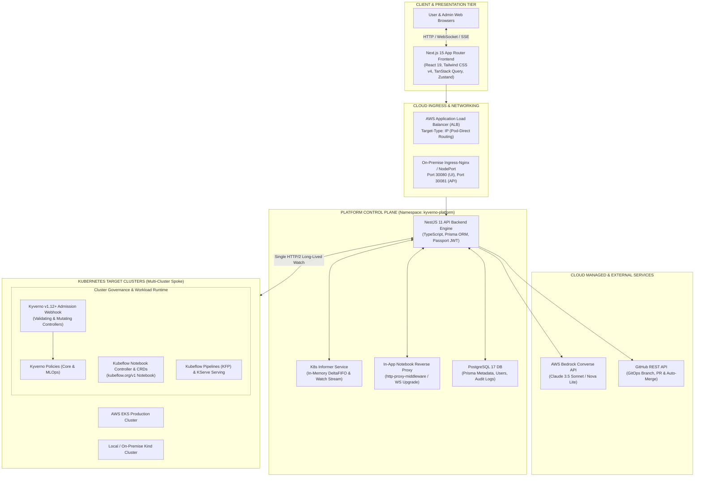

# PaC Kyverno Governance Platform
> **Enterprise Kubernetes Policy-as-Code (PaC), Autonomous MLOps Governance & AI Diagnostics**  
> Unified control plane for declarative Kyverno policy management, Dual-Path GitOps exception approvals, pre-deployment policy simulation, admission Enforce AI diagnostics, MLOps GPU workload governance, and real-time multi-cluster observability.

[](https://kubernetes.io/)
[](https://kyverno.io/)
[](https://nextjs.org/)
[](https://nestjs.com/)
[](https://www.postgresql.org/)
[](https://aws.amazon.com/bedrock/)

---

## Executive Table of Contents

- [1. Executive Summary & Core Mission](#1-executive-summary--core-mission)
- [2. Platform Architecture & System Topology](#2-platform-architecture--system-topology)
- [3. Repository Monorepo Layout](#3-repository-monorepo-layout)
- [4. Platform Architecture & Specification Chapters](#4-platform-architecture--specification-chapters)
  - [Chapter 1: Platform Overview & System Architecture](#chapter-1-platform-overview--system-architecture)
  - [Chapter 2: Core Governance Engine & Policy Lifecycle](#chapter-2-core-governance-engine--policy-lifecycle)
  - [Chapter 3: MLOps Platform & FinOps Suite](#chapter-3-mlops-platform--finops-suite)
  - [Chapter 4: AI Diagnostics, Policy Simulation Lab & GitOps](#chapter-4-ai-diagnostics-policy-simulation-lab--gitops)
  - [Chapter 5: Frontend Architecture, Navigation & Security Mechanisms](#chapter-5-frontend-architecture-navigation--security-mechanisms)
  - [Chapter 6: Infrastructure, Deployment & Verification Guide](#chapter-6-infrastructure-deployment--verification-guide)
- [5. Component Modularization & Selective Enablement](#5-component-modularization--selective-enablement)
- [6. Quickstart & Local Development](#6-quickstart--local-development)
  - [6.1 Prerequisites](#61-prerequisites)
  - [6.2 Local Bootstrapping](#62-local-bootstrapping)
  - [6.3 Default Access Credentials](#63-default-access-credentials)
- [7. Automated Testing & Verification Suite](#7-automated-testing--verification-suite)
- [8. Universal Cluster Deployment (EKS & On-Premise)](#8-universal-cluster-deployment-eks--on-premise)
- [9. In-Depth Documentation Index](#9-in-depth-documentation-index)

---

## 1. Executive Summary & Core Mission

Modern enterprise cloud-native environments face three critical operational bottlenecks:
1. **Security Compliance Dilemma**: Workloads frequently enter clusters with privileged root permissions, mutable `:latest` tags, missing CPU/memory resource limits, or unauthorized container images.
2. **Cost-Intensive MLOps Sprawl**: High-cost GPU compute instances (NVIDIA A10G, T4) for interactive Jupyter Notebooks, training jobs, and model endpoints are left running idle, without automated namespace-level GPU quotas or Spot instance enforcement.
3. **Control Plane Polling Exhaustion**: Traditional governance dashboards continuously poll the `kube-apiserver` for PolicyReports, exhausting API Priority and Fairness (APF) request queues and introducing heavy etcd I/O overhead.

The **PaC Kyverno Governance Platform** provides an end-to-end, production-grade solution:
* **Zero EKS API Load via CQRS Informer Architecture**: Client-side in-memory caching using `@kubernetes/client-node` Informers and DeltaFIFO caches eliminates polling and delivers sub-millisecond query latency.
* **Closed-Loop Policy Lifecycle**: Real-time PolicyReport ingestion, granular approval workflows, UUIDv7 distributed lease locking, and automatic exception expiration.
* **Dual-Path GitOps Synchronization**: Immediate in-cluster runtime relief via `PolicyException` CRDs combined with automated, asynchronous GitHub Pull Request creation and auto-merging.
* **Autonomous MLOps Governance & In-App Proxy**: Seamless Kubeflow Notebook creation with direct in-app reverse proxy (`/notebook/*`), KFP pipelines, KServe model serving, namespace GPU limits, and automated idle resource reapers.
* **Pre-Deployment Simulation & AI Diagnostics**: What-If dry-run policy evaluation sandbox (`/simulation`) and instant admission Enforce block diagnosis powered by AWS Bedrock (Claude 3.5 Sonnet / Amazon Nova Lite).

---

## 2. Platform Architecture & System Topology



---

## 3. Repository Monorepo Layout

Managed via **pnpm workspaces** (`pnpm-workspace.yaml`), standardizing TypeScript across frontend, backend, and shared packages:

```
.
├── apps/
│   ├── backend/                    # NestJS 11 Backend API Server
│   │   ├── src/
│   │   │   ├── ai-agent/           # AWS Bedrock Converse API & offline rule engine
│   │   │   ├── audit-logs/         # Immutable compliance audit trail
│   │   │   ├── auth/               # Single-session invalidation & JWT token rotation
│   │   │   ├── exception-requests/ # PolicyException request approval workflow
│   │   │   ├── gitops/             # Dual-path GitHub PR generator & auto-merge
│   │   │   ├── kubernetes/         # Informer caching service & multi-cluster client
│   │   │   ├── mlops/              # Notebooks, reverse proxy, KFP, KServe, GPU FinOps
│   │   │   ├── policies/           # Kyverno ClusterPolicy dynamic YAML parser
│   │   │   ├── simulation/         # Pre-deployment What-If dry-run engine
│   │   │   ├── system/             # Runtime platform module discovery endpoint
│   │   │   └── violations/         # PolicyReport ingestion & deduplication
│   │   ├── prisma/                 # PostgreSQL schema, migrations, and seed scripts
│   │   └── Dockerfile              # Multi-stage production build (node:22-slim)
│   └── frontend/                   # Next.js 15 App Router Frontend Application
│       ├── src/
│       │   ├── app/                # User portal & /admin/* route hierarchies
│       │   │   ├── admin/          # Cluster, policy, violation, exception administration
│       │   │   ├── diagnostics/    # Enforce admission block AI diagnostic studio
│       │   │   ├── mlops/          # Notebook hub, pipelines, serving, and FinOps
│       │   │   └── simulation/     # Policy simulation test lab
│       │   ├── components/         # Lucide icons, Radix UI primitives, drawers & modals
│       │   ├── hooks/              # SSE subscriptions & TanStack Query hooks
│       │   └── lib/                # Zustand stores, auth client & system module client
│       └── Dockerfile              # Standalone optimized build (<150MB bundle)
├── packages/
│   └── shared/                     # Cross-boundary TypeScript interfaces & DTOs
├── k8s-manifests/
│   ├── base/                       # Core platform manifests (namespace, rbac, postgres, apps)
│   ├── modules/mlops/              # Optional MLOps extension (notebook-controller & CRDs)
│   ├── overlays/
│   │   ├── eks/                    # AWS EKS overlay (ALB Ingress, gp3 StorageClass)
│   │   └── onprem/                 # On-Premise overlay (Ingress-Nginx, NodePort)
│   ├── policies/                   # Production Kyverno policies (Core & MLOps)
│   └── testbed/                    # E2E testbed scenarios & violation workloads
├── scripts/
│   ├── deploy.sh                   # Universal cluster deployment script (EKS & On-Premise)
│   ├── setup-local-cluster.sh      # Single-node Kind bare-minimum setup
│   ├── setup-bedrock-irsa.sh       # AWS Bedrock IAM Roles for Service Accounts setup
│   ├── run-e2e-cluster-test.sh     # Comprehensive 6-scenario E2E test runner
│   └── tests/                      # High-speed bare Kind single & multi-cluster runners
├── docs/                           # Master context guides, whitepapers, and ADRs
│   ├── readme_drafts/              # Detailed 6-chapter technical specifications
│   └── modular-components-architecture-plan.md # Architectural plan for selective modules
├── install.sh                      # One-click installer (wrapper around scripts/deploy.sh)
└── redeploy.sh                     # Rapid local onprem rebuild & redeploy wrapper
```

---

## 4. Platform Architecture & Specification Chapters

The complete architectural, implementation, and operational specifications for the platform are organized into 6 modular chapters authored by dedicated leads:

```
┌────────────────────────────────────────────────────────────────────────────────────────────────────┐
│                           PLATFORM SPECIFICATIONS & ARCHITECTURE CHAPTERS                         │
├───────────────┬─────────────────────────────────────────────────┬──────────────────────────────────┤
│ Chapter       │ Title & Scope                                   │ Primary Specification Document   │
├───────────────┼─────────────────────────────────────────────────┼──────────────────────────────────┤
│ **Ch 1 & 2**  │ **Platform Overview, Architecture & Core Engine**│ [ch1_2_architecture_core.md](docs/readme_drafts/ch1_2_architecture_core.md)   │
│ **Ch 3**      │ **MLOps Suite & FinOps Governance Platform**    │ [ch3_mlops_platform.md](docs/readme_drafts/ch3_mlops_platform.md)        │
│ **Ch 4**      │ **AI Diagnostics, Policy Simulation & GitOps**  │ [ch4_ai_simulation_gitops.md](docs/readme_drafts/ch4_ai_simulation_gitops.md)  │
│ **Ch 5**      │ **Frontend Architecture & Session Security**     │ [ch5_frontend_security.md](docs/readme_drafts/ch5_frontend_security.md)     │
│ **Ch 6**      │ **Infrastructure, Deployment & Verification**    │ [ch6_deploy_operations.md](docs/readme_drafts/ch6_deploy_operations.md)     │
└───────────────┴─────────────────────────────────────────────────┴──────────────────────────────────┘
```

---

### Chapter 1: Platform Overview & System Architecture
*Detailed Specification*: [docs/readme_drafts/ch1_2_architecture_core.md](docs/readme_drafts/ch1_2_architecture_core.md#chapter-1-platform-overview--system-architecture)

* **Enterprise Problem Statement**: Resolving the trilemma of Kubernetes multi-tenant security compliance, runaway MLOps compute expenditures, and API server etcd I/O exhaustion.
* **Hub-and-Spoke Topology**: Central control plane running in `kyverno-platform` managing target clusters across AWS EKS and on-premise environments via single HTTP/2 watch streams.
* **Core Design Principles**:
  * *Zero-Trust Admission Control*: Enforcing Kyverno mutating and validating webhooks at the API boundary.
  * *Asynchronous Eventual Consistency*: Background reconciliation loops ensuring persistent state alignment.
  * *CQRS Read-Side Caching*: In-memory DeltaFIFO cache completely isolating frontend read traffic from the cluster API server.
  * *Cloud-Native Observability*: Multi-cluster health probes, audit metrics, and dynamic error recovery.

---

### Chapter 2: Core Governance Engine & Policy Lifecycle
*Detailed Specification*: [docs/readme_drafts/ch1_2_architecture_core.md](docs/readme_drafts/ch1_2_architecture_core.md#chapter-2-core-governance-engine--policy-lifecycle)

* **Policy Engine & Parser**: Dynamic ingestion of Kyverno `ClusterPolicy` and `Policy` manifests using `js-yaml`, supporting `validate`, `mutate`, `generate`, and `verifyImages` rules. Automatically synthesizes `autogen-` controller rules for Pods, Deployments, and CronJobs.
* **PolicyReport Ingestion Pipeline**: Real-time watching of `wgpolicyk8s.io/v1alpha2` `PolicyReport` and `ClusterPolicyReport` CRDs. Features deterministic ID generation (`<clusterId>:<namespace>/<reportName>:<index>`), namespace collision protection, index shift compensation, and 44 baseline noise filter rules.
* **Policy Exceptions & Concurrency Reconciler**: Self-service exception requests mapping to `kyverno.io/v2beta1 PolicyException` CRDs. Employs monotonic **UUIDv7** identifiers, PostgreSQL `SELECT ... FOR UPDATE SKIP LOCKED` distributed lease locking (`reconcileClaimId`, `reconcileLeaseUntil`), 4-tier priority scheduling, exponential backoff (up to 10 retries / 300s cap), and automated TTL revocation.
* **Audit Logging & Compliance**: Immutable audit trail (`AuditLog`) tracking actors (`USER` vs `SYSTEM`), actions, before/after states, and JSON metadata diffs.
* **Database Architecture**: Comprehensive PostgreSQL 17 relational schema (Prisma ORM) with composite indices optimized for high-throughput multi-tenant querying.

---

### Chapter 3: MLOps Platform & FinOps Suite
*Detailed Specification*: [docs/readme_drafts/ch3_mlops_platform.md](docs/readme_drafts/ch3_mlops_platform.md)

```
┌──────────────────────────────────────────────────────────────────────────────────────────────────┐
│                                   MLOPS GOVERNANCE & FINOPS SUITE                                │
├─────────────────────────┬────────────────────────────┬───────────────────────────────────────────┤
│ Capability              │ Implementation             │ Technical Rationale                       │
├─────────────────────────┼────────────────────────────┼───────────────────────────────────────────┤
│ **Kubeflow Notebooks**  │ `apps/backend/src/mlops/`  │ Self-service workspace provisioning with  │
│                         │ `notebooks/`               │ hardware/framework presets and auto PVC   │
├─────────────────────────┼────────────────────────────┼───────────────────────────────────────────┤
│ **In-App Reverse Proxy**│ `NotebookProxyService`     │ Direct browser proxy (`/notebook/*`) with │
│                         │ (http-proxy-middleware)    │ WebSocket upgrade; no port-forwarding     │
├─────────────────────────┼────────────────────────────┼───────────────────────────────────────────┤
│ **KFP Pipelines**       │ `KFPAdapter`               │ Interactive DAG submission, execution     │
│                         │ (Argo Workflows engine)    │ tracking, and live SSE log streaming      │
├─────────────────────────┼────────────────────────────┼───────────────────────────────────────────┤
│ **KServe Model Serving**│ `KServeAdapter`            │ InferenceService deployments, canary      │
│                         │ (v1beta1 KServe API)       │ traffic splitting, and live test console  │
├─────────────────────────┼────────────────────────────┼───────────────────────────────────────────┤
│ **GPU FinOps Reaper**   │ `IdleWorkloadMonitorService`│ 5-min cron harvesting unutilized GPU pods;│
│                         │ (Cron EVERY_5_MINUTES)     │ namespace quotas + Spot node selector     │
├─────────────────────────┼────────────────────────────┼───────────────────────────────────────────┤
│ **MLOps AI Copilot**    │ `MlopsAssistantService`    │ Claude 3.5 Sonnet action cards & CUDA OOM │
│                         │ (Bedrock Converse API)     │ exit code 137 workload failure diagnostics│
└─────────────────────────┴────────────────────────────┴───────────────────────────────────────────┘
```

---

### Chapter 4: AI Diagnostics, Policy Simulation Lab & GitOps
*Detailed Specification*: [docs/readme_drafts/ch4_ai_simulation_gitops.md](docs/readme_drafts/ch4_ai_simulation_gitops.md)

* **Policy Simulation Lab (`/simulation`)**: Pre-deployment dry-run sandbox isolated in `governance-testbed`. Evaluates candidate Kubernetes manifests against live admission controllers without modifying cluster state, generating instant compliance scores and pre-filling exception requests.
* **Admission Enforce AI Diagnostics (`/diagnostics`)**: Solves the Kubernetes admission gap where blocked pods in Enforce mode never persist to etcd and fail to generate PolicyReports. Integrates AWS Bedrock Converse API (Nova Lite / Claude 3.5 Sonnet) with the heuristic `WorkloadEvaluatorService` to deliver root cause analysis and copy-paste-ready YAML patches.
* **Offline Rule Template Fallback**: Built-in regex rule engine (`KyvernoRuleTemplateEngine`) executing within a 15-second `Promise.race` SLA, ensuring zero downtime even during cloud network partitions.
* **Dual-Path GitOps Publisher (`apps/backend/src/gitops`)**: Synchronizes approved exceptions via three modes (`DUAL_PATH`, `STRICT_GITOPS`, `RUNTIME_ONLY`). Automates GitHub branch creation, commit serialization (`kyverno.io/v2`), PR submission, and exponential retry auto-merging with local filesystem fallback.

---

### Chapter 5: Frontend Architecture, Navigation & Security Mechanisms
*Detailed Specification*: [docs/readme_drafts/ch5_frontend_security.md](docs/readme_drafts/ch5_frontend_security.md)

* **Next.js 15 App Router Architecture**: Role-segregated routing between Developer Workspace (`/dashboard`, `/policies`, `/violations`, `/exceptions`, `/mlops/*`) and Admin Console (`/admin/*`), leveraging standalone output builds for minimal container sizes (<150MB).
* **Global State Management**: Dual-layer state architecture pairing lightweight Zustand stores (`auth-store.ts`, `data-store.ts`, `notifications-store.ts`) with TanStack Query v5 cache invalidation.
* **Real-Time SSE Event Subscriptions**: Reusable `use-sse-subscription.ts` hook streaming live violation updates, MLOps lifecycle status, and pipeline execution logs.
* **Enterprise Session Security**:
  * *Single-Session Enforcement*: Instant termination of concurrent duplicate logins via backend `SessionEventsService` and client `SessionWatcher`.
  * *Token Hygiene*: Argon2-hashed Refresh Token Rotation (RTR) stored in `httpOnly`, `SameSite=Lax`, `Secure` cookies with short-lived memory access tokens.
  * *Transparent Interception*: Automatic 401 token refresh and request replay handled by `api-client.ts`.
* **Design System**: Tailwind CSS v4 styling with OKLCH high-gamut tokens, Lucide icons, and responsive dialogs/drawers.

---

### Chapter 6: Infrastructure, Deployment & Verification Guide
*Detailed Specification*: [docs/readme_drafts/ch6_deploy_operations.md](docs/readme_drafts/ch6_deploy_operations.md)

* **Universal Deployment Engine (`install.sh` / `scripts/deploy.sh`)**: Environment-independent installer with automated EKS vs. On-Premise detection, dynamic cryptographic password and JWT generation, Kyverno health verification, and rollout tracking.
* **Kubernetes Manifest Architecture**: Modular Kustomize base with AWS EKS overlay (ALB Ingress, gp3 StorageClass, Bedrock IRSA) and On-Premise overlay (NodePort 30080/30081, Ingress-Nginx).
* **Local Evaluation & Testing**: Kind single-node setup supporting Minimal Mode (Admission-only, zero disk I/O) and Full Mode, alongside Docker multi-stage builds.
* **Testing & Verification Suite**: High-speed bare Kind single-cluster and multi-cluster integration test runners (`scripts/tests/`), alongside the 6-scenario E2E test suite (`scripts/run-e2e-cluster-test.sh`).
* **Day-2 Operational Playbook**: CLI diagnostic cheat sheets, Kyverno admission latency troubleshooting, database migration/rollback guides, and teardown commands.

---

## 5. Component Modularization & Selective Enablement

The platform supports selective modularization, allowing operators to disable optional components (such as MLOps) to conserve compute resources:

| Module Identifier | Classification | Scope & Impact when Disabled |
| :--- | :--- | :--- |
| **`core`** | **Mandatory** | Policies, Violations, Exception Lifecycle, Audit Logs, Users, Multi-Cluster |
| **`mlops`** | **Optional** | Kubeflow Notebook Controller, Kubeflow CRDs, MLOps Kyverno policies, and Idle Reapers are omitted |
| **`aiAgent`** | **Optional** | AWS Bedrock AI diagnostics and prompt suggestions are disabled |
| **`simulation`** | **Optional** | Pre-deployment What-If simulation engine is excluded |
| **`gitops`** | **Optional** | GitHub PR creation is bypassed in favor of runtime-only exception application |

* **Architectural Plan**: See [docs/modular-components-architecture-plan.md](docs/modular-components-architecture-plan.md) for detailed specifications on backend dynamic module loading (`AppModule`), runtime discovery endpoint (`GET /api/system/modules`), and frontend dynamic navigation filtering.

---

## 6. Quickstart & Local Development

### 6.1 Prerequisites
* **Node.js**: `>= 22.x LTS`
* **pnpm**: `>= 9.x`
* **Docker Engine** & **Docker Compose**
* **kubectl** & **Kind**: `>= v0.22+`

### 6.2 Local Bootstrapping

1. **Clone the repository and install dependencies**:
   ```bash
   git clone https://github.com/YeongrimGo/PaC-KyvernoDashboard.git
   cd PaC-KyvernoDashboard
   pnpm install
   ```

2. **Start PostgreSQL Database**:
   ```bash
   docker run -d --name postgres-db \
     -e POSTGRES_USER=postgres \
     -e POSTGRES_PASSWORD=postgres \
     -e POSTGRES_DB=kyverno_dashboard \
     -p 5432:5432 \
     postgres:17-alpine

   # Apply Prisma schema migrations and seed baseline records
   pnpm --filter @kyverno-platform/backend prisma migrate deploy
   pnpm --filter @kyverno-platform/backend prisma db seed
   ```

3. **Start Development Servers**:
   ```bash
   pnpm dev
   ```
   * **Frontend Application**: `http://localhost:3000`
   * **Backend REST API**: `http://localhost:4000/api` (Swagger UI: `http://localhost:4000/api/docs`)

### 6.3 Default Access Credentials

| Persona | Email | Password | Role & Assigned Permissions |
| :--- | :--- | :--- | :--- |
| **Platform Administrator** | `admin@test.com` | `test1234!` | `ADMIN`: Full cluster management, policy editing, exception approvals |
| **Developer / Requester** | `user@test.com` | `test1234!` | `REQUESTER`: Workload inspection, exception creation, notebook provisioning |

---

## 7. Automated Testing & Verification Suite

The repository includes high-speed bare Kind test runners optimized for resource-constrained environments:

```bash
# 1. Run single-cluster bare integration test
pnpm test:bare:single
# Or: bash scripts/tests/run-bare-single-cluster-test.sh

# 2. Run literal multi-cluster dual-API integration test
pnpm test:bare:multicluster
# Or: bash scripts/tests/run-bare-multicluster-test.sh

# 3. Clean up all test clusters and dangling containers
bash scripts/tests/cleanup-all-test-clusters.sh
```

---

## 8. Universal Cluster Deployment (EKS & On-Premise)

Deploy the full platform into any target Kubernetes cluster using the environment-independent installer:

```bash
# Deploy to AWS EKS with ALB Ingress
./install.sh --env eks --admin-email admin@mycompany.com

# Deploy to On-Premise / Local Kind with local image build
./redeploy.sh

# Perform dry-run manifest inspection
./install.sh --env onprem --dry-run

# Complete platform teardown and uninstallation
./install.sh --uninstall
```

> 📖 **상세 단계별 가이드**: 클러스터 환경 준비, 단일/멀티클러스터 구축, Argo CD 연동, 사용자 계정 및 예외 관리 전 과정을 담은 **[종합 온보딩 및 설치 가이드 (Comprehensive Onboarding & Installation Guide)](docs/ONBOARDING_AND_INSTALLATION_GUIDE.md)**를 참조하세요.

---

## 9. In-Depth Documentation Index

| Documentation Resource | Scope & Primary Focus |
| :--- | :--- |
| **[종합 온보딩 및 설치 가이드 (Comprehensive Onboarding & Installation Guide)](docs/ONBOARDING_AND_INSTALLATION_GUIDE.md)** | **[권장 필독]** 환경 준비, 로컬 Kind/EKS 설치, Argo CD Spoke 연동, 초기 로그인 및 운영 라이프사이클 전체 가이드 |
| **[Chapter 1 & 2: Platform Overview & Core Governance Engine](docs/readme_drafts/ch1_2_architecture_core.md)** | Architecture, Hub-and-Spoke topology, Informer caching, PolicyExceptions, and DB models |
| **[Chapter 3: MLOps Platform & FinOps Suite](docs/readme_drafts/ch3_mlops_platform.md)** | Kubeflow Notebooks, in-app reverse proxy, KFP pipelines, KServe, and GPU FinOps |
| **[Chapter 4: AI Diagnostics, Policy Simulation & GitOps](docs/readme_drafts/ch4_ai_simulation_gitops.md)** | Dry-run simulation lab, AWS Bedrock Converse RCA, and GitOps PR auto-merge |
| **[Chapter 5: Frontend Architecture & Session Security](docs/readme_drafts/ch5_frontend_security.md)** | Next.js 15 App Router, SSE subscriptions, single-session invalidation, and Zustand |
| **[Chapter 6: Infrastructure, Deployment & Verification Guide](docs/readme_drafts/ch6_deploy_operations.md)** | Universal installer, Kustomize overlays, Kind/EKS setups, and verification playbooks |
| **[Modular Components Architecture Plan](docs/modular-components-architecture-plan.md)** | Architectural design for selectively enabling/disabling MLOps, AI, and Simulation modules |
| **[Documentation Modernization Plan](docs/documentation-update-plan.md)** | Phased roadmap and target matrix for synchronizing all secondary docs and guides |
| **[Technical Foundation & Architectural Whitepaper](docs/TECHNICAL_FOUNDATION_REPORT.md)** | Deep theoretical analysis of Kubernetes internals, Informers, and Kyverno webhooks |
| **[Local Kind E2E Testing Guide](docs/guides/local-kind-testing.md)** | Step-by-step verification guide for policy enforcement, exceptions, and MLOps |
| **[Cluster Visualization & Live Presentation Plan](docs/cluster-visualization-plan.md)** | Observability architecture and presentation storyboard with Policy Reporter and Grafana |
| **[Architecture Decision Records (ADRs)](docs/adr/0001-tech-stack-and-architecture.md)** | Technical decisions for Monorepo, Database access, Runtime environment, and CI/CD |
| **[ADR-0009: Pluggable Vendor SPI Architecture](docs/adr/0009-pluggable-vendor-decoupling-spi-architecture.md)** | Architectural decision for SPI-based LLM, VCS, and GitOps incident detector decoupling |
| **[Vendor Integration & Provider Extension Guide](docs/guides/vendor-integration-guide.md)** | Developer guide for implementing new LLM (OpenAI), VCS (GitLab), and CD (Flux) providers |
| **[Release Patch Notes (2026-08)](docs/history/patch-notes-2026-08.md)** | Historical patch notes detailing MLOps rollouts, informer caching, and refactoring |
| **[Agent Operational Guidelines](docs/guides/agent-operational-guidelines.md)** | Contributor and AI agent workflow, commit format, and identity guidelines |
| **[Advanced Governance Enhancements & Prompts](docs/plans/ADVANCED_GOVERNANCE_ENHANCEMENT_TASKS_AND_PROMPTS.md)** | Deep-dive analysis and ready-to-run task prompts for SSE integrity, 2-Tier Gate, BullMQ DLQ, and Drift Self-Healing |
