# 쿠버네티스 환경에서의 PaC 위반 대응 및 예외 관리 시스템 설계

2026 전기 부산대학교 정보컴퓨터공학부 졸업과제  30조 | 지도교수 유영환

Kubernetes 정책 위반의 원인 파악부터 임시 예외의 요청, 승인, 적용, 만료, 감사까지 하나의 흐름으로 관리하는 웹 기반 거버넌스 플랫폼입니다.

## 1. 프로젝트 배경

### 1.1. 국내외 시장 현황 및 문제점

CNCF Annual Survey 2024에 따르면 컨테이너를 사용하거나 평가 중인 조직의 Kubernetes 프로덕션 사용률은 2023년 66%에서 2024년 80%로 증가했습니다. Kubernetes 활용이 확대되면서 위험한 컨테이너 설정과 과도한 자원 사용을 배포 전에 차단하는 Policy-as-Code(PaC)의 중요성도 커지고 있습니다.

Kyverno와 같은 정책 엔진은 Kubernetes 리소스의 생성 및 변경 요청을 검사하고, 규정을 위반한 요청을 차단하거나 PolicyReport에 결과를 기록합니다. 그러나 정책 집행만으로 위반 이후의 대응 과정이 완성되지는 않습니다.

- 위반 메시지, 정책 YAML, 실제 리소스 상태가 서로 다른 위치에 있어 원인 파악에 시간이 듭니다.
- 메신저, 이메일, 이슈, 수동 파일 변경으로 예외를 처리하면 요청 사유, 승인자, 적용 범위, 종료 시점을 일관되게 추적하기 어렵습니다.
- 관리자가 승인했더라도 네트워크 장애나 Kubernetes API 오류로 실제 PolicyException이 적용되지 않을 수 있습니다.
- 임시 예외의 제거를 누락하면 정책 우회가 장기간 유지될 수 있습니다.
- 기존 관측 도구는 정책 평가 결과와 시스템 상태의 시각화에 초점을 두므로 예외 요청, 승인, 만료와 같은 업무 흐름을 별도로 구성해야 합니다.

### 1.2. 필요성과 기대효과

본 프로젝트는 정책 위반 이후 개발자와 관리자가 수행하는 대응 절차를 통합하여 다음 효과를 제공합니다.

- 위반 메시지, 정책, 리소스와 수정 방향을 함께 제공하여 원인 파악 시간을 줄입니다.
- 역할과 클러스터 접근 범위에 따라 예외 요청과 검토 권한을 통제합니다.
- 승인 결정과 실제 클러스터 반영 상태를 분리하여 적용 여부의 오해를 줄입니다.
- 예외 적용, 재시도, 만료, 취소와 감사 기록을 연결하여 임시 예외의 방치를 방지합니다.
- GitOps 기반 YAML과 Pull Request 게시로 예외 변경의 추적 가능성을 높입니다.
- Notebook, 모델 서빙, 파이프라인에 정책 기준을 적용하여 MLOps 자원을 통제합니다.

## 2. 개발 목표

### 2.1. 목표 및 세부 내용

전체 목표는 Kubernetes 정책 위반 이후의 대응 과정을 하나의 웹 기반 흐름으로 연결하는 것입니다. 위반 정보 조회, 원인 설명, 예외 요청, 관리자 검토, PolicyException 적용, 만료 및 감사 이력 보존을 단절 없이 제공합니다.

세부 목표는 다음과 같습니다.

1. PolicyReport와 ClusterPolicyReport의 위반 정보를 정책, 규칙, 대상 리소스, 심각도와 함께 조회합니다.
2. 오류 메시지, 정책 YAML, 리소스 매니페스트를 바탕으로 원인 요약과 수정 방향을 제공합니다.
3. ADMIN, APPROVER, REQUESTER, VIEWER 역할과 사용자별 클러스터 할당을 기준으로 접근을 제어합니다.
4. 승인 결정과 실제 Kubernetes 반영을 별도 상태로 관리하고 외부 적용 실패를 재시도합니다.
5. 예외의 만료와 취소 시 PolicyException을 회수하고 업무 이력과 감사 기록을 보존합니다.
6. 예외 YAML과 Kustomization 항목을 GitOps 경로에 게시하고 만료 및 취소 시 게시를 해제합니다.
7. Kubeflow Notebook, KServe 모델 서빙, Kubeflow Pipelines와 GPU 및 유휴 Notebook 거버넌스를 연계합니다.

### 2.2. 기존 서비스 대비 차별성

| 구분 | 기존 역할 | 본 프로젝트의 차별성 |
|---|---|---|
| Kyverno 정책 | 리소스 검증 및 차단 | 위반 이후 원인 설명과 대응 흐름을 연결한다. |
| PolicyReport | 정책 평가 결과와 준수 현황 제공 | 사용자별 처리 상태와 DB 이력을 결합한다. |
| PolicyException | 제한된 정책 예외 표현 | 요청자, 승인자, 사유, 범위, 만료와 실제 적용 상태를 관리한다. |
| Prometheus 및 Grafana | 지표 수집과 시각화 | 예외 요청, 승인, 재시도, 만료, 취소의 업무 흐름을 처리한다. |
| Slack, Jira, 이메일 | 의사소통과 개별 기록 | 분산된 기록을 상태 모델과 감사 로그로 통합한다. |
| GitOps | 선언적 상태와 변경 이력 관리 | 런타임 적용 결과와 예외 게시 및 해제를 생명주기에 연결한다. |

핵심 차별점은 승인자의 판단과 실제 클러스터 반영 완료를 분리한다는 점입니다. 시스템은 DB의 업무 상태와 Kubernetes 리소스를 주기적으로 대조하고 재시도하여 일시적인 외부 오류와 불일치를 복구합니다.

### 2.3. 사회적 가치 도입 계획

본 프로젝트는 보안 정책의 일관된 적용과 책임 있는 예외 관리를 통해 Kubernetes 운영의 투명성과 감사 가능성을 높입니다. 최소 범위와 제한된 기간의 예외만 허용하고 만료 및 취소 시 자동 회수하여 장기간의 정책 우회를 줄입니다. 또한 사용자 역할과 클러스터 접근 범위를 분리하고 요청자의 자기 승인을 차단하여 책임 분리를 강화합니다.

MLOps 환경에서는 GPU 사용량과 Notebook 상태를 확인하고 유휴 Notebook을 중지 대상으로 관리합니다. 이를 통해 한정된 학습 자원의 불필요한 점유를 줄이고 효율적인 자원 운영을 지원합니다.

## 3. 시스템 설계

### 3.1. 시스템 구성도

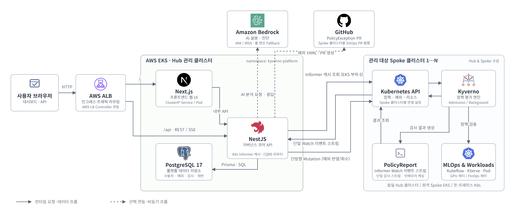

시스템은 Next.js 프론트엔드, NestJS 백엔드, PostgreSQL과 Prisma, Kubernetes와 Kyverno로 구성합니다. 프론트엔드는 개발자와 관리자 화면을 제공하고, 백엔드는 인증, 정책, 위반, 예외, 감사 및 MLOps 모듈을 결합합니다. 선택적 외부 연동으로 AWS Bedrock, GitHub, Kubeflow, KServe, Kubeflow Pipelines를 사용합니다.

정책 집행 경로는 Kubernetes API와 Kyverno가 담당하고, 본 플랫폼은 위반 이후의 조회, 설명, 예외 업무 상태, 외부 적용 결과와 감사 이력을 관리합니다. 정책 집행 경로와 데이터 저장 및 LLM 분석 경로를 분리하여 admission 처리에 플랫폼의 DB 또는 LLM 호출이 개입하지 않도록 구성합니다.

### 3.2. 사용 기술

| 구분 | 사용 기술 |
|---|---|
| 프론트엔드 | Next.js 15, React 19, TypeScript, Tailwind CSS, shadcn/ui, TanStack Query, Zustand |
| 백엔드 | NestJS 11, TypeScript, Prisma, JWT와 Passport, Zod, argon2, Swagger |
| 데이터베이스 및 캐시 | PostgreSQL 17, Redis 7 |
| 정책 및 인프라 | Kubernetes, Kyverno, kind, Docker, DevContainer, Kustomize, pnpm workspace, CI/CD |
| 외부 연동 | AWS Bedrock, GitHub, Kubeflow Notebook, KServe, Kubeflow Pipelines |
| 테스트 | Jest, Supertest, Testcontainers |

## 4. 개발 결과

### 4.1. 전체 시스템 흐름도

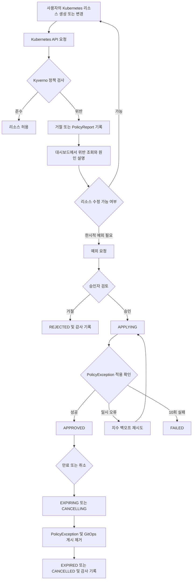

예외 요청은 `PENDING`, `APPLYING`, `APPROVED`, `REJECTED`, `CANCELLING`, `EXPIRING`, `EXPIRED`, `CANCELLED`, `FAILED` 상태로 관리합니다. 조정 작업은 10초마다 최대 50건의 후보를 처리하며, 적용 실패에는 10초 기반 지수 백오프와 최대 300초의 대기 간격을 사용합니다. `APPLYING` 상태에서 10회 실패하면 `FAILED`로 전환합니다.

### 4.2. 기능 설명 및 주요 기능 명세서

| 기능 | 입력 | 처리 | 출력 |
|---|---|---|---|
| 인증 및 접근 제어 | 로그인 정보, JWT, 사용자 역할과 클러스터 할당 | Access Token과 Refresh Token을 검증하고 Permission과 클러스터 범위를 확인한다. | 허용된 기능과 클러스터 데이터 또는 403 응답을 반환한다. |
| 정책 위반 조회 | PolicyReport, ClusterPolicyReport, 정책·네임스페이스·심각도 필터 | 접근 가능한 클러스터를 조회하고 부분 장애 시 성공한 결과를 우선 반환한다. | 위반 목록, 요약, 상세와 처리 상태를 제공한다. |
| 위반 원인 설명 | 오류 메시지, 정책 YAML, 리소스 매니페스트, 환경 문맥 | AWS Bedrock으로 분석하고 실패, 시간 초과 또는 JSON 파싱 실패 시 규칙 기반 템플릿으로 전환한다. | 원인 요약, 수정 단계, 수정 YAML, 정책의 필요성을 제공한다. |
| 예외 요청 | 대상 클러스터, 정책·규칙·리소스, 사유, 만료 시각 | 미래 만료 시각과 최대 기간을 검증하고 요청 범위를 저장한다. | `PENDING` 요청과 감사 기록을 생성한다. |
| 예외 검토 및 적용 | 승인 또는 거절, 승인 규칙, 검토 사유 | 자기 승인을 차단하고 정책과 규칙을 재검증한 뒤 PolicyException 적용을 확인한다. | `APPROVED` 또는 `REJECTED` 상태와 처리 이력을 제공한다. |
| 만료, 취소 및 복구 | 만료 시각, 취소 요청, 실제 클러스터 상태 | 조정 서비스가 DB와 Kubernetes 리소스를 대조하고 삭제 또는 복구를 재시도한다. | `EXPIRED`, `CANCELLED`, `FAILED` 상태와 감사 기록을 제공한다. |
| GitOps 게시 | 승인된 예외 정보 | 예외 YAML, Kustomization 항목, GitHub 브랜치와 Pull Request를 생성하고 종료 시 게시를 해제한다. | 게시 결과와 버전 관리 이력을 제공한다. |
| MLOps 거버넌스 | Notebook, 모델 서빙, 파이프라인, GPU 및 활동 정보 | Notebook CR과 PVC, KServe 트래픽, KFP 실행과 로그, 유휴 Notebook을 관리한다. | 워크로드 상태, 정책 현황, GPU 쿼터와 실행 결과를 제공한다. |

#### 관리자 대시보드

클러스터, 정책 위반, 예외와 확인이 필요한 알림을 요약하여 운영 상태를 확인합니다.

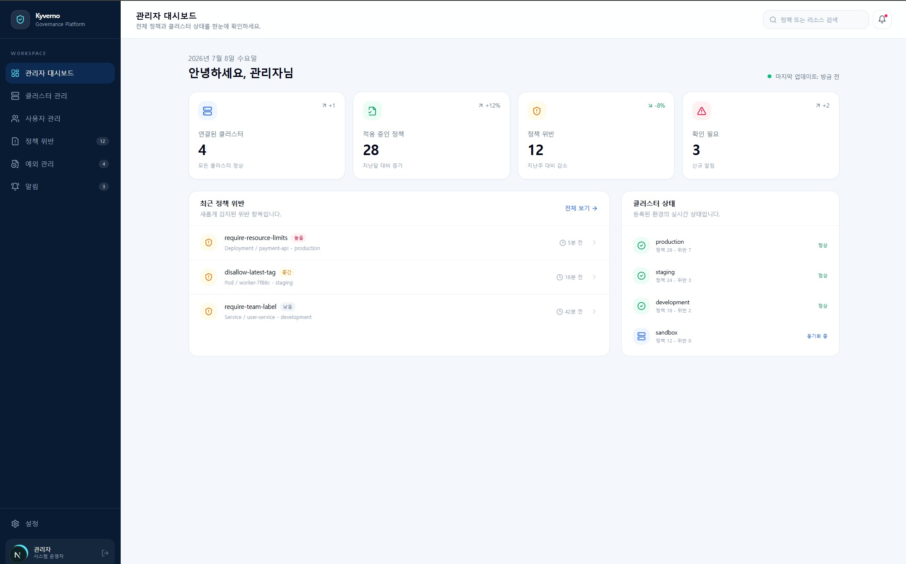

#### 정책 위반 조회

정책, 네임스페이스, 심각도 등의 조건으로 위반을 탐색하고 예외 요청 대상을 식별합니다.

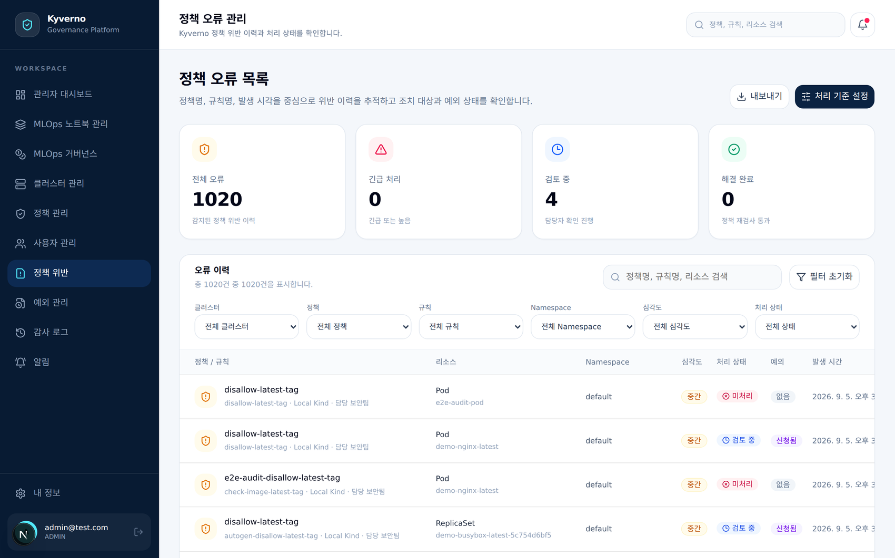

#### 예외 신청

대상 정책과 규칙, 리소스, 적용 범위, 만료 시각과 요청 사유를 지정합니다.

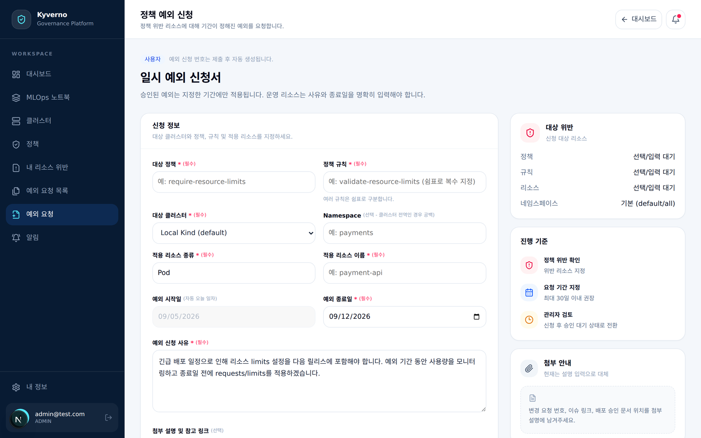

#### 예외 검토 및 승인

승인자는 요청 사유와 위험도, 적용 범위를 검토한 뒤 승인하거나 거절합니다.

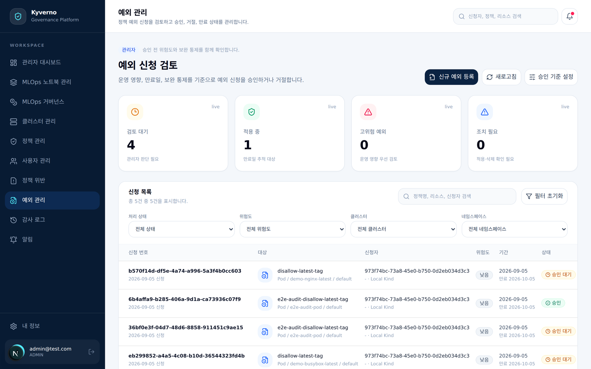

#### 예외 상세 및 처리 이력

요청 정보, 현재 상태, 적용 결과와 상태 변경 이력을 한 화면에서 추적합니다.

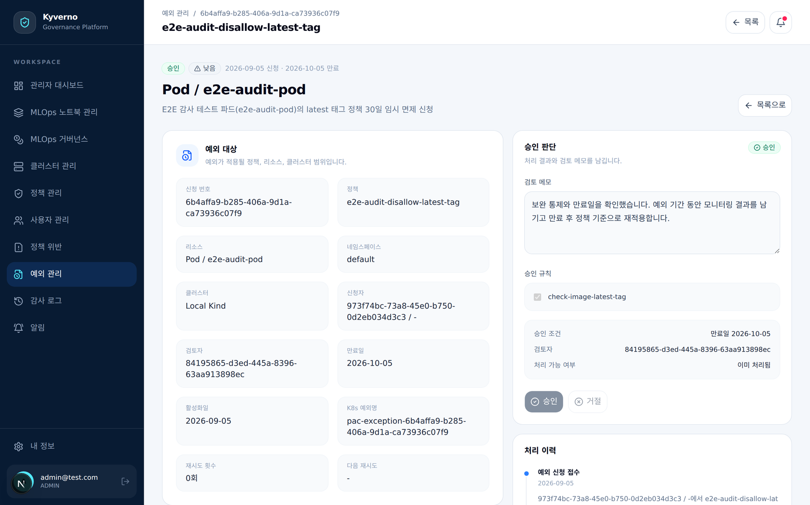

#### 감사 로그

요청, 승인, 거절, 활성화, 만료, 취소와 적용 실패 등 사용자 및 시스템 행위를 보존합니다.

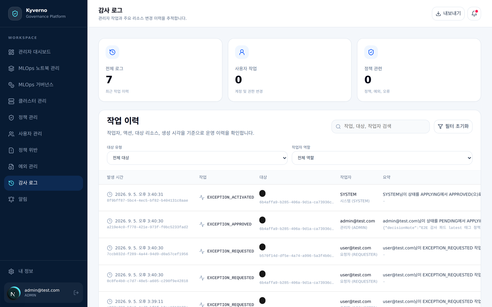

#### MLOps 거버넌스

사용자의 ML 작업 요청은 관리 플랫폼을 거쳐 Kyverno의 승인 이미지 및 GPU 상한 검사를 통과한 뒤 Notebook, Pipeline, KServe 워크로드로 생성됩니다. 플랫폼은 워크로드 상태와 GPU 할당량을 수집하고 유휴 Notebook을 중지 대상으로 관리합니다.

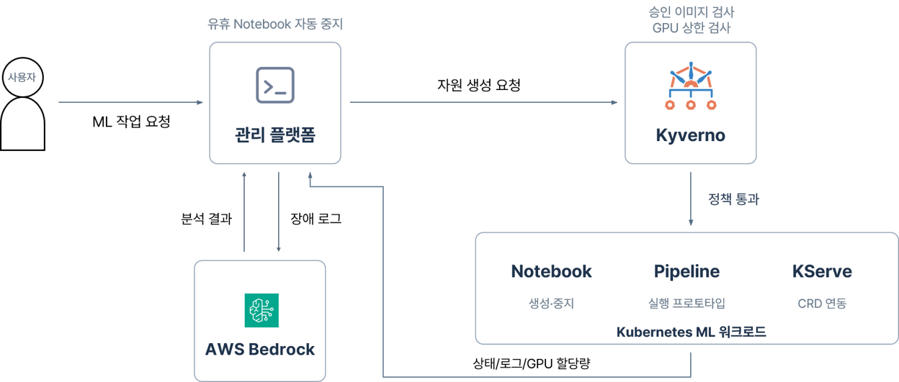

### 4.3. 디렉토리 구조

```text
.
├── apps/
│   ├── backend/
│   │   ├── prisma/             # Prisma 스키마, 마이그레이션과 시드
│   │   ├── src/                # NestJS API와 업무 모듈
│   │   └── test/               # 백엔드 통합 테스트
│   └── frontend/
│       ├── public/             # 정적 리소스
│       └── src/                # Next.js 화면과 클라이언트 로직
├── packages/
│   └── shared/
│       └── src/                # 프론트엔드와 백엔드의 공유 타입
├── k8s-manifests/
│   ├── base/                   # 공통 Kubernetes 리소스
│   ├── crds/                   # Kubeflow Notebook CRD
│   ├── modules/mlops/          # MLOps 확장 리소스
│   ├── overlays/               # EKS와 온프레미스 오버레이
│   ├── policies/               # Kyverno 정책
│   ├── rbac/                   # 원격 클러스터 RBAC
│   ├── system/                 # 플랫폼 배포 리소스
│   └── testbed/                # 정책과 예외 검증 시나리오
├── gitops/
│   ├── apps/                   # Argo CD 애플리케이션
│   └── spoke-apps/             # Spoke 클러스터 애플리케이션
├── scripts/                    # 로컬, EKS, 멀티클러스터 설정 및 배포 스크립트
├── docs/
│   ├── 01.보고서/              # 착수, 중간, 최종보고서
│   ├── 02.포스터/              # 포스터 PDF
│   ├── 03.발표자료/            # 발표 PDF와 PPTX
│   ├── images/                 # README와 보고서 화면 이미지
│   └── USAGE.md                # 상세 설치 및 사용 방법
├── docker-compose.yml          # 로컬 PostgreSQL과 Redis
├── install.sh                  # 클러스터 배포 스크립트 진입점
├── package.json                # 모노레포 공통 명령
└── pnpm-workspace.yaml         # pnpm 워크스페이스 구성
```

### 4.4. 산업체 멘토링 의견 및 반영 사항

| 멘토 의견 | 반영 사항 |
|---|---|
| 성능평가 근거가 부족하다. | 위반 조회 지연, 예외 승인 및 반영 지연, 만료 삭제 지연, 동시성 격리, AI 응답 지연과 오류율을 측정했다. 로컬 kind와 AWS EKS 환경을 분리하여 평가했다. |
| 처리 흐름을 직관적으로 설명할 필요가 있다. | 예외 상태 전이와 위반 조회부터 만료까지의 시연 흐름을 정리하고 대시보드 화면을 구성했다. |
| Kubeflow 적용으로 주제를 확장할 수 있다. | Notebook, KServe 모델 서빙, Kubeflow Pipelines, GPU 쿼터와 유휴 Notebook 거버넌스 모듈을 구현했다. |

### 4.5. 테스트 및 성능 평가

#### 평가 환경

| 구분 | 내용 |
|---|---|
| 자동화 테스트 | 백엔드 단위 테스트 58개 파일, 414개 케이스(100% 통과). 실제 PostgreSQL을 사용한 DB 통합 테스트 42개 케이스로 토큰 회전, 세션 만료, 예외 상태 전이의 트랜잭션 원자성을 검증 |
| 로컬 기준선 | kind 단일 클러스터, PolicyReport 100건과 1,000건 |
| 클라우드 부하 환경 | AWS EKS, 15개 네임스페이스, 150개 경량 파드, 181건의 PolicyReport가 실시간으로 갱신되는 조건 |
| 측정 방식 | NestJS 프로덕션 빌드와 PostgreSQL 17에서 `process.hrtime.bigint()` 기반 벤치마크로 p50, p95, 최대 지연, RPS, 오류율 산출 |

#### 핵심 기능 검증 시나리오

모든 시나리오는 UI가 아니라 Kubernetes API Server의 CR 상태, DB 트랜잭션 로그, AuditLog를 교차 확인하여 판정했습니다.

| 번호 | 검증 절차 | 판정 기준 |
|---|---|---|
| F1 | 정책 위반 리소스의 PolicyReport 조회 | 정책, 규칙, 대상 리소스, 네임스페이스, 클러스터 정보가 원본과 일치 |
| F2 | 권한 없는 사용자의 예외 승인 또는 타 클러스터 접근 | 403 응답, 상태 변경과 Kubernetes 리소스 생성 차단 |
| F3 | 권한 있는 승인자의 정상 승인 | `PENDING` → `APPLYING`을 거쳐 PolicyException CR 생성 확인 후 `APPROVED` 전이 |
| F4 | 동일 `PENDING` 요청에 대한 동시 승인 | `FOR UPDATE SKIP LOCKED`로 1건만 승인, 나머지는 409/400 차단, 중복 CR 0건 |
| F5 | 적용 중 Kubernetes API 일시 오류 후 복구 | 지수 백오프와 실패 횟수 기록, 백그라운드 재시도로 최종 `APPROVED` 반영 |
| F6 | 한시적 예외 만료 후 위반 리소스 재생성 | PolicyException CR 삭제, `EXPIRED` 전이, 신규 배포 즉시 차단 |
| F7 | PolicyException CR 수동 삭제 | 조정 서비스가 불일치를 감지해 활성 예외 CR을 자동 복구 |
| F8 | AI 서비스 시간 초과(15초 상한) 또는 네트워크 단절 | 규칙 기반 템플릿으로 즉시 전환하여 조치 가이드 반환 |
| F9 | MLOps 워크로드 생성과 정책 위반 감지 | GPU 쿼터와 신뢰할 수 없는 이미지 정책 판정 일치, 유휴 Notebook 감지 및 중지 |
| F10 | 승인 예외의 GitOps 동기화와 만료 시 회수 | GitHub PR 발행과 Kustomization 등록, 만료 시 매니페스트 회수 |

#### 성능 측정 결과

| 지표 | 조건 | 결과 |
|---|---|---|
| 위반 조회 (로컬) | kind, 1 VU, 조건별 300회 | 100건 p50 32.8ms / p95 96.1ms, 1,000건 p50 58.4ms / p95 101.1ms |
| 위반 조회 (EKS) | 181개 PolicyReport, 1·10·50 VU | 아래 표 참고, 전 구간 오류율 0% |
| 예외 승인·반영 (로컬) | 승인 API 호출부터 CR 생성 확인까지, 30회 | 승인 응답 p50 81.1ms, 승인~CR 확인 p50 92.1ms / p95 124.3ms |
| 예외 승인·반영 (원격 EKS) | 승인 API 호출부터 원격 EKS의 CR 생성 확인까지, 10회 | p50 225.11ms / p95 429.03ms, 10.00 RPS, 오류율 0% |
| 예외 만료 회수 | 만료 시각 도래 후 조정 루프의 CR 삭제, 30회 | p50 6.8초 / p95 12.9초 / 최대 13.2초 |
| 동시 승인 경합 | 동일 `PENDING` 요청에 20건 동시 승인 | 1건 승인, 19건 차단(409/400), 경합 처리 p50 29.68ms, 중복 CR 0건 |
| AI 원인 분석 | 오류 메시지와 매니페스트 기반 분석 | 규칙 기반 Fallback p50 4.5ms / p95 6.1ms, Amazon Nova Lite p50 1,892.16ms / p95 2,128.34ms |

AWS EKS 환경의 위반 조회 부하 테스트 결과는 다음과 같습니다.

| 벤치마크 | 조건 | VU | p50 (ms) | p95 (ms) | 최대 (ms) | RPS | 오류율 |
|---|---|---|---|---|---|---|---|
| BM-1-1VU | 전체 클러스터 위반 집계 | 1 | 212.48 | 218.52 | 224.63 | 4.73 | 0% |
| BM-1-10VU | 전체 클러스터 위반 집계 | 10 | 221.88 | 274.32 | 286.82 | 42.03 | 0% |
| BM-1-50VU | 전체 클러스터 위반 집계 | 50 | 339.84 | 929.40 | 1,138.00 | 96.79 | 0% |
| BM-2 | 단일 클러스터 필터링 조회 | 10 | 214.68 | 262.12 | 286.86 | 43.48 | 0% |

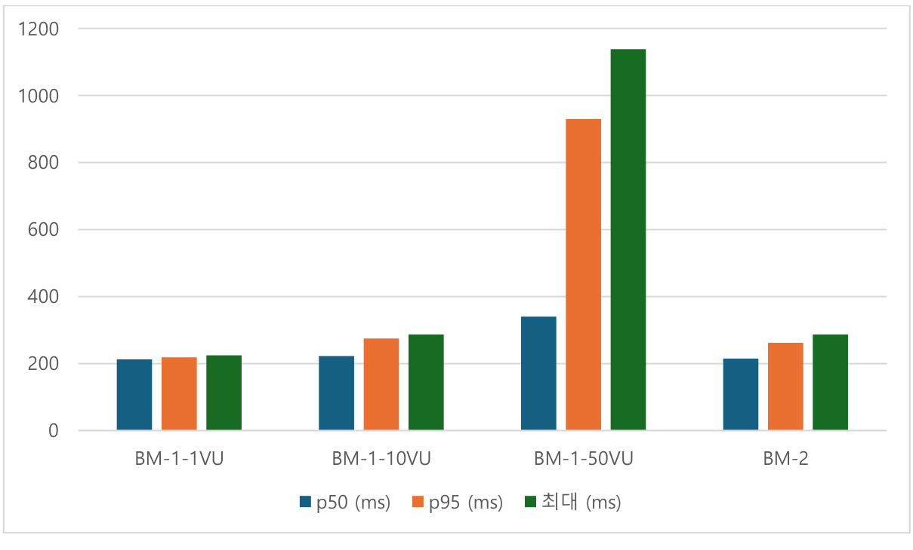

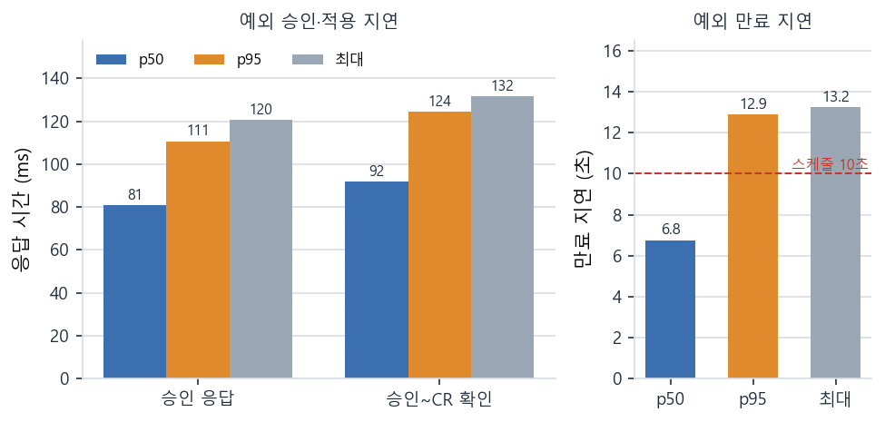

#### 결과 분석

- 동시 접속이 1 VU에서 10 VU로 늘어도 EKS 위반 조회 p50은 212.48ms에서 221.88ms로 4.4%만 증가했습니다. 50 VU에서도 오류 없이 초당 96.79건을 처리했습니다.
- 관리자가 승인한 뒤 원격 EKS에 PolicyException이 생성되기까지 p50 225.11ms가 걸려, 0.2초대에 예외 적용이 완료됩니다.
- 만료 회수 지연은 스케줄 주기(10초)와 후보 선점, 배치 제한, DB·API 통신 지연의 영향을 받습니다. 만료 후 즉시 미승인 파드를 배포했을 때 정책 거절이 다시 적용되는 것을 확인했습니다.
- 리소스 생성 후 위반이 PolicyReport에 반영되기까지는 약 20초가 걸렸습니다. 이는 조회 API가 아니라 Kyverno 백그라운드 스캔 주기에 따른 값입니다.

#### 현재 한계

- 평가는 단일 리전(us-east-1)의 EKS 클러스터를 중심으로 진행했습니다. 멀티리전 클러스터 간 수집과 조정 서비스 동기화는 추가 검증이 필요합니다.
- 유휴 Notebook 판단은 5분 주기 스케줄러와 어노테이션 기반으로 동작합니다. Prometheus의 실제 GPU·CPU 사용률과 연계한 판단은 향후 보완할 부분입니다.
- EKS 컨트롤 플레인 업그레이드, etcd compaction 등 장기 운영 중 발생할 수 있는 상황에서의 복원력은 추가 검증이 필요합니다.

## 5. 설치 및 실행 방법

### 5.1. 설치절차 및 실행 방법

로컬 개발 환경에는 Node.js 22 LTS, pnpm 9 이상, Docker Engine과 Docker Compose, kubectl 1.28 이상이 필요합니다. 로컬 Kubernetes 연동에는 kind 0.22 이상이 필요합니다.

```sh
pnpm install

cp apps/backend/.env.example apps/backend/.env
cp apps/frontend/.env.example apps/frontend/.env.local

docker compose up -d

pnpm db:migrate
pnpm db:seed

pnpm dev
```

실행 후 프론트엔드는 `http://localhost:3000`, Swagger API 문서는 `http://localhost:3001/api/docs`에서 확인합니다. 로컬 kind 클러스터를 연동하려면 다음 명령을 실행합니다.

```sh
./scripts/setup-local-cluster.sh
```

자세한 설치, 환경 변수와 사용 방법은 [docs/USAGE.md](docs/USAGE.md)를 참고합니다.

### 5.2. 오류 발생 시 해결 방법

- PostgreSQL 또는 Redis 연결 오류가 발생하면 `docker compose up -d`로 두 서비스를 실행하고 `apps/backend/.env`의 `DATABASE_URL`을 확인합니다.
- 로컬 Kubernetes 리소스를 조회하지 못하면 `kubectl`과 kind 설치 여부를 확인하고 `./scripts/setup-local-cluster.sh`로 테스트 클러스터를 구성합니다.
- AWS Bedrock 호출이 실패하거나 시간 초과 또는 응답 파싱 오류가 발생하면 시스템은 규칙 기반 설명 템플릿으로 전환합니다.
- GitHub 설정이 없으면 GitOps 게시 기능은 로컬 파일 게시 경로를 사용합니다.

## 6. 소개 자료 및 시연 영상

### 6.1. 프로젝트 소개 자료

- [착수보고서](docs/01.보고서/01.착수보고서.pdf)
- [중간보고서](docs/01.보고서/02.중간보고서.pdf)
- [최종보고서](docs/01.보고서/03.최종보고서.pdf)
- [포스터](docs/02.포스터/포스터파일.pdf)
- [발표자료 PDF](docs/03.발표자료/발표자료.pdf)
- [발표자료 PPTX](docs/03.발표자료/발표자료.pptx)

### 6.2. 시연 영상

> TODO: 프로젝트 시연 영상 링크 추가

## 7. 팀 구성

### 7.1. 팀원별 소개 및 역할 분담

| 이름 | 이메일 | 담당 영역 | 주요 역할 |
|---|---|---|---|
| 고영림 | yeongrimgo1106@pusan.ac.kr | 기획 및 인프라 | DevContainer와 kind 개발 환경, 프론트엔드 및 백엔드 컨테이너화, CI/CD, 정책 파일 검증, 시스템 구조 설계, Kubernetes 인프라와 GitOps 및 MLOps 외부 연동 |
| 최유렬 | yuyeol@pusan.ac.kr | 백엔드 | JWT와 RBAC 인증 및 인가, 정책 위반 및 예외 처리 API, 예외 상태 조정과 재시도, 감사 기록, Kubernetes API 연동 |
| 박태영 | pty4pp@pusan.ac.kr | 프론트엔드 | 개발자 및 관리자 대시보드, 정책 위반 목록과 필터 및 상세, 예외 요청과 검토 및 승인, 감사 및 클러스터 관제 화면, 백엔드 API 연동 |

### 7.2. 팀원 별 참여 후기

> TODO: 참여 후기 추가
