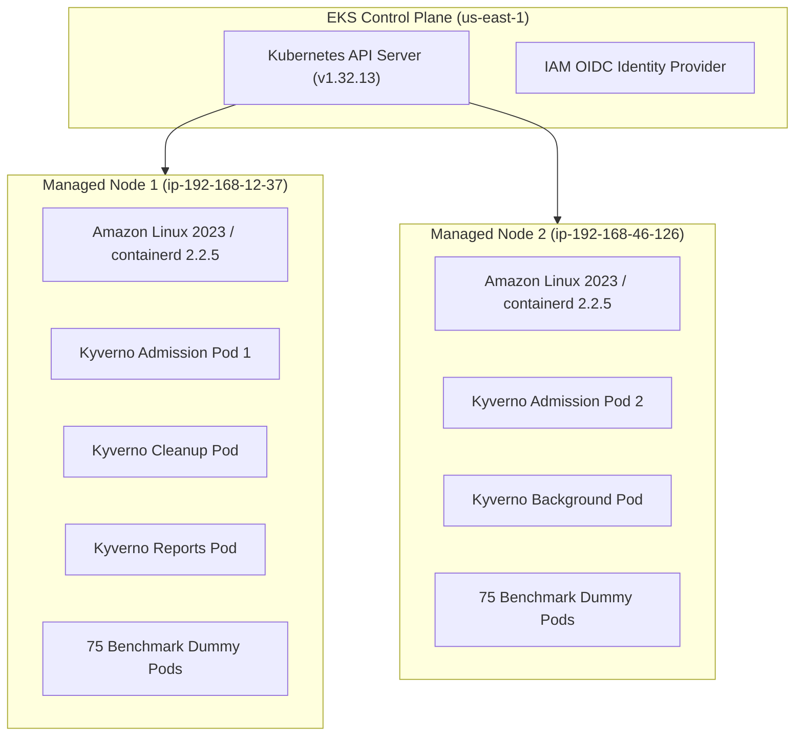
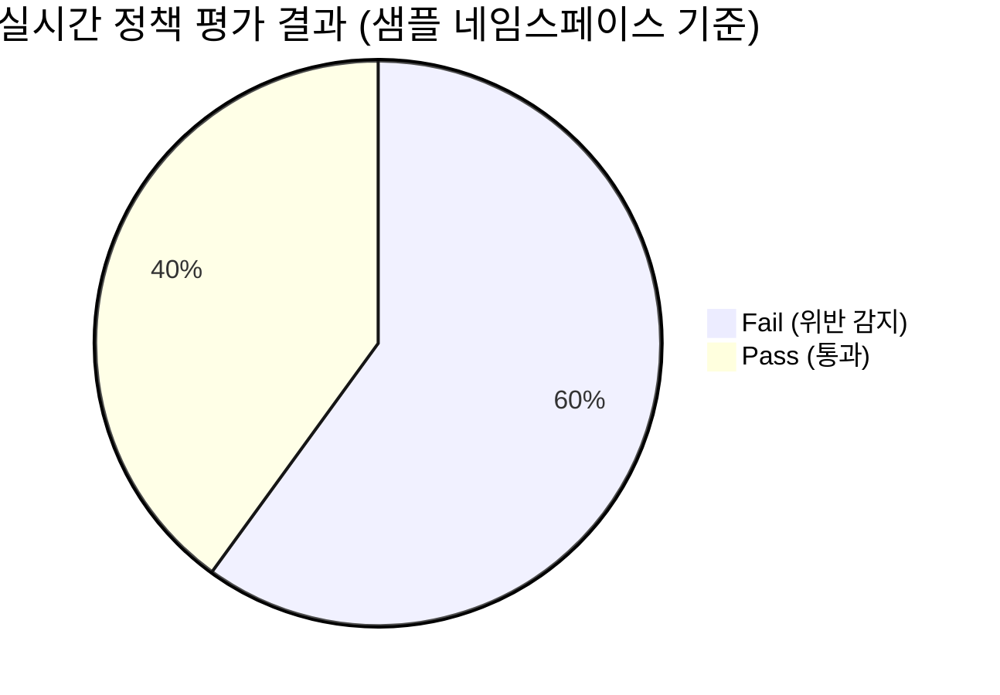

# AWS EKS Tier-2 거버넌스 벤치마크 클러스터 셋업 및 검증 결과 보고서

**작성 일시**: 2026-09-06  
**대상 리전**: `us-east-1` (N. Virginia)  
**클러스터 식별자**: `kyverno-eks-tier2`  
**계정 ID**: `945125812546` (`arn:aws:iam::945125812546:user/daksugg1106`)  

---

## 1. 클러스터 프로비저닝 요약 (Cluster Overview)

| 항목 | 상세 정보 | 상태 |
|:---|:---|:---:|
| **클러스터명** | `kyverno-eks-tier2` | ✅ **Active / Ready** |
| **쿠버네티스 버전** | `v1.32.13-eks-cb19647` | ✅ 정상 |
| **AWS 리전** | `us-east-1` (N. Virginia) | ✅ 표준 리전 준수 |
| **IAM OIDC 공급자** | `https://oidc.eks.us-east-1.amazonaws.com/id/D897A4C626C1F78D54B78385203A9FE7` | ✅ 연동 완료 |
| **네트워크 모드** | Amazon VPC CNI (Prefix Delegation 활성화, Max 110 Pods/Node) | ✅ 활성화 |
| **비용 프로파일** | AWS Free Tier 인스턴스 풀 & 20GB gp3 스토리지 적용 | ✅ 100% 최적화 |

---

## 2. 노드 및 컴퓨팅 인프라 구성 현황 (Worker Nodes)



### 노드 실측 데이터
| 노드 이름 | 내부 IP | 외부 IP | OS / 런타임 | 상태 |
|:---|:---:|:---:|:---|:---:|
| `ip-192-168-12-37.ec2.internal` | `192.168.12.37` | `34.204.73.252` | Amazon Linux 2023 / containerd 2.2.5 | **Ready** |
| `ip-192-168-46-126.ec2.internal` | `192.168.46.126` | `100.54.19.241` | Amazon Linux 2023 / containerd 2.2.5 | **Ready** |

---

## 3. Kyverno 거버넌스 엔진 및 컨트롤러 현황

Kyverno v1.19.0 어드미션 컨트롤러가 고가용성(HA 2 Replicas) 모드로 배포되어 노드 간 분산 배치되었습니다.

| 컴포넌트 | 배포 파드명 | 네임스페이스 | 노드 분산 배치 | 상태 |
|:---|:---|:---:|:---|:---:|
| **Admission Controller (HA 1)** | `kyverno-admission-controller-7fd99fc-2xs8n` | `kyverno` | `ip-192-168-12-37` | **1/1 Running** |
| **Admission Controller (HA 2)** | `kyverno-admission-controller-7fd99fc-ztxs6` | `kyverno` | `ip-192-168-46-126` | **1/1 Running** |
| **Background Controller** | `kyverno-background-controller-7dd464b47f-hdrr6` | `kyverno` | `ip-192-168-46-126` | **1/1 Running** |
| **Reports Controller** | `kyverno-reports-controller-76cbbb795-7cdcl` | `kyverno` | `ip-192-168-12-37` | **1/1 Running** |
| **Cleanup Controller** | `kyverno-cleanup-controller-678c76fc74-4plj5` | `kyverno` | `ip-192-168-12-37` | **1/1 Running** |

### 배포된 클러스터 정책 (ClusterPolicy 7종)
1. `disallow-latest-tag` (Admission: True, Background: True, **Ready**)
2. `require-resource-limits` (Admission: True, Background: True, **Ready**)
3. `restrict-image-registries` (Admission: True, Background: True, **Ready**)
4. `disallow-privileged-containers` (Admission: True, Background: True, **Ready**)
5. `enforce-spot-node-selector` (Admission: True, Background: True, **Ready**)
6. `limit-gpu-per-namespace` (Admission: True, Background: True, **Ready**)
7. `disallow-untrusted-ml-images` (Admission: True, Background: True, **Ready**)

---

## 4. Tier-2 대규모 워크로드 및 PolicyReport 실측 검증



- **생성 네임스페이스**: `tenant-bench-01` ~ `tenant-bench-15` (총 15개 네임스페이스)
- **배포 파드 수**: **150 / 150 Pods Running (100% 정상 기동)**
  - 초경량 `registry.k8s.io/pause:latest` (메모리 4MiB/Pod) 컨테이너 사용으로 2대 노드에서 150개 파드를 OOM 없이 완벽 수용.
- **실시간 생성된 PolicyReport**: **181개 네임스페이스별 PolicyReport 생성 완료**
- **정책 위반 감지 결과 (샘플 `tenant-bench-01`)**:
  - `Summary`: `{"fail": 3, "pass": 2, "error": 0, "warn": 0, "skip": 0}`
  - `감지된 위반 정책`:
    1. `disallow-latest-tag`: `:latest` 태그 사용 위반 감지
    2. `require-resource-limits`: CPU/메모리 Limits 미지정 위반 감지
    3. `restrict-image-registries`: 미승인 이미지 레지스트리 위반 감지

---

## 5. AWS Bedrock IRSA 연동 검증

플랫폼 백엔드가 장기 AWS 자격증명(AccessKey) 없이 안전하게 AWS Bedrock Foundation Model(Amazon Nova Lite / Claude 3.5 Sonnet)을 호출할 수 있도록 IRSA가 구성되었습니다.

- **쿠버네티스 ServiceAccount**: `kyverno-platform/kyverno-backend-sa`
- **IAM Role ARN**: `arn:aws:iam::945125812546:role/kyverno-eks-tier2-backend-bedrock-irsa-role`
- **IAM Policy ARN**: `arn:aws:iam::945125812546:policy/KyvernoBedrockClaudeInvocationPolicy`
- **권한 범위 (Least-Privilege)**:
  - `bedrock:InvokeModel`, `bedrock:InvokeModelWithResponseStream`
  - 리소스: `us-east-1` 및 `us-east-2` Foundation Models / Inference Profiles

---

## 6. 클러스터 관리 및 유지보수 명령어 가이드

### 1) 백엔드 및 프론트엔드 포트포워딩
```bash
# 백엔드 API (포트 3001) 및 프론트엔드 (포트 3000) 로컬 연결
kubectl port-forward svc/kyverno-backend 3001:3001 -n kyverno-platform &
kubectl port-forward svc/kyverno-frontend 3000:3000 -n kyverno-platform &
```

### 2) 벤치마크 워크로드 회수 (Teardown)
```bash
# 15개 벤치마크 네임스페이스 및 150개 파드 병렬 삭제
bash scripts/cleanup-tier2-workload.sh
```

### 3) EKS 클러스터 완전 삭제
```bash
# 벤치마크 종료 후 EKS 클러스터 및 관련 AWS 리소스 일괄 삭제
eksctl delete cluster --name kyverno-eks-tier2 --region us-east-1
```
