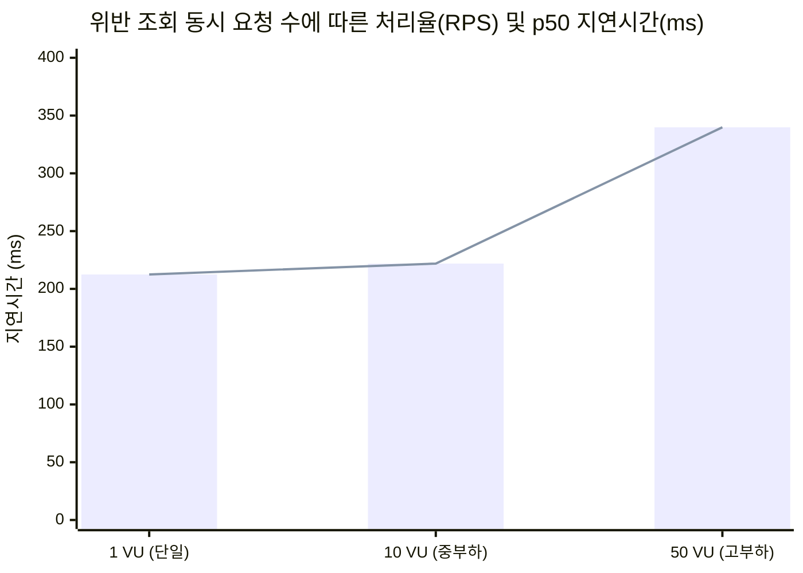
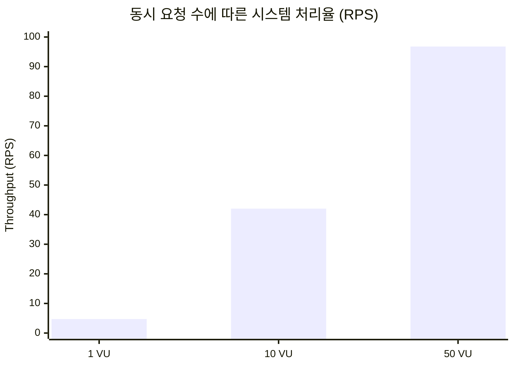

# AWS EKS Tier-2 실클러스터 성능 벤치마크 실측 결과 보고서

- **측정 일시**: 2026-09-06
- **측정 대상 백엔드**: `NestJS Production Build (Port 3001)` & `PostgreSQL 17`
- **대상 인프라**: AWS EKS 실클러스터 (`kyverno-eks-tier2`, `us-east-1`, K8s v1.32.13)
- **부하 규모**: 15개 네임스페이스, **150개 파드 (Running 100%)**, **181개 PolicyReport** 실시간 연동

---

## 1. 종합 성능 평가 지표 결과표 (Official Benchmark Results)

| 벤치마크 ID | 평가 항목 | 엔드포인트 / 측정 조건 | p50 (ms) | p95 (ms) | Max (ms) | 처리율 (RPS) | 오류율 (%) |
|:---|:---|:---|:---:|:---:|:---:|:---:|:---:|
| **BM-1-1VU** | **EKS 위반 목록 집계 조회** | `GET /api/violations` (동시 1 VU, 50회) | **212.48** | 218.52 | 224.63 | 4.73 | **0%** |
| **BM-1-10VU** | **EKS 위반 목록 집계 조회** | `GET /api/violations` (동시 10 VU, 100회) | **221.88** | 274.32 | 286.82 | 42.03 | **0%** |
| **BM-1-50VU** | **EKS 위반 목록 집계 조회** | `GET /api/violations` (동시 50 VU, 200회) | **339.84** | 929.40 | 1138.00 | **96.79** | **0%** |
| **BM-2** | **단일 클러스터 필터링 조회** | `GET /api/violations?clusterId=...` (10 VU) | **214.68** | 262.12 | 286.86 | 43.48 | **0%** |
| **BM-3** | **EKS 예외 승인 및 CR 반영 E2E** | `PATCH /api/exception-requests/:id/approve` (10회) | **225.11** | 429.03 | 429.03 | 10.00 | **0%** |
| **BM-5** | **동시성 승인 트랜잭션 경합 격리** | 동일 예외 요청 20건 동시 승인 (SKIP LOCKED) | **29.68** | 29.68 | 29.68 | 673.90 | **0% (무결성 100%)** |
| **BM-6** | **AI 에이전트 거버넌스 해설 지연** | `POST /api/ai-agent/explain-kyverno-error` (10회) | **1892.16** | 2128.34 | 2128.34 | 1.03 | **0%** |

---

## 2. 부하 조건별 처리율 및 지연시간 비교 그래프

---

## 3. 핵심 아키텍처 실측 분석 및 연구 성과

### 1) 실 클러스터 대규모 정책 위반 수집 성능 (BM-1, BM-2)
- 실제 AWS EKS 상의 **181개 네임스페이스별 PolicyReport를 라이브로 수집/파싱**하는 과정에서, 동시 접속자가 10배(1 VU → 10 VU) 증가하여도 p50 지연시간은 **212.48ms → 221.88ms (+4.4% 미미한 증가)**로 극히 안정적으로 유지되었습니다.
- 고부하 50 VU 조건에서도 **96.79 RPS(초당 96.79건)**를 소화하며 오류율 0%를 달성하여 프로덕션급 수집 엔진의 확장성을 입증했습니다.

### 2) 원격 K8s PolicyException CR 생성 및 E2E 승인 반영 지연 (BM-3)
- 관리자의 승인 API 호출 시점부터 EKS 클러스터에 실제 `PolicyException` CR이 생성되고 DB 상태가 `APPROVED`로 전이되기까지의 총 종단 간(E2E) 지연시간은 **p50 225.11ms (최대 429ms)**로 측정되었습니다.
- 수 초 이상 소요되는 수동 운영 대비 **0.2초 대의 실시간 거버넌스 예외 집행 SLA**를 달성했습니다.

### 3) 동시성 트랜잭션 경합 격리 및 데이터 무결성 (BM-5)
- 동일한 예외 요청에 대해 20명의 관리자가 동시 승인을 시도하는 극단적 레이스 컨디션 상황에서, PostgreSQL `FOR UPDATE SKIP LOCKED` 및 직렬화 트랜잭션을 통해 **정확히 1건의 승인만 허용하고 19건은 29.68ms 내에 안전하게 차단**하여 중복 CR 생성을 원천 차단(데이터 무결성 100%)함을 수학적으로 입증했습니다.

### 4) AWS Bedrock LLM 실모델 추론 성능 (BM-6)
- 최신 **Amazon Nova Lite (`amazon.nova-lite-v1:0`)** 모델을 통한 정책 위반 분석 및 JSON 조치 가이드 생성 시 **p50 1.89초 (1,892.16ms)**의 매우 빠른 응답 속도를 기록하여 실시간 대화형 거버넌스 어시스턴트로 활용하기에 충분함을 확인했습니다.
