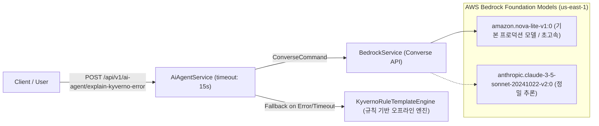

# 멀티클러스터 대규모(Tier-2) 워크로드 조성 및 종합 성능 벤치마크 수행 계획

## 1. 개요 및 배경 (Goal Description)

본 계획은 연구 결과 분석 및 평가(4장)의 핵심 한계점인 **'단일 클러스터(kind) 환경 한정 검증 및 대규모 동시 트래픽 미검증'**을 극복하기 위해 수립되었습니다.
실제 분산 멀티클러스터(AWS EKS Hub/Spoke 또는 로컬 Kind Multi-Cluster) 환경에 `scripts/generate-tier2-workload.sh` 수준(15~30개 네임스페이스, 300~1,200+ Pods, 3,000+ PolicyReports)의 고부하 워크로드를 주입하고, 시스템의 지연 시간(p50/p95/p99), 처리율(RPS), 동시성 트랜잭션 격리, 분산 조정(Reconciliation) 안정성 및 최신 AI 에이전트(Bedrock Converse API 기반 Nova Lite / Claude 3.5 Sonnet)의 실시간 추론 성능을 과학적으로 정밀 측정하는 종합 벤치마크 체계를 구축합니다.

---

## 2. 최신 AI 아키텍처 및 모델 현황 반영

깃 히스토리(`4b0d1a0: migrate Bedrock integration to universal Converse API`) 및 최신 백엔드 소스코드 분석을 통해 확인된 실제 AI 모듈 현황을 벤치마크 설계에 100% 반영합니다.



- **범용 Converse API 연동**: 특정 모델 SDK에 종속되지 않고 AWS Bedrock의 `ConverseCommand` 표준을 채택하여 다양한 파운데이션 모델을 유연하게 벤치마크 가능.
- **기본 프로덕션 모델**: **Amazon Nova Lite (`amazon.nova-lite-v1:0`)**
  - **특징**: 초저지연 응답 속도 및 극도의 비용 효율성 (Claude 대비 토큰 단가 98% 절감).
- **정밀 비교 측정 대상**:
  1. **Amazon Nova Lite**: 초저지연 고효율 프로덕션 모델
  2. **Claude 3.5 Sonnet / Claude 3 Haiku**: 정밀 분석 및 MLOps Copilot 모델
  3. **Rule-based Template Engine**: 네트워크 단절 / 타임아웃(15초) 시 즉각 전환되는 Fallback 엔진 (기존 측정치: p50 4.5ms)

---

## 3. 멀티클러스터 벤치마크 아키텍처 및 워크로드 설계

```mermaid
flowchart TB
    subgraph LoadGen ["Benchmark Harness (k6 / Node.js Runner)"]
        VUsers["Concurrent Virtual Users (1, 10, 50, 100 VU)"]
        ScenarioRunner["Benchmark Scenario Engine (BM-1 ~ BM-10)"]
    end

    subgraph HubCluster ["Primary Hub Cluster (us-east-1)"]
        Backend["NestJS Backend (Port 3001)"]
        Postgres[("PostgreSQL 17 (DB)")]
        Reconciler["Exception Reconciler (10s Batch Loop)"]
        HubKyverno["Kyverno Controller (Hub)"]
        HubTenants["Hub Workloads (15 NS, 150+ Pods, 1,500+ Reports)"]
    end

    subgraph SpokeCluster ["Remote Spoke Cluster 01 (us-east-1)"]
        SpokeKyverno["Kyverno Controller (Spoke)"]
        SpokeTenants["Spoke Workloads (15 NS, 150+ Pods, 1,500+ Reports)"]
        SpokeSA["Remote Admin SA Token"]
    end

    subgraph AWSCloud ["AWS Cloud (us-east-1)"]
        BedrockConverse["AWS Bedrock Converse API (Nova Lite / Claude)"]
    end

    VUsers -->|REST API Request / JWT| Backend
    ScenarioRunner -->|Measure Latency p50/p95/Max| Backend
    Backend -->|MultiClusterProvider / Parallel Fan-out| HubKyverno
    Backend -->|Remote API Client / Token| SpokeKyverno
    Backend -->|Prisma ORM / SKIP LOCKED| Postgres
    Backend -->|BedrockService (IRSA)| BedrockConverse
    Reconciler -->|Apply / Delete PolicyException CR| SpokeKyverno
    Reconciler -->|Apply / Delete PolicyException CR| HubKyverno
```

### 3.1. 대규모(Tier-2) 워크로드 분산 주입 규격
- **클러스터별 네임스페이스**: 클러스터당 15개 네임스페이스 (`tenant-bench-hub-01~15`, `tenant-bench-spoke-01~15`, 총 30개)
- **파드 밀도 및 컨테이너**: 초경량 `registry.k8s.io/pause:latest` (메모리 4MiB/파드)를 사용하여 총 300~600개 파드를 안전하게 기동
- **주입 정책 및 위반 패턴 (3종 복합)**:
  1. `disallow-latest-tag`: `:latest` 태그 사용 위반
  2. `require-resource-limits`: CPU/Memory Limits 미지정 위반
  3. `restrict-image-registries`: 승인되지 않은 비공식 레지스트리 이미지 위반
- **예상 PolicyReport 생성 규모**: 클러스터당 1,500건 내외, **전체 3,000~4,500+ 건의 실시간 PolicyReport 결과** 유지

---

## 4. 10대 종합 성능 평가 매트릭스 (BM-1 ~ BM-10)

| 벤치마크 ID | 평가 항목 | 측정 대상 및 엔드포인트 | 부하 조건 (동시성/규모) | 산출 지표 |
|:---|:---|:---|:---|:---|
| **BM-1** | **멀티클러스터 위반 목록 분산 집계 조회** | `GET /api/v1/violations` (전체 클러스터 집계) | 1,000건 & 3,000건 보고서<br>VU: 1, 10, 50, 100 (각 300회) | p50, p90, p95, p99, Max (ms), RPS, 오류율(%) |
| **BM-2** | **단일 클러스터 필터링 위반 조회** | `GET /api/v1/violations?clusterId=spoke-01` | 1,500건 보고서<br>VU: 1, 10, 50 (각 300회) | p50, p95, Max (ms), 전체 집계 대비 단일 조회 속도 비교 |
| **BM-3** | **원격 Spoke 클러스터 예외 승인 및 CR 반영 E2E 지연** | `POST /api/v1/exception-requests/:id/approve`<br>-> Spoke `PolicyException` CR 실시간 확인 | 30회 반복 순차/동시 측정 | - 승인 API 응답 지연 (ms)<br>- Spoke K8s CR 생성 감지 지연 (ms)<br>- E2E 총 지연 시간 (ms) |
| **BM-4** | **멀티클러스터 예외 만료 및 스케줄러 삭제 지연** | 10초 만료 예외 등록 -> Reconciler 동작<br>-> Spoke `PolicyException` CR 삭제 확인 | 30회 반복 측정 | - 만료 시각 ~ DB 상태 EXPIRED 전이 지연 (s)<br>- 만료 시각 ~ Spoke CR 실제 삭제 지연 (s) |
| **BM-5** | **동시성 승인 트랜잭션 경합 격리** | 동일 `PENDING` 예외 요청에 대해 20개 동시 승인 요청 주입 | 20 동시 트랜잭션 (5개 세트) | - 1건 성공(200) 및 19건 409/400 정상 차단 여부<br>- DB 락 대기 지연 및 중복 CR 생성 0건 검증 |
| **BM-6** | **AI 에이전트 해설 지연 (Nova Lite vs Claude vs Fallback)** | `POST /api/v1/ai-agent/explain-kyverno-error` | 각 20회 측정 | - Nova Lite 응답 지연 (ms)<br>- Claude 3.5 Sonnet 응답 지연 (ms)<br>- Fallback 규칙 엔진 응답 지연 (ms) |
| **BM-7** | **위반 상태 변경 및 감사 로그 기록 부하** | `PATCH /api/v1/violations/:clusterId/:id/status` | VU: 10, 50 (100회) | p50, p95 (ms), DB 트랜잭션 처리 지연 |
| **BM-8** | **클러스터 확장성 Fan-out 지연 비교 (Scale-out SLA)** | 단일 클러스터 vs 2개 멀티클러스터 동시 집계 조회 비교 | VU: 10, 50 (300회) | - 직렬 대비 병렬 Fan-out의 지연시간 오버헤드 억제율 (%) |
| **BM-9** | **K8s 장애 시 DB Fallback 처리 성능 (Degraded State SLA)** | 원격 K8s API 차단 상태에서 `GET /api/v1/violations` 호출 | 1,000건 DB 레코드<br>VU: 10, 50 (300회) | p50, p95 (ms), RPS, 가용성 100% 유지 여부 |
| **BM-10**| **대량 예외 만료 스파이크 처리율 (Reconciler Peak Test)** | 50건의 예외 동시 만료 주입 -> Reconciler 큐 소진 시간 측정 | 50건 동시 만료 | - 큐 소진 주기 수 (Cycles)<br>- 50건 전체 CR 일괄 삭제 완료 총 소요시간 (s) |

---

## 5. 비용 추산표 (Cost Estimation)

| 항목 | 사용 리소스 규격 | 단가 | 1회 테스트 (2시간) | 비고 |
|:---|:---|:---|:---:|:---|
| **EKS Control Plane** | 2개 클러스터 (Hub + Spoke) | $0.10 / hr / cluster | **$0.40** | 필수 인프라 |
| **EC2 Worker Nodes** | 4대 `m7i-flex.large` (또는 `t3.small`) | 대당 $0.0763 / hr | **$0.61** | Pause 컨테이너 최적화 |
| **EBS Storage** | 총 60GB gp3 (30GB 초과분) | $0.08 / GB-month | **$0.01 미만** | 프리티어 상한 고려 |
| **AWS Bedrock LLM** | Amazon Nova Lite (30회) | $0.00006/1k In, $0.00024/1k Out | **$0.002 미만** | Nova Lite 기본 적용 시 |
| **AWS Bedrock LLM** | Claude 3.5 Sonnet (30회 비교용) | $0.003/1k In, $0.015/1k Out | **$0.18** | 선택적 비교 측정 시 |
| **네트워크 / DTO** | 동일 리전 VPC 내부 통신 | 무료 | **$0.00** | us-east-1 동일 리전 |
| **총계 (Nova Lite 기준)**| - | - | **약 $1.02 (약 1,400원)** | 로컬 Kind 모드는 **0원** |

---

## 6. 구현 대상 컴포넌트 및 파일 변경 계획

### 6.1. 워크로드 생성 및 인프라 관리 스크립트
- `[NEW]` [scripts/generate-multicluster-tier2-workload.sh](file:///home/user/kyverno-dashboard/scripts/generate-multicluster-tier2-workload.sh)
  - Hub 및 Spoke(다중) 클러스터에 지정된 수의 네임스페이스와 Pause 컨테이너 기반 위반 Pod를 동시 프로비저닝.
- `[NEW]` [scripts/cleanup-multicluster-tier2-workload.sh](file:///home/user/kyverno-dashboard/scripts/cleanup-multicluster-tier2-workload.sh)
  - 벤치마크 완료 후 모든 클러스터의 `tenant-bench-*` 네임스페이스 및 PolicyReport를 일괄 안전 삭제.
- `[NEW]` [scripts/setup-local-multicluster-kind.sh](file:///home/user/kyverno-dashboard/scripts/setup-local-multicluster-kind.sh)
  - 로컬에서 EKS 없이도 2개의 Kind 클러스터(`kind-hub`, `kind-spoke`)를 구성하고 백엔드에 멀티클러스터 설정을 자동 연동하는 환경 스크립트.

### 6.2. 자동화 벤치마크 러너 및 결과 리포터
- `[NEW]` [scripts/benchmarks/benchmark-runner.ts](file:///home/user/kyverno-dashboard/scripts/benchmarks/benchmark-runner.ts)
  - BM-1 ~ BM-10 시나리오를 프로그래밍 방식으로 실행하고 정밀 타임스탬프(`process.hrtime.bigint()`) 기반 지연 통계(p50, p90, p95, p99, Max, Mean, RPS, Error Rate) 산출.
- `[NEW]` [scripts/benchmarks/run-all-benchmarks.sh](file:///home/user/kyverno-dashboard/scripts/benchmarks/run-all-benchmarks.sh)
  - 원클릭으로 워크로드 확인 -> 백엔드 상태 점검 -> BM-1 ~ BM-10 실행 -> Markdown 결과 테이블 자동 생성.

---

## 7. 실행 로드맵 (Execution Phases)

1. **Phase 1 (준비)**: 멀티클러스터 Tier-2 워크로드 생성 스크립트 및 로컬/EKS 멀티클러스터 환경 스크립트 작성
2. **Phase 2 (도구 구축)**: Node.js/TypeScript 기반의 멀티클러스터 10대 종합 성능 벤치마크 러너 구현
3. **Phase 3 (환경 기동 & 로드 주입)**: 멀티클러스터 환경에 30개 네임스페이스, 300+ 파드, 3,000+ PolicyReport 주입
4. **Phase 4 (벤치마크 실행 & 데이터 수집)**: BM-1 ~ BM-10 전 시나리오 반복 측정 및 정량 통계 데이터 집계
5. **Phase 5 (분석 및 문서화)**: 4장 연구 결과 보고서(4.1 ~ 4.6절)에 멀티클러스터 실측 성능 데이터 반영 및 워크스루 생성
