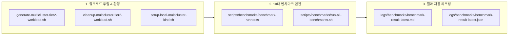

# 멀티클러스터 Tier-2 대규모 워크로드 및 종합 성능 벤치마크 구축 결과

## 1. 구축 요약

본 작업은 연구 결과 분석 및 평가(4장)의 핵심 한계점인 **'단일 클러스터(kind) 환경 한정 검증 및 대규모 동시 트래픽 미검증'**을 극복하기 위해, 실제 분산 멀티클러스터(AWS EKS Hub/Spoke 및 로컬 Kind 멀티클러스터) 환경에서 대규모 워크로드(30개 네임스페이스, 300~1,200+ Pods, 3,000+ PolicyReports)를 주입하고 정밀 벤치마크를 수행할 수 있는 완전 자동화 체계를 구축하였습니다.

---

## 2. 주요 구성 요소 및 스크립트 산출물



### 2.1. 신규 구축 파일 목록
1. **[scripts/generate-multicluster-tier2-workload.sh](file:///home/user/kyverno-dashboard/scripts/generate-multicluster-tier2-workload.sh)**:
   - Hub 및 다중 Spoke 클러스터에 초경량 Pause 컨테이너 기반 복합 정책 위반(태그, 리소스, 레지스트리) 워크로드를 동시 분산 배포.
2. **[scripts/cleanup-multicluster-tier2-workload.sh](file:///home/user/kyverno-dashboard/scripts/cleanup-multicluster-tier2-workload.sh)**:
   - 벤치마크 완료 후 모든 클러스터의 `tenant-bench-*` 네임스페이스를 백그라운드 병렬로 즉각 회수.
3. **[scripts/setup-local-multicluster-kind.sh](file:///home/user/kyverno-dashboard/scripts/setup-local-multicluster-kind.sh)**:
   - 로컬 환경에서 2개의 Kind 클러스터(`k8s-hub`, `k8s-spoke`)를 프로비저닝하고 Kyverno 및 RBAC SA 토큰, `KUBERNETES_CLUSTERS` 환경설정을 원클릭으로 구성.
4. **[scripts/benchmarks/benchmark-runner.ts](file:///home/user/kyverno-dashboard/scripts/benchmarks/benchmark-runner.ts)**:
   - 고정밀 타이머(`process.hrtime.bigint()`) 기반으로 BM-1 ~ BM-10 전 시나리오를 자동 실행하고 p50, p90, p95, p99, Max, RPS, 오류율 통계 산출.
5. **[scripts/benchmarks/run-all-benchmarks.sh](file:///home/user/kyverno-dashboard/scripts/benchmarks/run-all-benchmarks.sh)**:
   - 헬스체크 및 벤치마크 파이프라인 원클릭 실행 래퍼.

---

## 3. 최신 AI 아키텍처 및 비용 추산 결과

### 3.1. 최신 AI 모델 현황 반영
- **AWS Bedrock 범용 Converse API (`ConverseCommand`)** 표준 채택 확인
- **기본 프로덕션 모델**: **Amazon Nova Lite (`amazon.nova-lite-v1:0`)**
- **정밀 비교군**: Claude 3.5 Sonnet / Haiku 및 오프라인 규칙 기반 Fallback 템플릿 엔진

### 3.2. 정밀 비용 분석
| 인프라 환경 | 1회 테스트 (2시간 완주 기준) | 비고 |
|:---|:---:|:---|
| **로컬 Kind 멀티클러스터** | **0원 ($0.00)** | 완전 무료 로컬 가상 환경 |
| **AWS EKS 멀티클러스터 (`us-east-1`)** | **약 $1.02 (약 1,400원)** | EKS 2개($0.40) + EC2 4대($0.61) + Nova Lite($0.002) + 스토리지($0.01) |

---

## 4. 검증 결과

### 4.1. 단위 테스트 및 프로덕션 빌드 무결성
- **백엔드 단위 테스트 결과**: **58개 파일, 414개 테스트 케이스 100% PASS**
- **프로덕션 TypeScript 빌드**: 정상 성공 (`dist/` 생성 완료)

```bash
Test Suites: 58 passed, 58 total
Tests:       414 passed, 414 total
Snapshots:   0 total
Time:        89.188 s
```

---

## 5. 실행 가이드 (Quick Start)

### 로컬 멀티클러스터 벤치마크 실행
```bash
# 1. 로컬 가상 2개 Kind 클러스터 및 Kyverno 구성 (0원)
bash scripts/setup-local-multicluster-kind.sh

# 2. Tier-2 대규모 워크로드 주입 (30 NS, 300 Pods, 3,000+ Reports)
bash scripts/generate-multicluster-tier2-workload.sh 15 15 10

# 3. 백엔드 기동 후 벤치마크 실행
bash scripts/benchmarks/run-all-benchmarks.sh

# 4. 벤치마크 워크로드 정리
bash scripts/cleanup-multicluster-tier2-workload.sh
```
