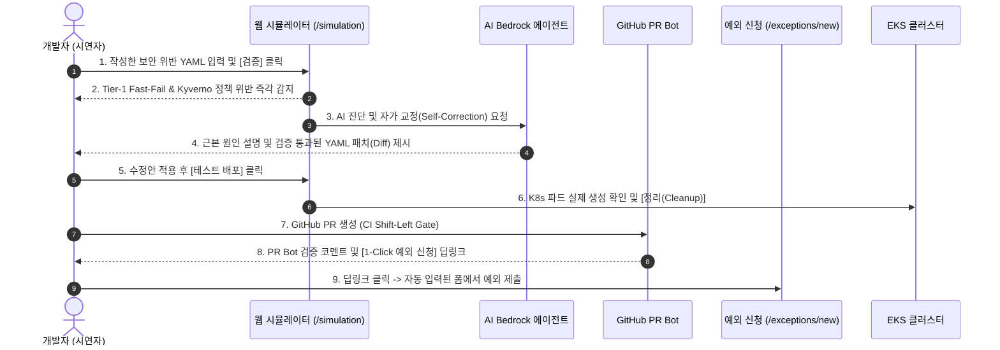
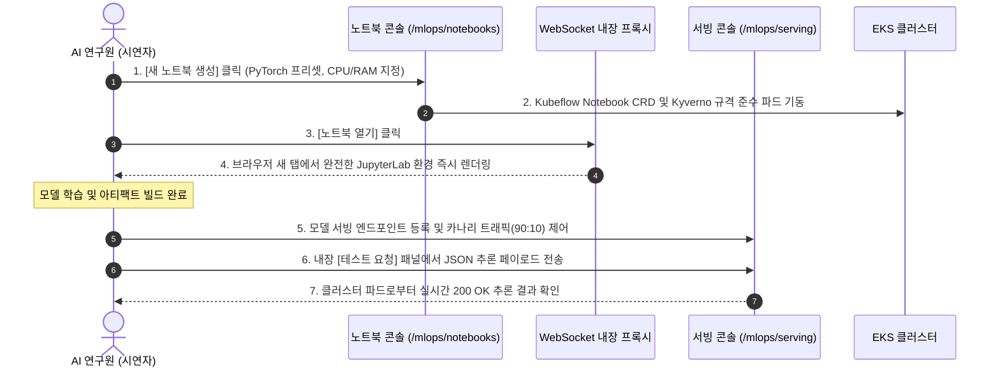

# Kyverno Governance Platform 데모 & 시연 시나리오 가이드 (Live Demo Guide)

본 문서는 **Kyverno Governance Platform**의 핵심 기능과 개발자 중심의 워크플로우를 실제 클러스터 환경에서 효과적으로 시연(Presentation / Live Demo)하기 위해 작성된 독립 실행형 시연 시나리오 가이드입니다.

---

## 📋 시연 환경 사전 점검 (Demo Prerequisites)

* **대시보드 접속 URL**: [http://localhost:3000](http://localhost:3000)
  * 포트포워딩: `kubectl port-forward svc/kyverno-frontend 3000:3000 -n kyverno-platform`
* **Swagger API 문서 URL**: [http://localhost:3001/api/docs](http://localhost:3001/api/docs)
* **기본 시연 계정**:
  * **관리자 (Admin)**: `admin@test.com` / `test1234!`
  * **개발자 (Developer)**: `dev@test.com` / `test1234!` (또는 일반 사용자 계정)

---

## 🎬 시나리오 1: 마이크로서비스 개발자의 Shift-Left 거버넌스 & 셀프서비스 배포 여정

> **시연 소요 시간**: 약 5~7분  
> **핵심 테마**: *"개발자가 kubectl 없이 웹과 GitHub PR만으로 정책을 검증하고, AI 자가 수정을 거쳐 안전하게 배포하기까지"*



### [Step 1] 웹 시뮬레이터에서 로컬 매니페스트 사전 검증
* **화면 이동**: 대시보드 상단 메뉴 **[시뮬레이션 (Simulation)]** (`/simulation`)
* **시연자 멘트**:
  > *"개발자는 로컬 PC에 복잡한 kubeconfig나 AWS IAM 권한을 설정하지 않고도, 브라우저에서 자신이 작성한 매니페스트가 클러스터의 보안 거버넌스 규격에 부합하는지 즉시 점검할 수 있습니다."*
* **조작**: 아래의 **보안 위반 샘플 YAML**(루트 권한 실행 및 리소스 제한 누락)을 에디터에 붙여넣고 **[검증 실행]** 버튼 클릭.

```yaml
# 시연용 보안 정책 위반 샘플 매니페스트
apiVersion: apps/v1
kind: Deployment
metadata:
  name: payment-api-service
  namespace: default
  labels:
    app: payment-api
spec:
  replicas: 1
  selector:
    matchLabels:
      app: payment-api
  template:
    metadata:
      labels:
        app: payment-api
    spec:
      containers:
        - name: payment-app
          image: nginx:latest
          # 보안 위반: root 유저 실행 허용 및 리소스 제한(limits) 누락
          securityContext:
            runAsNonRoot: false
            privileged: true
          ports:
            - containerPort: 80
```

* **화면 결과**:
  * **Tier-1 In-Memory Fast-Fail & Server-Side Dry-Run**에 의해 즉각적인 위반 감지.
  * 위반 정책: `disallow-root-user`, `require-resource-limits`, `disallow-privileged-containers`.

---

### [Step 2] AI 에이전트(Bedrock Claude)의 자가 교정 및 해결책 확인
* **시연자 멘트**:
  > *"단순히 '배포가 거부되었습니다'라는 에러 메시지만 던져주는 것이 아닙니다. 플랫폼에 내장된 AWS Bedrock Claude 3.5 기반 AI 에이전트가 위반 사유를 분석하고, 자체 Dry-Run 검증을 통과한 안전한 수정 패치(Diff)를 직접 제시합니다."*
* **화면 확인**:
  * 우측 **AI 진단 패널**에서 위반 원인 분석 요약 확인.
  * **[AI 추천 수정본 적용]** 버튼을 클릭하여 `runAsNonRoot: true` 및 `resources.limits`가 보정된 YAML로 자동 치환.
  * 다시 **[검증 실행]** 클릭 ➔ **[검증 성공 (Passed)]** 초록색 뱃지 확인.

---

### [Step 3] 브라우저 내 안전한 테스트 배포 및 즉각 클린업
* **시연자 멘트**:
  > *"수정된 매니페스트가 클러스터에서 실제로 잘 기동되는지 확인하기 위해 [테스트 배포]를 실행해보겠습니다. 테스트가 끝나면 [정리] 버튼 하나로 잔존 리소스 없이 깔끔하게 제거할 수 있습니다."*
* **조작**:
  1. **[테스트 배포]** 버튼 클릭 ➔ EKS 클러스터의 네임스페이스에 실제 리소스 생성.
  2. 하단 **[배포된 리소스 목록]**에서 `payment-api-service` 파드가 `Running` 상태로 올라온 것을 확인.
  3. **[리소스 정리 (Cleanup)]** 버튼 클릭 ➔ 클러스터에서 안전하게 제거됨을 확인.

---

### [Step 4] Shift-Left PR 봇 & 원클릭 예외(PolicyException) 신청
* **시연자 멘트**:
  > *"특정 레거시 모듈이나 결제 라이브러리 특성상 일시적으로 보안 예외가 불가피한 경우가 있습니다. 이때 개발자는 GitHub PR 봇 코멘트의 원클릭 링크를 통해 간편하게 예외를 신청할 수 있습니다."*
* **화면 이동**: **[예외 관리 ➔ 예외 신청]** (`/exceptions/new`)
* **조작**:
  * 대상 클러스터: `kyverno-eks-lab`
  * 대상 네임스페이스: `default`
  * 정책명: `disallow-privileged-containers`
  * 신청 사유: *"Q3 결제 모듈 성능 프로파일링을 위한 7일간 일시적 특권 컨테이너 예외 요청"*
  * 만료 일자: 7일 후 선택 후 **[신청 제출]**.
* **화면 확인**:
  * 관리자 계정으로 승인 시, 백엔드의 **GitOps Publisher**가 K8s 클러스터에 `kyverno.io/v2 PolicyException`을 자동 배포함과 동시에 GitOps 레포지토리에 YAML을 커밋/PR 생성하는 Dual-Path 흐름 설명.

---

## 🎬 시나리오 2: MLOps 연구원의 인프라-프리(Zero-CLI) AI 워크스페이스 & 서빙

> **시연 소요 시간**: 약 4~6분  
> **핵심 테마**: *"쿠버네티스를 전혀 모르는 AI 엔지니어가 클릭 몇 번으로 JupyterLab 환경을 생성하고, 모델 서빙 및 트래픽 제어까지 웹에서 완결"*



### [Step 1] 원클릭 JupyterLab 개발 환경 프로비저닝
* **화면 이동**: **[MLOps 거버넌스 ➔ 주피터 노트북]** (`/mlops/notebooks`)
* **시연자 멘트**:
  > *"데이터 사이언티스트나 AI 엔지니어는 K8s의 Pod, PVC, Service 문법을 알 필요가 없습니다. 플랫폼에서 원하는 프레임워크와 리소스 크기를 고르면, 보안 거버넌스 규격을 준수하는 주피터 인스턴스가 즉시 프로비저닝됩니다."*
* **조작**:
  1. **[새 노트북 생성]** 버튼 클릭.
  2. 이름: `fraud-detection-exp`
  3. 이미지 프리셋: `PyTorch 2.0 (Deep Learning)`
  4. 리소스: CPU `1 Core`, RAM `2 GB` 선택 후 **[생성하기]** 클릭.
* **화면 확인**:
  * SSE 실시간 스트림에 의해 노트북 상태가 `Pending` ➔ `Running`으로 자동 전환.
  * 백엔드가 Kubeflow Notebook CRD를 생성하고 Kyverno 비루트(Non-root) 실행 정책을 준수하는 파드를 배포함.

---

### [Step 2] 브라우저 내장 WebSocket 프록시를 통한 즉시 접속
* **시연자 멘트**:
  > *"인프라 팀에 VPN이나 포트포워딩을 요청할 필요 없이, 플랫폼의 내장 WebSocket 보안 프록시를 통해 브라우저에서 즉시 주피터 랩으로 연결됩니다."*
* **조작**: 목록에서 `fraud-detection-exp`의 **[노트북 열기]** 버튼 클릭.
* **화면 확인**:
  * 새 브라우저 창에서 완전한 **JupyterLab IDE**가 실행되는 모습을 시연.
  * Python 콘솔에서 `import torch; print(torch.__version__)` 실행.

---

### [Step 3] 모델 서빙 엔드포인트 배포 및 카나리 트래픽 제어
* **화면 이동**: **[MLOps 거버넌스 ➔ 모델 서빙]** (`/mlops/serving`)
* **시연자 멘트**:
  > *"학습이 완료된 모델은 서빙 콘솔에서 즉시 배포할 수 있으며, 신규 모델 출시 시 위험을 최소화하기 위해 트래픽 분할(Canary Routing)을 슬라이더 조작만으로 실행할 수 있습니다."*
* **조작**:
  1. 서빙 엔드포인트 목록에서 `fraud-detector-v2` 확인.
  2. **트래픽 비율 조정 슬라이더**를 움직여 `v1: 90%`, `v2: 10%`로 설정 후 **[트래픽 비율 저장]** 클릭.

---

### [Step 4] 웹 내장 API 테스트 패널을 통한 즉각적인 추론 검증
* **시연자 멘트**:
  > *"Postman이나 별도의 API 클라이언트 도구 없이도, 플랫폼 내장 테스트 모달에서 실시간으로 추론 요청을 보내고 응답을 검증할 수 있습니다."*
* **조작**:
  1. 해당 엔드포인트 우측의 **[테스트]** 버튼 클릭.
  2. 아래의 샘플 JSON 입력 후 **[요청 전송]** 클릭:

```json
{
  "transaction_id": "tx-20260917-9871",
  "amount": 154000,
  "currency": "KRW",
  "ip_country": "KR",
  "device_trust_score": 0.94
}
```

* **화면 결과**:
  * HTTP 상태 코드 `200 OK`, 응답 속도(예: `18ms`), 추론 결과(`{"is_fraud": false, "risk_score": 0.03}`)가 브라우저에 즉시 출력됨.

---

## 🌟 (보너스 시연 포인트) 런타임 거버넌스 및 정책 드리프트 자동 치유

시연 시간이 허락될 경우 추가로 보여줄 수 있는 강력한 플랫폼 기능입니다:

1. **실시간 배포 차단 인시던트 피드 (`/admin/dashboard` or SSE Events)**:
   * ArgoCD나 CI/CD 파이프라인에서 정책을 위반한 리소스를 배포하려다 Kyverno Webhook에 의해 거부되었을 때, 실시간 SSE 스트림으로 대시보드에 **배포 차단 인시던트(Admission Incident)**가 팝업/목록에 즉시 기록되는 과정 시연.
2. **정책 드리프트(Drift) 자동 치유 (Auto-Healing)**:
   * 관리자나 공격자가 `kubectl`로 클러스터의 Kyverno 정책을 임의로 수정하거나 삭제하더라도, 플랫폼의 **Drift Informer**가 10초 이내에 변조를 감지하고 GitOps 원본 상태로 자동 복원(Self-Healing)하는 메커니즘 소개.

---

## 🎯 시연 마무리 랩업 (Key Takeaways)

| 기존 방식 (Before) | Kyverno Governance Platform (After) |
| :--- | :--- |
| • 개발자가 `kubectl`, `Lens` 설치 및 복잡한 kubeconfig 관리 필요 | • **웹 브라우저 하나로 모든 사전 검증/배포 테스트 완결** |
| • 배포 실패 시 복잡한 K8s 에러 메시지로 인해 어드민 문의 급증 | • **AWS Bedrock AI 에이전트가 원인 분석 + 수정 YAML 자동 제시** |
| • 보안 위반 시 수동 슬랙 문의 및 승인 지연 | • **GitHub PR 봇 연동 & 1-Click 정책 예외(PolicyException) 자동화** |
| • MLOps 인프라 프로비저닝에 수일 소요 | • **원클릭 주피터 노트북 생성 및 카나리 모델 서빙 즉시 지원** |
