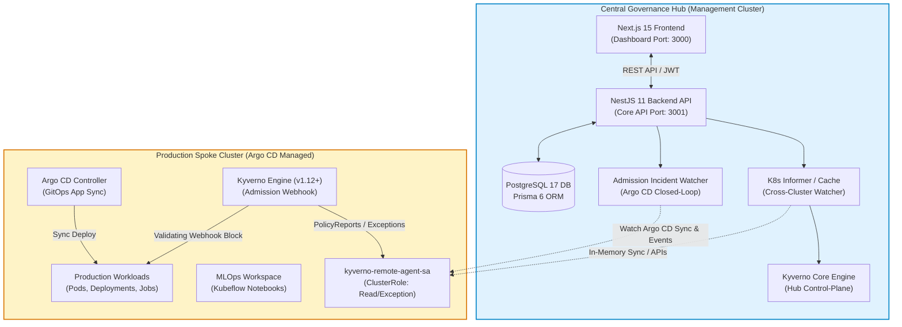
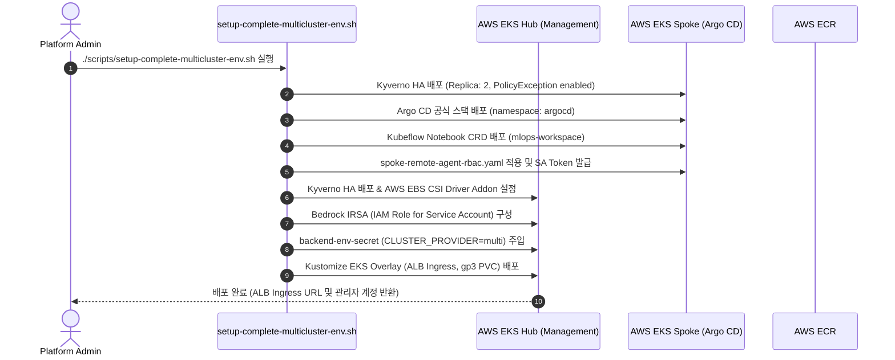
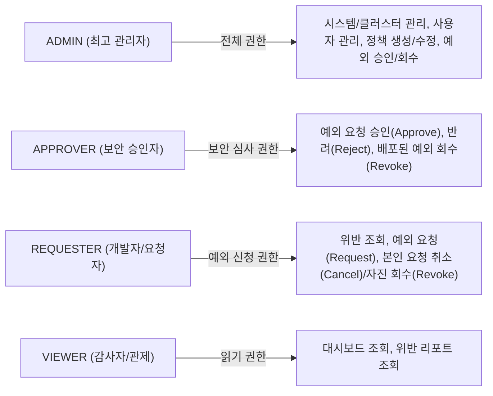
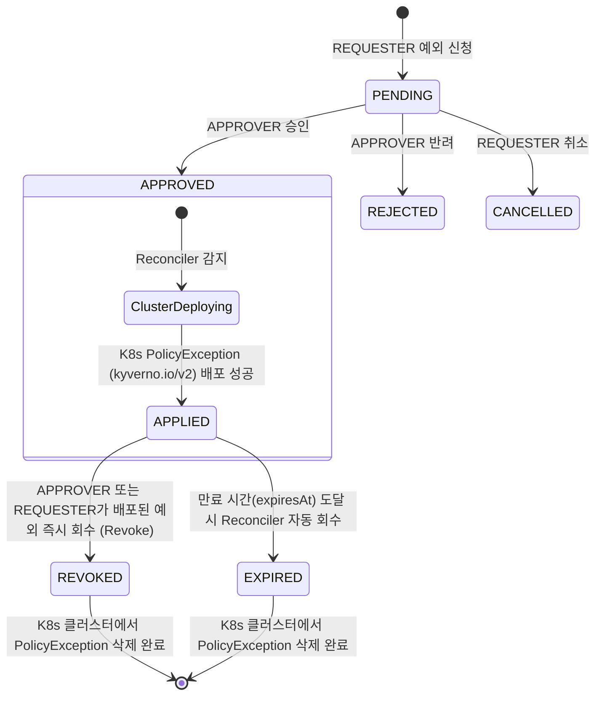

# PaC Kyverno Governance Platform: 종합 온보딩 및 설치 가이드
# (Comprehensive Onboarding & Installation Guide)

> **문서 버전**: v1.1.0  
> **최종 개정일**: 2026-09-21  
> **대상 독자**: 플랫폼 엔지니어, DevOps/SRE, 보안 관리자 및 개발팀  

---

## 📌 목차 (Table of Contents)

1. [플랫폼 개요 및 아키텍처](#1-플랫폼-개요-및-아키텍처)
2. [사전 요구사항 (Prerequisites)](#2-사전-요구사항-prerequisites)
3. [빠른 시작: 1-Click 원클릭 설치 (`install.sh`)](#3-빠른-시작-1-click-원클릭-설치-installsh)
4. [로컬 개발 및 테스트베드 구축 (Kind 기반)](#4-로컬-개발-및-테스트베드-구축-kind-기반)
   * 4.1. 단일 노드 로컬 클러스터 (`setup-local-cluster.sh`)
   * 4.2. 가상 멀티클러스터 with Argo CD (`setup-local-multicluster-kind.sh`)
   * 4.3. 로컬 환경 정리 및 자원 반환 (`cleanup-local-cluster.sh`)
5. [프로덕션 및 클라우드(AWS EKS) 멀티클러스터 구축](#5-프로덕션-및-클라우드aws-eks-멀티클러스터-구축)
6. [외부 Argo CD Spoke 클러스터 온보딩 가이드](#6-외부-argo-cd-spoke-클러스터-온보딩-가이드)
7. [사용자 온보딩 및 첫걸음 (First Steps)](#7-사용자-온보딩-및-첫걸음-first-steps)
   * 7.1. 대시보드 접속 및 로그인
   * 7.2. RBAC 권한 모델 및 계정 역할
   * 7.3. 정책 관리 및 감사 현황 모니터링
   * 7.4. 배포 차단 인시던트(Incident) 감지 및 Closed-Loop 대응
   * 7.5. 정책 예외(PolicyException) 신청, 승인 및 회수(Revocation)
   * 7.6. MLOps 거버넌스 및 AI 코파일럿 활용
8. [운영 관리 및 트러블슈팅 (Troubleshooting & FAQ)](#8-운영-관리-및-트러블슈팅-troubleshooting--faq)

---

## 1. 플랫폼 개요 및 아키텍처

**PaC Kyverno Governance Platform**은 쿠버네티스 멀티클러스터 환경에서 **코드형 정책(Policy as Code)** 거버넌스를 중앙 집중식으로 관제, 감사 및 강제하는 엔터프라이즈 거버넌스 대시보드 및 자동화 솔루션입니다.



### 핵심 아키텍처 특징
1. **분산 허브-스포크(Hub & Spoke) 토폴로지**:
   - **Central Governance Hub**: 대시보드 UI, 백엔드 API, PostgreSQL DB, 분산 리컨실러(Reconciler), AI 진단 코파일럿이 구동되는 중앙 관리 클러스터.
   - **Remote Spoke Cluster**: 실제 애플리케이션 및 MLOps 학습 파이프라인이 구동되는 워크로드 클러스터.
2. **Argo CD Closed-Loop 인시던트 감지 및 복구**:
   - 원격 클러스터에서 Argo CD Sync 중 Kyverno 어드미션 웹훅에 의해 배포가 차단되면, 백엔드의 `AdmissionIncidentWatcher`가 즉시 감지하여 인시던트(`DeploymentIncident`)로 격리하고 긴급 예외 신청(Hotfix) 워크플로우를 자동 연계합니다.
3. **Kyverno v1.12+ 및 `PolicyException` v2 표준 완벽 준수**:
   - 쿠버네티스 최신 CRD 규격인 `kyverno.io/v2` 정책 예외 라이프사이클(신청 -> 승인 -> 배포 -> 회수)을 완벽하게 지원합니다.
4. **플러그형 모듈 아키텍처**:
   - 코어 거버넌스를 바탕으로 MLOps 거버넌스, AI 코파일럿(AWS Bedrock), 정책 시뮬레이션 랩, GitOps PR 싱크 모듈을 선택적으로 활성화/비활성화할 수 있습니다.

---

## 2. 사전 요구사항 (Prerequisites)

### 2.1. 인프라 및 시스템 권장 사양

| 환경 | 최소 사양 (Minimal) | 권장 사양 (Production / Full-Stack) |
| :--- | :--- | :--- |
| **운영체제** | Linux (Ubuntu 22.04+, Debian 12+), macOS (Apple Silicon / Intel), WSL2 | Linux (Ubuntu 22.04 LTS, Amazon Linux 2023) |
| **CPU** | 2 Cores 이상 | 4 Cores 이상 |
| **Memory** | 4 GB RAM 이상 | 8 GB ~ 16 GB RAM 이상 |
| **Storage** | 10 GB 이상의 여유 디스크 공간 | 30 GB 이상의 SSD 스토리지 |

### 2.2. 필수 클라이언트 도구

호스트 또는 개발 머신에 다음 CLI 도구들이 준비되어 있어야 합니다:

*   **`kubectl`** (v1.28 이상 권장):
    ```bash
    kubectl version --client
    ```
*   **`docker`** (v24.0 이상, 로컬 컨테이너 빌드 및 Kind 실행 시 필요):
    ```bash
    docker --version
    ```
*   **`kind`** (v0.20 이상, 로컬 가상 클러스터 구축 시 필요):
    ```bash
    kind version
    ```
*   **`helm`** (v3.12 이상, Kyverno 런타임 배포 시 필요):
    ```bash
    helm version
    ```
*   **`pnpm`** (v9.x 권장, 소스코드 빌드 및 모노레포 작업 시):
    ```bash
    pnpm --version
    ```

---

## 3. 빠른 시작: 1-Click 원클릭 설치 (`install.sh`)

저장소 루트에 위치한 [`install.sh`](file:///home/user/PaC-KyvernoDashboard/install.sh)는 클러스터 환경을 자동 감지하고 데이터베이스, 백엔드, 프론트엔드, 거버넌스 정책까지 한 번에 프로비저닝하는 범용 설치기입니다.

### 3.1. 기본 설치 (단일 클러스터 모드)

현재 활성화된 쿠버네티스 컨텍스트(`kubectl config current-context`)에 즉시 배포합니다:

```bash
# 실행 권한 부여 후 원클릭 설치 실행
chmod +x install.sh
./install.sh
```

설치기가 자동으로 수행하는 작업:
1. 쿠버네티스 클러스터 연결성 및 환경 감지 (AWS EKS vs On-Premise / Generic K8s)
2. 클러스터 내 Kyverno Policy Engine (v1.12.5) CRD 및 어드미션 컨트롤러 유무 확인 및 자동 설치
3. 네임스페이스(`kyverno-platform`) 및 고유 보안 시크릿(DB 패스워드, JWT 시크릿, 초기 계정) 생성
4. Kustomize 오버레이를 통한 PostgreSQL DB, Backend API, Frontend Dashboard 롤아웃
5. 기본 거버넌스 정책(`k8s-manifests/policies/`) 자동 적용
6. 접속 주소 및 초기 관리자/사용자 로그인 자격 증명 콘솔 출력

---

### 3.2. 설치 옵션 커스터마이징

`install.sh`는 다양한 환경과 요구사항에 맞춤 설정할 수 있는 파라미터를 제공합니다:

```bash
# 1. 관리자 이메일과 비밀번호를 직접 지정하여 설치:
./install.sh --admin-email security-admin@company.com --admin-password "StrongAdminPass123!"

# 2. 로컬에서 도커 이미지를 직접 빌드하여 설치:
./install.sh --build

# 3. 가벼운 코어 거버넌스 전용으로 설치 (MLOps 및 AI 모듈 비활성화):
./install.sh --disable-mlops --disable-ai

# 4. 명시적인 모듈 활성화:
./install.sh --modules core,simulation,gitops

# 5. 매니페스트 사전 검토 (Dry-Run):
./install.sh --dry-run
```

---

### 3.3. 멀티클러스터 & Argo CD Spoke 연동 설치

원격 Spoke 클러스터(`external-argocd-cluster`)가 이미 준비되어 있거나 Kubeconfig에 등록된 경우:

```bash
# Spoke 컨텍스트를 지정하여 허브-스포크 멀티클러스터로 자동 배포:
./install.sh \
  --spoke-context "my-spoke-cluster-context" \
  --spoke-cluster-id "external-argocd-cluster" \
  --install-argocd
```

---

### 3.4. 설치 삭제 및 자원 정리 (Uninstall)

배포된 플랫폼 네임스페이스와 클러스터 RBAC 리소스를 안전하게 제거합니다:

```bash
./install.sh --uninstall
```

---

## 4. 로컬 개발 및 테스트베드 구축 (Kind 기반)

AWS 등 클라우드 인프라 비용 없이 로컬 개발 머신(Docker 기반 Kind)에서 전체 플랫폼을 검증할 수 있는 최적화된 스크립트들을 제공합니다.

### 4.1. 단일 노드 로컬 클러스터 ([`scripts/setup-local-cluster.sh`](file:///home/user/PaC-KyvernoDashboard/scripts/setup-local-cluster.sh))

단일 제어평면 노드(`k8s-lab`)를 기동하고 Kyverno와 테스트베드 워크로드를 배포합니다:

```bash
# [모드 1] 경량 모드 (Zero-I/O: etcd 부하 방지, 백그라운드 스캔 비활성화)
bash scripts/setup-local-cluster.sh --minimal

# [모드 2] 풀스택 모드 (PostgreSQL, Backend, Frontend 컨테이너까지 Kind 내부에 모두 롤아웃)
bash scripts/setup-local-cluster.sh --full

# [모드 3] Argo CD 포함 모드 (단일 노드에서도 Argo CD 배포 차단 인시던트 테스트)
bash scripts/setup-local-cluster.sh --with-argocd
```

---

### 4.2. 가상 멀티클러스터 with Argo CD ([`scripts/setup-local-multicluster-kind.sh`](file:///home/user/PaC-KyvernoDashboard/scripts/setup-local-multicluster-kind.sh))

독립된 2개의 Kind 클러스터(**`k8s-hub`**와 **`k8s-spoke`**)를 생성하여 실제 프로덕션 환경의 허브-스포크 및 Argo CD 인시던트 감지를 100% 로컬에서 재현합니다.

```bash
# 로컬 멀티클러스터(Hub & Spoke with Argo CD) 원클릭 셋업
bash scripts/setup-local-multicluster-kind.sh
```

**셋업 완료 후 자동 구성되는 항목:**
1. `k8s-hub` 클러스터: 중앙 관리자 허브. Kyverno 및 `kyverno-platform` 네임스페이스 생성.
2. `k8s-spoke` 클러스터 (`id: external-argocd-cluster`):
   - Kyverno 엔진 (Audit/Enforce 모드)
   - **Argo CD 공식 컨트롤러** (`argocd` 네임스페이스)
   - Kubeflow Notebooks CRD (`mlops-workspace` 네임스페이스)
   - 원격 에이전트 ServiceAccount(`kyverno-dashboard-spoke-sa`) 및 RBAC
3. 설정 동기화:
   - Hub 클러스터의 `backend-env-secret`에 `CLUSTER_PROVIDER="multi"`와 Spoke 접근 토큰/CA JSON이 자동 주입됩니다.
   - 로컬 호스트 백엔드 실행을 위한 `config/local-multi-clusters.json` 파일이 생성됩니다.

---

### 4.3. 로컬 환경 정리 및 자원 반환 ([`scripts/cleanup-local-cluster.sh`](file:///home/user/PaC-KyvernoDashboard/scripts/cleanup-local-cluster.sh))

테스트 완료 후 생성된 Kind 클러스터와 컨테이너를 정리하여 시스템 CPU/RAM 자원을 즉시 회수합니다:

```bash
# 모든 로컬 테스트 클러스터 (k8s-lab, k8s-hub, k8s-spoke) 일괄 삭제:
bash scripts/cleanup-local-cluster.sh all

# 특정 클러스터만 선택 삭제:
bash scripts/cleanup-local-cluster.sh k8s-lab
```

---

## 5. 프로덕션 및 클라우드(AWS EKS) 멀티클러스터 구축

AWS EKS 환경에서 고가용성(HA) 허브 클러스터와 운영용 Spoke 클러스터를 배포하는 정석 파이프라인입니다.



### 단계별 배포 절차

1. **EKS 클러스터 프로비저닝 (선행 조건)**:
   [`scripts/eksctl-config.yaml`](file:///home/user/PaC-KyvernoDashboard/scripts/eksctl-config.yaml) 및 [`scripts/eksctl-spoke-config.yaml`](file:///home/user/PaC-KyvernoDashboard/scripts/eksctl-spoke-config.yaml)을 활용하여 Hub 및 Spoke EKS 클러스터를 생성합니다:
   ```bash
   eksctl create cluster -f scripts/eksctl-config.yaml        # Hub Cluster
   eksctl create cluster -f scripts/eksctl-spoke-config.yaml  # Spoke Cluster
   ```

2. **완전 자동화 EKS 멀티클러스터 통합 설치 실행**:
   [`scripts/setup-complete-multicluster-env.sh`](file:///home/user/PaC-KyvernoDashboard/scripts/setup-complete-multicluster-env.sh) 스크립트를 실행합니다:
   ```bash
   export AWS_REGION="us-east-1"
   export HUB_CLUSTER="kyverno-eks-lab"
   export SPOKE_CLUSTER="kyverno-eks-spoke-01"

   bash scripts/setup-complete-multicluster-env.sh
   ```

3. **AWS ALB Ingress 활성화**:
   외부 사용자가 브라우저로 접근할 수 있도록 AWS Load Balancer Controller와 연결된 Ingress를 활성화합니다:
   ```bash
   bash scripts/alb-ingress-on.sh
   ```

---

## 6. 외부 Argo CD Spoke 클러스터 온보딩 가이드

이미 운영 중인 기존 쿠버네티스 클러스터(사내 온프레미스 k8s 또는 타사 클라우드 EKS/GKE)를 플랫폼에 Spoke 클러스터로 등록하는 방법입니다.

### Step 1. Spoke 클러스터에 최소 권한 RBAC 배포
원격 클러스터의 kubeconfig context를 대상으로 원격 에이전트 서비스 어카운트를 배포합니다:

```bash
SPOKE_CTX="my-production-spoke-context"

kubectl --context="${SPOKE_CTX}" apply -f - <<EOF
apiVersion: v1
kind: Namespace
metadata:
  name: kyverno
---
apiVersion: v1
kind: ServiceAccount
metadata:
  name: kyverno-remote-agent-sa
  namespace: kyverno
---
apiVersion: v1
kind: Secret
metadata:
  name: kyverno-remote-agent-sa-token
  namespace: kyverno
  annotations:
    kubernetes.io/service-account.name: kyverno-remote-agent-sa
type: kubernetes.io/service-account-token
EOF

kubectl --context="${SPOKE_CTX}" apply -f k8s-manifests/rbac/spoke-remote-agent-rbac.yaml
```

### Step 2. 접속 정보 추출 (Server, CA, Token)
Hub 백엔드가 Spoke 클러스터의 API 서버와 통신하기 위해 필요한 토큰과 인증서를 추출합니다:

```bash
# 1. API Server Endpoint
SPOKE_SERVER=$(kubectl --context="${SPOKE_CTX}" config view --minify --raw -o jsonpath='{.clusters[0].cluster.server}')

# 2. CA Certificate Data (Base64)
SPOKE_CA=$(kubectl --context="${SPOKE_CTX}" config view --minify --raw -o jsonpath='{.clusters[0].cluster.certificate-authority-data}')

# 3. ServiceAccount Bearer Token
SPOKE_TOKEN=$(kubectl --context="${SPOKE_CTX}" get secret kyverno-remote-agent-sa-token -n kyverno -o jsonpath='{.data.token}' | base64 -d || kubectl --context="${SPOKE_CTX}" create token kyverno-remote-agent-sa -n kyverno --duration=87600h)
```

### Step 3. Hub 클러스터에 Spoke 등록 (Secret 패치)
[`scripts/patch-multicluster-secret.sh`](file:///home/user/PaC-KyvernoDashboard/scripts/patch-multicluster-secret.sh) 스크립트를 활용하거나, `KUBERNETES_CLUSTERS` 환경변수에 Spoke 객체를 추가하여 Hub의 `kyverno-platform` 네임스페이스 시크릿을 업데이트합니다:

```bash
KUBERNETES_CLUSTERS='[
  {
    "id": "default-cluster",
    "displayName": "Central Governance Hub",
    "server": "https://kubernetes.default.svc",
    "exceptionNamespace": "kyverno",
    "default": true
  },
  {
    "id": "external-argocd-cluster",
    "displayName": "Production Spoke Cluster (Argo CD Managed)",
    "server": "'"${SPOKE_SERVER}"'",
    "caData": "'"${SPOKE_CA}"'",
    "token": "'"${SPOKE_TOKEN}"'",
    "exceptionNamespace": "kyverno",
    "default": false
  }
]'

kubectl -n kyverno-platform patch secret kyverno-platform-secret \
  --type='json' \
  -p='[{"op": "replace", "path": "/data/CLUSTER_PROVIDER", "value": "'$(echo -n "multi" | base64 -w 0)'"}, {"op": "replace", "path": "/data/KUBERNETES_CLUSTERS", "value": "'$(echo -n "${KUBERNETES_CLUSTERS}" | base64 -w 0)'"}]'

# 백엔드 파드 재기동하여 Informer 캐시 동기화
kubectl -n kyverno-platform rollout restart deployment/kyverno-backend
```

---

## 7. 사용자 온보딩 및 첫걸음 (First Steps)

### 7.1. 대시보드 접속 및 로그인

배포 완료 후 제공된 엔드포인트로 웹 브라우저를 통해 접속합니다:
*   **로컬 환경**: `http://localhost:3000` (또는 NodePort: `http://<NODE_IP>:30080`)
*   **EKS 환경**: `http://<ALB_INGRESS_HOSTNAME>`

#### 기본 시드 계정 정보 (Seed Credentials)

| 역할 (Role) | 이메일 (Email) | 비밀번호 (Password) | 권한 요약 |
| :--- | :--- | :--- | :--- |
| **ADMIN** | `admin@pac-kyverno.local` (또는 `admin@test.com`) | `test1234!` (지정 비밀번호) | 전체 정책/예외 승인/클러스터/사용자 권한 관리 |
| **APPROVER** | `approver@pac-kyverno.local` | `test1234!` | 정책 예외 신청 심사, 승인, 반려 및 배포된 예외 회수 |
| **REQUESTER** | `user@pac-kyverno.local` (또는 `user@test.com`) | `test1234!` | 정책 위반 조회, 예외 신청, 본인 예외 자진 회수 |
| **VIEWER** | `viewer@pac-kyverno.local` | `test1234!` | 정책 및 위반 현황 대시보드 읽기 전용 조회 |

---

### 7.2. RBAC 권한 모델 및 계정 역할

본 플랫폼은 엔터프라이즈 보안 요구사항에 부합하는 세분화된 권한 체계(RBAC)를 제공합니다:



---

### 7.3. 정책 관리 및 감사 현황 모니터링

1. **상단 네비게이션**: `/policies` (정책 관리) 메뉴로 이동합니다.
2. **ClusterPolicy 및 Policy 목록**:
   - 현재 등록된 정책명, 카테고리(PSS, Best Practices, Supply Chain), 대상 리소스(Pod, Deployment), 적용 모드(`Audit` vs `Enforce`)를 실시간으로 확인합니다.
3. **정책 실시간 반영**:
   - 백엔드의 In-Memory Informer가 클러스터의 Kyverno 정책 변경사항을 수초 이내로 감지하여 대시보드에 무중단 반영합니다.

---

### 7.4. 배포 차단 인시던트(Incident) 감지 및 Closed-Loop 대응

1. **시나리오**:
   - 개발자가 잘못된 설정(`privileged: true` 또는 `latest` 태그)을 가진 워크로드를 Argo CD Git 저장소에 커밋합니다.
   - Argo CD가 Spoke 클러스터에 Sync를 시도하지만, Kyverno Admission Webhook이 이를 차단합니다.
2. **플랫폼 감지 (`/incidents`)**:
   - 백엔드의 `ArgoCdIncidentDetector`가 웹훅 차단 이벤트를 포착하고 **`DeploymentIncident`** 상태를 `ACTIVE`로 격리 등록합니다.
   - 대시보드 알림 센터(Notification Center)에 경고 팝업이 전송됩니다.
3. **신속 복구 (Dual-Path Recovery)**:
   - **경로 A (예외 승인)**: 대시보드에서 `[예외 신청 연계]` 버튼을 클릭하여 즉시 `PolicyException` 승인 워크플로우로 진입합니다.
   - **경로 B (핫픽스 커밋)**: Git 저장소에 올바른 설정을 커밋하면 Argo CD Sync 재시도 성공을 감지하여 인시던트가 `RESOLVED_BY_HOTFIX`로 자동 종료됩니다.

---

### 7.5. 정책 예외(PolicyException) 신청, 승인 및 회수(Revocation)

플랫폼의 핵심 거버넌스 기능인 **예외 라이프사이클 4단계**를 수행하는 방법입니다:



#### 배포된 예외 회수 (Revocation) 수행 방법
1. `/exceptions` 메뉴에서 상태가 **`APPLIED`**인 예외 항목을 선택합니다.
2. 상세 페이지 상단의 **`[예외 회수 (Revoke)]`** 버튼을 클릭합니다 (APPROVER 및 해당 예외를 요청한 REQUESTER에게 노출).
3. 다이얼로그에서 **회수 사유(Revocation Reason)**를 필수로 입력합니다 (예: *"긴급 배포 완료로 인한 임시 예외 조기 반환"*).
4. `[회수 실행]`을 클릭하면:
   - 백엔드 분산 리컨실러가 즉시 대상 쿠버네티스 클러스터에서 해당 `PolicyException` CRD를 삭제합니다.
   - 상태가 `REVOKED`로 변경되며 감사 로그(AuditLog)에 회수 일시, 작업자 및 사유가 영구 보존됩니다.

---

### 7.6. MLOps 거버넌스 및 AI 코파일럿 활용

*   **MLOps 대시보드 (`/mlops`)**:
    - Spoke 클러스터의 `mlops-workspace` 내 Kubeflow Jupyter Notebook 파드를 중앙에서 생성 및 프록시 접근할 수 있습니다.
    - Spot 노드 자동 주입 정책(`enforce-spot-node-selector`) 및 GPU 쿼터 할당량을 시각적으로 관제합니다.
*   **AI 코파일럿 (AWS Bedrock)**:
    - 정책 위반이 발생한 파드 상세 뷰에서 **`[AI 정책 진단]`** 버튼을 클릭하면 Claude 3.5 Sonnet 모델이 위반 원인 분석 및 K8s 매니페스트 수정 가이드를 자동 생성합니다.

---

## 8. 운영 관리 및 트러블슈팅 (Troubleshooting & FAQ)

### Q1. 클린 환경에서 `pnpm install` 시 peer dependency 에러가 발생합니다.
*   **원인**: React 19와 호환되지 않는 레거시 패키지가 설치 목록에 남아 있는 경우 발생합니다.
*   **조치**: `apps/frontend/package.json`에서 미사용 패키지(`react-hook-form`, `@tanstack/react-table`)가 제거되었는지 확인하고 최신 브랜치(`release/v1.1.0`) 상태를 유지하십시오.

### Q2. 신규 배포 시 `relation "Notification" does not exist` DB 에러가 발생합니다.
*   **원인**: Prisma 마이그레이션 SQL이 데이터베이스에 반영되지 않은 경우입니다.
*   **조치**: 백엔드 파드가 기동되기 전 마이그레이션을 배포하십시오:
    ```bash
    pnpm --filter @kyverno-platform/backend exec prisma migrate deploy
    ```
    (플랫폼의 `install.sh` 및 CI 파이프라인에는 `prisma migrate deploy`가 자동 내장되어 있습니다.)

### Q3. Spoke 클러스터의 정책 예외가 배포되지 않고 실패합니다.
*   **원인**: Kyverno CRD 버전이 레거시 `kyverno.io/v2beta1`으로 요청되었거나 Spoke 토큰 권한이 부족한 경우입니다.
*   **조치**:
    1. 코드베이스 전체가 `kyverno.io/v2`로 단일화되어 있는지 확인합니다.
    2. Spoke 클러스터에 [`k8s-manifests/rbac/spoke-remote-agent-rbac.yaml`](file:///home/user/PaC-KyvernoDashboard/k8s-manifests/rbac/spoke-remote-agent-rbac.yaml)이 적용되어 있는지 확인합니다.

### Q4. Argo CD가 정책 차단으로 인해 Sync 중단(OutOfSync/Degraded)에 빠졌습니다.
*   **원인**: Kyverno의 어드미션 웹훅이 Argo CD가 동기화하려는 매니페스트의 정책 위반을 차단하여 발생합니다.
*   **조치**:
    1. 대시보드의 `/incidents` 탭에서 차단된 규칙명과 리소스명을 확인합니다.
    2. 긴급 복구가 필요한 경우 `[예외 생성]`을 승인하여 임시 `PolicyException`을 발급하면 Argo CD가 즉시 정상 Sync(`Synced`) 상태로 전환됩니다.

---

*문서 관련 기술 문의 및 버그 제보는 프로젝트 이슈 트래커를 이용해 주시기 바랍니다.*
