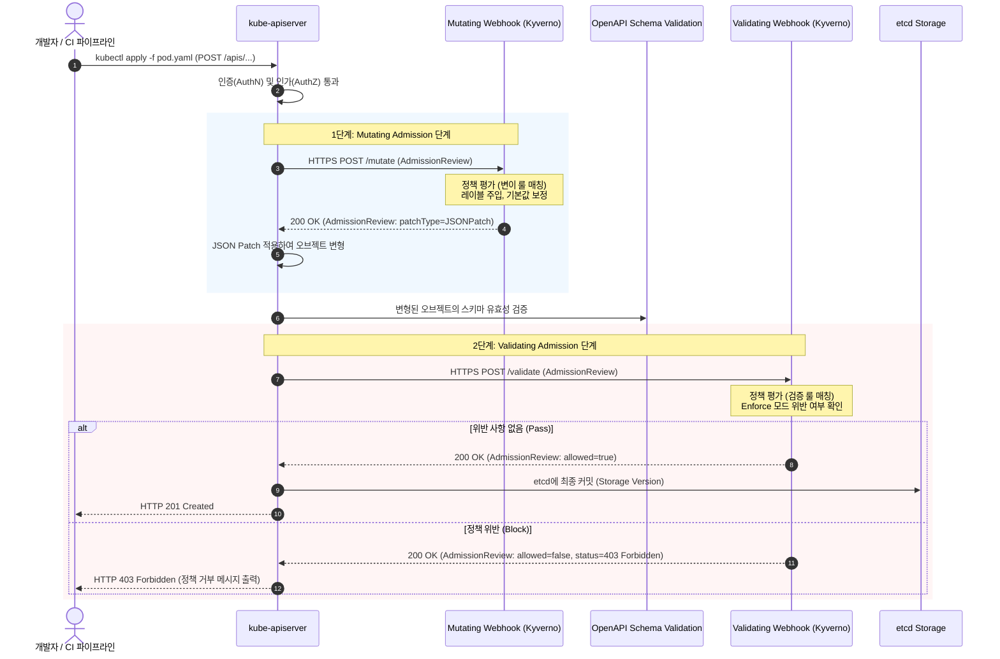
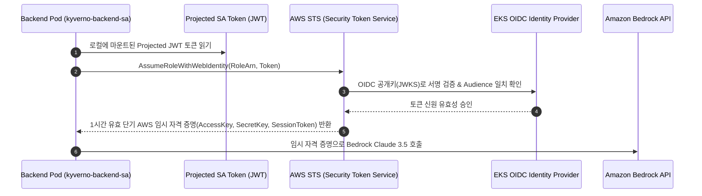
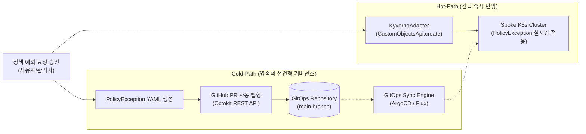

# Kyverno Governance Platform 기술 기반 아키텍처 심층 분석 보고서
**Technical Foundation & Architectural Whitepaper**

> **문서 버전**: v1.0.0  
> **대상 플랫폼**: Kubernetes v1.28+, Kyverno v1.12+, AWS EKS Platform  
> **작성 기준일**: 2026-09-10  
> **분류**: 기술 아키텍처 백서 (Technical Engineering Whitepaper)  

---

## 목차 (Table of Contents)

1. [Executive Summary (개요 및 시스템 아키텍처 개관)](#1-executive-summary-개요-및-시스템-아키텍처-개관)
   - 1.1. 프로젝트 배경 및 거버넌스 플랫폼의 목표
   - 1.2. Hub & Spoke 멀티클러스터 토폴로지
   - 1.3. 핵심 기술 스택 및 컴포넌트 역할 매트릭스
2. [쿠버네티스 코어 내부 작동 메커니즘 (Kubernetes Internal Architecture)](#2-쿠버네티스-코어-내부-작동-메커니즘-kubernetes-internal-architecture)
   - 2.1. 선언적 API(Declarative API)와 최종 일관성(Eventual Consistency)
   - 2.2. Control Plane 핵심 컴포넌트 심층 분석
     - `kube-apiserver`: 중앙 상태 제어기 및 무상태(Stateless) API 엔진
     - `etcd`: Raft 합의 알고리즘 기반 분산 Key-Value 스토리지 및 MVCC
     - `kube-controller-manager`: Reconciliation Loop와 WorkQueue 아키텍처
     - `kube-scheduler`: 노드 필터링(Predicates) 및 우선순위 점수화(Priorities)
   - 2.3. Worker Node 런타임 아키텍처
     - `kubelet`: CRI(Container Runtime Interface) 기반 파드 생명주기 관리 및 PLEG
     - `kube-proxy`: iptables vs IPVS 모드와 ClusterIP L4 패킷 포워딩
     - 컨테이너 런타임(`containerd`): OCI 표준 및 Linux cgroups v2/namespaces 격리
3. [Kubernetes API Server 통신 프로토콜 및 요청 수명주기 (API Server Communication Lifecycle)](#3-kubernetes-api-server-통신-프로토콜-및-요청-수명주기-api-server-communication-lifecycle)
   - 3.1. 엔드-투-엔드 요청 처리 파이프라인 (Request Processing Pipeline)
   - 3.2. 통신 프로토콜 및 고성능 스트리밍
     - HTTP/1.1 vs HTTP/2 다중화(Multiplexing)와 커넥션 풀링
     - Protocol Buffers (Protobuf) 직렬화와 JSON 비교
     - Watch 메커니즘: HTTP Chunked Transfer & `resourceVersion` 기반 Delta 동기화
   - 3.3. 고성능 클라이언트 아키텍처: Informer / Lister 패턴
     - Polling 방식의 한계와 List-Watch 패턴
     - Reflector, DeltaFIFO, Indexer(In-Memory Cache) 구조
     - 본 플랫폼의 `K8sInformerService` 설계 및 CQRS 기반 EKS 부하 제로화
4. [Admission Webhook 아키텍처 및 Kyverno 내부 작동 원리 (Admission Webhooks & Kyverno Deep Dive)](#4-admission-webhook-아키텍처-및-kyverno-내부-작동-원리-admission-webhooks--kyverno-deep-dive)
   - 4.1. Dynamic Admission Control의 동작 메커니즘
     - MutatingWebhook vs ValidatingWebhook 실행 흐름 및 RFC 6902 JSON Patch
     - Webhook 요청/응답 페이로드 규격 (`AdmissionReview`)
   - 4.2. Webhook Configuration 및 고가용성 운영 트레이드오프
     - `MutatingWebhookConfiguration` & `ValidatingWebhookConfiguration` 상세 스펙
     - `failurePolicy: Fail` (Fail-Closed) vs `failurePolicy: Ignore` (Fail-Open)
     - Webhook 타임아웃, 지연 시간(Latency) 및 재호출 정책(`reinvocationPolicy`)
     - TLS 인증서 신뢰 체인: mTLS 검증과 `caBundle` 주입 자동화
   - 4.3. Kyverno의 모듈형 컨트롤러 아키텍처
     - Admission Controller, Webhook Controller, Background Controller, Report Controllers
     - Cert Renewer의 무중단 인증서 로테이션
   - 4.4. Kyverno 정책 유형 및 룰 엔진 메커니즘
     - Validation, Mutation, Generation, Image Verification (Cosign/Attestation)
     - `autogen-` 규칙 접두사 매핑 알고리즘
     - PolicyReport (`wgpolicyk8s.io/v1alpha2`) 표준 규격 및 위반 집계
   - 4.5. PolicyException (`kyverno.io/v2beta1`) 정밀 예외 제어
5. [AWS EKS 인프라 및 클라우드 네이티브 네트워크/보안 아키텍처 (AWS EKS Infrastructure & Cloud-Native Foundation)](#5-aws-eks-인프라-및-클라우드-네이티브-네트워크보안-아키텍처-aws-eks-infrastructure--cloud-native-foundation)
   - 5.1. AWS EKS Control Plane 관리 구조
     - AWS 관리형 단독 VPC 내 Multi-AZ Control Plane 격리
     - Cross-Account ENI (X-ENI)를 통한 Control Plane과 Customer VPC 간 터널링
     - API Priority and Fairness (APF) 제어 및 스로틀링(HTTP 429) 방어
   - 5.2. EKS 고성능 네트워킹 아키텍처
     - AWS VPC CNI (`amazon-vpc-cni-k8s`): 오버레이 없는 Native IP 직접 할당 및 Prefix Delegation
     - Security Groups for Pods (SG for Pods)를 통한 Pod 레벨 마이크로 세그멘테이션
     - Ingress 라우팅: AWS Load Balancer Controller와 ALB `target-type: ip` 다이렉트 라우팅
   - 5.3. 제로 트러스트 신원 연동 및 보안 (Identity & Access Management)
     - IAM Roles for Service Accounts (IRSA): OIDC Provider와 STS `AssumeRoleWithWebIdentity`
     - GitHub Actions CI/CD의 AWS OIDC 연동 (Zero Long-lived Credential)
     - 플랫폼 백엔드의 최소 권한 RBAC 매트릭스
   - 5.4. 컴퓨팅 최적화 및 FinOps 자원 통제
     - Karpenter / Managed Node Groups와 Spot 인스턴스 전략
     - MLOps 워크로드(Kubeflow Notebooks, KServe)의 GPU 쿼터 거버넌스
6. [플랫폼 엔지니어링 융합 및 기술적 통찰 (Engineering Synthesis & Insights)](#6-플랫폼-엔지니어링-융합-및-기술적-통찰-engineering-synthesis--insights)
   - 6.1. CQRS 기반 대규모 클러스터 API 스케일링
   - 6.2. Dual-Path GitOps 정책 예외 발행 파이프라인
   - 6.3. Amazon Bedrock LLM과 Kyverno Rule Engine 결합을 통한 실시간 RCA(Root Cause Analysis)
   - 6.4. 결론 및 미래 발전 방향

---

## 1. Executive Summary (개요 및 시스템 아키텍처 개관)

### 1.1. 프로젝트 배경 및 거버넌스 플랫폼의 목표

현대 엔터프라이즈 클라우드 네이티브 환경에서 Kubernetes는 컨테이너 오케스트레이션의 표준으로 자리 잡았습니다. 그러나 클러스터의 규모가 확장되고 수많은 팀이 마이크로서비스 및 AI/ML 워크로드를 배포함에 따라 다음과 같은 핵심 과제가 대두되었습니다:

1. **보안 컴플라이언스 및 표준 강제(Governance)**: 비인가 퍼블릭 이미지 레지스트리 사용, 특권 컨테이너(Privileged Container) 실행, 리소스 상한선(Limit) 누락 등으로 인한 클러스터 침해 및 리소스 고갈 위험.
2. **개발 생산성과 보안 간의 마찰**: 보안 정책이 엄격할수록 긴급 배포나 연구용 워크로드 실행 시 불필요한 승인 지연이 발생하며, 임시 예외(Policy Exception)의 수작업 처리는 보안 감사(Audit)의 가시성을 저해함.
3. **Control Plane 과부하**: 수백, 수천 개의 워크로드와 정책 위반 상태를 중앙 대시보드에서 빈번하게 Polling할 경우 Kubernetes API Server에 과도한 부하가 가해져 클러스터 전체의 안정성이 위협받음.
4. **고비용 자원(FinOps) 통제**: MLOps 파이프라인(Kubeflow, KServe)의 확산으로 고가의 GPU 인스턴스가 무분별하게 프로비저닝되어 막대한 클라우드 비용이 낭비됨.

**Kyverno Governance Platform**은 이러한 문제를 해결하기 위해 설계된 Kubernetes 네이티브 거버넌스 및 정책 자동화 플랫폼입니다. 쿠버네티스 표준 Admission Controller인 **Kyverno**를 기반으로 하며, 정책 수명주기 관리, 정밀한 정책 예외(PolicyException) 승인 워크플로, GitOps 자동 PR 생성, MLOps GPU 자원 통제, 그리고 생성형 AI(Amazon Bedrock) 기반의 실시간 정책 위반 진단 엔진을 하나로 통합하였습니다.

---

### 1.2. Hub & Spoke 멀티클러스터 토폴로지

본 플랫폼은 중앙 관리형 **Hub 클러스터**와 정책이 실제로 적용되는 1개 이상의 **Spoke 대상 클러스터**로 구성된 Hub & Spoke 아키텍처를 채택하고 있습니다.

```mermaid
flowchart TB
    subgraph ClientLayer["클라이언트 / 사용자 계층"]
        Browser["사용자 웹 브라우저 (Next.js 15 UI)"]
        GitHubActions["GitHub Actions CI/CD (OIDC 배포)"]
    end

    subgraph HubCluster["AWS EKS · Hub 관리 클러스터 (namespace: kyverno-platform)"]
        direction TB
        ALB["AWS Application Load Balancer\n(target-type: ip / AWS LB Controller)"]
        
        subgraph HubPods["Hub 플랫폼 런타임"]
            FrontendPod["Next.js 15 Frontend Pod\n(ClusterIP: 3000 / Standalone)"]
            BackendPod["NestJS 11 Backend Core Pod\n(ClusterIP: 3001 / CQRS Router)"]
            InformerCache[("K8s Informer In-Memory Cache\n(Zero EKS API Load on Read)")]
        end
        
        HubDB[("PostgreSQL 17 DB\n(메타데이터, 사용자, 감사로그)")]
    end

    subgraph AWSManagedServices["AWS 매니지드 서비스 계층"]
        Bedrock["Amazon Bedrock\n(Claude 3.5 Sonnet / Nova Lite)"]
        ECR["Amazon ECR\n(컨테이너 이미지 레지스트리)"]
        GitOpsRepo["GitHub Repository\n(GitOps PR / PolicyException YAML)"]
    end

    subgraph SpokeClusters["관리 대상 Spoke 클러스터 1…N (Production, Staging, MLOps)"]
        direction TB
        SpokeAPIServer["K8s API Server (kube-apiserver)\n(APF 유량 제어 / mTLS Webhook)"]
        
        subgraph KyvernoControl["Kyverno Governance Engine"]
            KyvernoAdmission["Admission Controller\n(Mutating/Validating Webhook)"]
            KyvernoBackground["Background Controller\n(정기 스캔 & Generate)"]
            KyvernoReport["Report Controller\n(PolicyReport CRD 생성)"]
        end

        subgraph WorkloadLayer["워크로드 계층"]
            MLOpsPods["MLOps 워크로드 (Kubeflow, KServe, GPU Pods)"]
            BusinessPods["일반 비즈니스 마이크로서비스"]
        end
    end

    %% 트래픽 흐름
    Browser -->|HTTP 80/443| ALB
    ALB -->|/ Path| FrontendPod
    ALB -->|/api Path| BackendPod
    FrontendPod -->|내부 API 호출| BackendPod
    BackendPod -->|SQL / Prisma ORM| HubDB
    
    %% AI 및 GitOps 연동
    BackendPod -.->|IRSA / STS AssumeRole| Bedrock
    BackendPod -.->|Octokit REST API (PR 생성)| GitOpsRepo
    GitHubActions -->|OIDC AssumeRole| ECR
    
    %% K8s API 연동 (Informer vs Mutation)
    SpokeAPIServer -->|단일 HTTP/2 Watch 스트림| InformerCache
    InformerCache -->|Read: 캐시 즉시 반환 (EKS 부하 0)| BackendPod
    BackendPod -->|Write: CustomObjectsApi (예외 생성/회수)| SpokeAPIServer
    
    %% Spoke 내부 연동
    SpokeAPIServer <-->|AdmissionReview mTLS| KyvernoAdmission
    KyvernoAdmission -->|차단 / 허용 / 주입| WorkloadLayer
    KyvernoBackground -->|스캔 결과 집계| KyvernoReport
    KyvernoReport -->|CRD 영속화| SpokeAPIServer
```

- **Hub 관리 클러스터**: `kyverno-platform` 네임스페이스 내에 Next.js 프론트엔드, NestJS 백엔드, PostgreSQL 데이터베이스가 상주합니다. AWS Application Load Balancer(ALB)를 단일 Ingress 진입점으로 사용하며, Path-based 라우팅(`/` $\to$ Frontend, `/api` $\to$ Backend)을 수행합니다.
- **Spoke 대상 클러스터**: 사내 다양한 서비스 클러스터(EKS, 온프레미스 등)로서, 쿠버네티스 API Server와 Kyverno 컨트롤러가 구동됩니다.
- **Informer 기반 트래픽 격리**: Hub의 NestJS 백엔드는 Spoke 클러스터의 API Server와 장기 HTTP/2 Watch 커넥션을 수립하고, 모든 읽기 트래픽(Policy, PolicyReport, PolicyException 등)을 메모리 내 캐시(`ObjectCache`)에서 무부하로 서빙합니다. 쓰기(Write) 작업인 정책 예외 생성 및 삭제만 단방향 Mutation 호출로 전달됩니다.

---

### 1.3. 핵심 기술 스택 및 컴포넌트 역할 매트릭스

| 계층 (Layer) | 구성 요소 (Component) | 기술 스택 및 버전 | 역할 및 아키텍처적 의의 |
| :--- | :--- | :--- | :--- |
| **Frontend UI** | Web Dashboard | Next.js 15 (React 19, TypeScript) | TanStack Query v5 기반 비동기 상태 캐싱, Tailwind CSS v4 반응형 UI, Standalone 빌드로 컨테이너 80% 경량화 |
| **Backend Core** | Governance API Server | NestJS 11, Node.js 22 LTS | Controller-Service-Adapter 계층화, Business Error Catalog, CQRS 트래픽 라우팅 |
| **Data Storage** | Platform Database | PostgreSQL 17, Prisma ORM 6 | 사용자 인증 세션, RBAC 역할/권한, 감사 로그(Audit Log), 정책 예외 신청 이력 관리 |
| **K8s Client SDK**| API Client Engine | `@kubernetes/client-node` v0.22 | Multi-Cluster KubeConfig 파싱, Informer 캐시 인프라, `CustomObjectsApi` 추상화 |
| **Policy Engine** | Admission & Audit | Kyverno v1.12+ | Kubernetes Native CRD 기반 선언적 정책 검증, 변이, 생성, 예외 처리, 표준 PolicyReport 생성 |
| **AI Diagnostics**| Intelligent RCA Engine | Amazon Bedrock (Claude 3.5 / Nova Lite) | 정책 위반 원인 심층 분석, Helm/매니페스트 수정 가이드 생성, Fallback 룰 엔진 내장 |
| **GitOps Engine** | Declarative Exception Sync | GitHub API (Octokit), GitOps PR | 긴급 승인 시 Hot-Path 클러스터 반영과 Cold-Path GitOps PR 자동 발행을 병행하는 Dual-Path 모델 |
| **Infrastructure**| Cloud Native Platform | AWS EKS (K8s 1.28+), ALB, VPC CNI | AWS Load Balancer Controller(target-type: ip), IRSA 기반 제로 트러스트 보안, Cross-Account ENI 통신 |

---

## 2. 쿠버네티스 코어 내부 작동 메커니즘 (Kubernetes Internal Architecture)

쿠버네티스는 단순한 컨테이너 실행 환경이 아니라, 대규모 분산 시스템의 상태를 자율적으로 유지하고 복원하는 **선언적 분산 상태 수렴 머신(Declarative Distributed State Convergence Machine)**입니다.

### 2.1. 선언적 API(Declarative API)와 최종 일관성(Eventual Consistency)

쿠버네티스는 명령형(Imperative: "컨테이너 3개를 지금 띄워라") 방식 대신 선언형(Declarative: "이 파드의 복제본 수는 항상 3개여야 한다") 모델을 채택합니다.
- 사용자는 원하는 이상적 상태(**Desired State**, `spec`)를 API Server에 선언합니다.
- 시스템은 현재 클러스터의 실제 상태(**Actual State**, `status`)를 끊임없이 관찰합니다.
- 실제 상태와 이상적 상태의 차이(Diff)가 발생하면, 컨트롤러가 이를 감지하여 실제 상태를 이상적 상태로 지속 수렴(Reconciliation)시킵니다.
- 이 과정은 즉각적이지 않을 수 있으나 시간의 흐름에 따라 반드시 일치하게 되는 **최종 일관성(Eventual Consistency)**을 보장합니다.

```
       +-----------------------------------------------------------+
       |                  Kubernetes Control Plane                 |
       |                                                           |
       |    Desired State (spec)                                   |
       |           |                                               |
       |           v                                               |
       |   +---------------+     watch      +------------------+   |
       |   | kube-apiserver|<-------------->|    Controller    |   |
       |   +---------------+                | (Reconciliation) |   |
       |           ^                        +------------------+   |
       |           | persist                         |             |
       |           v                                 | drive       |
       |       +-------+                             v             |
       |       | etcd  |                    +------------------+   |
       |       +-------+                    |   Actual State   |   |
       |                                    |     (status)     |   |
       +-----------------------------------------------------------+
```

---

### 2.2. Control Plane 핵심 컴포넌트 심층 분석

#### (1) `kube-apiserver`: 중앙 상태 제어기 및 무상태(Stateless) API 엔진
- **단일 진입점(Single Point of Contact)**: 쿠버네티스 클러스터의 모든 내부 컴포넌트(`kubelet`, `scheduler`, `controller-manager`)와 외부 클라이언트(`kubectl`, 플랫폼 백엔드)는 오직 `kube-apiserver`만을 통해 통신합니다. 컴포넌트 간의 직접 통신은 원천 차단됩니다.
- **무상태(Stateless) 아키텍처**: API Server 자체는 어떠한 상태도 로컬 메모리나 디스크에 영속하지 않습니다. 모든 클러스터 상태는 `etcd`에 위임하므로, 부하 증가 시 API Server 인스턴스를 수평 확장(Scale-out)하여 로드 밸런서 뒤에 배치할 수 있습니다.
- **선언적 데이터 유효성 검증**: 수신된 매니페스트의 OpenAPI 스키마 유효성 검사, 기본값 주입(Defaulting), 내부 버전으로의 변환(Conversion)을 수행합니다.

#### (2) `etcd`: Raft 합의 알고리즘 기반 분산 Key-Value 스토리지 및 MVCC
- **Raft 합의 프로토콜**: 홀수 개(통상 3개 또는 5개)의 노드로 클러스터를 구성하여 네트워크 파티션 상황에서도 쿼럼(Quorum: $\lfloor N/2 \rfloor + 1$)을 유지하며 엄격한 데이터 일관성(Strict Consistency)을 제공합니다.
- **MVCC (Multi-Version Concurrency Control)**: etcd는 기존 데이터를 덮어쓰지 않고 새로운 버전(Revision)의 레코드를 추가합니다.
  - 모든 쓰기 트랜잭션마다 단조 증가(Monotonically Increasing)하는 64비트 정수인 `revision`이 부여됩니다.
  - 리소스가 수정될 때마다 쿠버네티스의 `metadata.resourceVersion` 필드가 갱신됩니다.
  - 이를 통해 클라이언트는 특정 시점의 스냅샷을 읽거나, 낙관적 동시성 제어(Optimistic Concurrency Control, OCC)를 통해 충돌(HTTP 409 Conflict)을 감지하고 데이터 덮어쓰기 사고를 방지합니다.
- **Watch 이벤트 큐**: etcd는 특정 `revision` 이후에 발생한 모든 변경 이벤트를 보관하며, 클라이언트가 HTTP/2 gRPC 스트림으로 특정 키 또는 프리픽스를 감시할 때 누락 없이 이벤트를 전달합니다.

#### (3) `kube-controller-manager`: Reconciliation Loop와 WorkQueue 아키텍처
- 다양한 쿠버네티스 내장 컨트롤러(DeploymentController, ReplicaSetController, NodeLifecycleController, NamespaceController 등)의 모음집입니다.
- **Reconciliation Loop (조정 루프)**:
  ```go
  for {
      desired := getDesiredState()
      actual := getActualState()
      if desired != actual {
          reconcile(desired, actual)
      }
  }
  ```
- **WorkQueue 및 RateLimiting**: 변경 이벤트가 발생하면 즉시 처리하지 않고 `WorkQueue`에 적재합니다. 실패한 작업은 지수 백오프(Exponential Backoff) 알고리즘을 통해 점진적으로 재시도하여 일시적인 장애가 시스템 전체로 전파되는 현상을 차단합니다.

#### (4) `kube-scheduler`: 노드 필터링(Predicates) 및 우선순위 점수화(Priorities)
- 아직 노드가 배정되지 않은(`spec.nodeName == ""`) 파드를 감시하고 최적의 워커 노드를 찾아 바인딩합니다.
- **2단계 스케줄링 파이프라인**:
  1. **필터링 단계 (Filtering / Scheduling Queue)**: 파드의 요구 조건(CPU/메모리 Request, NodeSelector, Taints/Tolerations, PodAffinity, 볼륨 마운트 가능 여부)을 충족하지 못하는 노드를 제외합니다.
  2. **점수화 단계 (Scoring / Prioritizing)**: 남은 후보 노드들을 대상으로 리소스 균등 분배(LeastRequestedPriority), 이미지 선 캐싱 여부 등을 평가하여 0~100점의 점수를 매기고 최상위 점수의 노드를 선정합니다.
- **바인딩 (Binding)**: 최종 선정된 노드 이름을 파드의 `spec.nodeName`에 기록하는 서브리소스 요청(`/binding`)을 API Server에 전송합니다.

---

### 2.3. Worker Node 런타임 아키텍처

#### (1) `kubelet`: CRI 기반 파드 생명주기 관리 및 PLEG
- 각 워커 노드에서 데몬 형태로 구동되며, 자신이 속한 노드에 할당된 파드의 명세(`PodSpec`)를 받아 컨테이너가 정상 실행되도록 관리합니다.
- **syncLoop**: PodSpec의 변화를 지속적으로 감시하며 런타임 상태를 일치시키는 핵심 루프입니다.
- **PLEG (Pod Lifecycle Event Generator)**: 컨테이너 런타임의 상태를 주기적으로 폴링하여 이전 상태와 비교하고, 컨테이너 시작/종료 등의 변경 이벤트를 생성하여 `syncLoop`로 전달합니다. 이를 통해 kubelet의 CPU 소모를 획기적으로 낮춥니다.
- **CRI (Container Runtime Interface)**: kubelet과 컨테이너 런타임 간의 통신을 표준화한 gRPC 인터페이스입니다. ImageService(이미지 Pull/List/Remove)와 RuntimeService(PodSandbox 생성, 컨테이너 생명주기 제어)로 분리되어 있습니다.

#### (2) `kube-proxy`: iptables vs IPVS 모드와 ClusterIP L4 패킷 포워딩
- 쿠버네티스의 `Service` 추상화를 구현하는 네트워크 컴포넌트입니다.
- **iptables 모드**: 커널의 netfilter iptables 체인을 생성하여 가상 IP(ClusterIP)로 향하는 패킷을 백엔드 파드 IP로 DNAT(Destination Network Address Translation)합니다. 규칙이 선형(O(N))으로 증가하므로 서비스가 수천 개 이상으로 늘어나면 패킷 처리 지연과 규칙 갱신 오버헤드가 급증합니다.
- **IPVS (IP Virtual Server) 모드**: Linux 커널의 L4 부하분산 기술을 사용합니다. 해시 테이블 기반(O(1))으로 동작하여 대규모 엔터프라이즈 클러스터에서도 극도로 짧은 지연 시간과 높은 처리량을 보장합니다.

#### (3) 컨테이너 런타임(`containerd`): OCI 표준 및 Linux 격리 기술
- **OCI (Open Container Initiative)** 런타임 사양을 준수하며, 저수준 런타임인 `runc`를 호출하여 실제 컨테이너를 구동합니다.
- **Linux Namespaces**: 프로세스별 독립된 뷰(PID, Mount, Network, IPC, UTS, User)를 제공하여 파드 간 네트워크 및 파일시스템을 완벽히 격리합니다.
- **cgroups v2 (Control Groups)**: CPU, 메모리, I/O, 프로세스 수(pids)의 상한선을 커널 레벨에서 강제하여 특정 컨테이너의 메모리 누수가 노드 전체를 다운시키는 OOM(Out of Memory) 사태를 방지합니다.

---

## 3. Kubernetes API Server 통신 프로토콜 및 요청 수명주기 (API Server Communication Lifecycle)

클러스터 내/외부에서 `kube-apiserver`로 들어오는 모든 요청은 엄격하게 정의된 직렬 파이프라인을 통과합니다. 단 하나의 단계라도 실패하면 요청은 즉시 거절(Reject)됩니다.

### 3.1. 엔드-투-엔드 요청 처리 파이프라인 (Request Processing Pipeline)

```
       [ HTTP Request from Client ]
                     |
                     v
   +------------------------------------+
   | 1. TLS Handshake & Termination     |  <-- HTTPS (Port 6443 / 443), mTLS Support
   +------------------------------------+
                     |
                     v
   +------------------------------------+
   | 2. Authentication (인증)          |  <-- X.509, Bearer Token (ServiceAccount / OIDC)
   +------------------------------------+
                     |
                     v
   +------------------------------------+
   | 3. Authorization (인가)           |  <-- RBAC (ClusterRole / Role), Webhook, Node
   +------------------------------------+
                     |
                     v
   +------------------------------------+
   | 4. Mutating Admission Webhook      |  <-- Kyverno Mutation, Defaulting, JSON Patch
   +------------------------------------+
                     |
                     v
   +------------------------------------+
   | 5. Object Schema Validation        |  <-- OpenAPI v3 Schema Validation
   +------------------------------------+
                     |
                     v
   +------------------------------------+
   | 6. Validating Admission Webhook    |  <-- Kyverno Validation (Enforce/Audit Check)
   +------------------------------------+
                     |
                     v
   +------------------------------------+
   | 7. etcd Persistence & Serialization|  <-- Storage Version 변환, Protobuf 저장
   +------------------------------------+
```

#### Step 1: Transport Security & TLS Handshake
모든 통신은 TLS 1.3 또는 TLS 1.2 암호화 채널을 통해 이루어집니다. 클라이언트와 API Server 간의 상호 인증(Mutual TLS)을 지원하며, 서버 인증서의 SAN(Subject Alternative Name)에는 내부 도메인(`kubernetes`, `kubernetes.default.svc`)과 IP가 등록되어 있습니다.

#### Step 2: Authentication (인증)
요청자의 신원을 증명하는 단계입니다. 등록된 다중 인증 플러그인이 순차적으로 평가되며, 하나라도 통과하면 인증된 사용자(`UserInfo`: `Username`, `UID`, `Groups`)가 생성됩니다.
- **ServiceAccount Bearer Token**: Pod 내부에서 구동되는 본 플랫폼의 NestJS 백엔드는 `/var/run/secrets/kubernetes.io/serviceaccount/token` 경로에 투영된 Projected ServiceAccount Token을 `Authorization: Bearer <JWT>` 헤더에 실어 전송합니다. API Server는 TokenReview API 또는 공개키 서명 검증을 통해 토큰의 유효성과 대상(Audience)을 검증합니다.
- **OIDC (OpenID Connect)**: 외부 ID 공급자(Keycloak, Okta, AWS IAM)와 연동하여 발급된 ID 토큰을 검증합니다.
- **X.509 클라이언트 인증서**: 관리자 접근 시 CA(Certificate Authority)가 서명한 인증서의 CN(Common Name)을 사용자명으로, O(Organization)를 그룹으로 매핑합니다.

#### Step 3: Authorization (인가)
인증된 사용자에게 해당 API 엔드포인트와 리소스에 대한 요청 권한이 있는지 판별합니다.
- **RBAC (Role-Based Access Control)**: 주류 인가 엔진입니다. 대상 네임스페이스, API 그룹(`apiGroup`), 리소스 종류(`resources`), 수행 동사(`verbs`: `get`, `list`, `watch`, `create`, `update`, `delete` 등)를 정의한 `ClusterRole`과 이를 ServiceAccount에 바인딩하는 `ClusterRoleBinding`을 통해 최소 권한 원칙(Least Privilege)을 강제합니다.

#### Step 4: Mutating Admission Webhook
수정 가능한 웹훅(Mutating Admission Webhook) 단계입니다. 수신된 오브젝트를 변형하거나 필드의 기본값을 주입합니다. 본 플랫폼에서는 Kyverno가 이 단계에서 동작하여 누락된 레이블 주입, 파드 보안 컨텍스트 보정, 리소스 기본값 할당 등을 수행합니다. 변경 사항은 RFC 6902 JSON Patch 형태로 반환되어 원본 오브젝트에 적용됩니다.

#### Step 5: Object Schema Validation
쿠버네티스 코어 컴포넌트가 오브젝트의 OpenAPI v3 스키마 유효성을 엄격하게 검증합니다. 필수 필드 누락, 데이터 타입 불일치, 알 수 없는 필드가 포함된 경우 `422 Unprocessable Entity` 에러를 반환합니다.

#### Step 6: Validating Admission Webhook
유효성 검증 웹훅(Validating Admission Webhook) 단계입니다. 오브젝트를 더 이상 수정할 수 없으며, 오직 허용(`allowed: true`) 또는 거절(`allowed: false`)만 결정할 수 있습니다. Kyverno의 Enforce 정책 규칙들이 이 단계에서 평가되며, 위반 시 에러 메시지와 함께 요청이 차단됩니다.

#### Step 7: etcd Persistence & Serialization
모든 검증을 통과한 오브젝트는 내부 저장 버전(Storage Version)으로 변환된 후 `etcd`에 직렬화되어 기록됩니다. etcd에 성공적으로 커밋되면 `metadata.generation` 및 `metadata.resourceVersion`이 증가하고, 클라이언트에게 최종 HTTP 200/201 응답이 반환됩니다.

---

### 3.2. 통신 프로토콜 및 고성능 스트리밍

#### (1) HTTP/1.1 vs HTTP/2 다중화(Multiplexing)와 커넥션 풀링
쿠버네티스 API Server는 기본적으로 HTTP/2를 사용합니다.
- **HTTP/1.1의 한계**: Head-of-Line Blocking(HOLB) 문제로 인해 동시 다발적인 리소스 조회 시 다수의 TCP 연결을 열어야 하므로 핸드셰이크 오버헤드와 소켓 고갈 문제가 발생합니다.
- **HTTP/2 다중화**: 단 하나의 TCP 연결 위에서 수십, 수백 개의 논리적 스트림(Stream)을 병렬로 처리합니다. 이를 통해 클라이언트(NestJS 백엔드)와 Spoke API Server 간의 연결 유지 비용을 최소화하고 레이턴시를 획기적으로 단축합니다.

#### (2) Protocol Buffers (Protobuf) 직렬화와 JSON 비교
- 외부 클라이언트(`kubectl`, 웹 브라우저)는 일반적으로 사람이 읽기 쉬운 JSON 포맷(`Accept: application/json`)을 사용합니다.
- 그러나 내부 컨트롤러와 고성능 클라이언트는 바이너리 프로토콜인 **Protobuf (`Accept: application/vnd.kubernetes.protobuf`)**를 활용할 수 있습니다. Protobuf는 JSON 파싱 대비 CPU 소모량을 약 60~70% 절감하고 페이로드 크기를 50% 이상 압축하여 대규모 파드 목록 동기화 시 Control Plane 부하를 대폭 줄여줍니다.

#### (3) Watch 메커니즘: HTTP Chunked Transfer & `resourceVersion` 기반 Delta 동기화
쿠버네티스의 가장 강력한 통신 패턴은 **Watch**입니다.
- 클라이언트가 `GET /apis/kyverno.io/v1/clusterpolicies?watch=true&resourceVersion=12345`를 호출하면, API Server는 연결을 닫지 않고 `Transfer-Encoding: chunked` 헤더를 통해 스트림을 유지합니다.
- etcd의 변경 이벤트(ADDED, MODIFIED, DELETED)가 발생하는 즉시 해당 오브젝트를 JSON/Protobuf 청크로 클라이언트에 푸시합니다.
- 네트워크 단절 시 클라이언트는 마지막으로 수신한 `resourceVersion`을 헤더에 실어 재연결함으로써 중간에 유실된 이벤트만 정확히 이어받을 수 있습니다.

---

### 3.3. 고성능 클라이언트 아키텍처: Informer / Lister 패턴

#### (1) Polling 방식의 치명적 한계
전통적인 웹 애플리케이션처럼 주기적으로 `GET /api/v1/pods` 또는 `GET /apis/wgpolicyk8s.io/v1alpha2/policyreports`를 전체 조회(Full List Polling)하면 다음과 같은 문제가 발생합니다:
1. **API Server CPU 급증**: 수천 개의 리소스를 etcd에서 읽어 JSON으로 직렬화하는 과정에서 API Server CPU가 100%에 도달합니다.
2. **EKS APF Throttling (HTTP 429)**: AWS EKS의 유량 제어 메커니즘에 걸려 필수적인 시스템 파드 스케줄링까지 마비됩니다.
3. **네트워크 대역폭 낭비**: 변경되지 않은 수 메가바이트의 동일한 데이터를 반복 전송하게 됩니다.

#### (2) Client-Go / Node SDK Informer 아키텍처
쿠버네티스 공식 아키텍처는 이를 해결하기 위해 **Informer 패턴**을 정의하고 있습니다.

```
+-----------------------------------------------------------------------------------------+
|                                    Informer Architecture                                |
|                                                                                         |
|   +-------------------+                                                                 |
|   |   kube-apiserver  |                                                                 |
|   +-------------------+                                                                 |
|         |        ^                                                                      |
|    List |        | Watch (HTTP/2 Stream)                                                |
|         v        |                                                                      |
|     +----------------+                                                                  |
|     |   Reflector    |                                                                  |
|     +----------------+                                                                  |
|             |                                                                           |
|             v enqueue                                                                   |
|     +----------------+                                                                  |
|     |   DeltaFIFO    |                                                                  |
|     +----------------+                                                                  |
|             |                                                                           |
|             v pop                                                                       |
|     +----------------+           update           +---------------------------------+   |
|     |   Controller   |--------------------------->| Indexer / Local Store           |   |
|     +----------------+                            | (Thread-Safe In-Memory Cache)   |   |
|             |                                     +---------------------------------+   |
|             v dispatch                                             |                    |
|     +----------------+                                             | Direct Read (0ms)  |
|     | Resource Event |                                             v                    |
|     |    Handlers    |                                    +-----------------+           |
|     | (Add/Upd/Del)  |                                    | Application     |           |
|     +----------------+                                    | Service Layer   |           |
+-----------------------------------------------------------------------------------------+
```

1. **Reflector**: 대상 리소스에 대해 최초 1회 전체 목록(`List`)을 가져온 뒤, 전달받은 `resourceVersion`을 기준으로 끊김 없는 감시(`Watch`) 스트림을 수립합니다.
2. **DeltaFIFO**: 수신된 변경 이벤트(타입과 오브젝트)를 큐에 순서대로 적재합니다.
3. **Indexer (In-Memory Cache)**: DeltaFIFO에서 이벤트를 꺼내 메모리 내 로컬 스토리지에 동기화합니다. 네임스페이스나 이름 기반으로 O(1) 인덱싱을 제공합니다.
4. **Resource Event Handlers**: 등록된 비즈니스 로직 콜백(`onAdd`, `onUpdate`, `onDelete`)을 호출합니다.

#### (3) 본 플랫폼의 `K8sInformerService` 설계 및 CQRS 기반 EKS 부하 제로화

본 플랫폼의 백엔드(`apps/backend/src/kubernetes/k8s-informer.service.ts`)는 `@kubernetes/client-node`의 `makeInformer`를 활용하여 엔터프라이즈급 인메모리 캐싱 계층을 완벽히 구축하였습니다.

```typescript
// apps/backend/src/kubernetes/k8s-informer.service.ts 핵심 구현 발췌
export type InformerResourceType =
  | "policyreports"
  | "clusterpolicyreports"
  | "clusterpolicies"
  | "policyexceptions";

// 4대 핵심 CRD에 대한 전용 Informer 파이프라인 가동
this.registerInformer(registry, cluster.id, kubeConfig, "policyreports", ...);
this.registerInformer(registry, cluster.id, kubeConfig, "clusterpolicyreports", ...);
this.registerInformer(registry, cluster.id, kubeConfig, "clusterpolicies", ...);
this.registerInformer(registry, cluster.id, kubeConfig, "policyexceptions", ...);
```

- **CQRS (Command Query Responsibility Segregation) 분리**:
  - **Read (조회)**: 사용자 대시보드에서 1초에 수백 번 정책 목록이나 정책 위반 통계를 조회하더라도, API Server로 네트워크 패킷이 단 한 개도 전송되지 않습니다. 백엔드 Pod 메모리에 상주하는 `Indexer` 캐시에서 즉시(평균 1ms 미만) 반환됩니다.
  - **Write (명령)**: 사용자가 정책 예외를 승인하거나 삭제하는 경우에만 `CustomObjectsApi`를 통해 실제 Spoke 클러스터 API Server로 단방향 HTTP POST/DELETE 요청을 전송합니다.
- **클러스터 장애 격리(Fault Tolerance)**: 특정 Spoke 클러스터의 API Server가 일시 다운되거나 네트워크가 지연되어도, 백엔드는 직전까지 캐시된 메모리 데이터를 즉각 서빙하여 대시보드 전체 장애로의 확산을 완벽히 방지합니다.

---

## 4. Admission Webhook 아키텍처 및 Kyverno 내부 작동 원리 (Admission Webhooks & Kyverno Deep Dive)

Kubernetes 거버넌스의 핵심은 클러스터에 배포되는 모든 리소스가 사전에 정의된 규칙을 준수하도록 강제하는 것입니다. 이를 가능케 하는 기반 기술이 바로 **Dynamic Admission Control**입니다.

### 4.1. Dynamic Admission Control의 동작 메커니즘

쿠버네티스 API Server의 컴파일 타임에 내장된 플러그인 외에, 런타임에 외부 HTTP 서브시스템을 웹훅(Webhook)으로 등록하여 진입하는 리소스를 심사하는 메커니즘입니다.



#### AdmissionReview 요청 및 응답 페이로드 규격
API Server와 Kyverno Webhook 서버 간에는 `admission.k8s.io/v1` API의 `AdmissionReview` 객체가 교환됩니다.

- **요청 (`AdmissionReview.request`)**:
  - `uid`: 고유 요청 UUID.
  - `kind`, `resource`: 대상 리소스의 GVK(Group/Version/Kind) 및 GVR.
  - `userInfo`: 요청을 발생시킨 주체 (예: `system:serviceaccount:kube-system:replicaset-controller`).
  - `object`: 생성/수정하려는 오브젝트의 전체 JSON 명세.
  - `oldObject`: 수정/삭제 시 기존 오브젝트의 상태.
  - `dryRun`: 실제 커밋 여부 플래그.

- **응답 (`AdmissionReview.response`)**:
  - `uid`: 요청의 UUID와 동일해야 함.
  - `allowed`: 리소스 허용 여부 (`true` / `false`).
  - `status`: 거절 시 HTTP 에러 코드(`code: 403`)와 사용자 안내 메시지(`message`).
  - `patchType`: Mutating 시 `JSONPatch`.
  - `patch`: Base64로 인코딩된 RFC 6902 JSON Patch 배열.

---

### 4.2. Webhook Configuration 및 고가용성 운영 트레이드오프

Kubernetes 클러스터에는 `MutatingWebhookConfiguration` 및 `ValidatingWebhookConfiguration` 리소스를 통해 웹훅의 대상과 동작 방식이 선언됩니다.

#### (1) Failure Policy 트레이드오프: Fail vs Ignore
- `failurePolicy: Fail` (Fail-Closed, 강력한 보안 모델):
  - 웹훅 서버(Kyverno Pod)가 다운되거나, 네트워크 타임아웃이 발생하면 API Server는 **요청을 즉시 거절**합니다.
  - **장점**: 어떠한 비인가 리소스도 클러스터에 침투할 수 없습니다.
  - **위험성**: Kyverno Pod 장애 시 클러스터 내 신규 파드 생성이나 롤링 배포가 전면 중단되어 심각한 서비스 가용성 장애로 이어집니다.
- `failurePolicy: Ignore` (Fail-Open, 가용성 우선 모델):
  - 웹훅 호출 실패 시 API Server가 검증을 건너뛰고 **요청을 통과**시킵니다.
  - **장점**: 웹훅 시스템 장애 시에도 비즈니스 서비스의 배포와 자가 치유(Self-healing)가 지속됩니다.
  - **위험성**: 장애 구간 동안 정책을 위반한 보안 취약 리소스가 클러스터에 배포될 수 있습니다. (Kyverno는 이를 사후 Background Scan을 통해 PolicyReport에 기록하여 보완함).

#### (2) Timeout 및 Reinvocation Policy
- `timeoutSeconds`: API Server가 웹훅 응답을 기다리는 최대 시간(통상 10초, Kyverno 권장 3~5초)입니다. 이 시간을 초과하면 `failurePolicy`에 따라 처리됩니다.
- `reinvocationPolicy`: 다른 Mutating Webhook에 의해 오브젝트가 변경되었을 때 현재 웹훅을 재호출할지 여부(`Never` 또는 `IfNeeded`)를 결정하여 웹훅 간 실행 순서에 따른 불일치를 방지합니다.

#### (3) TLS 인증서 신뢰 체인: mTLS 검증과 `caBundle` 주입 자동화
API Server는 Webhook Pod와 반드시 HTTPS로 통신해야 합니다.
- API Server가 Webhook의 사설 SSL/TLS 인증서를 신뢰할 수 있도록 WebhookConfiguration의 `clientConfig.caBundle` 필드에 Base64로 인코딩된 루트 CA 인증서가 기록되어야 합니다.
- **Kyverno Cert-Renewer**: Kyverno는 별도의 `cert-manager` 없이도 내장된 자체 서명 CA 컨트롤러를 통해 Webhook 인증서를 자동 발급하고 만료 전 갱신하며, 클러스터 내 `ValidatingWebhookConfiguration`의 `caBundle`을 실시간 동기화합니다.

---

### 4.3. Kyverno의 모듈형 컨트롤러 아키텍처

Kyverno는 고성능과 확장성을 달성하기 위해 단일 모놀리스 바이너리가 아닌 역할별 분리된 마이크로 컨트롤러 세트로 진화하였습니다.

```
+-----------------------------------------------------------------------------------------+
|                               Kyverno Controller Architecture                           |
|                                                                                         |
|      [ Ingress AdmissionReview from kube-apiserver ]                                    |
|                             |                                                           |
|                             v                                                           |
|                 +-----------------------+                                               |
|                 | Admission Controller  | <--- High Concurrency / In-Line Validation   |
|                 +-----------------------+                                               |
|                             |                                                           |
|                             +-------------------------------+                           |
|                             |                               |                           |
|                             v                               v                           |
|                 +-----------------------+       +-----------------------+               |
|                 |  Policy Engine Core   |       |  Cert-Renewer Service |               |
|                 |  (Rule Evaluation)    |       |  (TLS Secret & CA)    |               |
|                 +-----------------------+       +-----------------------+               |
|                             |                                                           |
|                             | enqueues UpdateRequest                                    |
|                             v                                                           |
|                 +-----------------------+       +-----------------------+               |
|                 | Background Controller |       |   Report Controllers  |               |
|                 | (Generate / Mutate)   |       | (PolicyReport Sync)   |               |
|                 +-----------------------+       +-----------------------+               |
|                             |                               |                           |
|                             +-------------------------------+                           |
|                                             |                                           |
|                                             v                                           |
|                           [ Spoke Kubernetes API Server ]                               |
+-----------------------------------------------------------------------------------------+
```

1. **Admission Controller**: 인라인(In-line) 웹훅 요청을 실시간으로 수신하여 평가합니다. 무상태 고성능 처리에 집중되어 있으며 수평 확장이 가능합니다.
2. **Webhook Controller**: 클러스터 내 활성화된 `ClusterPolicy`들을 감시하여, 정책과 관련 없는 리소스 요청은 API Server 단계에서 원천 필터링되도록 `WebhookConfiguration`의 `rules` 필드를 동적으로 최적화합니다.
3. **Background Controller**: 클러스터에 이미 존재하는 리소스를 대상으로 비동기 작업을 수행합니다. `generate` 룰(예: 새 네임스페이스에 RoleBinding 자동 복제)이나 `mutate-existing` 룰을 실행하기 위해 `UpdateRequest` CRD를 매개체로 작업 큐를 관리합니다.
4. **Report Controllers**: Admission 시점의 감사 결과(`AdmissionReport`)와 백그라운드 주기적 검사 결과(`BackgroundScanReport`)를 병합하여 최종 `PolicyReport` 및 `ClusterPolicyReport` 리소스로 집계 및 영속화합니다.

---

### 4.4. Kyverno 정책 유형 및 룰 엔진 메커니즘

Kyverno 정책은 `ClusterPolicy`(클러스터 전체 범위)와 `Policy`(특정 네임스페이스 범위)로 정의되며, 하나의 정책 내부에는 여러 개의 규칙(`spec.rules`)이 포함됩니다.

#### (1) Validation Rules (검증 규칙)
- **`validationFailureAction: Enforce`**: 규칙 위반 시 API Server 요청을 즉각 거절(HTTP 403)합니다.
- **`validationFailureAction: Audit`**: 요청을 허용하되, 위반 사실을 `PolicyReport`에 기록합니다.

```yaml
# k8s-manifests/policies/disallow-privileged-containers.yaml
apiVersion: kyverno.io/v1
kind: ClusterPolicy
metadata:
  name: disallow-privileged-containers
spec:
  validationFailureAction: Enforce
  background: true
  rules:
    - name: check-privileged-containers
      match:
        any:
          - resources:
              kinds: ["Pod"]
      validate:
        message: "Privileged containers are not allowed."
        pattern:
          spec:
            containers:
              - =(securityContext):
                  =(privileged): "false"
```

#### (2) Mutation Rules (변이 규칙)
리소스 스펙을 선언적으로 변경합니다.
- **Pattern Matching (Strategic Merge Patch)**: 템플릿과 매칭하여 누락된 필드를 덧붙입니다.
- **JSON Patch (RFC 6902)**: 정확한 경로(`/spec/containers/0/imagePullPolicy`)에 대한 `add`, `replace`, `remove` 연산을 수행합니다.

#### (3) Generation Rules (생성 규칙)
특정 이벤트가 발생했을 때 연계 리소스를 자동으로 프로비저닝합니다.
- 예: 신규 테넌트 네임스페이스가 생성될 때 사내 표준 `NetworkPolicy`, `ResourceQuota`, `Secret` 등을 자동으로 복제 주입합니다.

#### (4) VerifyImages Rules (이미지 무결성 검증)
- Sigstore/Cosign 기반의 암호학적 디지털 서명을 검증합니다.
- 소프트웨어 공급망 보안(SLSA, SBOM, 취약점 스캔 Attestation)을 검증하여 서명되지 않았거나 보안 취약점이 발견된 컨테이너 이미지의 클러스터 유입을 차단합니다.

#### (5) `autogen-` 규칙 접두사 매핑 알고리즘
쿠버네티스에서 사용자는 Pod를 직접 배포하기보다 `Deployment`, `DaemonSet`, `StatefulSet`, `CronJob`과 같은 상위 워크로드 컨트롤러를 배포합니다.
- Kyverno는 Pod를 대상으로 작성된 규칙을 감지하면, 백그라운드에서 상위 컨트롤러를 검사할 수 있도록 자동으로 규칙을 복제 생성하며 이를 **Autogen 규칙**이라고 합니다.
- 일반 워크로드: `autogen-<rule-name>`
- CronJob 워크로드: `autogen-cronjob-<rule-name>`
- **본 플랫폼의 핵심 처리 로직**: 사용자가 정책 예외를 신청할 때, 백엔드(`KyvernoAdapter.resolveRuleNames`)는 원본 규칙뿐만 아니라 쿠버네티스 파드 컨트롤러 계층에 맞춰 `autogen-` 접두사가 붙은 규칙까지 자동으로 계산하여 PolicyException에 등록함으로써 하위 Pod 생성이 의도치 않게 차단되는 현상을 방지합니다.

---

### 4.5. PolicyException (`kyverno.io/v2beta1`) 정밀 예외 제어

기존의 단순한 어노테이션 기반 예외 처리는 개발자가 임의로 보안 검사를 무력화할 수 있는 보안 구멍이었습니다. Kyverno는 v1.9+부터 독립적인 CRD인 **PolicyException**을 도입하여 정밀하고 안전한 예외 제어를 지원합니다.

```yaml
# 본 플랫폼이 자동 생성하는 PolicyException 매니페스트 규격
apiVersion: kyverno.io/v2beta1
kind: PolicyException
metadata:
  name: exception-governance-testbed-disallow-latest-tag-1234
  namespace: kyverno-platform
  labels:
    app.kubernetes.io/managed-by: pac-kyverno-dashboard
    pac.kyverno.io/request-id: 2a77c5e9-8c64-4c73-b91f-d18cc67792a3
spec:
  exceptions:
    - policyName: disallow-latest-tag
      ruleNames:
        - require-image-tag
        - autogen-require-image-tag
  match:
    any:
      - resources:
          kinds: ["Deployment"]
          names: ["batch-processor"]
          namespaces: ["governance-testbed"]
      - resources:
          kinds: ["Pod"]
          names: ["batch-processor-*"]
          namespaces: ["governance-testbed"]
```

- **격리된 보안 통제**: PolicyException은 클러스터 관리자만 쓰기 권한을 가지는 특정 네임스페이스(`kyverno-platform`)에 저장되므로, 일반 개발자가 임의로 예외를 조작할 수 없습니다.
- **와일드카드 및 컨트롤러 자동 매핑**: Pod 컨트롤러 이름 기반으로 파생 파드(`batch-processor-*`)까지 완벽하게 매칭하여 임시 긴급 배포를 안전하게 허용합니다.

---

## 5. AWS EKS 인프라 및 클라우드 네이티브 네트워크/보안 아키텍처 (AWS EKS Infrastructure & Cloud-Native Foundation)

본 플랫폼이 프로덕션 환경에서 구동되는 인프라 기반인 **Amazon Elastic Kubernetes Service (EKS)**는 AWS의 엔터프라이즈급 관리형 Kubernetes 플랫폼입니다.

```mermaid
flowchart TB
    subgraph AWSManagedVPC["AWS 관리형 Control Plane VPC (AWS 소유 및 관리)"]
        direction TB
        EKS_API1["kube-apiserver (AZ-a)"]
        EKS_API2["kube-apiserver (AZ-b)"]
        ETCD_CLUST[("etcd Quorum Cluster (Multi-AZ)")]
        EKS_APF["API Priority and Fairness (APF FlowControl)"]
        
        EKS_API1 --- ETCD_CLUST
        EKS_API2 --- ETCD_CLUST
        EKS_API1 --- EKS_APF
        EKS_API2 --- EKS_APF
    end

    subgraph CustomerVPC["고객사 관리형 VPC (us-east-1 / 10.0.0.0/16)"]
        direction TB
        
        subgraph XENILayer["Cross-Account Elastic Network Interfaces (X-ENIs)"]
            XENI1["Cross-Account ENI (Subnet-AZ-a)"]
            XENI2["Cross-Account ENI (Subnet-AZ-b)"]
        end

        subgraph IngressLayer["퍼블릭 서브넷 (Public Subnets)"]
            PublicALB["AWS Application Load Balancer (ALB)\n(AWS Load Balancer Controller 관리)"]
        end

        subgraph WorkerNodes["프라이빗 서브넷 (Private Subnets) - EKS Data Plane"]
            subgraph NodeA["EC2 Worker Node A (m7i-flex.large / Karpenter)"]
                KubeletA["kubelet"]
                VPCCNIA["AWS VPC CNI (aws-node)"]
                PodFrontend["Next.js Frontend Pod\n(IP: 10.0.10.45 - VPC Native)"]
            end

            subgraph NodeB["EC2 Worker Node B (m7i-flex.large / Karpenter)"]
                KubeletB["kubelet"]
                VPCCNIB["AWS VPC CNI (aws-node)"]
                PodBackend["NestJS Backend Pod\n(IP: 10.0.20.88 - VPC Native)\n[kyverno-backend-sa]"]
                PodPostgres["PostgreSQL 17 Pod\n(IP: 10.0.20.90 - EBS PV)"]
            end
        end
    end

    %% 제어 플레인 터널링 통신
    EKS_API1 <===>|AWS 내부 관리형 프라이빗 터널| XENI1
    EKS_API2 <===>|AWS 내부 관리형 프라이빗 터널| XENI2
    XENI1 <--->|kubectl exec, logs, webhook| KubeletA
    XENI2 <--->|kubectl exec, logs, webhook| KubeletB

    %% 데이터 플레인 트래픽 통신
    PublicALB ===>|Direct Target-Type: IP (Bypasses NodePort)| PodFrontend
    PublicALB ===>|Direct Target-Type: IP (Bypasses NodePort)| PodBackend
    PodBackend --->|In-Cluster TCP: 5432| PodPostgres
    
    %% API 호출 및 Watch 스트림
    PodBackend --->|Informer Watch (HTTPS / TCP: 443)| EKS_API1
```

### 5.1. AWS EKS Control Plane 관리 구조

#### (1) Multi-AZ Control Plane 격리
EKS는 고객의 AWS 계정과 완전히 분리된 **AWS 관리형 단독 VPC** 내에서 Kubernetes Control Plane을 구동합니다.
- `kube-apiserver`와 `etcd`는 최소 3개의 가용 영역(AZ)에 걸쳐 고가용성(HA) 모드로 분산 배치되며, 노드 장애나 AZ 수준의 정전 발생 시에도 무중단 서비스를 제공합니다.
- etcd 데이터는 AWS가 관리하는 엔터프라이즈 볼륨에 실시간 스냅샷 및 자동 백업됩니다.

#### (2) Cross-Account ENI (X-ENI)를 통한 터널링
Control Plane VPC와 고객사 VPC 간의 통신은 **Cross-Account Elastic Network Interface (X-ENI)**를 통해 이루어집니다.
- 클러스터 생성 시 지정된 서브넷에 AWS 소유의 네트워크 인터페이스(X-ENI)가 생성됩니다.
- Control Plane의 API Server가 워커 노드의 kubelet으로 로그(`kubectl logs`), 콘솔 연결(`kubectl exec`), 그리고 **Admission Webhook 호출**을 보낼 때 이 X-ENI를 통해 안전하게 사설망 통신을 수행합니다.

#### (3) API Priority and Fairness (APF) 유량 제어 및 스로틀링(HTTP 429)
대규모 Kubernetes 클러스터에서 단일 서비스의 무분별한 요청 폭주는 전체 Control Plane을 마비시킬 수 있습니다.
- EKS는 기본적으로 Kubernetes **APF (API Priority and Fairness)** 메커니즘을 활성화합니다.
- 들어오는 요청은 `FlowSchema`에 따라 분류되고, `PriorityLevelConfiguration`에 할당된 큐(Queue)와 동시 실행 허용 좌석(Concurrency Seats)을 소비합니다.
- 표준 EKS 클러스터(Standard Mode)는 API Server당 약 600개의 동시 좌석(Mutating 200, Non-Mutating 400)을 갖습니다.
- 대시보드 백엔드가 수많은 클러스터의 정책과 리포트를 지속적으로 Polling할 경우 이 좌석을 모두 고갈시켜 `429 Too Many Requests` 에러를 유발합니다.
- **본 플랫폼의 대응**: `K8sInformerService`의 단일 Watch 스트림 아키텍처를 도입하여 동시 요청 좌석 소모를 사실상 0으로 유지함으로써 APF 스로틀링을 원천 방어합니다.

---

### 5.2. EKS 고성능 네트워킹 아키텍처

#### (1) AWS VPC CNI (`amazon-vpc-cni-k8s`)
많은 온프레미스 K8s 클러스터가 Flannel, Calico 등의 오버레이 네트워크(VXLAN, Geneve 캡슐화)를 사용하는 반면, AWS EKS는 **AWS VPC CNI**를 기본 사용합니다.
- **VPC Native IP 할당**: 클러스터 내의 모든 Pod는 가상 서브넷이 아닌, 실제 AWS VPC 서브넷의 보조 사설 IP(Secondary Private IP)를 직접 부여받습니다.
- **오버레이 캡슐화 오버헤드 제로**: 패킷 캡슐화/역캡슐화 과정이 없어 CPU 부하가 최소화되며, EC2 인스턴스 네트워크 대역폭(최대 100Gbps)을 100% 활용합니다.
- **Prefix Delegation**: 인스턴스 ENI 하나당 개별 IP 대신 `/28` IPv4 프리픽스를 할당받아 노드당 호스팅 가능한 파드 밀도를 극대화합니다.

#### (2) Security Groups for Pods (SG for Pods)
- 전통적으로 AWS Security Group은 EC2 노드 단위로만 적용 가능했습니다.
- EKS의 SG for Pods 기술을 활용하면, 노드 내의 특정 Pod(`Branch ENI` 활용)에 전용 AWS Security Group을 연결할 수 있습니다.
- 본 플랫폼의 백엔드 파드에만 전용 보안 그룹을 연결하여 RDS 데이터베이스나 사내 프라이빗 엔드포인트로의 네트워크 접근을 Pod 레벨에서 마이크로 세그멘테이션(Micro-segmentation)합니다.

#### (3) Ingress 라우팅: AWS Load Balancer Controller와 ALB `target-type: ip`
본 플랫폼의 Ingress 매니페스트(`k8s-manifests/system/ingress.yaml`)는 AWS 공식 L7 로드밸런서인 Application Load Balancer(ALB)를 사용합니다.
- **`alb.ingress.kubernetes.io/target-type: ip` 모드**:
  - 기존의 `instance` 모드는 트래픽이 EC2 NodePort를 거친 후 kube-proxy에 의해 다시 Pod로 2단계 포워딩되는 불필요한 네트워크 홉(Hop)이 발생했습니다.
  - VPC CNI 환경에서 `ip` 모드를 지정하면, **AWS ALB가 Pod의 사설 IP로 직접 패킷을 라우팅(Direct Pod Routing)**합니다.
  - 이를 통해 네트워크 지연(Latency)이 30% 이상 단축되고 패킷 드롭이 원천 방지됩니다.
- **단일 ALB 기반 Path 라우팅**:
  - `/api` $\to$ `kyverno-backend` (Port 3001)
  - `/` $\to$ `kyverno-frontend` (Port 3000)

---

### 5.3. 제로 트러스트 신원 연동 및 보안 (Identity & Access Management)

#### (1) IAM Roles for Service Accounts (IRSA)
과거에는 파드가 AWS API(S3, Bedrock, DynamoDB 등)를 호출하기 위해 EC2 인스턴스 프로파일에 거대한 IAM 권한을 부여해야 했으며, 이는 동일 노드 내의 모든 파드가 해당 권한을 공유하는 치명적인 보안 취약점이었습니다.



- **동작 원리**: EKS 클러스터마다 고유한 OIDC 발급자(Issuer URL)가 생성됩니다. Pod가 기동될 때 쿠버네티스가 주입한 서명된 JWT 토큰을 AWS STS의 `AssumeRoleWithWebIdentity`에 제출하면, STS가 OIDC 공급자를 통해 토큰을 검증하고 1시간짜리 단기 임시 자격 증명을 반환합니다.
- **본 플랫폼 적용**: 백엔드 Pod는 하드코딩된 AWS 키 없이 `kyverno-backend-sa` ServiceAccount를 통해 Amazon Bedrock AI 서비스에 안전하게 접근합니다.

#### (2) GitHub Actions CI/CD의 AWS OIDC 연동
- `.github/workflows/cd-backend.yml` 파이프라인 역시 AWS IAM 장기 비밀키(`AWS_ACCESS_KEY_ID`, `AWS_SECRET_ACCESS_KEY`)를 전혀 저장하지 않습니다.
- GitHub Actions 러너가 발급한 OIDC Id-Token을 AWS STS에 교환하여 임시 AssumeRole을 획득하고, ECR에 안전하게 도커 이미지를 푸시합니다.

---

### 5.4. 컴퓨팅 최적화 및 FinOps 자원 통제

#### (1) Karpenter 및 Spot 인스턴스 전략
- 본 플랫폼은 급격한 트래픽 증가나 MLOps 작업 배치 시 Kubernetes 네이티브 오토스케일러인 **Karpenter**를 지원합니다.
- Karpenter는 파드의 리소스 요구량(`requests`)과 스케줄링 제약 조건을 분석하여 초 단위로 최적의 EC2 인스턴스를 Just-in-Time 프로비저닝합니다.
- **FinOps 스팟 인스턴스 강제 정책**: 플랫폼 정책(`policies/mlops/enforce-spot-node-selector.yaml`)을 통해 대규모 배치 학습 파드에 대해 온디맨드 인스턴스 대신 최대 70~90% 저렴한 AWS Spot 인스턴스 사용을 강제하여 인프라 비용을 극대화하여 절감합니다.

#### (2) MLOps GPU 자원 통제 정책
AI/ML 연구 환경(Kubeflow Notebooks, KServe)에서는 고가의 GPU 인스턴스(NVIDIA A100, H100 등)가 사용됩니다.
- 본 플랫폼은 `policies/mlops/limit-gpu-per-namespace.yaml` 정책을 통해 특정 네임스페이스가 클러스터 전체 GPU의 허용 상한선(`nvidia.com/gpu`)을 초과하여 점유하는 것을 Admission 단계에서 원천 차단합니다.
- 또한 `policies/mlops/disallow-untrusted-ml-images.yaml`을 통해 보안 검증을 통과하지 않은 외부 ML 컨테이너 이미지의 실행을 금지합니다.

---

## 6. 플랫폼 엔지니어링 융합 및 기술적 통찰 (Engineering Synthesis & Insights)

Kyverno Governance Platform은 단순한 관리 도구가 아니라, 분산 시스템의 복잡한 상태를 안전하고 효율적으로 다루기 위한 현대 소프트웨어 엔지니어링 패턴의 정수를 구현하고 있습니다.

### 6.1. CQRS 기반 대규모 클러스터 API 스케일링

수십 개의 Spoke 클러스터를 관리하는 대규모 엔터프라이즈 환경에서, 대시보드 트래픽과 쿠버네티스 API Server 간의 결합도를 낮추는 것은 아키텍처의 성패를 가르는 핵심입니다.

```
       [ Read Request ]                          [ Write Request ]
   (대시보드 통계, 위반 목록)                 (정책 예외 승인, 삭제)
              |                                         |
              v                                         v
   +-----------------------+                 +-----------------------+
   |  K8sInformerService   |                 |    KyvernoAdapter     |
   | (In-Memory Indexer)   |                 |   (CustomObjectsApi)  |
   +-----------------------+                 +-----------------------+
              |                                         |
              | 0ms In-Memory Read                      | HTTPS POST / DELETE
              v                                         v
       [ Instant JSON ]                      [ Spoke kube-apiserver ]
```

- **Query 경로**: 백엔드 내부의 `K8sInformerService`가 EKS Control Plane으로부터 단일 HTTP/2 Watch 스트림으로 데이터를 지속 스트리밍받아 메모리에 적재합니다. 대시보드의 모든 읽기 요청은 메모리에서 즉각 처리되므로, 클러스터 규모나 사용자 수가 증가해도 EKS Control Plane의 CPU/메모리 부하는 0으로 유지됩니다.
- **Command 경로**: 상태 변경 작업(PolicyException 생성 등)은 `KyvernoAdapter`가 명시적이고 원자적인 API 호출을 통해 수행합니다.

---

### 6.2. Dual-Path GitOps 정책 예외 발행 파이프라인

전통적인 GitOps 모델은 안정적이지만, 긴급 배포 상황에서 PR 승인 및 파이프라인 반영까지 수 분에서 수십 분이 소요되는 단점이 있습니다. 본 플랫폼은 **Dual-Path GitOps 모델**을 채택하여 민첩성과 컴플라이언스를 동시에 달성했습니다.



1. **Hot-Path (실시간 즉시 반영)**: 관리자가 대시보드에서 예외를 승인하는 즉시 백엔드가 Spoke 클러스터의 API Server로 PolicyException CRD를 직접 생성합니다. 파드는 지체 없이 배포됩니다.
2. **Cold-Path (GitOps PR 자동 발행)**: 동시에 백엔드는 해당 예외 명세를 표준 YAML 파일로 패키징하여 지정된 GitOps 리포지토리의 브랜치로 커밋하고 Pull Request를 자동 오픈합니다.
3. **상태 수렴**: 사후 코드 리뷰가 완료되고 PR이 `main` 브랜치에 병합되면, ArgoCD/Flux에 의해 선언적 인프라 상태가 영구 보존됩니다.

---

### 6.3. Amazon Bedrock LLM과 Kyverno Rule Engine 결합을 통한 실시간 RCA

정책 위반이 발생했을 때 개발자가 겪는 가장 큰 어려움은 복잡한 쿠버네티스 스펙과 정책 규칙 간의 불일치 원인을 이해하는 것입니다.

- **컨텍스트 인식 AI 진단**: 백엔드는 PolicyReport의 위반 메시지뿐만 아니라 대상 워크로드의 전체 YAML 스펙, 위반된 Kyverno ClusterPolicy 규칙 본문을 취합하여 프롬프트를 구성합니다.
- **Amazon Bedrock (Claude 3.5 Sonnet / Nova Lite)**: LLM이 이를 분석하여:
  1. 위반의 근본 원인(Root Cause)을 한글로 명확히 설명합니다.
  2. 개발자가 바로 적용할 수 있는 구체적인 매니페스트 수정본(Diff / YAML)을 생성합니다.
  3. 보안 규정상 수정이 불가능한 경우, 적절한 PolicyException 명세를 제안합니다.
- **고가용성 Fallback 룰 엔진**: 만약 외부 AI API 호출에 장애가 발생하거나 지연이 초과되면, 사전에 컴파일된 내장 휴리스틱 룰 엔진(`ai-agent/rule-template.engine.ts`)이 즉각 개입하여 표준 수정 가이드를 무중단으로 반환합니다.

---

### 6.4. 결론 및 미래 발전 방향

Kyverno Governance Platform은 Kubernetes의 코어 아키텍처(선언적 API, Raft 기반 etcd, Reconciliation Loop), API Server 통신 최적화(HTTP/2, Watch, Informer 패턴), Dynamic Admission Webhook(Kyverno, RFC 6902 Patch), 그리고 AWS EKS 클라우드 네이티브 인프라(X-ENI, VPC CNI Direct Routing, IRSA)를 가장 이상적인 형태로 융합한 엔터프라이즈 거버넌스 솔루션입니다.

향후 본 플랫폼은 다음과 같은 방향으로 아키텍처를 지속 진화시킬 예정입니다:
1. **eBPF 기반 런타임 보안 연동**: Admission 시점의 선제적 차단(Shift-Left)을 넘어, Cilium Tetragon 등과 연계하여 커널 레벨 시스템 콜 감사 및 런타임 공격 탐지까지 거버넌스 영역을 확장.
2. **글로벌 멀티 리전 DR 고도화**: 기본 리전(`us-east-1`)과 보조 DR 리전(`us-east-2`) 간의 멀티 클러스터 정책 동기화 및 실시간 글로벌 컴플라이언스 인덱싱 구축.
3. **Cosign & SLSA 공급망 자동화**: 소프트웨어 공급망 보안을 강화하기 위해 CI/CD 파이프라인에서 컨테이너 빌드 시 OIDC 기반 Cosign 키리스(Keyless) 서명을 자동 수행하고, Admission 단계에서 엄격한 Attestation을 검증하는 제로 트러스트 공급망 구축.

---
*(End of Technical Report)*
