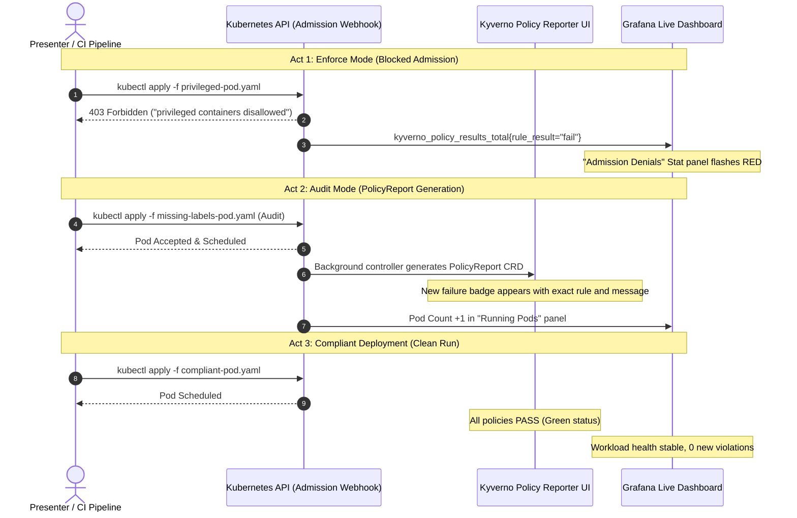

# Kubernetes Cluster Visualization & Governance Observability Plan

## 1. Executive Context & Objectives

* **Target Audience**: AI agents and engineers implementing or presenting cluster governance observability on the **PaC Kyverno Governance Platform**.
* **Current Baseline**: The frontend uses a custom-built hierarchical React DOM topology viewer ([apps/frontend/src/app/clusters/live-topology/page.tsx](file:///home/user/work_dir/apps/frontend/src/app/clusters/live-topology/page.tsx) pointing to [apps/frontend/src/app/demo/cluster-live/page.tsx](file:///home/user/work_dir/apps/frontend/src/app/demo/cluster-live/page.tsx)).
* **Objective**: Replace or augment the custom topology view with established cloud-native visualization tools (Kyverno Policy Reporter, Grafana, and Prometheus) to deliver a clear live test workflow for audience presentations.
* **Core Presentation Requirements**:
  1. **Enforce Policy Denial**: Visually confirm when a non-compliant deployment request is rejected at the admission stage.
  2. **Audit Policy Reports**: Visually inspect `PolicyReport` / `ClusterPolicyReport` CRDs generated for audit-mode policies.
  3. **Workload Lifecycle**: Visually track pods transitioning through deployment phases (`Pending` -> `ContainerCreating` -> `Running`).

---

## 2. Technical Evaluation & Architecture Decisions

### 2.1. Why Prometheus + Grafana Alone is Insufficient
* **Metrics are Aggregated Numbers**: An admission denial in Prometheus is an incrementing counter (`kyverno_policy_results_total{rule_result="fail"}`). It lacks real-time visual punch without the exact rejection reason or affected manifest line.
* **PolicyReports are CRDs**: Kyverno's core `:8000/metrics` endpoint does not expose full audit reports. Exporting `PolicyReport` results to Prometheus requires an external exporter.
* **Scrape Latency**: Default Prometheus scraping (15s–30s) creates awkward dead air during live terminal demonstrations.

### 2.2. The Selected Solution: CNCF Policy Reporter + Grafana
To address these constraints, the architecture adopts a dual-tool setup:

```
┌────────────────────────────────────────────────────────────────────────────────────────┐
│                               LIVE PRESENTATION ARCHITECTURE                           │
├────────────────────────────────────────┬───────────────────────────────────────────────┤
│ Layer                                  │ Component & Role                              │
├────────────────────────────────────────┼───────────────────────────────────────────────┤
│ Admission Enforcement                  │ Kyverno Admission Controller Webhook          │
│                                        │ + Grafana (Admission Request/Denial Spikes)   │
├────────────────────────────────────────┼───────────────────────────────────────────────┤
│ Governance & Audit Reports             │ CNCF Policy Reporter Web UI                   │
│                                        │ + Policy Reporter Prometheus Exporter         │
├────────────────────────────────────────┼───────────────────────────────────────────────┤
│ Workload & Cluster Health              │ Grafana Kube-State-Metrics                    │
│                                        │ (Optional: KubeView / Headlamp for Topology)  │
├────────────────────────────────────────┼───────────────────────────────────────────────┤
│ Platform Presentation Hub              │ apps/frontend/src/app/clusters/live-topology  │
│                                        │ (Tabbed / Dual-pane iFrame Kiosk Container)   │
└────────────────────────────────────────┴───────────────────────────────────────────────┘
```

---

## 3. Live Presentation Storyboard (3-Act Demo)



---

## 4. Implementation Blueprint for Implementing Agent

### Step 1: Enable Metrics in Kyverno Helm Values
Ensure the Kyverno controllers expose their Prometheus metrics endpoints:

```yaml
# kyverno-values.yaml
admissionController:
  metricsService:
    create: true
    port: 8000
    type: ClusterIP
reportsController:
  metricsService:
    create: true
    port: 8000
    type: ClusterIP
backgroundController:
  metricsService:
    create: true
    port: 8000
    type: ClusterIP
```

### Step 2: Deploy CNCF Policy Reporter
Deploy Policy Reporter with the standalone UI and Prometheus exporter enabled:

```bash
helm repo add policy-reporter https://kyverno.github.io/policy-reporter
helm repo update

helm upgrade --install policy-reporter policy-reporter/policy-reporter \
  --namespace policy-reporter \
  --create-namespace \
  --set ui.enabled=true \
  --set monitoring.enabled=true \
  --set monitoring.grafana.dashboards=true
```

### Step 3: Tune Prometheus Scrape Interval for Live Demos
Avoid latency in demonstrations by reducing the scrape interval for Kyverno and Policy Reporter targets to `2s`:

```yaml
# kube-prometheus-stack values
prometheus:
  prometheusSpec:
    scrapeInterval: 2s
    evaluationInterval: 2s
```

### Step 4: Import Official Grafana Dashboards
Import the official Kyverno and Policy Reporter dashboards into Grafana:
* **Kyverno Official Dashboard**: [kyverno-dashboard.json](https://raw.githubusercontent.com/kyverno/kyverno/main/charts/kyverno/charts/grafana/dashboard/kyverno-dashboard.json)
* **Policy Reporter Dashboard**: Bundled with Policy Reporter Helm chart (`monitoring.grafana.dashboards=true`).

#### Key PromQL Queries for Custom Demo Panels:
* **Enforce Admission Denials**:
  ```promql
  sum(increase(kyverno_policy_results_total{rule_result="fail", policy_execution_mode="admission"}[1m]))
  ```
* **Audit Violations Count**:
  ```promql
  count(policy_report_results{status="fail"}) by (policy, severity, resource_namespace)
  ```
* **Active Pods by Phase**:
  ```promql
  sum(kube_pod_status_phase{phase=~"Running|Pending|Failed"}) by (phase)
  ```

### Step 5: Embed Views in [clusters/live-topology/page.tsx](file:///home/user/work_dir/apps/frontend/src/app/clusters/live-topology/page.tsx)
Replace the custom DOM canvas with a dual-pane presentation container:

```tsx
"use client";

import { useState } from "react";
import { ShieldCheck, BarChart3 } from "lucide-react";
import { Button } from "@/components/ui/button";

export default function ClusterObservabilityPage() {
  const [activeTab, setActiveTab] = useState<"policy-reporter" | "grafana">("policy-reporter");

  const policyReporterUrl = process.env.NEXT_PUBLIC_POLICY_REPORTER_URL || "http://localhost:8082";
  const grafanaUrl = process.env.NEXT_PUBLIC_GRAFANA_URL || "http://localhost:3001/d/kyverno/kyverno-dashboard?kiosk";

  return (
    <div className="flex flex-col h-[calc(100vh-4rem)] p-4 gap-3 bg-background">
      <div className="flex items-center justify-between pb-2 border-b">
        <div>
          <h1 className="text-xl font-bold tracking-tight">Cluster Governance Observability</h1>
          <p className="text-xs text-muted-foreground">
            Live Policy Enforcement, Audit Reports, and Workload Telemetry
          </p>
        </div>
        <div className="flex gap-2">
          <Button
            size="sm"
            variant={activeTab === "policy-reporter" ? "default" : "outline"}
            onClick={() => setActiveTab("policy-reporter")}
          >
            <ShieldCheck className="w-4 h-4 mr-1.5" /> Policy Reporter
          </Button>
          <Button
            size="sm"
            variant={activeTab === "grafana" ? "default" : "outline"}
            onClick={() => setActiveTab("grafana")}
          >
            <BarChart3 className="w-4 h-4 mr-1.5" /> Grafana Metrics
          </Button>
        </div>
      </div>

      <div className="flex-1 w-full h-full rounded-lg border bg-card overflow-hidden">
        {activeTab === "policy-reporter" ? (
          <iframe
            src={policyReporterUrl}
            className="w-full h-full border-0"
            title="Kyverno Policy Reporter UI"
          />
        ) : (
          <iframe
            src={grafanaUrl}
            className="w-full h-full border-0"
            title="Kyverno Grafana Dashboard"
          />
        )}
      </div>
    </div>
  );
}
```

---

## 5. Verification & Acceptance Criteria

Agents executing this plan must verify the following:
1. `kubectl get pods -n policy-reporter` shows the UI and target exporter in `Running` state.
2. `curl http://localhost:8000/metrics` on the Kyverno admission controller returns `kyverno_policy_results_total`.
3. Applying a privileged pod triggers a `403 Forbidden` response and causes a spike in the Grafana admission denials panel.
4. Applying an audit policy pod generates a corresponding entry in `kubectl get policyreports -A` and displays in Policy Reporter UI.
