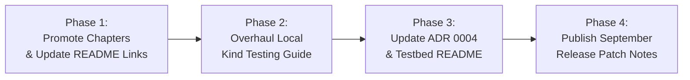

# Platform Documentation Modernization Plan

## 1. Executive Context & Objectives

* **Target Audience**: AI agents and software engineers maintaining and updating documentation for the **PaC Kyverno Governance Platform**.
* **Current Baseline**:
  - The master [README.md](file:///home/user/work_dir/README.md) has been overhauled into a comprehensive Master Context Guide (commit `73da127`).
  - Five deep-dive technical specifications totaling 4,727 lines have been authored into [`docs/readme_drafts/`](file:///home/user/work_dir/docs/readme_drafts/).
  - The [Modular Component Architecture Plan](file:///home/user/work_dir/docs/modular-components-architecture-plan.md) is established to guide feature decoupling.
* **Problem Statement**:
  While high-level architectural documentation is now current, several secondary documents and operational guides remain out of sync with recent platform features (such as Policy Simulation Lab, Admission Enforce AI Diagnostics, in-app notebook reverse proxy, universal deployer scripts, and bare Kind automated test runners).
* **Objective**:
  Establish a structured, phased roadmap to update, reorganize, and maintain all repository documentation in an up-to-date, consistent state.

---

## 2. Documentation Audit & Target Matrix

| Target Document | Current Status | Priority | Key Gaps & Required Updates |
| :--- | :--- | :--- | :--- |
| **[`docs/readme_drafts/`](file:///home/user/work_dir/docs/readme_drafts/)** | Complete Drafts | **P1 (Immediate)** | • 5 chapter drafts are currently housed under `readme_drafts/`. • Promote to permanent first-class documentation directory (`docs/chapters/`). • Update cross-references in master [README.md](file:///home/user/work_dir/README.md). |
| **[`docs/guides/local-kind-testing.md`](file:///home/user/work_dir/docs/guides/local-kind-testing.md)** | Partially Outdated | **P1 (High)** | • Relies purely on manual container and Kind setup commands. • Missing modern automated test runner commands (`pnpm test:bare:single`, `pnpm test:bare:multicluster`). • Missing test scenarios for Policy Simulation Lab (`/simulation`) and Enforce AI Diagnostics (`/diagnostics`). • Fix reference to missing manifest (`15-user-violation-workload.yaml`). |
| **[`docs/adr/0004-cicd-pipeline.md`](file:///home/user/work_dir/docs/adr/0004-cicd-pipeline.md)** | Outdated Status | **P2 (Medium)** | • Marked as `Status: Proposed` and `Under consideration` with obsolete references to a temporary proposal branch. • Update status to `Accepted` reflecting implemented GitHub Actions OIDC + ECR/EKS pipeline. |
| **[`k8s-manifests/testbed/README.md`](file:///home/user/work_dir/k8s-manifests/testbed/README.md)** | Incomplete Inventory | **P2 (Medium)** | • Missing documentation for testbed manifests added later (`compliant-app.yaml`, `real-world-scenarios.yaml`, `violating-privileged-debugger.yaml`, `violating-web-app.yaml`). • Add instructions for testing manifests against Policy Simulation Lab. |
| **[`docs/history/patch-notes-2026-09.md`](file:///home/user/work_dir/docs/history/)** | Missing Release Notes | **P3 (Low)** | • Existing patch notes end at 2026-09-02 (v1.2.0). • Create formal September 2026 patch notes covering v1.3.0 features (Simulation Lab, Notebook Proxy, Modular Manifests, Universal Deployer, Bare Kind Runners). |

---

## 3. Phased Implementation Roadmap

### Phase 1: Chapter Promotion & Documentation Reorganization
* **Actions**:
  1. Move [`docs/readme_drafts/`](file:///home/user/work_dir/docs/readme_drafts/) to `docs/chapters/`:
     - `ch1_2_architecture_core.md` -> `docs/chapters/01-architecture-and-core-governance.md`
     - `ch3_mlops_platform.md` -> `docs/chapters/02-mlops-and-finops-suite.md`
     - `ch4_ai_simulation_gitops.md` -> `docs/chapters/03-ai-diagnostics-simulation-gitops.md`
     - `ch5_frontend_security.md` -> `docs/chapters/04-frontend-architecture-security.md`
     - `ch6_deploy_operations.md` -> `docs/chapters/05-infrastructure-and-operations.md`
  2. Update links in [README.md](file:///home/user/work_dir/README.md) table of contents and documentation index.
* **Success Criteria**: All chapter paths are permanent; zero 404/dead links in [README.md](file:///home/user/work_dir/README.md).

---

### Phase 2: Overhaul Local Kind E2E Testing Guide
* **Actions**:
  1. Update Section 2 of [`docs/guides/local-kind-testing.md`](file:///home/user/work_dir/docs/guides/local-kind-testing.md) to feature:
     - Automated Kind single-cluster setup via `scripts/tests/run-bare-single-cluster-test.sh` / `pnpm test:bare:single`.
     - Automated Kind multi-cluster setup via `scripts/tests/run-bare-multicluster-test.sh` / `pnpm test:bare:multicluster`.
     - Rapid local cluster deployment via `./redeploy.sh` or `scripts/deploy.sh --env onprem --build`.
  2. Add **Scenario 7: Policy Simulation Lab (`/simulation`)**:
     - Uploading candidate YAMLs for dry-run validation against live policies.
  3. Add **Scenario 8: Admission Enforce AI Diagnostics (`/diagnostics`)**:
     - Submitting blocked pod admission review payloads to Bedrock AI Copilot for root-cause diagnosis and one-click remediation.
  4. Add **Scenario 9: Direct Browser Notebook Reverse Proxy (`/notebook/*`)**:
     - Launching JupyterLab sessions directly through in-app reverse proxy without requiring CLI `kubectl port-forward`.
  5. Resolve reference to `15-user-violation-workload.yaml` by providing the inline YAML or mapping to existing `13-violation-missing-limits.yaml`.
* **Success Criteria**: Developers can follow the guide end-to-end using both manual and automated pathways.

---

### Phase 3: ADR & Testbed Manifest Catalog Standardization
* **Actions**:
  1. Update [`docs/adr/0004-cicd-pipeline.md`](file:///home/user/work_dir/docs/adr/0004-cicd-pipeline.md):
     - Change status from `Proposed` to `Accepted`.
     - Document implemented GitHub Actions workflows, AWS IAM OIDC federation, and ECR/EKS build offloading.
  2. Update [`k8s-manifests/testbed/README.md`](file:///home/user/work_dir/k8s-manifests/testbed/README.md):
     - Complete manifest inventory table with [`compliant-app.yaml`](file:///home/user/work_dir/k8s-manifests/testbed/compliant-app.yaml), [`real-world-scenarios.yaml`](file:///home/user/work_dir/k8s-manifests/testbed/real-world-scenarios.yaml), [`violating-privileged-debugger.yaml`](file:///home/user/work_dir/k8s-manifests/testbed/violating-privileged-debugger.yaml), and [`violating-web-app.yaml`](file:///home/user/work_dir/k8s-manifests/testbed/violating-web-app.yaml).
     - Add section explaining how to test these manifests using the Policy Simulation Lab UI.
* **Success Criteria**: ADR and testbed documentation accurately mirror active codebase state.

---

### Phase 4: September 2026 Release Patch Notes (v1.3.0)
* **Actions**:
  1. Author `docs/history/patch-notes-2026-09.md` covering changes from 2026-09-03 to 2026-09-11:
     - In-app reverse proxy for Kubeflow Notebooks (`http-proxy-middleware`, direct browser launch).
     - Policy Simulation Lab & Admission Enforce AI Diagnostics (`/simulation`, `/diagnostics`).
     - Universal environment-independent deployment script ([`scripts/deploy.sh`](file:///home/user/work_dir/scripts/deploy.sh), [`redeploy.sh`](file:///home/user/work_dir/redeploy.sh), [`install.sh`](file:///home/user/work_dir/install.sh)).
     - Modular Kubernetes manifests ([`k8s-manifests/base`](file:///home/user/work_dir/k8s-manifests/base), [`overlays/eks`](file:///home/user/work_dir/k8s-manifests/overlays/eks), [`overlays/onprem`](file:///home/user/work_dir/k8s-manifests/overlays/onprem)).
     - Bare Kind single- and multi-cluster integration test runners (`pnpm test:bare:single`, `pnpm test:bare:multicluster`).
     - Comprehensive Technical Foundation Whitepaper ([`docs/TECHNICAL_FOUNDATION_REPORT.md`](file:///home/user/work_dir/docs/TECHNICAL_FOUNDATION_REPORT.md)).
     - Master Repository Context Guide ([`README.md`](file:///home/user/work_dir/README.md)).
* **Success Criteria**: Full changelog continuity bridging August v1.2.0 to September v1.3.0.

---

## 4. Operational Guidelines for Contributing Agents

All documentation updates must conform to the project conventions specified in [`.agents/AGENTS.md`](file:///home/user/work_dir/.agents/AGENTS.md):
1. **Clickable Links**: All file and directory references must use GitHub-style markdown links with the `file://` scheme.
2. **Commit Granularity**: Divide changes into small, atomic commits per phase or document.
3. **Commit Author**: All commits must be attributed to `yeongrimGo-agy <yeongrimgo1106@pusan.ac.kr>`.
4. **Conventional Commits**: Use strict v1.0.0 format (`docs(...)`, `fix(...)`, `feat(...)`).
5. **Pre-Commit Human Approval**: Present planned commit details and await explicit user confirmation prior to running `git commit`.
