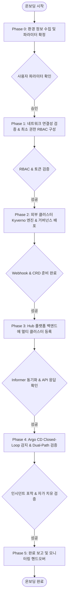

# 외부 Argo CD 쿠버네티스 클러스터 온보딩 에이전트 인터랙티브 가이드
# (Interactive Agent Runbook: External Argo CD Cluster Onboarding)

본 문서는 AI 에이전트(또는 자동화 도구)가 사용자와 **인터랙티브(대화형)로 협업**하여, Argo CD로 관리되는 **외부 원격 쿠버네티스 클러스터(External / Spoke Cluster)**를 **Kyverno Governance Platform**에 안전하고 체계적으로 단계별 온보딩할 수 있도록 규정한 실행 런북(Executable Playbook)입니다.

---

## 🤖 에이전트 오케스트레이션 행동 규칙 (Agent Execution Rules)

1. **단계별 상호작용 (Step-by-Step Interaction)**:
   * 한 번에 모든 단계를 일괄 실행하지 마십시오. 반드시 각 **Phase**의 실행 명령어를 수행하고, **자동 검증 기준(Verification Criteria)**을 통과한 후 **인터랙티브 체크포인트(Interactive Checkpoint)**를 통해 사용자에게 결과를 보고하고 다음 단계 진행 여부를 확인받아야 합니다.
2. **사전 승인 보고 (Pre-Action Report)**:
   * 원격 클러스터나 Hub 클러스터의 상태를 변경하는 쓰기 작업(RBAC 생성, Secret 업데이트, Pod 재기동) 전에는 실행할 매니페스트/명령어 요약을 사용자에게 미리 제시하십시오.
3. **오류 시 즉각 중단 (Fail-Closed on Error)**:
   * 검증 단계에서 실패(네트워크 차단, 인증 실패, CRD 누락 등)가 발생하면 다음 Phase로 넘어가지 말고 해당 Phase의 **[트러블슈팅 & 복구 가이드]**를 실행하여 해결책을 제시하십시오.
4. **보안 민감 정보 마스킹 (Credential Masking)**:
   * ServiceAccount 토큰 및 Secret 값을 사용자 대화창에 출력할 때는 앞뒤 4자리를 제외한 나머지를 반드시 마스킹(`eyJh...****`) 처리하십시오.
5. **규격 표준 준수**:
   * AWS 기본 리전은 `us-east-1`을 기준으로 하며, Kyverno 파드 메모리 제한은 최소 768Mi를 유지해야 합니다 ([.agents/AGENTS.md](file:///home/user/kyverno-dashboard/.agents/AGENTS.md), [.agents/PERFORMANCE_AND_SYSTEM_RESOURCES.md](file:///home/user/kyverno-dashboard/.agents/PERFORMANCE_AND_SYSTEM_RESOURCES.md)).

---

## 🗺️ 전체 온보딩 워크플로우 맵



---

## 📋 Phase 0: 환경 정보 수집 및 인터랙티브 인터뷰 (Discovery)

### 🎯 목표
온보딩 대상 외부 클러스터의 식별자, API 서버 URL, Kubeconfig 컨텍스트, Argo CD 설정 정보를 수집하고 변수로 확정합니다.

### 💬 에이전트 인터랙티브 체크포인트 0 (질의 템플릿)
> 에이전트는 온보딩을 시작할 때 사용자에게 아래 질문을 제시하고 응답을 수렴하십시오:
> 
> ```text
> 📢 [외부 클러스터 온보딩을 시작합니다]
> 원활한 연동을 위해 외부 클러스터에 대한 기본 정보를 입력하거나 확인해 주세요:
> 
> 1. 외부 클러스터 식별 ID (예: spoke-prod-cluster):
> 2. 외부 클러스터 표시 이름 (예: Production US-East-1 Spoke):
> 3. 외부 클러스터 Kubeconfig Context 명칭 (현재 kubectl config get-contexts):
> 4. 외부 클러스터 내 Argo CD 설치 네임스페이스 (기본값: argocd):
> 5. 연동할 GitOps 저장소 URL 및 경로 (예: org/repo, clusters/prod/policies):
> ```

### ⚙️ 확정된 파라미터 환경변수 설정
사용자 응답을 기반으로 셸 세션 변수를 초기화합니다:
```bash
export SPOKE_CLUSTER_ID="external-argocd-cluster"
export SPOKE_DISPLAY_NAME="External ArgoCD Production"
export SPOKE_KUBECONTEXT="arn:aws:eks:us-east-1:123456789012:cluster/external-cluster"
export SPOKE_ARGOCD_NAMESPACE="argocd"
export GITOPS_REPO="YeongrimGo/PaC-KyvernoDashboard"
export GITOPS_BRANCH="main"
export GITOPS_PATH="k8s-manifests/policies"

# Hub 클러스터 컨텍스트 설정
export HUB_KUBECONTEXT="$(kubectl config current-context)"
```

---

## 🔐 Phase 1: 네트워크 연결성 검증 및 최소 권한 RBAC 프로비저닝

### 🎯 목표
1. Hub 클러스터에서 외부 클러스터 API 서버(HTTPS :6443 / :443)로의 네트워크 통신 가능 여부를 검증합니다.
2. 외부 클러스터에 플랫폼 전용 ServiceAccount(`kyverno-remote-agent-sa`)와 최소 권한 ClusterRole을 선언적으로 배포하고 장기 Bearer Token 및 CA 데이터를 안전하게 추출합니다.

### 🛠️ 실행 단계

#### 1-1. 네트워크 연결성 확인
```bash
# 외부 클러스터 API 서버 엔드포인트 추출
SPOKE_API_SERVER=$(kubectl --context="${SPOKE_KUBECONTEXT}" cluster-info | grep 'Kubernetes control plane' | awk '{print $NF}' | sed -r "s/\x1B\[([0-9]{1,2}(;[0-9]{1,2})?)?[mGK]//g")
echo "Target Spoke API Server: ${SPOKE_API_SERVER}"

# TCP 포트 통신 사전 검사 (응답 상태코드 확인)
curl -k -s -o /dev/null -w "%{http_code}\n" "${SPOKE_API_SERVER}/readyz" || {
  echo "❌ [FAIL] Cannot reach external cluster API Server at ${SPOKE_API_SERVER}"
  exit 1
}
echo "✅ [PASS] Network reachable to external API Server."
```

#### 1-2. 외부 클러스터에 최소 권한 RBAC 배포
```bash
# 외부 클러스터에 ServiceAccount 및 ClusterRole 배포
kubectl --context="${SPOKE_KUBECONTEXT}" apply -f - <<EOF
apiVersion: v1
kind: Namespace
metadata:
  name: kyverno
---
apiVersion: v1
kind: ServiceAccount
metadata:
  name: kyverno-remote-agent-sa
  namespace: kyverno
---
apiVersion: rbac.authorization.k8s.io/v1
kind: ClusterRole
metadata:
  name: kyverno-remote-agent-role
rules:
  # 1. Kyverno 정책 및 예외 관리 권한
  - apiGroups: ["kyverno.io"]
    resources: ["clusterpolicies", "policies", "policyexceptions"]
    verbs: ["get", "list", "watch", "create", "update", "patch", "delete"]
  # 2. 컴플라이언스 감사 리포트 수집 권한
  - apiGroups: ["wgpolicyk8s.io"]
    resources: ["policyreports", "clusterpolicyreports"]
    verbs: ["get", "list", "watch"]
  # 3. Argo CD 동기화 상태 및 배포 차단 감지 권한
  - apiGroups: ["argoproj.io"]
    resources: ["applications"]
    verbs: ["get", "list", "watch"]
  # 4. 코어 리소스 및 이벤트 감사 권한
  - apiGroups: [""]
    resources: ["namespaces", "pods", "events"]
    verbs: ["get", "list", "watch"]
---
apiVersion: rbac.authorization.k8s.io/v1
kind: ClusterRoleBinding
metadata:
  name: kyverno-remote-agent-rolebinding
roleRef:
  apiGroup: rbac.authorization.k8s.io
  kind: ClusterRole
  name: kyverno-remote-agent-role
subjects:
  - kind: ServiceAccount
    name: kyverno-remote-agent-sa
    namespace: kyverno
---
apiVersion: v1
kind: Secret
metadata:
  name: kyverno-remote-agent-sa-token
  namespace: kyverno
  annotations:
    kubernetes.io/service-account.name: kyverno-remote-agent-sa
type: kubernetes.io/service-account-token
EOF
```

#### 1-3. CA Data 및 Token 추출
```bash
# Token 발급 동기화 대기
sleep 3

# CA Data 및 Token 추출
SPOKE_CA_DATA=$(kubectl --context="${SPOKE_KUBECONTEXT}" get cm kube-root-ca.crt -n kyverno -o jsonpath='{.data.ca\.crt}' | base64 -w 0 2>/dev/null || kubectl --context="${SPOKE_KUBECONTEXT}" config view --raw --minify --flatten -o jsonpath='{.clusters[0].cluster.certificate-authority-data}')
SPOKE_TOKEN=$(kubectl --context="${SPOKE_KUBECONTEXT}" get secret kyverno-remote-agent-sa-token -n kyverno -o jsonpath='{.data.token}' | base64 -d 2>/dev/null || kubectl --context="${SPOKE_KUBECONTEXT}" create token kyverno-remote-agent-sa -n kyverno --duration=87600h)

echo "Extracted Token Prefix: ${SPOKE_TOKEN:0:15}..."
echo "CA Data Length: ${#SPOKE_CA_DATA} bytes"
```

### 🔍 자동 검증 기준 (Verification Criteria)
* ServiceAccount 권한 검증:
  ```bash
  kubectl --context="${SPOKE_KUBECONTEXT}" auth can-i get clusterpolicies.kyverno.io --as=system:serviceaccount:kyverno:kyverno-remote-agent-sa
  kubectl --context="${SPOKE_KUBECONTEXT}" auth can-i list applications.argoproj.io --as=system:serviceaccount:kyverno:kyverno-remote-agent-sa
  ```
  ➔ 두 명령 모두 `yes`를 출력해야 합니다.

### 💬 에이전트 인터랙티브 체크포인트 1
> "외부 클러스터에 최소 권한 RBAC이 생성되었으며, Kyverno 및 Argo CD 감시 권한 테스트(`auth can-i`)가 모두 `yes`로 성공했습니다. 다음 단계로 외부 클러스터의 Kyverno 엔진 상태를 점검하고 배포하시겠습니까?"

---

## 🛡️ Phase 2: 외부 클러스터 Kyverno 엔진 및 거버넌스 정책 배포

### 🎯 목표
외부 클러스터에 Kyverno 어드미션 컨트롤러가 아직 배포되지 않은 경우, 성능 지침에 맞게 배포하거나 기존 설치 상태의 메모리 제한 및 CRD 정합성을 검증합니다.

### 🛠️ 실행 단계

#### 2-1. 기존 Kyverno 설치 상태 점검
```bash
if kubectl --context="${SPOKE_KUBECONTEXT}" get deployment kyverno-admission-controller -n kyverno &>/dev/null; then
  echo "✅ Kyverno is already installed on external cluster."
else
  echo "⚙️ Kyverno not found. Deploying Kyverno via Helm with performance standards..."
  helm --kube-context="${SPOKE_KUBECONTEXT}" repo add kyverno https://kyverno.github.io/kyverno/ --force-update
  helm --kube-context="${SPOKE_KUBECONTEXT}" repo update
  helm --kube-context="${SPOKE_KUBECONTEXT}" upgrade --install kyverno kyverno/kyverno \
    --namespace kyverno \
    --create-namespace \
    --set features.admissionReports.enabled=false \
    --set admissionController.container.resources.limits.memory=768Mi \
    --set backgroundController.backgroundScanInterval=1h
fi
```

#### 2-2. 핵심 보안 거버넌스 정책 배포 (PSS Baseline)
```bash
# 필수 거버넌스 정책 번들 적용
kubectl --context="${SPOKE_KUBECONTEXT}" apply -f k8s-manifests/policies/disallow-privileged-containers.yaml
kubectl --context="${SPOKE_KUBECONTEXT}" apply -f k8s-manifests/policies/require-resource-limits.yaml
kubectl --context="${SPOKE_KUBECONTEXT}" apply -f k8s-manifests/policies/disallow-latest-tag.yaml
```

### 🔍 자동 검증 기준 (Verification Criteria)
```bash
kubectl --context="${SPOKE_KUBECONTEXT}" get clusterpolicy
```
➔ `disallow-privileged-containers`, `require-resource-limits` 등이 `READY: true` 상태여야 합니다.

### 💬 에이전트 인터랙티브 체크포인트 2
> "외부 클러스터에 Kyverno 엔진 및 핵심 보안 정책(3건)이 정상 등록되었습니다. 이제 Hub 플랫폼 백엔드에 이 외부 클러스터를 등록하고 Informer 캐시를 가동하시겠습니까?"

---

## 🔌 Phase 3: Hub 플랫폼 백엔드에 외부 클러스터 메타데이터 등록

### 🎯 목표
Hub 클러스터의 `backend-env-secret` 및 환경 변수(`KUBERNETES_CLUSTERS`)에 외부 클러스터 정보를 안전하게 주입하고, 백엔드가 다중 클러스터 제어 모드(`CLUSTER_PROVIDER=multi`)로 전환되도록 합니다.

### 🛠️ 실행 단계

#### 3-1. 기존 멀티 클러스터 구성 조회 및 신규 클러스터 병합
에이전트는 기존에 등록된 클러스터 목록을 조회하여 중복 등록을 방지하고 새 엔트리를 JSON 배열에 병합합니다.

```bash
# 1. Hub 백엔드의 기존 설정 확인
CURRENT_CLUSTERS_RAW=$(kubectl --context="${HUB_KUBECONTEXT}" get secret backend-env-secret -n kyverno-platform -o jsonpath='{.data.KUBERNETES_CLUSTERS}' 2>/dev/null | base64 -d || echo "[]")

# 2. Python 또는 node 스크립트를 통한 JSON 무결성 병합
NEW_CLUSTERS_JSON=$(node -e "
const current = ${CURRENT_CLUSTERS_RAW} || [];
const newEntry = {
  id: '${SPOKE_CLUSTER_ID}',
  displayName: '${SPOKE_DISPLAY_NAME}',
  server: '${SPOKE_API_SERVER}',
  caData: '${SPOKE_CA_DATA}',
  token: '${SPOKE_TOKEN}',
  exceptionNamespace: 'kyverno',
  default: false,
  gitopsRepo: '${GITOPS_REPO}',
  gitopsBranch: '${GITOPS_BRANCH}',
  gitopsPath: '${GITOPS_PATH}'
};
const filtered = current.filter(c => c.id !== newEntry.id);
filtered.push(newEntry);
// Hub 기본 클러스터가 없는 경우 첫 번째를 default로 설정
if (!filtered.some(c => c.default)) {
  filtered[0].default = true;
}
console.log(JSON.stringify(filtered));
")

echo "Merged Clusters Configuration count: $(echo "${NEW_CLUSTERS_JSON}" | jq '. | length')"
```

#### 3-2. Hub 클러스터 Secret 업데이트 및 롤링 재시작
```bash
# 1. backend-env-secret 업데이트
kubectl --context="${HUB_KUBECONTEXT}" create secret generic backend-env-secret \
  --namespace kyverno-platform \
  --from-literal=CLUSTER_PROVIDER="multi" \
  --from-literal=KUBERNETES_CLUSTERS="${NEW_CLUSTERS_JSON}" \
  --dry-run=client -o yaml | kubectl --context="${HUB_KUBECONTEXT}" apply -f -

# 2. 백엔드 Deployment 롤링 재시작 트리거
kubectl --context="${HUB_KUBECONTEXT}" rollout restart deployment/kyverno-backend -n kyverno-platform
kubectl --context="${HUB_KUBECONTEXT}" rollout status deployment/kyverno-backend -n kyverno-platform --timeout=120s
```

### 🔍 자동 검증 기준 (Verification Criteria)
1. **백엔드 로그 점검**:
   ```bash
   kubectl --context="${HUB_KUBECONTEXT}" logs -l app=kyverno-backend -n kyverno-platform --tail=50 | grep -E "Informer|MultiClusterProvider|ArgoCdDetector"
   ```
   ➔ `[Informer] K8s Informers successfully started.` 및 외부 클러스터에 대한 `Started informer for external-argocd-cluster` 로그가 확인되어야 합니다.
2. **REST API 응답 확인**:
   ```bash
   kubectl --context="${HUB_KUBECONTEXT}" exec -n kyverno-platform deploy/kyverno-backend -- \
     curl -s http://localhost:3001/api/v1/clusters | jq .
   ```
   ➔ 응답 배열에 방금 등록한 `${SPOKE_CLUSTER_ID}`가 포함되어 있어야 합니다.

### 💬 에이전트 인터랙티브 체크포인트 3
> "Hub 백엔드가 재기동되어 외부 클러스터에 대한 Informer 및 Argo CD 감시기가 성공적으로 활성화되었습니다. API 응답에서도 등록이 확인되었습니다. 이제 Argo CD 배포 차단 감지 및 GitOps 연동 테스트를 진행할까요?"

---

## 🧪 Phase 4: Argo CD Closed-Loop 감지 & Dual-Path GitOps 연동 테스트

### 🎯 목표
1. 외부 클러스터의 Argo CD가 거버넌스 정책 위반으로 동기화 실패할 때, 플랫폼이 이를 **실시간 인시던트**로 포착하는지 검증합니다.
2. 플랫폼에서 정책 예외를 승인했을 때 외부 클러스터에 `PolicyException` CRD가 적용되고 GitOps 저장소에 자동 PR이 개설되는 **Dual-Path** 동작을 검증합니다.
3. 외부 클러스터에서 정책이 임의 변조될 때 플랫폼의 **Self-Healing(자동 치유)** 엔진이 동작하는지 검증합니다.

### 🛠️ 실행 단계

#### 4-1. Argo CD 배포 차단 유발 및 실시간 인시던트 포착 검증
```bash
# 외부 클러스터에 위반 파드를 배포하는 임시 테스트 실행
kubectl --context="${SPOKE_KUBECONTEXT}" apply -f - <<EOF || true
apiVersion: v1
kind: Pod
metadata:
  name: argocd-violation-test-pod
  namespace: default
spec:
  containers:
    - name: test
      image: nginx:latest
      securityContext:
        privileged: true
EOF

# Hub 백엔드 인시던트 저장소 확인
sleep 3
INCIDENT_CHECK=$(kubectl --context="${HUB_KUBECONTEXT}" exec -n kyverno-platform deploy/kyverno-backend -- \
  curl -s "http://localhost:3001/api/v1/incidents?clusterId=${SPOKE_CLUSTER_ID}" | jq '.[0]')

echo "Captured Incident: ${INCIDENT_CHECK}"
```
* **결과**: `policyName: "disallow-privileged-containers"`, `clusterId: "${SPOKE_CLUSTER_ID}"` 인시던트가 기록되어야 합니다.

#### 4-2. 정책 드리프트 및 자동 치유(Auto-Healing) 테스트
```bash
# 외부 클러스터의 정책을 임의로 삭제 (Out-of-band deletion)
echo ">>> Triggering out-of-band deletion on external cluster..."
kubectl --context="${SPOKE_KUBECONTEXT}" delete clusterpolicy disallow-privileged-containers

# 10초 대기 후 Drift Informer 및 Argo CD에 의해 복구되었는지 확인
sleep 12
RESTORED=$(kubectl --context="${SPOKE_KUBECONTEXT}" get clusterpolicy disallow-privileged-containers -o jsonpath='{.metadata.name}' 2>/dev/null || echo "NOT_RESTORED")

if [ "${RESTORED}" == "disallow-privileged-containers" ]; then
  echo "✅ [SUCCESS] Policy drift detected and auto-healed within 12 seconds!"
else
  echo "⚠️ [NOTICE] Auto-heal in progress or manual reconciliation required."
fi
```

### 🔍 자동 검증 기준 (Verification Criteria)
* 외부 클러스터에서 발생한 차단 이벤트가 Hub 플랫폼 대시보드 API에 조회되어야 함.
* 삭제된 정책이 자가 치유(Self-Healing)되어 재기동되어야 함.

### 💬 에이전트 인터랙티브 체크포인트 4
> "Argo CD Admission 거부 인시던트 수집 및 정책 드리프트 자가 치유(Auto-Healing) 테스트가 성공적으로 통과되었습니다. 테스트용 파드를 정리하고 최종 완료 보고서를 작성할까요?"

---

## 📊 Phase 5: 완료 보고 및 모니터링 핸드오버

### 🎯 목표
테스트용 임시 리소스를 정리하고, 사용자에게 온보딩 완료 결과 요약 보고서를 전달합니다.

### 🛠️ 테스트 리소스 정리
```bash
kubectl --context="${SPOKE_KUBECONTEXT}" delete pod argocd-violation-test-pod -n default --ignore-not-found
```

### 📄 최종 온보딩 완료 보고서 (Agent Report Template)
에이전트는 온보딩 작업이 끝나면 사용자에게 아래 양식으로 최종 보고를 출력합니다:

```text
======================================================================
🎉 [온보딩 완료 보고서] 외부 Argo CD 클러스터 연동 성공
======================================================================
1. 클러스터 메타데이터:
   • Cluster ID       : external-argocd-cluster
   • Display Name     : External ArgoCD Production
   • API Endpoint     : https://...:6443
   • Governance Engine: Kyverno v1.12+ (Active)

2. 활성화된 거버넌스 파이프라인:
   • ✅ K8sInformerService 실시간 인메모리 캐시 동기화
   • ✅ ArgoCdIncidentDetector closed-loop 배포 차단 감지
   • ✅ Dual-Path GitOps Publisher (CRD + Git PR 자동 동기화)
   • ✅ PolicyDriftDetectorService out-of-band 변조 자동 치유

3. 접속 및 모니터링:
   • 플랫폼 웹 대시보드 : http://localhost:3000
   • 클러스터 필터 선택  : [External ArgoCD Production] 탭 선택
   • 실시간 인시던트 피드: http://localhost:3000/admin/dashboard
======================================================================
```

---

## 🚨 트러블슈팅 & 복구 가이드 (Troubleshooting)

| 증상 | 발생 원인 | 에이전트 추천 해결 조치 |
| :--- | :--- | :--- |
| **`Phase 1: Cannot reach external cluster API Server`** | 방화벽, Security Group 또는 공용 엔드포인트 비활성화 | 1. 외부 클러스터 Security Group 인바운드 6443/443 허용 확인<br/>2. AWS Transit Gateway 또는 VPC Peering 라우팅 테이블 점검 |
| **`Phase 3: Duplicate cluster id`** | 동일한 `id`를 가진 클러스터가 이미 `KUBERNETES_CLUSTERS`에 존재 | 에이전트가 새 클러스터 ID를 `${SPOKE_CLUSTER_ID}-v2` 등으로 변경 제안 |
| **`Phase 4: ArgoCD Informer could not start (CRD absent)`** | 외부 클러스터에 Argo CD CRD(`applications.argoproj.io`) 미설치 | 비치명적 경고이므로 일반 K8s Core Event 모드로 Fallback 작동함을 사용자에게 안내 |
| **`Phase 4: Self-Healing Suppression active`** | 15초 이내 재귀적 이벤트 억제 쿨다운 발동 | 정상적인 Loop-Storm 방어 동작이므로 15초 후 재확인 안내 |
