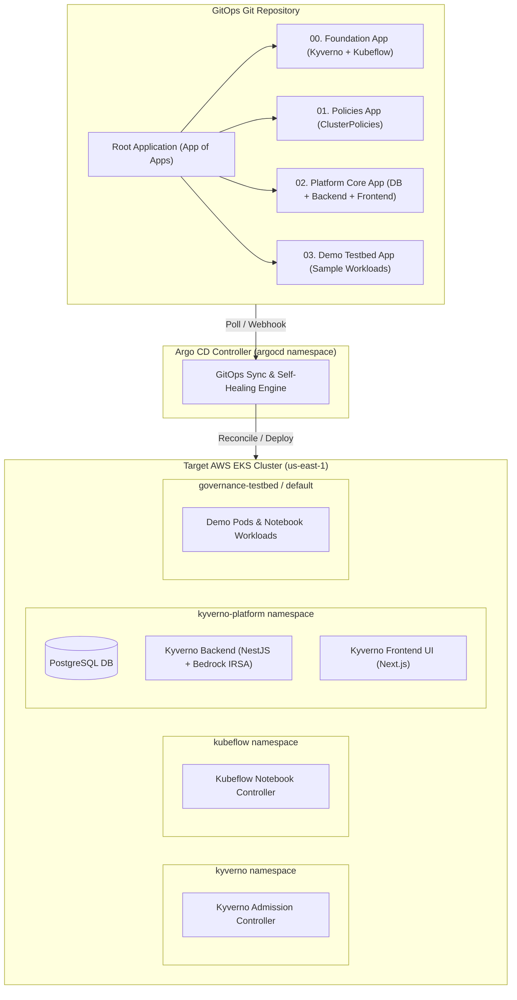

# Argo CD & GitOps 기반 가상 EKS 클러스터 플랫폼 온보딩 가이드 (EKS Onboarding Guide)

본 문서는 이미 동작 중인 가상의 AWS EKS 클러스터(`us-east-1`)에 **Argo CD**와 **GitOps(App of Apps 패턴)**를 활용하여 **Kyverno Governance Platform**을 선언적으로 배포하고, 새로 수립된 [데모 시연 시나리오 (DEMO_SCENARIOS.md)](file:///home/user/kyverno-dashboard/docs/DEMO_SCENARIOS.md)를 완벽하게 구동하기 위한 엔드투엔드 온보딩 절차를 규정합니다.

---

## 1. 아키텍처 개요 및 시연 시나리오 요구사항 매핑

플랫폼 도입의 핵심 목표는 개발자가 `kubectl` 없이도 웹 UI와 GitHub PR을 통해 보안 거버넌스를 준수하고, MLOps 개발 환경을 원클릭으로 안전하게 사용할 수 있도록 지원하는 것입니다.



### 1.1. 시연 시나리오별 필수 인프라 요구사항 매트릭스

| 시연 시나리오 ([DEMO_SCENARIOS.md](file:///home/user/kyverno-dashboard/docs/DEMO_SCENARIOS.md)) | 클러스터 필수 컴포넌트 | GitOps 관리 레이어 | 필수 설정 및 보안 자격증명 |
| :--- | :--- | :--- | :--- |
| **시나리오 1**: Shift-Left 거버넌스 & AI 자가 수정 & 예외 신청 | • Kyverno Admission Controller<br/>• Kyverno ClusterPolicy CRD<br/>• Kyverno Backend & Postgres | Layer 0 (Engine)<br/>Layer 1 (Policies)<br/>Layer 2 (Core) | • AWS Bedrock IRSA Role 바인딩<br/>• GitHub Token (`backend-env-secret`)<br/>• Server-Side Dry-Run RBAC |
| **시나리오 2**: MLOps Zero-CLI JupyterLab & 카나리 서빙 | • Kubeflow Notebook CRD<br/>• Notebook Controller Pod<br/>• Kyverno Backend (WebSocket Proxy) | Layer 0 (Kubeflow)<br/>Layer 2 (Core) | • Non-root 실행 보안 정책<br/>• PVC 동적 프로비저닝 (EBS gp3)<br/>• ClusterIP 통신 허용 |
| **보너스 시나리오**: 실시간 배포 차단 피드 & 드리프트 자동 치유 | • Kyverno Drift Informer<br/>• Kyverno Backend SSE Stream<br/>• Argo CD Auto-Sync & Heal | Layer 0 & Layer 1<br/>Argo CD SyncPolicy | • Argo CD `selfHeal: true`<br/>• Kyverno Admission Webhook 통계 |

---

## 2. GitOps 리포지토리 레이아웃 및 App of Apps 구조

Argo CD의 **App of Apps(애플리케이션 집합)** 패턴을 사용하여 의존성 순서(Sync Wave)에 따라 계층적으로 배포합니다.

### 2.1. 디렉토리 구조 표준

```text
gitops/
├── apps/
│   ├── 00-foundation-application.yaml   # Kyverno Engine + Kubeflow Controller (Wave 0)
│   ├── 01-policies-application.yaml     # Kyverno ClusterPolicy 모음 (Wave 1)
│   ├── 02-platform-core-application.yaml# Postgres, Backend, Frontend (Wave 2)
│   └── 03-demo-testbed-application.yaml # 시연용 네임스페이스 및 테스트베드 (Wave 3)
├── root-application.yaml                # Argo CD 루트 App of Apps 매니페스트
└── manifests/
    ├── foundation/                      # Helm Values & Kubeflow Controller 매니페스트
    ├── policies/                        # k8s-manifests/policies 연계
    ├── platform-core/                   # k8s-manifests/system 연계
    └── testbed/                         # k8s-manifests/testbed 연계
```

---

## 3. 1단계: 사전 준비 작업 (EKS 클러스터 환경 점검)

가상 EKS 클러스터가 이미 가동 중인 상태에서 플랫폼 연동에 필요한 AWS IAM 및 보안 Secret을 선제적으로 구성합니다.

### 3.1. 클러스터 및 CLI 점검
* **AWS 기본 리전**: `us-east-1` 확인 (.agents/AGENTS.md 규칙 준수)
* **Kubeconfig 컨텍스트**: 대상 EKS 클러스터(예: `kyverno-eks-lab`) 선택

```bash
# EKS 클러스터 연결 및 노드 상태 확인
export AWS_REGION="us-east-1"
export CLUSTER_NAME="kyverno-eks-lab"

aws eks update-kubeconfig --region "${AWS_REGION}" --name "${CLUSTER_NAME}"
kubectl get nodes -o wide
```

### 3.2. AWS Bedrock AI 연동을 위한 IRSA(IAM Role for ServiceAccount) 구성
시나리오 1의 **AI 자가 수정(Self-Correction)** 기능을 위해 백엔드 ServiceAccount(`kyverno-backend-sa`)에 AWS Bedrock 모델 호출 권한을 부여합니다.

1. **EKS IAM OIDC Provider 활성화**:
   ```bash
   eksctl utils associate-iam-oidc-provider \
     --cluster="${CLUSTER_NAME}" \
     --region="${AWS_REGION}" \
     --approve
   ```

2. **최소 권한 IAM 정책 및 IRSA 생성** (프로젝트 내 자동화 스크립트 활용):
   ```bash
   # 프로젝트 스크립트를 통한 멱등성 IRSA 생성 실행
   chmod +x ./scripts/setup-bedrock-irsa.sh
   ./scripts/setup-bedrock-irsa.sh "${CLUSTER_NAME}" "${AWS_REGION}"
   ```
   > 💡 [scripts/setup-bedrock-irsa.sh](file:///home/user/kyverno-dashboard/scripts/setup-bedrock-irsa.sh)는 `Claude 3.5 Sonnet` 및 `Nova-Lite` 호출 권한만 격리 부여된 IAM Role을 생성하고, `kyverno-platform/kyverno-backend-sa`에 바인딩합니다.

### 3.3. 필수 Secret 사전 생성 (GitOps Secret 관리)
GitOps 리포지토리에는 일반 매니페스트만 커밋하고, 민감 정보(GitHub Personal Access Token, JWT Secret 등)는 클러스터에 Secret으로 사전 생성하거나 SealedSecrets/ExternalSecrets로 관리합니다.

```bash
# 1. 플랫폼 전용 네임스페이스 선행 생성
kubectl create namespace kyverno-platform --dry-run=client -o yaml | kubectl apply -f -

# 2. 백엔드 연동 Secret 생성 (GitHub PR 봇 및 Dual-Path GitOps용)
kubectl create secret generic backend-env-secret \
  --namespace kyverno-platform \
  --from-literal=GITHUB_TOKEN="ghp_your_actual_github_personal_access_token" \
  --from-literal=JWT_ACCESS_SECRET="platform-jwt-access-secret-production-key" \
  --from-literal=JWT_REFRESH_SECRET="platform-jwt-refresh-secret-production-key" \
  --from-literal=GITOPS_CI_TOKEN="ci-secret-token-for-github-actions-gate" \
  --dry-run=client -o yaml | kubectl apply -f -
```

---

## 4. 2단계: 가상 EKS 클러스터에 Argo CD 설치 및 구성

### 4.1. Argo CD 배포 (Official Manifest)
```bash
# 1. argocd 네임스페이스 생성 및 최신 안정화 버전 매니페스트 적용
kubectl create namespace argocd
kubectl apply -n argocd -f https://raw.githubusercontent.com/argoproj/argo-cd/stable/manifests/install.yaml

# 2. Argo CD 컨트롤러 파드 정상 기동 대기
kubectl rollout status deployment/argocd-server -n argocd --timeout=300s
```

### 4.2. Argo CD 초기 관리자 비밀번호 확인 및 로그인
```bash
# 초기 admin 비밀번호 조회
ARGOCD_PASSWORD=$(kubectl -n argocd get secret argocd-initial-admin-secret -o jsonpath="{.data.password}" | base64 -d)
echo "Argo CD Admin Password: ${ARGOCD_PASSWORD}"

# Argo CD 웹 UI 로컬 포트포워딩 (시연 및 운영 모니터링용)
kubectl port-forward svc/argocd-server -n argocd 8080:443 &
```
* **접속 URL**: [https://localhost:8080](https://localhost:8080) (ID: `admin`, PW: 위에서 출력된 값)

---

## 5. 3단계: Argo CD Application 매니페스트 작성 (계층별 선언적 구성)

각 계층은 Kubernetes의 Sync Wave 메커니즘(`argocd.argoproj.io/sync-wave`)을 사용하여 의존성 순서대로 안정적으로 프로비저닝됩니다.

### 5.1. Layer 0: 파운데이션 (Kyverno Engine + Kubeflow Notebook Controller)
* **파일 위치**: `gitops/apps/00-foundation-application.yaml`
* **Sync Wave**: `0`
* **리소스 표준 준수**: 컨트롤러 메모리 누수 및 Throttling 방지를 위해 `limits.memory`는 768Mi 이상 유지하며, `backgroundScanInterval`은 `1h`로 설정하여 etcd I/O 부하를 차단합니다.

```yaml
apiVersion: argoproj.io/v1alpha1
kind: Application
metadata:
  name: 00-foundation
  namespace: argocd
  annotations:
    argocd.argoproj.io/sync-wave: "0"
spec:
  project: default
  source:
    repoURL: 'https://github.com/YeongrimGo/PaC-KyvernoDashboard.git'
    targetRevision: main
    path: k8s-manifests/system
    directory:
      include: 'notebook-controller.yaml'
  destination:
    server: 'https://kubernetes.default.svc'
    namespace: kyverno
  syncPolicy:
    automated:
      prune: false
      selfHeal: true
    syncOptions:
      - CreateNamespace=true
      - ServerSideApply=true
---
# Kyverno 공식 Helm 차트 배포용 Application
apiVersion: argoproj.io/v1alpha1
kind: Application
metadata:
  name: 00-kyverno-engine
  namespace: argocd
  annotations:
    argocd.argoproj.io/sync-wave: "0"
spec:
  project: default
  source:
    chart: kyverno
    repoURL: https://kyverno.github.io/kyverno/
    targetRevision: 3.2.6
    helm:
      releaseName: kyverno
      valuesObject:
        features:
          admissionReports:
            enabled: false # 로컬/시연 환경 etcd WAL 쓰기 부하 방지
        admissionController:
          replicas: 1
          container:
            resources:
              requests:
                cpu: 100m
                memory: 256Mi
              limits:
                cpu: 1000m
                memory: 768Mi # .agents/PERFORMANCE_AND_SYSTEM_RESOURCES.md 표준 준수
        backgroundController:
          backgroundScanInterval: 1h # 백그라운드 스캔 주기 최적화
  destination:
    server: https://kubernetes.default.svc
    namespace: kyverno
  syncPolicy:
    automated:
      prune: false
      selfHeal: true
    syncOptions:
      - CreateNamespace=true
```

### 5.2. Layer 1: 보안 거버넌스 정책 번들 (ClusterPolicy)
* **파일 위치**: `gitops/apps/01-policies-application.yaml`
* **Sync Wave**: `1` (Kyverno CRD가 생성된 직후 정책 적용)
* **포함 정책**:
  - `disallow-root-user` (비루트 실행 강제)
  - `disallow-privileged-containers` (특권 컨테이너 차단)
  - `require-resource-limits` (CPU/Memory limits 강제)
  - `disallow-latest-tag` (latest 태그 감사/차단)
  - `mlops/*` (비인가 이미지 차단, Spot 노드 강제)

```yaml
apiVersion: argoproj.io/v1alpha1
kind: Application
metadata:
  name: 01-governance-policies
  namespace: argocd
  annotations:
    argocd.argoproj.io/sync-wave: "1"
spec:
  project: default
  source:
    repoURL: 'https://github.com/YeongrimGo/PaC-KyvernoDashboard.git'
    targetRevision: main
    path: k8s-manifests/policies
    directory:
      recurse: true
  destination:
    server: 'https://kubernetes.default.svc'
    namespace: kyverno
  syncPolicy:
    automated:
      prune: true
      selfHeal: true
    syncOptions:
      - SkipDryRunOnMissingResource=true
```

### 5.3. Layer 2: 플랫폼 코어 풀스택 (PostgreSQL + Backend + Frontend)
* **파일 위치**: `gitops/apps/02-platform-core-application.yaml`
* **Sync Wave**: `2`
* **구성**: DB 볼륨/초기화 스크립트, IRSA가 적용된 백엔드, 프론트엔드 대시보드.

```yaml
apiVersion: argoproj.io/v1alpha1
kind: Application
metadata:
  name: 02-platform-core
  namespace: argocd
  annotations:
    argocd.argoproj.io/sync-wave: "2"
spec:
  project: default
  source:
    repoURL: 'https://github.com/YeongrimGo/PaC-KyvernoDashboard.git'
    targetRevision: main
    path: k8s-manifests/system
    directory:
      include: '{namespace.yaml,rbac.yaml,postgres.yaml,backend.yaml,frontend.yaml}'
  destination:
    server: 'https://kubernetes.default.svc'
    namespace: kyverno-platform
  syncPolicy:
    automated:
      prune: true
      selfHeal: true
    syncOptions:
      - CreateNamespace=true
```

### 5.4. Layer 3: 시연용 테스트베드 환경 (Demo Testbed)
* **파일 위치**: `gitops/apps/03-demo-testbed-application.yaml`
* **Sync Wave**: `3`
* **목적**: 시연 시나리오 1과 시나리오 2에서 개발자가 배포 테스트를 수행할 `governance-testbed` 및 베이스라인 워크로드 격리 배포.

```yaml
apiVersion: argoproj.io/v1alpha1
kind: Application
metadata:
  name: 03-demo-testbed
  namespace: argocd
  annotations:
    argocd.argoproj.io/sync-wave: "3"
spec:
  project: default
  source:
    repoURL: 'https://github.com/YeongrimGo/PaC-KyvernoDashboard.git'
    targetRevision: main
    path: k8s-manifests/testbed
  destination:
    server: 'https://kubernetes.default.svc'
    namespace: governance-testbed
  syncPolicy:
    automated:
      prune: false # 시연 중 동적 생성/삭제 파드 보존
      selfHeal: false
    syncOptions:
      - CreateNamespace=true
```

### 5.5. 최상위 루트 애플리케이션 (Root App of Apps)
* **파일 위치**: `gitops/root-application.yaml`

```yaml
apiVersion: argoproj.io/v1alpha1
kind: Application
metadata:
  name: kyverno-platform-root
  namespace: argocd
  finalizers:
    - resources-finalizer.argocd.argoproj.io
spec:
  project: default
  source:
    repoURL: 'https://github.com/YeongrimGo/PaC-KyvernoDashboard.git'
    targetRevision: main
    path: gitops/apps
  destination:
    server: 'https://kubernetes.default.svc'
    namespace: argocd
  syncPolicy:
    automated:
      prune: true
      selfHeal: true
```

---

## 6. 4단계: GitOps 플랫폼 일괄 도입 및 동기화 실행

준비된 매니페스트를 클러스터에 일괄 적용하여 Argo CD가 전체 시스템을 자동으로 프로비저닝하도록 명령합니다.

```bash
# 1. 루트 애플리케이션 등록
kubectl apply -f gitops/root-application.yaml

# 2. Argo CD 전체 동기화 진행 상태 모니터링
kubectl get applications -n argocd -w
```

* 정상 배포 시 모든 애플리케이션의 상태가 `Synced` 및 `Healthy`로 전환됩니다:
  - `00-foundation`: Healthy
  - `00-kyverno-engine`: Healthy
  - `01-governance-policies`: Healthy
  - `02-platform-core`: Healthy
  - `03-demo-testbed`: Healthy

---

## 7. 5단계: 시연 시나리오별 엔드투엔드 검증 런북 (Verification Runbook)

모든 컴포넌트가 Argo CD에 의해 배포된 후, [DEMO_SCENARIOS.md](file:///home/user/kyverno-dashboard/docs/DEMO_SCENARIOS.md)의 시연 항목들이 정상 작동하는지 사전 검증합니다.

### 7.1. 대시보드 포트포워딩 준비
```bash
# 1. 프론트엔드 대시보드 (Next.js) 포트포워딩
kubectl -n kyverno-platform port-forward svc/kyverno-frontend 3000:3000 &

# 2. 백엔드 API (NestJS) 포트포워딩
kubectl -n kyverno-platform port-forward svc/kyverno-backend 3001:3001 &
```
* **대시보드 접속**: [http://localhost:3000](http://localhost:3000)
* **로그인 계정**: `admin@test.com` / `test1234!` (또는 일반 개발자 계정)

---

### 7.2. [시나리오 1 검증] Shift-Left 거버넌스 & AI 자가 수정 & 예외 신청

1. **웹 시뮬레이터 접속**:
   * 브라우저에서 `http://localhost:3000/simulation` 이동.
2. **보안 위반 매니페스트 검증**:
   * `runAsNonRoot: false`, `privileged: true`, 리소스 limits 누락된 Deployment 입력 후 **[검증 실행]** 클릭.
   * **기대 결과**: Tier-1 Fast-Fail 엔진 및 In-Cluster Dry-Run에 의해 `disallow-root-user`, `disallow-privileged-containers` 차단 결과 즉각 출력.
3. **AWS Bedrock AI 에이전트 자가 수정(Self-Correction) 검증**:
   * 우측 AI 패널에서 **[AI 추천 수정본 적용]** 클릭.
   * YAML이 자동으로 보정되어 재검증 시 **초록색 [Passed]** 상태로 변경되는지 확인 (IRSA STS 정상 동작 검증).
4. **테스트 배포 및 클린업**:
   * **[테스트 배포]** 클릭 ➔ 클러스터 `default` 네임스페이스에 파드 생성 확인.
   * **[정리(Cleanup)]** 클릭 ➔ 클러스터 파드 즉각 삭제 확인.
5. **원클릭 정책 예외(PolicyException) 신청**:
   * `http://localhost:3000/exceptions/new` 이동.
   * 예외 생성 시 백엔드가 Kubernetes에 `PolicyException` CRD를 배포하고, GitOps 대상 리포지토리에 커밋/PR을 개설하는 Dual-Path 흐름 확인.

---

### 7.3. [시나리오 2 검증] MLOps 연구원의 Zero-CLI JupyterLab & 카나리 서빙

1. **JupyterLab 원클릭 프로비저닝**:
   * `http://localhost:3000/mlops/notebooks` 이동 후 **[새 노트북 생성]** 클릭.
   * 이름: `fraud-detection-exp`, 이미지: `PyTorch 2.0`, 리소스: `1 Core / 2 GB`.
   * **기대 결과**: Kubeflow Notebook CRD가 생성되고, 백엔드 SSE 스트림을 통해 상태가 `Pending` ➔ `Running`으로 전환.
2. **브라우저 내장 WebSocket 프록시 접속**:
   * 목록에서 **[노트북 열기]** 클릭.
   * 별도 VPN/포트포워딩 없이 브라우저 새 탭에서 완전한 JupyterLab 환경 로딩 확인.
3. **모델 서빙 카나리 트래픽 제어 및 즉시 추론**:
   * `http://localhost:3000/mlops/serving` 이동.
   * `fraud-detector-v2`의 트래픽 슬라이더를 `90:10`으로 조정 후 저장.
   * **[테스트]** 모달에서 JSON 페이로드 전송 ➔ `200 OK` 및 실시간 추론 결과 수신 확인.

---

### 7.4. [보너스 시나리오 검증] 배포 차단 인시던트 피드 & 드리프트 자동 복원

1. **배포 차단 인시던트 피드 (`/admin/dashboard`)**:
   * 터미널에서 위반 파드 배포 시도:
     ```bash
     kubectl apply -f k8s-manifests/testbed/12-violation-privileged-container.yaml || true
     ```
   * 대시보드 상단 인시던트 배너 및 피드에 실시간(SSE)으로 차단 이벤트가 기록되는지 확인.
2. **정책 드리프트(Drift) 자동 치유**:
   * 관리자가 임의로 Kyverno 정책을 삭제하거나 Audit으로 변조:
     ```bash
     kubectl delete clusterpolicy disallow-privileged-containers
     ```
   * Argo CD의 `selfHeal: true` 및 플랫폼 백엔드의 **Drift Informer**가 이를 감지하여 10초 이내에 정책을 원본 GitOps 상태로 복원하는지 확인.

---

## 8. 트러블슈팅 및 장애 복구 가이드

| 증상 / 장애 상황 | 원인 분석 | 해결 절차 |
| :--- | :--- | :--- |
| **Argo CD 동기화 실패 (`x509: certificate signed by unknown authority`)** | Kyverno Admission Webhook의 인증서가 아직 완전히 전파되지 않은 상태에서 CRD 적용 시도 | `00-kyverno-engine`의 롤아웃 상태 확인 후 `argocd app sync 01-governance-policies --force` 실행 |
| **AI 에이전트 수정 실패 (`AccessDeniedException` / Bedrock 호출 오류)** | IRSA ServiceAccount의 OIDC 바인딩 누락 또는 STS 토큰 미반영 | 1. `kubectl describe sa kyverno-backend-sa -n kyverno-platform`<br/>2. `eksctl utils associate-iam-oidc-provider` 재실행<br/>3. `kubectl rollout restart deployment/kyverno-backend -n kyverno-platform` |
| **PostgreSQL Pod CrashLoopBackOff (`role does not exist`)** | `postgres-init.sql` ConfigMap이 마운트되기 전 초기화 완료 | `kubectl delete pvc -l app=postgres -n kyverno-platform` 후 Pod 재기동 |
| **JupyterLab WebSocket 연결 끊김 (1006 오류)** | Ingress/Service에서 HTTP Upgrade 헤더 누락 또는 백엔드 프록시 타임아웃 | 백엔드 내장 WebSocket Gateway 포트 및 클러스터 내부 Service 통신(`kubeflow` 네임스페이스) RBAC 권한 확인 |

---

## 9. 시연 종료 후 환경 리셋 (Clean-up)

시연이 끝난 후 테스트 리소스를 정리하고 클러스터를 초기 청정 상태로 되돌립니다.

```bash
# 1. 시연 중 생성된 테스트 워크로드 일괄 정리
kubectl delete -f k8s-manifests/testbed/11-violation-disallow-latest-tag.yaml --ignore-not-found
kubectl delete -f k8s-manifests/testbed/12-violation-privileged-container.yaml --ignore-not-found
kubectl delete -f k8s-manifests/testbed/compliant-app.yaml --ignore-not-found

# 2. 임시 생성된 주피터 노트북 및 테스트 네임스페이스 정리
kubectl delete notebooks --all -n default
kubectl delete pods -l app=payment-api -n default

# 3. (필요 시) Argo CD 루트 애플리케이션 및 플랫폼 전체 제거
# kubectl delete -f gitops/root-application.yaml
```
