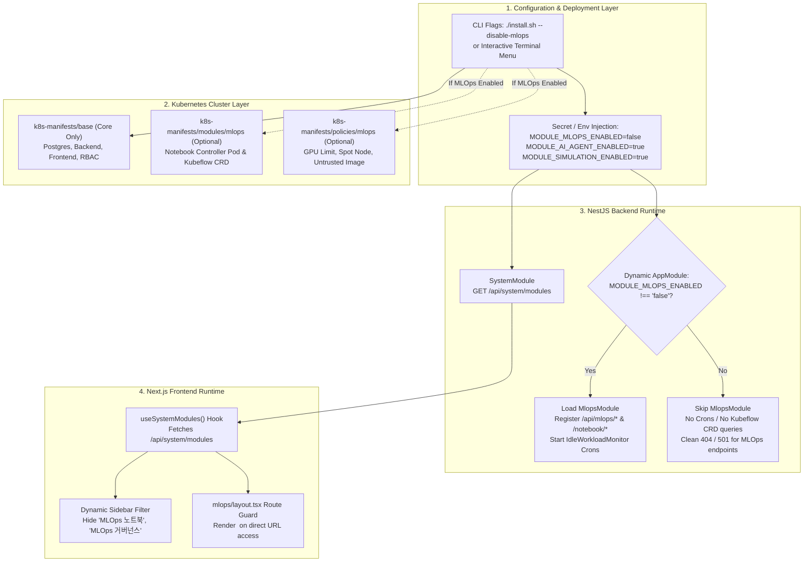

# Modular Component Architecture & Implementation Plan

## 1. Executive Context & Objectives

* **Target Audience**: AI agents and software engineers implementing modular component enablement/disablement in the **PaC Kyverno Governance Platform**.
* **Core Problem Statement**:
  Currently, all platform extensions—most notably the **MLOps Suite** (Kubeflow Notebooks, Pipelines, KServe Model Serving, GPU FinOps, and MLOps Kyverno Policies)—are bundled and deployed monolithically:
  1. `k8s-manifests/base/kustomization.yaml` hardcodes `notebook-controller.yaml`.
  2. `apps/backend/src/app.module.ts` statically imports `MlopsModule`, causing `IdleWorkloadMonitorService` crons to run and `KubeflowAdapter` to query Kubeflow CRDs even if the user never wanted MLOps or didn't install the CRDs.
  3. `apps/frontend/src/components/dashboard/dashboard-sidebar.tsx` unconditionally renders MLOps navigation links.
  4. `install.sh` / `scripts/deploy.sh` always deploys notebook controllers and applies `k8s-manifests/policies/mlops/`.
* **Objective**:
  Decouple optional platform components so operators and users can selectively enable or disable them (e.g., opting out of MLOps for a lightweight core governance deployment).
* **Guiding Principles**:
  1. **Single Container Portability**: Frontend and backend container images must NOT require separate builds for different module combinations. Feature detection occurs dynamically at runtime.
  2. **Backward Compatibility**: Default settings (`MODULE_MLOPS_ENABLED=true`) must preserve full functionality for existing deployments if no flags are passed.
  3. **Zero-Resource Footprint when Disabled**: When a component is disabled, no related CRDs, controller pods, or background cron intervals should be deployed or run in the cluster.

---

## 2. Platform Component Taxonomy

| Component ID | Component Name | Classification | In-Cluster Workloads & Policies | Backend Services & Routes | Frontend Routes & UI |
| :--- | :--- | :--- | :--- | :--- | :--- |
| **`core`** | Core Governance | **Mandatory** | `postgres`, `backend`, `frontend`, `rbac`, `policies/*.yaml` | Auth, Users, Policies, Violations, Exception Requests & Lifecycle, Audit Logs, Clusters, Health | `/dashboard`, `/policies`, `/violations`, `/exceptions`, `/clusters`, `/notifications`, `/admin/*` |
| **`mlops`** | MLOps Suite | **Optional** (Primary) | `notebook-controller`, `crds/kubeflow.org_notebooks.yaml`, `policies/mlops/*.yaml` | `MlopsModule`, `KubeflowAdapter`, `GpuQuotaService`, `IdleWorkloadMonitorService`, `PipelinesService`, `ServingService`, `/api/mlops/*`, `/notebook/*` | `/mlops/notebooks`, `/mlops/pipelines`, `/mlops/serving`, `/mlops/governance` |
| **`aiAgent`** | AI Policy Assistant | **Optional** | None (uses external AWS Bedrock API) | `AiAgentModule`, `BedrockService`, `WorkloadEvaluatorService`, `/api/ai-agent/*` | `/diagnostics` (Enforce AI Diagnostic), Copilot Drawers |
| **`simulation`** | Policy Simulation Lab | **Optional** | None | `SimulationModule`, `SimulationService`, `/api/simulation/*` | `/simulation` |
| **`gitops`** | GitOps PR Sync | **Optional** | None | `GitOpsModule`, `GitOpsService` | Background dual-path policy PR sync |

---

## 3. Architecture & Data Flow



---

## 4. Technical Specifications per Layer

### 4.1. Kubernetes Manifests & Kustomize Decoupling

#### Problem:
`k8s-manifests/base/kustomization.yaml` currently includes `notebook-controller.yaml`. This forces all environments (EKS and onprem) using `../../base` to deploy the Kubeflow Notebook Controller pod, demanding CPU/RAM and requiring the Kubeflow CRD.

#### Solution:
1. **Purge Base Manifest**: Remove `notebook-controller.yaml` from `k8s-manifests/base/kustomization.yaml`. Base must contain only core components (`namespace.yaml`, `rbac.yaml`, `postgres.yaml`, `backend.yaml`, `frontend.yaml`).
2. **Create MLOps Module Directory**:
   - Directory: `k8s-manifests/modules/mlops/`
   - Manifest: `k8s-manifests/modules/mlops/kustomization.yaml`
   - Resources referenced:
     - `../../base/notebook-controller.yaml` (or moved to `modules/mlops/notebook-controller.yaml`)
     - `../../crds/kubeflow.org_notebooks.yaml`
3. **Policies Segregation**:
   - `k8s-manifests/policies/*.yaml` (Core governance policies: disallow privileged containers, disallow latest tag, etc.)
   - `k8s-manifests/policies/mlops/*.yaml` (Only applied if MLOps is enabled).

---

### 4.2. Backend (NestJS) Dynamic Architecture

#### 4.2.1. System Module Specification (`apps/backend/src/system/`)
Create a new module to serve as the runtime single source of truth for platform capabilities.

* **Types (`system.types.ts`)**:
  ```typescript
  export type PlatformModuleId =
    | "core"
    | "mlops"
    | "aiAgent"
    | "simulation"
    | "gitops";

  export interface ModuleMetadata {
    id: PlatformModuleId;
    name: string;
    description: string;
    enabled: boolean;
    required: boolean;
  }

  export interface SystemModulesResponse {
    modules: Record<PlatformModuleId, ModuleMetadata>;
  }
  ```

* **Service (`system.service.ts`)**:
  ```typescript
  @Injectable()
  export class SystemService {
    private readonly modules: Record<PlatformModuleId, ModuleMetadata>;

    constructor(private readonly configService: ConfigService) {
      this.modules = {
        core: {
          id: "core",
          name: "Core Governance",
          description: "Kyverno policy engine, violations, exception requests, audit logs, and multi-cluster management.",
          enabled: true,
          required: true,
        },
        mlops: {
          id: "mlops",
          name: "MLOps Platform",
          description: "Kubeflow notebooks, pipelines, KServe model serving, and GPU FinOps governance.",
          enabled: this.configService.get("MODULE_MLOPS_ENABLED") !== "false",
          required: false,
        },
        aiAgent: {
          id: "aiAgent",
          name: "AI Policy Assistant",
          description: "AWS Bedrock Claude/Nova AI policy explanation and Enforce block diagnostics.",
          enabled: this.configService.get("MODULE_AI_AGENT_ENABLED") !== "false",
          required: false,
        },
        simulation: {
          id: "simulation",
          name: "Policy Simulation Lab",
          description: "Pre-deployment dry-run policy evaluation sandbox.",
          enabled: this.configService.get("MODULE_SIMULATION_ENABLED") !== "false",
          required: false,
        },
        gitops: {
          id: "gitops",
          name: "GitOps Policy Sync",
          description: "GitHub PR policy synchronization and automated reconciliation.",
          enabled: this.configService.get("MODULE_GITOPS_ENABLED") !== "false",
          required: false,
        },
      };
    }

    getModules(): SystemModulesResponse {
      return { modules: this.modules };
    }

    isModuleEnabled(moduleId: PlatformModuleId): boolean {
      return this.modules[moduleId]?.enabled ?? false;
    }
  }
  ```

* **Controller (`system.controller.ts`)**:
  ```typescript
  @ApiTags("System")
  @Controller("system")
  export class SystemController {
    constructor(private readonly systemService: SystemService) {}

    @Get("modules")
    @ApiOperation({ summary: "Get platform module enablement status" })
    getModules(): SystemModulesResponse {
      return this.systemService.getModules();
    }
  }
  ```

#### 4.2.2. Dynamic `AppModule` Import (`apps/backend/src/app.module.ts`)
Avoid registering `MlopsModule` when disabled:
```typescript
const isEnabled = (envVar: string, defaultVal = true): boolean => {
  const val = process.env[envVar];
  return val === undefined ? defaultVal : val.toLowerCase() !== "false";
};

const optionalModules: (Type<any> | DynamicModule)[] = [];

if (isEnabled("MODULE_MLOPS_ENABLED")) {
  optionalModules.push(MlopsModule);
}
if (isEnabled("MODULE_SIMULATION_ENABLED")) {
  optionalModules.push(SimulationModule);
}
if (isEnabled("MODULE_AI_AGENT_ENABLED")) {
  optionalModules.push(AiAgentModule);
}
if (isEnabled("MODULE_GITOPS_ENABLED")) {
  optionalModules.push(GitOpsModule);
}

@Module({
  imports: [
    ConfigModule.forRoot({ isGlobal: true }),
    PrismaModule,
    AuthModule,
    UsersModule,
    ExceptionRequestsModule,
    PoliciesModule,
    ViolationsModule,
    AuditLogsModule,
    NotificationsModule,
    HealthModule,
    SystemModule,
    ...optionalModules,
    LoggerModule.forRoot({ pinoHttp: createPinoHttpConfig() }),
  ],
  providers: [
    {
      provide: APP_FILTER,
      useClass: BusinessExceptionFilter,
    },
  ],
})
export class AppModule {}
```

---

### 4.3. Frontend (Next.js) Dynamic UX & Route Protection

#### 4.3.1. Frontend Module Client & Hook (`apps/frontend/src/lib/system-modules.ts`)
* Implements API client to query `/api/system/modules`.
* Exposes hook `useSystemModules()` with React Query / SWR / Zustand caching to prevent duplicate network calls.
* Returns helper method `isModuleEnabled(moduleId: string): boolean`.

#### 4.3.2. Sidebar Navigation Filtering (`apps/frontend/src/components/dashboard/dashboard-sidebar.tsx`)
Tag navigation definitions with optional `moduleId`:
```typescript
type NavigationItem = {
  label: string;
  href: string;
  icon: LucideIcon;
  moduleId?: "mlops" | "simulation" | "aiAgent";
};

const navigation: Record<"user" | "admin", NavigationItem[]> = {
  user: [
    { label: "대시보드", href: "/dashboard", icon: LayoutDashboard },
    { label: "정책 테스트 랩", href: "/simulation", icon: FlaskConical, moduleId: "simulation" },
    { label: "Enforce 차단 AI 진단", href: "/diagnostics", icon: Sparkles, moduleId: "aiAgent" },
    { label: "MLOps 노트북", href: "/mlops/notebooks", icon: Layers, moduleId: "mlops" },
    { label: "클러스터", href: "/clusters", icon: Server },
    { label: "정책", href: "/policies", icon: ShieldCheck },
    { label: "내 리소스 위반", href: "/violations", icon: FileWarning },
    { label: "예외 요청 목록", href: "/exceptions", icon: Files },
    { label: "예외 요청", href: "/exceptions/new", icon: FilePlus2 },
    { label: "알림", href: "/notifications", icon: BellRing },
  ],
  admin: [
    { label: "관리자 대시보드", href: "/admin/dashboard", icon: LayoutDashboard },
    { label: "정책 테스트 랩", href: "/simulation", icon: FlaskConical, moduleId: "simulation" },
    { label: "MLOps 노트북 관리", href: "/mlops/notebooks", icon: Layers, moduleId: "mlops" },
    { label: "MLOps 거버넌스", href: "/mlops/governance", icon: Coins, moduleId: "mlops" },
    { label: "클러스터 관리", href: "/admin/clusters", icon: Server },
    { label: "정책 관리", href: "/admin/policies", icon: ShieldCheck },
    { label: "사용자 관리", href: "/admin/users", icon: Users },
    { label: "정책 위반", href: "/admin/violations", icon: FileWarning },
    { label: "예외 관리", href: "/admin/exceptions", icon: FileClock },
    { label: "감사 로그", href: "/admin/audit-logs", icon: History },
    { label: "알림", href: "/notifications", icon: BellRing },
  ],
};
```
In component render:
```typescript
const { isModuleEnabled, isLoading } = useSystemModules();

const visibleItems = navigation[variant].filter((item) => {
  if (user?.role !== "ADMIN" && item.href === "/admin/users") return false;
  if (item.moduleId && !isModuleEnabled(item.moduleId)) return false;
  return true;
});
```

#### 4.3.3. Disabled Notice Component (`apps/frontend/src/components/ui/module-disabled-notice.tsx`)
Create a reusable card component:
* Title: "기능 비활성화 알림 (Feature Disabled)"
* Explanation: "현재 배포된 환경에서는 **${moduleName}** 모듈이 비활성화되어 있습니다."
* Operator guidance: "플랫폼 관리자에게 문의하거나 환경 변수 `MODULE_${MODULE}_ENABLED=true`를 설정하세요."
* CTA Button: "메인 대시보드로 이동" (`/dashboard`)

#### 4.3.4. Route Guard in MLOps Layout (`apps/frontend/src/app/mlops/layout.tsx`)
* Creates a client layout wrapper around `/mlops/*`.
* Checks `isModuleEnabled('mlops')`. If false, renders `<ModuleDisabledNotice module="mlops" />`.

---

### 4.4. Installer & Deployment Script Modularity (`install.sh` / `scripts/deploy.sh`)

#### 4.4.1. CLI Flags
Support explicit module controls:
```bash
  --enable-mlops              Enable MLOps component (default)
  --disable-mlops, --no-mlops Disable MLOps component
  --enable-ai / --disable-ai  Toggle AI Diagnostics component
  --enable-simulation / --disable-simulation Toggle Policy Simulation Lab
  --modules <list>            Explicit comma-separated module list (e.g., core,simulation)
```

#### 4.4.2. Interactive Prompt
When run interactively (`[ -t 0 ]`) and no explicit module flags are passed:
```text
=== Platform Module Configuration ===
Select platform modules to install:
[1] Core Governance (Kyverno, Policies, Violations, RBAC) [Required]
[2] MLOps Platform (Notebooks, Pipelines, Serving, GPU FinOps) [Y/n]: 
[3] AI Copilot & Diagnostics (AWS Bedrock) [Y/n]: 
[4] Policy Simulation Lab [Y/n]: 
```

#### 4.4.3. Conditional Manifest & Policy Application
```bash
# Apply Core Kustomize Overlay
log_info "Applying Core Kustomize overlay from: ${OVERLAY_DIR}"
"${KUBECTL}" apply -k "${OVERLAY_DIR}"

# Apply MLOps Extension if enabled
if [ "${ENABLE_MLOPS}" = true ]; then
  log_info "Deploying MLOps Module (Notebook Controller & Kubeflow CRDs)..."
  "${KUBECTL}" apply -k "${ROOT_DIR}/k8s-manifests/modules/mlops"
  if [ -d "${POLICIES_DIR}/mlops" ]; then
    log_info "Applying MLOps Kyverno policies..."
    "${KUBECTL}" apply -f "${POLICIES_DIR}/mlops/" || true
  fi
else
  log_info "MLOps Module is DISABLED. Skipping Notebook Controller and MLOps policies."
fi
```

#### 4.4.4. Environment Variable Injection
Pass `MODULE_MLOPS_ENABLED` (and others) into `kyverno-platform-secret`:
```bash
"${KUBECTL}" create secret generic kyverno-platform-secret \
  --namespace="${NAMESPACE}" \
  ... \
  --from-literal=MODULE_MLOPS_ENABLED="${ENABLE_MLOPS}" \
  --from-literal=MODULE_AI_AGENT_ENABLED="${ENABLE_AI}" \
  --from-literal=MODULE_SIMULATION_ENABLED="${ENABLE_SIMULATION}" \
  --from-literal=MODULE_GITOPS_ENABLED="${ENABLE_GITOPS}" \
  --dry-run=client -o yaml | "${KUBECTL}" apply -f -
```

---

## 5. Step-by-Step Implementation Sequence for Agents

Agents executing this plan should follow this atomic step sequence:

1. **Step 1: Manifest Refactoring**
   - Extract `notebook-controller.yaml` from `k8s-manifests/base/kustomization.yaml`.
   - Create `k8s-manifests/modules/mlops/kustomization.yaml` containing the controller and CRD.
   - Verify `kubectl kustomize k8s-manifests/base` renders without error and contains zero MLOps resources.
2. **Step 2: Backend System Module & Dynamic Imports**
   - Create `apps/backend/src/system/system.types.ts`, `system.service.ts`, `system.controller.ts`, `system.module.ts`.
   - Update `apps/backend/src/app.module.ts` to dynamically import `MlopsModule` and optional modules.
   - Add unit tests for `SystemService` and `SystemController`.
3. **Step 3: Frontend Runtime Discovery & Route Guard**
   - Create `apps/frontend/src/lib/system-modules.ts` and `useSystemModules()` hook.
   - Update `apps/frontend/src/components/dashboard/dashboard-sidebar.tsx` with module filtering.
   - Create `apps/frontend/src/components/ui/module-disabled-notice.tsx`.
   - Create `apps/frontend/src/app/mlops/layout.tsx` to guard all `/mlops/*` paths.
4. **Step 4: Deployment Scripts Enhancement**
   - Update `scripts/deploy.sh` and `install.sh` with CLI flags, interactive prompts, secret injection, and conditional manifest/policy application.
   - Update `redeploy.sh` to pass through flags.
5. **Step 5: Testing & Verification**
   - Test full mode (`--enable-mlops`).
   - Test minimal/core mode (`--disable-mlops`).
   - Verify zero regression on existing core policy testing workflows.

---

## 6. Operational Guidelines for Collaborating Agents

When creating commits or modifying code:
1. **Adhere to `.agents/AGENTS.md`**:
   - Commit message convention: Conventional Commits (`feat(modules): ...`, `refactor(k8s): ...`).
   - Author: `yeongrimGo-agy <yeongrimgo1106@pusan.ac.kr>`.
   - Always display commit details and request explicit user confirmation before executing `git commit`.
   - Keep communication concise and structured.
