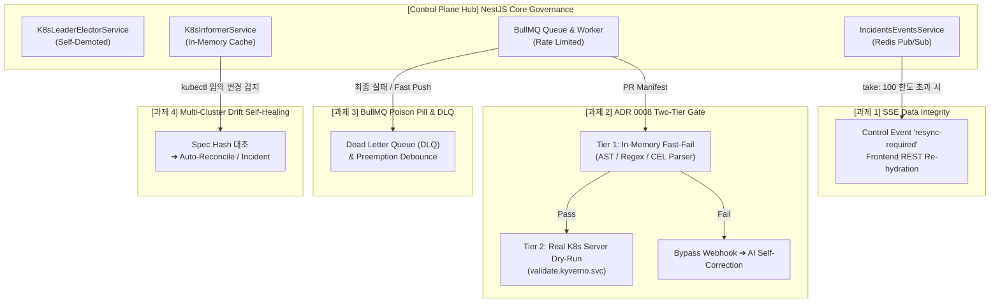

# 분산 정책 거버넌스 플랫폼 고도화 과제 분석 및 에이전트 작업 지시 프롬프트 통합 문서
(Advanced Governance Enhancements & Actionable Agent Prompts)

**문서 생성 일시**: 2026-09-16  
**대상 시스템**: PaC Kyverno Governance Platform  
**문서 목적**: 멀티 인스턴스 Scale-out 환경 전환 이후 식별된 4대 핵심 아키텍처 과제(이벤트 무결성, 2단계 정책 검증, 큐 신뢰성/DLQ, 멀티클러스터 드리프트 자가치유)에 대한 엔터프라이즈 모범 분석을 체계화하고, **다른 AI 에이전트 또는 엔지니어가 즉시 브랜치를 분기하여 작업에 착수할 수 있는 상세 Actionable `<TASK>` 프롬프트**를 제공합니다.

---

## 1. 아키텍처 개요 및 4대 고도화 과제 매핑

본 플랫폼은 K8s Lease 기반 리더 선출(ADR 0005), Redis Pub/Sub 기반 W3C SSE 실시간 브로드캐스트(ADR 0006), BullMQ 분산 작업 큐 및 Bedrock 레이트 리미팅(ADR 0007), 그리고 2단계 정책 검증 게이트(ADR 0008)를 통해 멀티 인스턴스 분산 플랫폼으로 누적 진화해왔습니다.

다음 단계의 핵심 목표는 **"이벤트 무결성 100% 보장"**, **"클러스터 웹훅 부하 70% 감축"**, **"작업 큐 안정성 및 비용 최적화"**, **"Spoke 클러스터 임의 조작에 대한 양방향 드리프트 자가치유"**입니다.



---

## 2. 4대 핵심 과제 심층 분석 및 엔터프라이즈 모범 대안

---

### 2.1. [과제 1] SSE 차분 동기화(Delta Hydration) 상한선 도달 시 이벤트 누락 방지

* **관련 모듈**:
  - 백엔드: [`apps/backend/src/incidents/incidents.service.ts`](file:///home/user/kyverno-dashboard/apps/backend/src/incidents/incidents.service.ts), [`apps/backend/src/incidents/incidents.controller.ts`](file:///home/user/kyverno-dashboard/apps/backend/src/incidents/incidents.controller.ts)
  - 프론트엔드: SSE 이벤트 구독 훅 및 상태 관리 저장소
* **문제 진단 및 리스크**:
  - 장기간(주말, 장기 오프라인) 단절된 클라이언트가 W3C `Last-Event-ID`를 들고 재연결할 때, OOM 방어를 위해 설정된 `take: 100` 상한선으로 인해 **100건을 초과하는 과거 이벤트는 조용히 버려지는 현상(Event Truncation)**이 발생합니다.
  - 프론트엔드는 100건만 부분 패치한 상태로 실시간 스트림(`realTime$`)에 즉각 연결되어, 101번째 이후의 이벤트가 영구 누락되는 대시보드 상태 불일치(State Inconsistency)가 발생합니다.
* **엔터프라이즈 모범 대안: Control Event 기반 Full Resync (Discord/Slack 게이트웨이 패턴)**:
  - `getIncidentsSince` 쿼리 결과가 정확히 100건(`take` 한도 도달)일 경우, 하이드레이션 스트림 말미에 특수 SSE 제어 이벤트(`event: resync-required`, `data: { reason: "buffer-overflow", lastEventId }`)를 발행합니다.
  - 프론트엔드는 이 이벤트를 수신하면 부분 패치를 중단하고 표준 REST API(`GET /api/v1/incidents?page=1`)를 호출하여 전체 목록을 안전하게 일괄 재동기화합니다.

---

### 2.2. [과제 2] ADR 0008: 2단계(Two-Tier) 정책 검증 게이트 실체화 및 CEL 엔진 통합

* **관련 모듈**:
  - 백엔드: [`apps/backend/src/simulation/simulation.service.ts`](file:///home/user/kyverno-dashboard/apps/backend/src/simulation/simulation.service.ts), [`apps/backend/src/ai-agent/rule-template.engine.ts`](file:///home/user/kyverno-dashboard/apps/backend/src/ai-agent/rule-template.engine.ts), [`apps/backend/src/gitops/gitops.service.ts`](file:///home/user/kyverno-dashboard/apps/backend/src/gitops/gitops.service.ts)
* **문제 진단 및 리스크**:
  - ADR 0008에 아키텍처가 정의되었으나 아직 실제 검증 파이프라인에 결합되지 않아, 모든 PR 검증 요청이 대상 EKS 클러스터의 API Server 및 Kyverno Admission Webhook(`validate.kyverno.svc`)으로 직접 전달됩니다.
  - 마이크로서비스 팀의 동시 다발적 PR 생성 시, 쿠버네티스 Admission Webhook 기본 타임아웃(10초) 초과(`HTTP 504`) 및 EKS APF(API Priority and Fairness) 429 스로틀링 위험에 상시 노출됩니다.
* **엔터프라이즈 모범 대안: AST Pre-Filter ➔ CEL In-Memory Validator (Zero-False-Negative)**:
  - `SimulationService.validateManifestDryRun` 진입부에 **Tier 1 (인메모리 Fast-Fail)** 관문을 배치합니다.
  - 필수 라벨 누락, `privileged: true`, `runAsNonRoot: false`, CPU/Memory limit 누락 등 정형화된 Pod Security Standards(PSS) 8종 룰을 1~5ms 내에 로컬 메모리에서 선행 검증합니다.
  - Tier 1 위반 발생 시 실제 K8s Webhook 호출을 100% 생략하고 곧바로 AI 자가 교정 루프로 라우팅합니다.
  - Tier 1을 통과한 매니페스트만 최종 권위 관문인 Tier 2(실제 K8s Dry-Run)로 전달하므로 오판(False Negative) 위험이 0%입니다.

---

### 2.3. [과제 3] BullMQ Dead Letter Queue (DLQ) 격리 및 커밋 SHA 기반 디바운스/선점 취소

* **관련 모듈**:
  - 백엔드: [`apps/backend/src/gitops/queues/gitops-pr-review.queue.ts`](file:///home/user/kyverno-dashboard/apps/backend/src/gitops/queues/gitops-pr-review.queue.ts), [`apps/backend/src/gitops/queues/gitops-pr-review.worker.ts`](file:///home/user/kyverno-dashboard/apps/backend/src/gitops/queues/gitops-pr-review.worker.ts)
* **문제 진단 및 리스크**:
  - 지수 백오프 3회 재시도를 수행하지만, AWS Bedrock 지속 장애 또는 매니페스트 파싱 불가(Poison Pill)로 인해 최종 3회 모두 실패할 경우 작업이 `failed` 상태로 큐에 방치되며 관리자 알림이나 재처리(Re-drive) 수단이 부재합니다.
  - 개발자가 동일 PR에 빠른 속도로 연속 커밋을 푸시할 때, 이전 커밋의 대기 중(`waiting`)인 작업이 취소되지 않고 중복 처리되어 Bedrock API Quota와 비용을 낭비합니다.
* **엔터프라이즈 모범 대안: Dedicated DLQ & Preemptive Cancellation**:
  - 3회 최종 실패 시 작업을 `gitops-pr-review-dlq`로 자동 이동하고, GitHub Check Run을 `conclusion: failure`로 안전하게 종결 처리한 후 관리자 알림을 발행합니다.
  - 동일 PR(`repo + pullNumber`)에 신규 커밋 작업이 Enqueue되면, 동일 PR의 `waiting` 상태인 이전 작업들을 찾아 `job.remove()`로 즉각 취소(Preemption)합니다.

---

### 2.4. [과제 4] Spoke 클러스터 정책 드리프트(Drift) 감지 및 Informer 기반 양방향 Self-Healing

* **관련 모듈**:
  - 백엔드: [`apps/backend/src/kubernetes/k8s-informer.service.ts`](file:///home/user/kyverno-dashboard/apps/backend/src/kubernetes/k8s-informer.service.ts), [`apps/backend/src/exception-lifecycle/exception-reconciler.service.ts`](file:///home/user/kyverno-dashboard/apps/backend/src/exception-lifecycle/exception-reconciler.service.ts)
* **문제 진단 및 리스크**:
  - Hub 백엔드가 Spoke 클러스터로 `PolicyException` 및 거버넌스 정책을 배포하지만, Spoke 현장 엔지니어가 긴급 상황에서 `kubectl edit/delete`로 클러스터 리소스를 임의 조작(Out-of-band mutation)할 경우 Hub DB와 런타임 간의 정합성이 붕괴됩니다.
* **엔터프라이즈 모범 대안: Informer Spec SHA-256 Hash Auditing & Auto-Heal**:
  - `K8sInformerService`의 `changeListeners`에 `PolicyException` 및 `ClusterPolicy` 리소스의 `update/delete` 이벤트를 감시하는 Reconciler를 등록합니다.
  - 수신된 CRD의 `spec` SHA-256 해시를 계산하여 Hub DB의 원본 해시와 대조하고, 미승인 변경 감지 시 즉시 Hub 원본으로 강제 덮어쓰기(Auto-Heal)하거나 "미승인 정책 변조 인시던트"를 자동 발행합니다.

---

## 3. 에이전트 실행용 4대 Actionable Task 프롬프트

각 과제는 독립된 브랜치에서 개발 및 단위 테스트 검증을 완료한 후, 순차적으로 상위 브랜치에 Rebase 전파하는 워크플로우를 권장합니다.

```text
[Stack Sequence]
Base (main)
  ├── Task 1: feat/sse-delta-resync-control
  ├── Task 2: feat/two-tier-fast-fail-gate
  ├── Task 3: feat/bullmq-dlq-and-debounce
  └── Task 4: feat/multi-cluster-drift-reconciliation
```

---

### 3.1. [Task 1] SSE 차분 동기화 상한선 도달 시 Resync 제어 이벤트 발행

```markdown
<TASK>
브랜치: feat/sse-delta-resync-control
목표: IncidentsService.getIncidentsSince가 100건 상한선에 도달했을 때 데이터 유실을 방지하기 위해 'event: resync-required' 제어 이벤트를 발행하고 클라이언트 재동기화를 유도합니다.

[요구사항]
1. `apps/backend/src/incidents/incidents.service.ts`:
   - `getIncidentsSince`의 반환 타입을 객체 구조로 확장하거나 메타데이터를 포함합니다:
     ```typescript
     export interface IncidentsDeltaResultDto {
       items: DeploymentIncidentDto[];
       hasMore: boolean; // items.length >= 100 인 경우 true
       lastEventId?: string;
     }
     ```
   - 기존 하위 호환성을 위해 `getIncidentsSince`가 `IncidentsDeltaResultDto`를 반환하도록 업데이트합니다.
   - `take: 100`으로 조회된 결과의 길이가 100인 경우 `hasMore: true`로 마킹합니다.

2. `apps/backend/src/incidents/incidents.controller.ts`:
   - `subscribeEvents` SSE 핸들러에서 `hydration$` 스트림을 파이프라인할 때:
     * `deltaResult.hasMore === true`인 경우, 하이드레이션 스트림의 마지막 항목으로 다음 특수 제어 MessageEvent를 방출합니다:
       ```typescript
       {
         type: "resync-required",
         data: {
           reason: "DELTA_BUFFER_OVERFLOW",
           message: "Disconnected duration exceeded delta buffer. Full re-synchronization required.",
           count: deltaResult.items.length,
         }
       }
       ```
     * 이를 통해 클라이언트(프론트엔드)가 이벤트를 감지하고 `GET /api/v1/incidents`를 호출하여 안전하게 전체 목록을 재조회할 수 있도록 합니다.

3. 단위 테스트 보강:
   - `apps/backend/src/incidents/incidents.service.spec.ts`:
     * 100건의 인시던트가 조회되었을 때 `hasMore: true`가 반환되는지 검증하는 테스트 추가.
   - `apps/backend/src/incidents/incidents.controller.spec.ts`:
     * `hasMore: true`일 때 `resync-required` 타입의 MessageEvent가 스트림에 포함되는지 RxJS 마블/배열 테스트 추가.

4. Conventional Commits 형식으로 사전 보고 후 커밋합니다:
   - 커밋 메시지: `feat(incidents): add resync-required SSE control event when delta hydration exceeds limit`
</TASK>
```

---

### 3.2. [Task 2] ADR 0008: 2단계(Two-Tier) 인메모리 Fast-Fail 정책 검증 게이트 구현

```markdown
<TASK>
브랜치: feat/two-tier-fast-fail-gate
목표: ADR 0008에 따라 SimulationService에 인메모리 Fast-Fail 관문(Tier 1)을 도입하여, K8s Admission Webhook 부하를 선제적으로 60~70% 감축합니다.

[요구사항]
1. `apps/backend/src/simulation/fast-fail/in-memory-fast-fail.engine.ts` (신규 파일 생성):
   - Kyverno 핵심 PSS 룰 6종을 로컬 AST/정규식으로 평가하는 경량 Fast-Fail 엔진 클래스 구현:
     * `disallow-privileged-containers`: `securityContext.privileged === true` 검사
     * `require-non-root-user`: `runAsNonRoot === false` 또는 `runAsUser === 0` 검사
     * `require-resource-limits`: `resources.limits.cpu` 또는 `resources.limits.memory` 누락 검사
     * `disallow-latest-tag`: 컨테이너 이미지 태그가 `:latest`이거나 태그가 생략된 경우 검사
     * `require-standard-labels`: `metadata.labels['app.kubernetes.io/name']` 누락 검사
   - 검사 시그니처:
     ```typescript
     evaluateResource(obj: KubernetesObject): KyvernoViolationDetail[]
     ```
   - 순수 인메모리 연산으로 수행되어 응답 시간 1~3ms 보장.

2. `apps/backend/src/simulation/simulation.service.ts`:
   - `InMemoryFastFailEngine`을 주입받아 `validateManifestDryRun`의 리소스 순회 루프 시작부에 배치:
     * 파싱된 각 `k8sObjects`에 대해 `this.fastFailEngine.evaluateResource(obj)`를 선행 실행.
     * Tier 1 위반이 1건 이상 발견되면:
       - 실제 K8s API Server(`objectApi.create({ ... dryRun: 'All' })`) 호출을 완전히 건너뜁니다 (Bypass Webhook).
       - 해당 리소스의 결과를 즉시 `dryRunPassed: false`, `blocked: true`, `violations`에 Tier 1 위반 상세를 매핑하여 반환.
     * Tier 1 위반이 없는 리소스에 대해서만 Tier 2(실제 K8s `dryRun: ['All']`)를 호출하여 최종 검증.

3. 단위 테스트 작성:
   - `apps/backend/src/simulation/fast-fail/in-memory-fast-fail.engine.spec.ts`:
     * Privileged, latest 태그, 라벨 누락 리소스에 대해 정확히 위반 항목을 반환하는지 테스트.
   - `apps/backend/src/simulation/simulation.service.spec.ts`:
     * Tier 1 위반 리소스에 대해 `objectApi.create`가 호출되지 않고 즉각 차단 결과가 반환되는지 Mock 호출 여부 검증.

4. Conventional Commits 형식으로 사전 보고 후 커밋합니다:
   - 커밋 메시지: `feat(simulation): implement Tier-1 in-memory fast-fail gate for ADR 0008`
</TASK>
```

---

### 3.3. [Task 3] BullMQ Dead Letter Queue (DLQ) 격리 및 선점 디바운스(Preemption) 구현

```markdown
<TASK>
브랜치: feat/bullmq-dlq-and-debounce
목표: BullMQ 작업 큐에 3회 최종 실패 작업 격리용 Dead Letter Queue(DLQ)를 신설하고, 동일 PR 신규 푸시 시 이전 대기 작업을 선점 취소하는 디바운스를 적용합니다.

[요구사항]
1. `apps/backend/src/gitops/queues/gitops-pr-review.queue.ts`:
   - 동일 PR 이전 대기 작업 선점 취소(Preemption/Debounce) 로직 추가:
     * `addReviewJob(dto, checkRunId)` 실행 시, 현재 큐에서 `waiting` 상태의 작업 목록을 조회(`await this.queue.getJobs(['waiting'])`).
     * 조회된 작업 중 `job.data.dto.repository === dto.repository && job.data.dto.pullNumber === dto.pullNumber` 매칭되는 이전 작업이 존재하면 즉시 `await oldJob.remove()` 호출하여 큐에서 제거.
     * 로그 출력: `[BullMQ] Preempted older pending job #${oldJob.id} for PR #${dto.pullNumber}`

2. `apps/backend/src/gitops/queues/gitops-pr-review.worker.ts`:
   - DLQ 지원:
     * `GITOPS_PR_REVIEW_DLQ_NAME = 'gitops-pr-review-dlq'` 큐 인스턴스를 옵셔널 주입 또는 내부 초기화.
     * `processJob`의 catch 블록에서 `job.attemptsMade >= (job.opts?.attempts || 3) - 1` (최종 재시도 실패) 도달 시:
       - 실패 상세 정보(에러 메시지, 스택, 실패 시각, 원본 DTO)를 패키징하여 DLQ 큐에 Enqueue:
         ```typescript
         await this.dlqQueue.add('failed-review', {
           originalJobId: job.id,
           dto,
           checkRunId,
           failedReason: err.message,
           failedAt: new Date().toISOString(),
         });
         ```
       - Check Run을 `conclusion: 'failure'` 및 요약 정보로 종결 처리.
       - 치명적 실패 경고 로그 출력.

3. 단위 테스트 보강:
   - `apps/backend/src/gitops/queues/gitops-pr-review.queue.spec.ts`:
     * 동일 PR의 새 작업 등록 시 이전 `waiting` 작업이 `remove()`되는지 검증.
   - `apps/backend/src/gitops/queues/gitops-pr-review.worker.spec.ts`:
     * 3회 실패 시 DLQ 큐에 작업이 등록되고 Check Run이 failure로 마결되는지 검증.

4. Conventional Commits 형식으로 사전 보고 후 커밋합니다:
   - 커밋 메시지: `feat(gitops): implement BullMQ DLQ routing and commit preemption debounce`
</TASK>
```

---

### 3.4. [Task 4] Spoke 클러스터 정책 드리프트 감지 및 양방향 Self-Healing 엔진

```markdown
<TASK>
브랜치: feat/multi-cluster-drift-reconciliation
목표: Spoke 클러스터 현장에서 kubectl로 직접 수행된 미승인 변경(Out-of-band mutation)을 Informer 이벤트로 실시간 감지하고 원복하거나 인시던트로 등록하는 Self-Healing 엔진을 구현합니다.

[요구사항]
1. `apps/backend/src/kubernetes/reconciler/policy-drift-detector.service.ts` (신규 서비스 생성):
   - `K8sInformerService`의 `registerChangeListener`를 구독하여 `policyexceptions` 리소스의 `update` 및 `delete` 이벤트 청취.
   - SHA-256 해시 계산 헬퍼 구현:
     * `computeSpecHash(spec: unknown): string`: 리소스의 `spec` 필드를 정렬된 JSON 문자열로 직렬화 후 SHA-256 해시 생성.
   - `handleResourceMutation(clusterId, resourceType, eventType, obj)`:
     * 1) 클러스터에서 수신된 `PolicyException`의 `spec` 해시 계산.
     * 2) Hub DB(`prisma.policyExceptionRequest`)에 저장된 승인 당시의 원본 매니페스트 해시와 대조.
     * 3) 해시 불일치 또는 임의 삭제 감지 시:
       - 경고 로그 출력: `[DriftDetector] Out-of-band mutation detected on ${clusterId}/${obj.metadata.name}`
       - `incidentsService.recordAdmissionBlock` 또는 신규 인시던트 등록 메서드를 호출하여 "UNAUTHORIZED_POLICY_MUTATION" 인시던트 생성.
       - (Auto-Heal 모드 활성화 시) Hub DB 원본 매니페스트를 타겟 클러스터에 즉각 재적용(`k8sPublisherService.publishManifest`).

2. `apps/backend/src/kubernetes/kubernetes.module.ts`:
   - `PolicyDriftDetectorService`를 프로바이더 및 온모듈이닛 리스너로 등록.

3. 단위 테스트 작성:
   - `apps/backend/src/kubernetes/reconciler/policy-drift-detector.service.spec.ts`:
     * 미승인 spec 변경 이벤트 수신 시 해시 불일치를 정확히 판별하는지 테스트.
     * 불일치 감지 시 인시던트 등록 서비스가 호출되는지 검증.

4. Conventional Commits 형식으로 사전 보고 후 커밋합니다:
   - 커밋 메시지: `feat(kubernetes): implement out-of-band policy drift detection and auto-healing`
</TASK>
```

---

## 4. 실행 가이드라인 및 검증 원칙

1. **사전 검증 필수 원칙**:
   - 각 브랜치 작업 완료 후 `pnpm --filter @kyverno-platform/backend test`를 실행하여 기존 73개 테스트 스위트, 518개 단위 테스트가 100% 통과하는지 검증합니다.
2. **커밋 규격 및 사전 보고**:
   - 커밋 메시지는 Conventional Commits v1.0.0 명세를 엄격히 준수합니다.
   - 커밋 전 작업 내역과 메시지를 사용자에게 사전 보고합니다.
3. **스택 브랜치 전파 순서**:
   - Task 1 ➡️ Task 2 ➡️ Task 3 ➡️ Task 4 순으로 순차 체크아웃 및 git rebase를 통해 상위 브랜치로 안정적으로 전파합니다.
