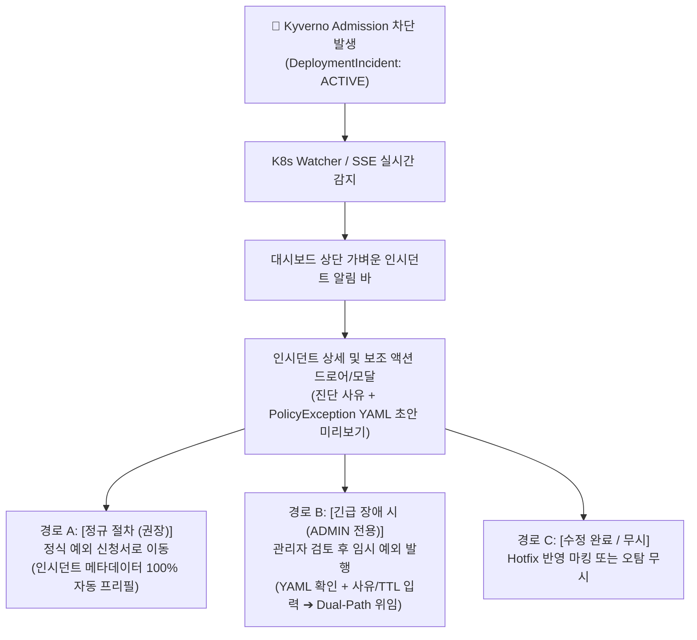

# Phase 3 인시던트 긴급 복구(Dual-Path) 착수 계획서: 보조 플랫폼(Assisted Operator) 관점의 현실적 설계

> **문서 식별자**: `PLAN-GITOPS-PHASE-3-ASSISTED`  
> **상태**: `READY_FOR_IMPLEMENTATION`  
> **설계 원칙**: **"Too Ambitious한 원클릭 블랙박스 지양, 투명하고 안전한 운영자 보조도구(Assisted Tool) 지향"**  
> **관련 모듈**:  
> - Backend: [`apps/backend/src/incidents/`](file:///home/user/kyverno-dashboard/apps/backend/src/incidents/), [`apps/backend/src/gitops/`](file:///home/user/kyverno-dashboard/apps/backend/src/gitops/), [`apps/backend/src/exception-requests/`](file:///home/user/kyverno-dashboard/apps/backend/src/exception-requests/)  
> - Frontend: [`apps/frontend/src/components/dashboard/`](file:///home/user/kyverno-dashboard/apps/frontend/src/components/dashboard/), [`apps/frontend/src/app/dashboard/`](file:///home/user/kyverno-dashboard/apps/frontend/src/app/dashboard/), [`apps/frontend/src/app/exceptions/new/`](file:///home/user/kyverno-dashboard/apps/frontend/src/app/exceptions/new/)

---

## 1. 배경 및 방향성 재정의 (Philosophy & Scope)

### 1.1. 초기 계획의 한계점과 위험성
초기 Phase 3 계획의 **"버튼 클릭 한 번으로 K8s 클러스터 런타임 주입 + GitOps PR 자동 생성"**은 데모에는 이상적이나, 실제 엔터프라이즈 환경에서는 다음과 같은 리스크를 수반합니다:
1. **블랙박스 우회 위험**: 무엇이 예외 처리되는지(대상 리소스, 네임스페이스, 룰) 사람이 확인하지 않고 단 1회 클릭으로 임시 예외가 배포되면 보안 구멍이 발생합니다.
2. **잘못된 습관 조장**: 배포 차단 인시던트의 80%는 "개발자의 매니페스트 오작성(Hotfix 대상)"입니다. 무조건 예외를 뚫어주는 방식은 플랫폼의 거버넌스 취지에 반합니다.
3. **복잡한 롤백/드리프트 오버헤드**: 런타임에 직접 찔러넣고 사후에 GitOps PR 거절 여부를 감시하며 롤백하는 무거운 백그라운드 스케줄러는 시스템 복잡도를 과도하게 높입니다.

### 1.2. 보조 플랫폼(Assisted Tool)으로서의 핵심 방향
본 플랫폼은 **"결정을 대신 내려주는 자율 에이전트"**가 아니라, **"운영자와 개발자가 빠르고 안전하게 판단하도록 돕는 거버넌스 코파일럿(Copilot)"**이어야 합니다.

---

## 2. 3대 보조 워크플로우 (Three Guided Paths)

### 경로 A: [정식 절차 (안전 제일 권장)] 예외 신청서 프리필 연계
* **목적**: 긴급하지 않거나 비즈니스적 예외 승인이 필요한 경우, 플랫폼의 정식 거버넌스 파이프라인으로 유도.
* **보조 방식**:
  - 인시던트 드로어에서 `[📝 정식 예외 신청하기]` 클릭 시 기존 [`apps/frontend/src/app/exceptions/new/page.tsx`](file:///home/user/kyverno-dashboard/apps/frontend/src/app/exceptions/new/page.tsx)로 즉각 라우팅.
  - URL Query Param(`cluster`, `namespace`, `resource`, `kind`, `policy`, `rule`, `repo`, `pr`, `incidentId`)이 완벽히 채워져 개발자가 폼을 다시 입력할 필요 없이 사유만 적어 제출 가능.

### 경로 B: [긴급 운영자 모드] 관리자 확인(Confirmation) 기반 Dual-Path 임시 완화
* **목적**: 서비스 장애 등 배포 지연이 치명적인 상황에서 관리자 권한을 가진 운영자가 통제 하에 배포를 즉시 재개.
* **보조 방식**:
  - 시스템이 사전에 조립한 `PolicyException` YAML 미리보기(Preview)를 제공.
  - 관리자가 **유효시간(TTL: 기본 24시간, 4h~72h)** 및 **긴급 발행 사유**를 확인 및 입력.
  - 발행 승인 시 기존에 안정적으로 검증된 [`GitOpsPublisherService.publishManifest`](file:///home/user/kyverno-dashboard/apps/backend/src/gitops/gitops-publisher.service.ts)를 호출:
    1. 타겟 클러스터에 런타임 직접 적용(Dynamic Apply)하여 ArgoCD가 수 초 내에 배포 통과.
    2. GitOps 저장소에 해당 예외 매니페스트 PR을 백그라운드로 자동 발급하여 형상 추적성 확보.
  - 인시던트 상태를 `RESOLVED_BY_EXCEPTION`으로 갱신.

### 경로 C: [개발자 조치 완료 / 오탐] Hotfix 종결 및 무시
* **목적**: 개발자가 Git PR이나 매니페스트를 수정(Hotfix)하여 재배포했거나, 단순 테스트 환경에서의 오탐인 경우.
* **보조 방식**:
  - `[✅ Hotfix 해결 완료]` 또는 `[무시(Ignore)]` 버튼을 통해 인시던트를 수동 종결(`RESOLVED_BY_HOTFIX` / `IGNORED`).
  - 감사 로그(AuditLog)에 조치자 및 사유 기록.

---

## 3. 세부 구현 작업 명세서 (Work Breakdown Structure)

### Phase 3.1: 백엔드 보조 API 및 상태 전이 엔드포인트
* **대상 모듈**: [`apps/backend/src/incidents/`](file:///home/user/kyverno-dashboard/apps/backend/src/incidents/)
1. **DTO 정의**:
   - `RemediationDraftDto`: 인시던트 기반 생성된 `suggestedExceptionYaml`, `remediationGuide`, `autoFillUrl` 제공.
   - `EmergencyRemediateDto`: `ttlHours` (기본 24), `reason` (필수), `publishToGitOps` (기본 true).
   - `ResolveHotfixDto`: `commitSha` (선택), `note` (선택).
2. **`IncidentsService` 비즈니스 로직 추가**:
   - `getRemediationDraft(user, id)`:
     - 인시던트의 리소스/정책 정보를 [`buildPolicyExceptionManifest`](file:///home/user/kyverno-dashboard/apps/backend/src/kubernetes/policy-exception-manifest.ts)에 넘겨 YAML 초안 생성.
     - 프론트엔드 프리필용 쿼리스트링 생성.
   - `remediateEmergency(user, id, dto)`:
     - `ADMIN` 권한 검증.
     - `GitOpsPublisherService`와 결합하여 클러스터 주입 및 GitOps PR 생성.
     - `DeploymentIncident` 상태 `RESOLVED_BY_EXCEPTION` 전이 및 감사 로그 생성.
     - `incidentsEventsService.emitIncidentUpdated()` 호출 (실시간 SSE 반영).
   - `resolveByHotfix(user, id, dto)`:
     - `DeploymentIncident` 상태 `RESOLVED_BY_HOTFIX` 전이.
3. **`IncidentsController` 엔드포인트 노출**:
   - `GET /api/v1/incidents/:id/remediation-draft`
   - `POST /api/v1/incidents/:id/remediate-emergency`
   - `POST /api/v1/incidents/:id/resolve-hotfix`
4. **단위 테스트 작성**:
   - `incidents.service.spec.ts` & `incidents.controller.spec.ts` 신규 메서드 100% 테스트.

### Phase 3.2: 프론트엔드 API 레이어 및 상태 관리
* **대상 위치**: `apps/frontend/src/lib/incidents-api.ts`
1. API 클라이언트 함수 작성:
   - `listIncidents(params)`
   - `getIncidentById(id)`
   - `getIncidentRemediationDraft(id)`
   - `remediateIncidentEmergency(id, body)`
   - `resolveIncidentHotfix(id, body)`
   - `ignoreIncident(id, body)`
2. 실시간 SSE 훅 연동 (`useIncidentsStream` 또는 기존 알림 스토어 결합).

### Phase 3.3: 프론트엔드 UI (미니멀 알림 바 & 보조 드로어)
* **대상 컴포넌트**:
1. [`apps/frontend/src/components/dashboard/incident-alert-banner.tsx`](file:///home/user/kyverno-dashboard/apps/frontend/src/components/dashboard/incident-alert-banner.tsx) (신규):
   - 활성(`ACTIVE`) 인시던트가 1개 이상 존재할 때만 대시보드 상단에 심플하고 세련된 앰버/레드 배너 표시:
     *"🚨 클러스터 배포 차단 인시던트 N건이 감지되었습니다. (조치 가이드 확인)"*
   - 인시던트가 없으면 0픽셀로 접힘 (화면 방해 없음).
2. [`apps/frontend/src/components/dashboard/incident-remediation-drawer.tsx`](file:///home/user/kyverno-dashboard/apps/frontend/src/components/dashboard/incident-remediation-drawer.tsx) (신규):
   - 차단된 인시던트 목록 및 선택 시 상세 정보 표시.
   - 상단: 차단 원인 분석 (어떤 정책의 어떤 룰에 걸렸는지, ArgoCD 앱 및 리소스 명).
   - 중단: 3대 액션 탭/버튼
     - **탭 1 (추천)**: `정식 예외 신청` (원클릭 프리필 링크)
     - **탭 2 (관리자 전용)**: `긴급 임시 예외 발행` (생성될 YAML 뷰어 + TTL 슬라이더 + 사유 입력 + [확인 후 발행] 버튼)
     - **탭 3**: `Hotfix 반영 완료 처리`
3. [`apps/frontend/src/app/dashboard/page.tsx`](file:///home/user/kyverno-dashboard/apps/frontend/src/app/dashboard/page.tsx) 및 [`apps/frontend/src/app/admin/dashboard/page.tsx`](file:///home/user/kyverno-dashboard/apps/frontend/src/app/admin/dashboard/page.tsx):
   - 상단에 `IncidentAlertBanner` 배치.

---

## 4. 기존 에셋 재사용 및 구현 효율성 (Zero Reinventing)

본 계획은 기존 코드를 최대한 활용하여 개발 공수를 최소화합니다:
1. **YAML 빌더**: 기존 [`apps/backend/src/kubernetes/policy-exception-manifest.ts`](file:///home/user/kyverno-dashboard/apps/backend/src/kubernetes/policy-exception-manifest.ts)의 `buildPolicyExceptionManifest` 100% 재사용.
2. **Dual-Path 발행기**: 기존 [`apps/backend/src/gitops/gitops-publisher.service.ts`](file:///home/user/kyverno-dashboard/apps/backend/src/gitops/gitops-publisher.service.ts)의 `applyRuntimeDirectly` 및 `createGitHubPullRequest` 100% 재사용.
3. **프론트엔드 프리필**: 기존 [`apps/frontend/src/app/exceptions/new/page.tsx`](file:///home/user/kyverno-dashboard/apps/frontend/src/app/exceptions/new/page.tsx)에 구축된 URL 쿼리 파싱 로직 100% 재사용.
4. **DB 스키마**: 이미 마이그레이션된 [`DeploymentIncident`](file:///home/user/kyverno-dashboard/apps/backend/prisma/schema.prisma) 모델 및 `IncidentStatus` 열거형 100% 재사용 (추가 DB 마이그레이션 불필요).

---

## 5. 단계별 실행 일정 및 커밋 계획

| 단계 | 작업 내용 | 예상 커밋 메시지 (사전 보고 대상) |
| :--- | :--- | :--- |
| **Step 1** | 백엔드 Remediation Draft 및 상태 전이 엔드포인트 구현 | `feat(incidents): add assisted remediation draft and resolution endpoints` |
| **Step 2** | 백엔드 단위 테스트 보강 및 검증 | `test(incidents): add unit tests for assisted remediation workflows` |
| **Step 3** | 프론트엔드 API 클라이언트 및 인시던트 배너/드로어 UI 구현 | `feat(frontend): add incident alert banner and guided remediation drawer` |
| **Step 4** | E2E 연동 검증 및 동작 확인 | `test(demo): verify assisted incident remediation flow` |
