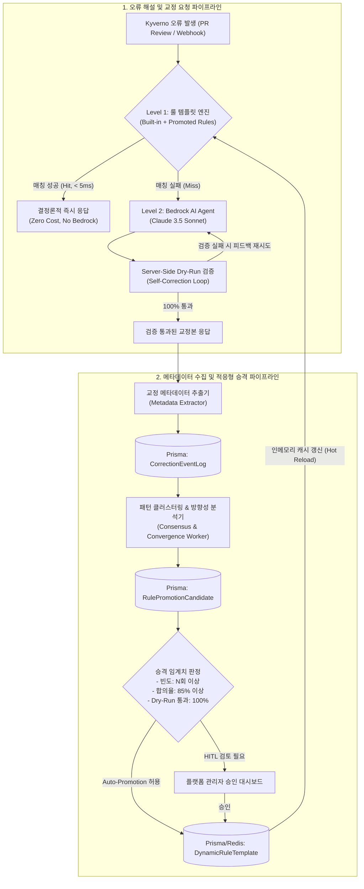

# Metadata-Driven Adaptive Rule Promotion Engine Architecture & Implementation Plan
(메타데이터 기반 적응형 룰 프로모션 엔진 아키텍처 및 구현 계획)

> **문서 식별자**: `PLAN-AI-ADAPTIVE-RULE-PROMOTION`  
> **상태**: `PROPOSED` / `DRAFT`  
> **대상 컴포넌트**:  
>   - Backend: `apps/backend/src/ai-agent/` (`KyvernoRuleTemplateEngine`, `AiAgentService`)  
>   - Backend: `apps/backend/src/gitops/` (`GitOpsService`)  
>   - Backend: `apps/backend/src/simulation/` (`SimulationService`)  
>   - Database: `apps/backend/prisma/schema.prisma` (새로운 메타데이터 및 룰 모델)  
>   - Frontend: `apps/frontend/src/app/admin/rule-promotion/` (거버넌스 검토 UI)  
> **적용 표준**: [`.agents/AGENTS.md`](../.agents/AGENTS.md), [`.agents/BACKEND_STANDARDS.md`](../.agents/BACKEND_STANDARDS.md)

---

## 1. 개요 및 배경 (Executive Summary & Background)

### 1.1. 현재 시스템의 한계와 기회
1. **고비용·고지연 LLM 의존성**:  
   현재 [`AiAgentService`](file:///home/user/kyverno-dashboard/apps/backend/src/ai-agent/ai-agent.service.ts)는 Kyverno 정책 위반에 대한 분석 및 매니페스트 수정본(`suggestedFixYaml`) 생성을 AWS Bedrock(Claude)에 의존하고 있습니다. 이는 1회 호출당 수 초~수십 초의 대기 시간(Latency)과 지속적인 API 호출 비용을 발생시킵니다.
2. **정적 룰 템플릿의 확장성 한계**:  
   오프라인 폴백을 담당하는 [`KyvernoRuleTemplateEngine`](file:///home/user/kyverno-dashboard/apps/backend/src/ai-agent/rule-template.engine.ts)은 1ms 미만의 초고속 응답을 제공하지만, 소스코드에 하드코딩된 정적 정규식 규칙에 국한되어 클러스터 환경별 특화 정책이나 새로운 위반 패턴을 능동적으로 학습하지 못합니다.
3. **검증된 성공 데이터의 지속적 발생**:  
   Phase 1에서 구축된 **GitOps Self-Correction Loop**와 **Simulation Dry-Run 검증 엔진**을 통해, "실제 쿠버네티스 클러스터 Kyverno 웹훅을 100% 무오류로 통과한 검증된 수정본(Fix YAML)" 데이터가 지속적으로 축적되고 있습니다.

### 1.2. 핵심 목적 (Objective)
> **"동일한 Kyverno 위반 패턴에 대해 Server-Side Dry-Run 검증을 통과한 AI 교정 메타데이터를 수집·클러스터링하고, 통계적 임계치(Threshold) 이상의 합의(Consensus)가 형성되면 이를 룰 기반 엔진(`KyvernoRuleTemplateEngine`)의 정규 규칙으로 자동 승격(Promotion)하여 플랫폼의 자율 진화형 지식 베이스를 구축한다."**

---

## 2. 전체 아키텍처 및 순환 피드백 루프 (Architecture & Feedback Loop)

시스템은 **3계층 하이브리드 엔진(3-Tier Hybrid Engine)**과 **비동기 적응형 학습 파이프라인(Adaptive Learning Pipeline)**으로 동작합니다.



---

## 3. 세부 컴포넌트 설계 (Detailed Component Specifications)

### 3.1. 메타데이터 추출기 (Metadata Extractor)
오류 발생 및 Self-Correction 성공 시점에서 이벤트로부터 핵심 지문(Fingerprint)을 추출하여 비동기 큐에 발행합니다.

#### 추출 대상 메타데이터 명세:
| 분류 | 필드명 | 설명 | 정규화 규칙 (Normalization) |
| :--- | :--- | :--- | :--- |
| **위반 지문** | `policyName` | Kyverno 정책명 | 원본 식별자 유지 (예: `disallow-latest-tag`) |
| | `ruleName` | Kyverno 세부 규칙명 | 원본 식별자 유지 |
| | `errorSignature` | 에러 메시지 정규화 지문 | Pod/UUID/인스턴스 고유명 마스킹 (`<RESOURCE_NAME>`) |
| | `resourceKind` | 리소스 종류 | `Deployment`, `Pod`, `StatefulSet` 등 |
| | `apiVersion` | 쿠버네티스 API 버전 | `apps/v1`, `batch/v1` 등 |
| **솔루션 지문** | `patchFingerprint` | YAML 수정 AST Diff 해시 | 주석/공백을 제외한 YAML 키 구조 및 값 패턴 해시 |
| | `suggestedFixYaml` | 실제 Dry-Run 통과 YAML | 공통 파라미터 템플릿화 (`${CONTAINER_NAME}`) |
| | `resolutionSteps` | 단계별 조치 가이드라인 | 텍스트 임베딩 또는 표준화된 가이드 문구 |
| **신뢰도 지표** | `dryRunVerified` | 클러스터 검증 통과 여부 | `true` 필수 |
| | `clusterId` | 검증된 대상 클러스터 | 클러스터 다양성 가중치 부여 |

---

### 3.2. 패턴 집계 및 방향성 수렴 분석기 (Consensus & Convergence Engine)

#### (1) 방향성 일치 (Directional Convergence) 판별 기준
단순히 발생 횟수만 세는 것이 아니라, **"여러 건의 서로 다른 요청에서 AI가 동일한 대응 방향(Actionable Solution)을 제시했는가"**를 정량화합니다.

1. **AST Diff 일치율 (Structural Consensus)**:
   - 두 매니페스트 패치 간의 Key-Path 비교:
     예) `spec.template.spec.securityContext.runAsNonRoot: true` 경로 추가 여부.
   - AST 노드 일치도 계산:
     $$\text{Similarity}(P_1, P_2) = \frac{|\text{Paths}(P_1) \cap \text{Paths}(P_2)|}{|\text{Paths}(P_1) \cup \text{Paths}(P_2)|}$$
2. **솔루션 클러스터링**:
   - 동일 `policyName` + `ruleName` 내에서 해결책 집합을 클러스터링하여, 가장 지배적인 클러스터 $C_{main}$의 점유율 계산:
     $$\text{ConsensusRatio} = \frac{|C_{main}|}{\sum |C_i|}$$

#### (2) 승격 임계치 조건 (Promotion Criteria)
후보 규칙이 정식 룰로 승격되기 위해 만족해야 하는 최소 조건:

* **최소 샘플 빈도 ($N_{min}$)**: 동일 패턴 5회 이상 발생 (`sampleCount >= 5`)
* **방향성 합의율 ($ConsensusRatio$)**: 주 클러스터 해결책 일치율 **85% 이상**
* **검증 무결성 ($DryRunPassRate$)**: Server-Side Dry-Run 검증 통과율 **100%**
* **클러스터/네임스페이스 분산도**: 단일 네임스페이스의 오염을 방지하기 위해 최소 2개 이상의 네임스페이스 또는 클러스터에서 수집
* **안정성 관찰 기간 (Cooldown Period)**: 최초 감지 후 최소 24시간 동안 해결책 충돌(Conflict)이 없을 것

---

### 3.3. 동적 룰 템플릿 엔진 (`DynamicRuleTemplateEngine`)

기존의 `KyvernoRuleTemplateEngine`을 확장하여, 부팅 시 정적 룰셋을 로드함과 동시에 DB/Redis에 저장된 동적 룰셋을 함께 조회하도록 개편합니다.

```typescript
export interface RulePatternTemplate {
  id: string;
  source: 'BUILT_IN' | 'AUTO_PROMOTED' | 'ADMIN_PROMOTED';
  pattern: RegExp;
  policyName?: string;
  ruleName?: string;
  targetKind?: string;
  summary: string;
  resolutionSteps: string[];
  suggestedFixYaml?: string;
  governanceRationale: string;
  confidenceScore: number;
  hitCount: number;
}
```

* **매칭 우선순위 (Resolution Priority)**:
  1. 관리자 명시 승인 동적 룰 (`ADMIN_PROMOTED`)
  2. 시스템 빌트인 기본 룰 (`BUILT_IN`)
  3. 신뢰도 높은 자율 승격 룰 (`AUTO_PROMOTED`)
* **런타임 갱신 (Hot-Reloading)**:
  Redis Pub/Sub 또는 NestJS `EventEmitter2`를 통해 새로운 룰 승격 시 서버 재시작 없이 즉시 인메모리 룰셋 캐시 갱신.

---

## 4. 데이터베이스 스키마 확장안 (Prisma Schema Proposal)

```prisma
/// AI 자가 교정 및 검증 성공 메타데이터 로그
model CorrectionEventLog {
  id                 String   @id @default(uuid(7))
  policyName         String   @db.VarChar(253)
  ruleName           String   @db.VarChar(253)
  resourceKind       String   @db.VarChar(63)
  targetClusterId    String   @db.VarChar(128)
  namespace          String   @db.VarChar(63)
  normalizedError    String   @db.VarChar(1000)
  patchFingerprint   String   @db.VarChar(64)   // AST Diff SHA-256
  suggestedFixYaml   String   @db.Text
  resolutionSteps    String[]
  governanceRationale String  @db.Text
  dryRunPassed       Boolean  @default(true)
  createdAt          DateTime @default(now())

  @@index([policyName, ruleName])
  @@index([patchFingerprint])
  @@index([createdAt])
}

/// 룰 엔진 승격 후보 풀 (Cluster & Candidate Pool)
model RulePromotionCandidate {
  id                 String   @id @default(uuid(7))
  policyName         String   @db.VarChar(253)
  ruleName           String   @db.VarChar(253)
  resourceKind       String   @db.VarChar(63)
  normalizedPattern  String   @db.VarChar(500)  // 자동 생성된 매칭 Regex
  dominantPatchHash  String   @db.VarChar(64)
  sampleCount        Int      @default(1)
  consensusRatio     Float    // 0.0 ~ 1.0
  templateYaml       String   @db.Text
  summary            String   @db.VarChar(1000)
  resolutionSteps    String[]
  status             String   @default("OBSERVING") // OBSERVING | READY_FOR_REVIEW | PROMOTED | REJECTED
  promotedRuleId     String?  @unique
  lastObservedAt     DateTime @default(now())
  createdAt          DateTime @default(now())

  promotedRule       DynamicRuleTemplate? @relation(fields: [promotedRuleId], references: [id])

  @@index([status, consensusRatio])
  @@index([policyName, ruleName])
}

/// 룰 템플릿 엔진에서 실시간 매칭에 사용하는 승격된 동적 룰
model DynamicRuleTemplate {
  id                 String   @id @default(uuid(7))
  ruleCode           String   @unique @db.VarChar(100) // 예: PROMOTED_DISALLOW_ROOT_NS
  patternRegex       String   @db.VarChar(500)
  policyName         String?  @db.VarChar(253)
  ruleName           String?  @db.VarChar(253)
  resourceKind       String?  @db.VarChar(63)
  summary            String   @db.VarChar(1000)
  resolutionSteps    String[]
  suggestedFixYaml   String?  @db.Text
  governanceRationale String  @db.Text
  promotionMode      String   @default("AUTO") // AUTO | MANUAL_ADMIN
  hitCount           Int      @default(0)
  isActive           Boolean  @default(true)
  createdAt          DateTime @default(now())
  updatedAt          DateTime @updatedAt

  candidate          RulePromotionCandidate?
  
  @@index([isActive])
}
```

---

## 5. 관리자 거버넌스 및 안전 제어 (Human-in-the-Loop Governance)

1. **자동 승격 vs 수동 승인 모드 토글 (Promotion Policy Setting)**:
   - `STRICT_MANUAL`: 임계치를 넘긴 후보는 `READY_FOR_REVIEW` 상태가 되며, 플랫폼 엔지니어의 1-클릭 승인 후 룰셋에 반영.
   - `AUTONOMOUS_SAFE`: 임계치 95% 이상 및 10회 이상 발생한 안전 패턴은 자동 활성화, 80~95%는 검토 대기.
2. **자동 롤백 및 오탐 방지 (Safety Circuit Breaker)**:
   - 승격된 동적 룰에 의해 생성된 수정본이 사용자나 CI에서 기각되거나 이슈가 발생할 경우, 관리자 UI에서 즉각 `isActive: false` 토글 및 블랙리스트 등록.
   - 룰 매칭 후 Dry-Run 검증 실패율이 0%를 초과하는 즉시 해당 동적 룰을 자동 격리(Quarantine).

---

## 6. 단계별 상세 구현 로드맵 (Phased Roadmap)

### Phase 1: 메타데이터 추출 및 감사 로깅 파이프라인 (2주)
* `GitOpsService.executeSelfCorrectionLoop` 성공 시점 및 `AiAgentService` 성공 시점에 `CorrectionEventLog` 비동기 적재 이벤트 발행.
* 에러 메시지 마스킹 및 YAML AST 정규화 유틸리티 구현.

### Phase 2: 수렴 분석기 및 후보 풀 백그라운드 워커 (2주)
* 주기적(예: 1시간 간격)으로 최근 7일간의 `CorrectionEventLog`를 분석하는 NestJS Cron 워커(`RuleConvergenceCronService`) 구현.
* AST 노드 유사도 계산 및 지배적 클러스터($C_{main}$) 도출 알고리즘 적용.
* 조건을 충족한 항목을 `RulePromotionCandidate`로 등록.

### Phase 3: `KyvernoRuleTemplateEngine` 동적 확장 (1.5주)
* DB 기반의 `DynamicRuleTemplate` 조회 및 인메모리 정규식 캐싱 레이어 구현.
* 룰 매칭 우선순위(Built-in vs Dynamic) 정립 및 호출 지표(`hitCount`) 트래킹.
* 캐시 무효화 및 Hot-Reload 메커니즘 구축.

### Phase 4: 관리자 검토 콘솔 및 프론트엔드 연동 (1.5주)
* 프론트엔드 관리자 대시보드 (`/admin/rule-promotion`):
  - 학습된 룰 후보 목록, 일치도 그래프(Consensus %), 생성된 정규식 및 YAML Diff 미리보기 제공.
  - 원클릭 승인(Promote), 거절(Reject), 정규식 수정 기능 제공.

---

## 7. 기대 효과 및 성과 지표 (Expected Impact & Success Metrics)

| 측정 지표 | 현재 기준 (As-Is) | 도입 후 목표 (To-Be) | 기대 효과 |
| :--- | :--- | :--- | :--- |
| **평균 해설/교정 응답 속도** | ~8,000ms - 15,000ms | **< 10ms (룰 매칭 시)** | 개발자 PR 리뷰 및 GitOps 게이트 대기 시간 99% 단축 |
| **AWS Bedrock API 호출 비용** | 100% 호출 | **30% 이하로 절감** | 반복 위반 패턴 룰셋 내재화로 70% 이상의 LLM 토큰 비용 절약 |
| **결정론적 일관성 (Determinism)** | LLM 확률적 생성에 의존 | **100% 검증된 템플릿 재사용** | 환각(Hallucination) 방지 및 일관된 플랫폼 정책 조치 가이드 제공 |
| **지식 베이스 자율 진화** | 수동 코드 패치 필요 | **운영 데이터 기반 자동 학습** | 플랫폼 엔지니어의 반복적인 템플릿 작성 공수 최소화 |
