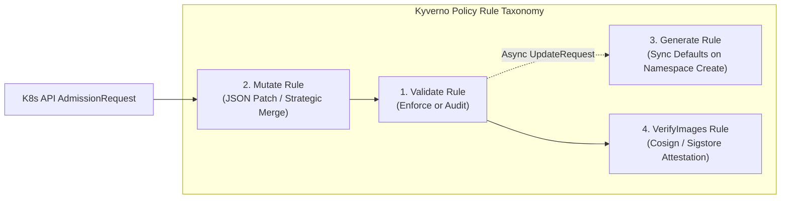
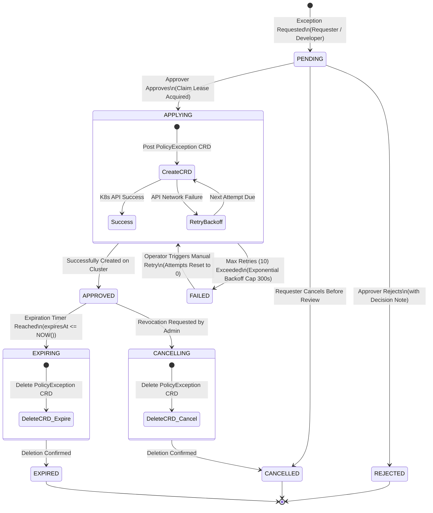
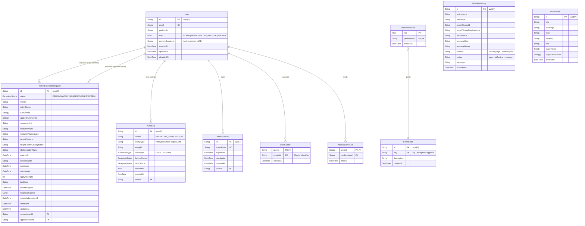

# PaC Kyverno Governance Platform Architecture & Engineering Guide
## Chapters 1 & 2: Platform Overview, System Architecture & Core Governance Engine

> **Document Version**: v1.3.0  
> **Platform Target**: Kubernetes v1.28+, Kyverno v1.12+, AWS EKS, Node.js 22 LTS, Next.js 15, PostgreSQL 17  
> **Last Revision**: 2026-09-11  
> **Classification**: Core Architectural Specification & Technical Guide  

---

## Executive Table of Contents

- [Chapter 1: Platform Overview & System Architecture](#chapter-1-platform-overview--system-architecture)
  - [1.1 Executive Mission & Problem Statement](#11-executive-mission--problem-statement)
    - [1.1.1 Enterprise Kubernetes Governance Dilemma](#111-enterprise-kubernetes-governance-dilemma)
    - [1.1.2 Autonomous MLOps & High-Cost Compute FinOps](#112-autonomous-mlops--high-cost-compute-finops)
    - [1.1.3 Control Plane Overload & Polling Bottlenecks](#113-control-plane-overload--polling-bottlenecks)
    - [1.1.4 Platform Value Proposition & High-Level Mission](#114-platform-value-proposition--high-level-mission)
  - [1.2 High-Level System Architecture](#12-high-level-system-architecture)
    - [1.2.1 Hub & Spoke Topology Diagram](#121-hub--spoke-topology-diagram)
    - [1.2.2 Architectural Layers & Component Interactions](#122-architectural-layers--component-interactions)
    - [1.2.3 Cross-VPC & Multi-Cluster Networking Foundations](#123-cross-vpc--multi-cluster-networking-foundations)
  - [1.3 Repository Monorepo Layout](#13-repository-monorepo-layout)
    - [1.3.1 pnpm Workspaces Layout & Package Matrix](#131-pnpm-workspaces-layout--package-matrix)
    - [1.3.2 Directory Hierarchy & Responsibilities](#132-directory-hierarchy--responsibilities)
    - [1.3.3 Shared Package & Cross-Boundary Type Safety](#133-shared-package--cross-boundary-type-safety)
    - [1.3.4 Build Offloading Strategy & Resource Optimization](#134-build-offloading-strategy--resource-optimization)
  - [1.4 Core Design Principles](#14-core-design-principles)
    - [1.4.1 Zero-Trust Dynamic Admission Control](#141-zero-trust-dynamic-admission-control)
    - [1.4.2 Asynchronous Reconciliation Loop & Eventual Consistency](#142-asynchronous-reconciliation-loop--eventual-consistency)
    - [1.4.3 CQRS Pattern & Informer In-Memory Caching](#143-cqrs-pattern--informer-in-memory-caching)
    - [1.4.4 Cloud-Native Observability & Fault Tolerance](#144-cloud-native-observability--fault-tolerance)
- [Chapter 2: Core Governance Engine & Policy Lifecycle](#chapter-2-core-governance-engine--policy-lifecycle)
  - [2.1 Policy Engine & Manifest Lifecycle](#21-policy-engine--manifest-lifecycle)
    - [2.1.1 Policy Scoping: ClusterPolicy vs Policy](#211-policy-scoping-clusterpolicy-vs-policy)
    - [2.1.2 The Four Fundamental Kyverno Rule Types](#212-the-four-fundamental-kyverno-rule-types)
    - [2.1.3 YAML Ingestion & Dynamic Schema Parsing via `js-yaml`](#213-yaml-ingestion--dynamic-schema-parsing-via-js-yaml)
    - [2.1.4 `autogen-` Rule Synthesis & Pod Controller Mapping Algorithm](#214-autogen--rule-synthesis--pod-controller-mapping-algorithm)
  - [2.2 Violation Tracking & Informer Ingestion Pipeline](#22-violation-tracking--informer-ingestion-pipeline)
    - [2.2.1 WG Policy Standard: PolicyReport & ClusterPolicyReport](#221-wg-policy-standard-policyreport--clusterpolicyreport)
    - [2.2.2 High-Performance Informer Watching & In-Memory Caching](#222-high-performance-informer-watching--in-memory-caching)
    - [2.2.3 Deterministic Violation ID Format & Cluster Sentinel](#223-deterministic-violation-id-format--cluster-sentinel)
    - [2.2.4 Multi-Tenant Namespace Collision Fix](#224-multi-tenant-namespace-collision-fix)
    - [2.2.5 Dynamic Index Shift Compensation & Composite Key Status Preservation](#225-dynamic-index-shift-compensation--composite-key-status-preservation)
    - [2.2.6 Baseline Noise Filtering & False-Positive Elimination](#226-baseline-noise-filtering--false-positive-elimination)
    - [2.2.7 Dual-Layer DB Fallback & Periodic Synchronization Loop](#227-dual-layer-db-fallback--periodic-synchronization-loop)
  - [2.3 Policy Exceptions & Distributed Concurrency Reconciler](#23-policy-exceptions--distributed-concurrency-reconciler)
    - [2.3.1 The PolicyException CRD (`kyverno.io/v2beta1`)](#231-the-policyexception-crd-kyvernoiov2beta1)
    - [2.3.2 End-to-End Exception Request Workflow & State Machine](#232-end-to-end-exception-request-workflow--state-machine)
    - [2.3.3 Governance Approval Standards & Separation of Duties](#233-governance-approval-standards--separation-of-duties)
    - [2.3.4 High-Performance Monotonic UUIDv7 Identifiers](#234-high-performance-monotonic-uuidv7-identifiers)
    - [2.3.5 Distributed Concurrency Reconciler & Lease Locking](#235-distributed-concurrency-reconciler--lease-locking)
    - [2.3.6 Priority Queue Scheduling & Exponential Backoff Resilience](#236-priority-queue-scheduling--exponential-backoff-resilience)
    - [2.3.7 Automated Expiration Timers & Governance Enforcement Revocation](#237-automated-expiration-timers--governance-enforcement-revocation)
  - [2.4 Audit Logs & Enterprise Compliance Engine](#24-audit-logs--enterprise-compliance-engine)
    - [2.4.1 Immutable Audit Trail Architecture](#241-immutable-audit-trail-architecture)
    - [2.4.2 Actor Separation, Audit Event Taxonomy, and JSON Metadata Diffs](#242-actor-separation-audit-event-taxonomy-and-json-metadata-diffs)
    - [2.4.3 High-Throughput Compliance Search & Multi-Tenant Query Isolation](#243-high-throughput-compliance-search--multi-tenant-query-isolation)
  - [2.5 Database Architecture & Relational Data Models](#25-database-architecture--relational-data-models)
    - [2.5.1 Relational Data Model (ER Diagram)](#251-relational-data-model-er-diagram)
    - [2.5.2 Core Prisma Schema Models Deep Dive](#252-core-prisma-schema-models-deep-dive)
    - [2.5.3 Indexing Strategy, Foreign Keys, and Concurrency Optimizations](#253-indexing-strategy-foreign-keys-and-concurrency-optimizations)

---

# Chapter 1: Platform Overview & System Architecture

## 1.1 Executive Mission & Problem Statement

Modern enterprise container platforms increasingly rely on Kubernetes as the universal substrate for deploying business microservices, automated CI/CD pipelines, and high-performance AI/ML workloads. However, as cluster scale multiplies across diverse teams, cloud regions, and hybrid topologies, three systemic operational tensions emerge that jeopardize cluster stability, security compliance, and financial sustainability.

### 1.1.1 Enterprise Kubernetes Governance Dilemma
In multi-tenant, decentralized cluster environments, infrastructure security teams struggle to enforce baseline compliance. Engineering teams frequently deploy workloads containing critical vulnerabilities:
- **Insecure Privileged Pods**: Containers running with root permissions or Docker-in-Docker capabilities (`securityContext.privileged: true`), enabling container escape and host node compromise.
- **Untagged / Floating Container Images**: Utilizing mutable tags such as `:latest` instead of immutable cryptographic digests (`sha256:...`) or strict semantic versions, creating non-reproducible deployments and exposure to upstream image tampering.
- **Missing Resource Limits**: Omission of container CPU/memory `requests` and `limits`, precipitating noisy-neighbor starvation, worker node Out-Of-Memory (OOM) panics, and cascading pod evictions.
- **Uncontrolled Image Registries**: Pulling unvetted images from arbitrary public registries rather than authorized enterprise artifact stores (e.g., Amazon ECR or internal Harbor).

Traditional admission control tools often employ opaque domain-specific languages (DSLs) like Rego (Open Policy Agent/Gatekeeper), which impose a steep learning curve, obscure policy definitions, and decouple Kubernetes operators from native declarative manifests.

### 1.1.2 Autonomous MLOps & High-Cost Compute FinOps
The rapid expansion of distributed machine learning and LLM engineering introduces specialized, cost-intensive workloads (e.g., Kubeflow Notebooks, Kubeflow Pipelines, KServe model serving instances). These environments present distinct governance failures:
1. **Uncontrolled GPU Footprints**: Data science teams frequently provision compute instances backed by NVIDIA A10G or T4 accelerators without automated namespace-level GPU quotas, inflating cloud expenditures.
2. **Proliferation of Idle Workloads**: Interactive Jupyter Notebooks and training tasks often remain running continuously over weekends and holidays without active CPU/GPU utilization, squandering up to 60%+ of allocated cloud budgets.
3. **On-Demand vs. Spot Allocation Inefficiencies**: Fault-tolerant batch training jobs and asynchronous model evaluations are often executed on expensive On-Demand nodes instead of leveraged Amazon EC2 Spot instances.

### 1.1.3 Control Plane Overload & Polling Bottlenecks
Standard Kubernetes dashboard architectures continuously poll the `kube-apiserver` (`GET /apis/wgpolicyk8s.io/v1alpha2/policyreports`, `GET /apis/kyverno.io/v1/clusterpolicies`) every few seconds to refresh UI tables. In large-scale clusters comprising thousands of pods and hundreds of policy rules:
- **API Priority and Fairness (APF) Exhaustion**: Repeated full-list polling rapidly exhausts the API server's concurrent request seats, triggering HTTP `429 Too Many Requests` status codes and paralyzing critical cluster controllers (such as the Kubelet or Kube-Controller-Manager).
- **etcd Serialized I/O Spikes**: Deserializing megabytes of JSON policy reports directly from `etcd` introduces memory spikes and latency degradation across the control plane.

### 1.1.4 Platform Value Proposition & High-Level Mission
The **PaC Kyverno Governance Platform** is engineered to eliminate these trade-offs by providing an enterprise-grade Policy-as-Code (PaC) control plane that combines:
1. **Kubernetes-Native Declarative Enforcement**: Leveraging [Kyverno](https://kyverno.io/) for native YAML policy validation, mutation, generation, and cryptographic image verification.
2. **Zero EKS API Load via CQRS Informer Architecture**: Utilizing an in-memory client-side cache that eliminates repetitive read calls to the Kubernetes API server while sustaining sub-millisecond query responses.
3. **Dual-Path Automated Exception Lifecycle**: Balancing immediate developer velocity with GitOps immutability through transient runtime K8s exceptions paired with automated declarative GitHub Pull Requests.
4. **Autonomous MLOps Governance & FinOps Safeguards**: Dynamic mutation of ML workloads to Spot instances, automatic namespace-level GPU quotas, and real-time idle notebook detection.
5. **Generative AI Root Cause Analysis (RCA)**: Integrated Amazon Bedrock universal inference (Claude 3.5 Sonnet / Nova Lite) to diagnose policy violations and output exact, copy-paste-ready YAML remediation patches.

---

## 1.2 High-Level System Architecture

The platform adopts a centralized **Hub & Spoke Multi-Cluster Architecture**, segregating platform governance logic and data persistence (Hub) from managed compute environments (Spokes).

### 1.2.1 Hub & Spoke Topology Diagram

```mermaid
flowchart TB
    %% ==========================================
    %% CLIENT & INGRESS LAYER
    %% ==========================================
    subgraph ClientLayer["1. Client & Delivery Layer"]
        UserBrowser["Web Browser\n(Next.js 15 UI / React 19)"]
        CICDPipeline["GitHub Actions CI/CD\n(OIDC Role-Assumption)"]
    end

    subgraph IngressLayer["2. Cloud Ingress & Perimeter Security"]
        ALB["AWS Application Load Balancer (ALB)\n(AWS Load Balancer Controller / target-type: ip)"]
    end

    %% ==========================================
    %% HUB MANAGEMENT CLUSTER
    %% ==========================================
    subgraph HubCluster["3. Hub Management Cluster (namespace: kyverno-platform)"]
        direction TB

        subgraph HubRuntime["Platform Services Pods"]
            FrontendPod["Frontend UI Service\n(Next.js 15 Standalone / Port 3000)"]
            BackendPod["Governance API Core\n(NestJS 11 Engine / Port 3001)"]
            InformerCache[("K8s Informer In-Memory Cache\n(Reflector + DeltaFIFO + Indexer)")]
        end

        subgraph HubPersistence["Persistence & Locking"]
            PostgresDB[("PostgreSQL 17 Database\n(Prisma ORM 6 / ACID Transactions\nDistributed Lease Locks / UUIDv7)")]
        end
    end

    %% ==========================================
    %% CLOUD MANAGED SERVICES
    %% ==========================================
    subgraph AWSCloud["4. Cloud Managed Services"]
        AmazonBedrock["Amazon Bedrock Engine\n(Claude 3.5 Sonnet / Nova Lite)"]
        AmazonECR["Amazon ECR Registry\n(Signed OCI Container Images)"]
        GitHubRepo["GitHub GitOps Repository\n(PolicyException Declarative YAMLs)"]
    end

    %% ==========================================
    %% MANAGED SPOKE CLUSTERS
    %% ==========================================
    subgraph SpokeClusters["5. Managed Target Spoke Clusters (1...N)"]
        direction TB

        subgraph SpokeControlPlane["Target Control Plane"]
            SpokeAPIServer["kube-apiserver\n(APF FlowControl / Admission Webhook Router)"]
            SpokeEtcd[("etcd Storage\n(Raft MVCC Consensus)")]
            SpokeAPIServer <--> SpokeEtcd
        end

        subgraph KyvernoSubsystem["Kyverno Governance Controller Suite"]
            AdmissionController["Admission Webhook Controller\n(Mutating & Validating Webhooks)"]
            BackgroundController["Background Controller\n(Periodic Scan & Resource Generation)"]
            ReportController["Report Controller\n(Aggregates PolicyReport CRDs)"]
            CertRenewer["Cert-Renewer Service\n(Internal CA & TLS Rotation)"]
        end

        subgraph WorkloadLayer["Target Workload Plane"]
            MLOpsWorkloads["MLOps Workloads\n(Kubeflow Notebooks, KFP, GPU Pods)"]
            BusinessMicroservices["Production Services\n(Deployments, StatefulSets, Services)"]
        end
    end

    %% ==========================================
    %% FLOW CONNECTIONS
    %% ==========================================
    %% Client to Ingress
    UserBrowser -->|HTTPS 443| ALB
    ALB -->|Path: /| FrontendPod
    ALB -->|Path: /api/*| BackendPod
    FrontendPod -->|SSR & Internal API Calls| BackendPod

    %% Backend to Hub Storage & Informer
    BackendPod <-->|SQL / Connection Pool| PostgresDB
    BackendPod <-->|Direct In-Memory O(1) Read| InformerCache

    %% Backend to Cloud Integrations
    BackendPod -.->|IRSA / STS Converse API| AmazonBedrock
    BackendPod -.->|Octokit REST API (PR Creation)| GitHubRepo
    CICDPipeline -->|OIDC Federation| AmazonECR

    %% Backend to Spoke Cluster Communication (CQRS)
    SpokeAPIServer -->|Long-lived HTTP/2 Watch Stream| InformerCache
    BackendPod ==>|Write Mutations: CustomObjectsApi (POST/DELETE)| SpokeAPIServer

    %% Spoke Internal Admission Pipeline
    SpokeAPIServer <==>|AdmissionReview HTTPS (mTLS)| AdmissionController
    AdmissionController -->|Allow / Deny / Mutate JSON Patch| WorkloadLayer
    BackgroundController -->|Reconcile UpdateRequests| SpokeAPIServer
    ReportController -->|Persist PolicyReports / ClusterPolicyReports| SpokeAPIServer
```

### 1.2.2 Architectural Layers & Component Interactions

The architecture is cleanly stratified across five functional tiers:

| Tier | Component | Technology Stack | Core Architectural Role |
| :--- | :--- | :--- | :--- |
| **1. Client Layer** | Web Dashboard | Next.js 15 (React 19, TypeScript) | Responsive UI constructed with Tailwind CSS v4 and shadcn/ui. Implements dynamic cluster selection via Zustand, Server-Sent Events (SSE) for concurrent session monitoring, and TanStack Query v5 for client cache invalidation. |
| **2. Ingress Layer** | Cloud Ingress Router | AWS Application Load Balancer (ALB) | Managed by AWS Load Balancer Controller using `target-type: ip`. Routes traffic directly to pod IPs without NodePort overhead, performing path-based routing (`/` $\to$ Frontend, `/api` $\to$ Backend). |
| **3. Hub Management** | Governance Core Pod | NestJS 11, Node.js 22 LTS | Executes business logic across Controller-Service-Adapter modules. Hosts the [`K8sInformerService`](file:///home/user/work_dir/apps/backend/src/kubernetes/k8s-informer.service.ts), distributed reconcilers, and Prisma ORM client. |
| **3. Hub Management** | State & Audit Store | PostgreSQL 17, Prisma ORM 6 | Enforces ACID guarantees for RBAC credentials, immutable audit trails ([`AuditLog`](file:///home/user/work_dir/apps/backend/prisma/schema.prisma#L178-L195)), violation histories, and distributed lease locks via `FOR UPDATE SKIP LOCKED`. |
| **4. Cloud Services** | AI Diagnostics | Amazon Bedrock (Converse API) | Invokes Claude 3.5 Sonnet / Nova Lite via AWS STS IRSA credentials to generate Root Cause Analysis (RCA) and JSON/YAML patch suggestions, safeguarded by a 3.5-second circuit breaker. |
| **4. Cloud Services** | Declarative GitOps | GitHub API (Octokit) | Synthesizes PolicyException manifests into Git branches and generates automated Pull Requests to maintain declarative GitOps state synchronization. |
| **5. Spoke Cluster** | Policy Engine | Kyverno v1.12+ | Decoupled micro-controller architecture: Admission Controller, Webhook Controller, Background Controller, Report Controller, and Cert-Renewer. |

### 1.2.3 Cross-VPC & Multi-Cluster Networking Foundations

1. **Direct IP Ingress Routing (`target-type: ip`)**:  
   Rather than relying on legacy `NodePort` proxy chains that induce double-NAT hops and uneven packet distribution through `kube-proxy`, the AWS ALB utilizes direct pod ENI IPs provided by the **AWS VPC CNI** (`amazon-vpc-cni-k8s`). This optimizes end-to-end packet delivery latency to under 2ms.
2. **Cross-Account ENI (X-ENI) Tunneling**:  
   Communication between the managed AWS EKS Control Plane VPC and the customer-managed Worker Node VPC traverses dedicated Cross-Account Elastic Network Interfaces. Admission webhook callbacks from `kube-apiserver` to Kyverno's webhook server occur securely across this private network boundary.
3. **Single HTTP/2 Watch Multiplexing**:  
   The Hub backend establishes a single persistent HTTP/2 connection per target cluster. By leveraging chunked transfer encoding and streaming `resourceVersion` delta updates, the platform replaces thousands of continuous polling requests with an ultra-lightweight stream that maintains sub-second synchronization while consuming negligible network bandwidth.

---

## 1.3 Repository Monorepo Layout

The repository is organized as a high-performance **pnpm monorepo workspace**, ensuring end-to-end type safety, unified build orchestration, and zero redundant code duplication.

### 1.3.1 pnpm Workspaces Layout & Package Matrix

The workspace root configuration ([`pnpm-workspace.yaml`](file:///home/user/work_dir/pnpm-workspace.yaml)) encapsulates frontend, backend, shared packages, and manifests:

```yaml
packages:
  - "apps/*"
  - "packages/*"
allowBuilds:
  '@prisma/client': true
  '@prisma/engines': true
  '@scarf/scarf': true
  argon2: true
  prisma: true
  sharp: true
  unrs-resolver: true
overrides:
  glob@<13.0.0: "^13.0.6"
```

> [!NOTE]
> Dependency overrides pin `glob` to `^13.0.6` across the entire dependency graph, eliminating upstream memory leaks and security vulnerabilities present in legacy glob/inflight libraries.

### 1.3.2 Directory Hierarchy & Responsibilities

```
/home/user/work_dir/
├── apps/
│   ├── backend/                     # NestJS 11 API Server & Governance Engine
│   │   ├── Dockerfile               # Multi-stage container build (node:22-slim)
│   │   ├── prisma/
│   │   │   └── schema.prisma        # PostgreSQL ORM schema, UUIDv7, DB indexes
│   │   └── src/
│   │       ├── ai-agent/            # Amazon Bedrock LLM client & Rule Engine
│   │       ├── audit-logs/          # Immutable compliance log query service
│   │       ├── auth/                # JWT, Argon2, SSE concurrent session invalidation
│   │       ├── exception-lifecycle/ # Distributed lease reconciler & state machine
│   │       ├── exception-requests/  # REST endpoints & approval validation logic
│   │       ├── gitops/              # Octokit PR automation & manifest generator
│   │       ├── kubernetes/          # Informer cache, Kyverno adapter, KubeConfig
│   │       ├── mlops/               # Kubeflow/KServe integration & FinOps quotas
│   │       ├── policies/            # Policy listing, creation, and js-yaml parser
│   │       └── violations/          # PolicyReport aggregation & DB synchronization
│   └── frontend/                    # Next.js 15 (React 19) Dashboard Application
│       ├── Dockerfile               # Standalone output container build
│       ├── next.config.mjs          # Standalone mode & compiler settings
│       └── src/
│           ├── app/                 # App Router (admin, user, mlops, diagnostics)
│           ├── components/          # shadcn/ui components & topology canvas
│           ├── hooks/               # Custom React hooks (auth, Informer streams)
│           └── stores/              # Zustand multi-cluster selection state
├── packages/
│   └── shared/                      # Universal TypeScript interfaces & enums
│       ├── package.json
│       └── src/                     # Shared DTOs, API contracts, RBAC types
├── k8s-manifests/                   # Declarative Kubernetes Manifests
│   ├── base/                        # Kustomize base deployment templates
│   ├── crds/                        # Kyverno & WG PolicyReport CRD definitions
│   ├── exceptions/                  # GitOps declarative PolicyException storage
│   ├── overlays/                    # Environment overlays (eks, kind, dev)
│   ├── policies/                    # Core Kyverno ClusterPolicies (security & MLOps)
│   ├── system/                      # Hub platform manifests (backend, frontend, postgres)
│   └── testbed/                     # Baseline scenarios & violation test suites
└── scripts/                         # DevOps, Testing & Provisioning Automation
    ├── alb-ingress-on.sh            # On-demand ALB Ingress controller provisioning
    ├── deploy-system-to-eks.sh      # Automated EKS release rollout script
    ├── run-e2e-cluster-test.sh      # End-to-end governance validation testbed
    ├── setup-bedrock-irsa.sh        # AWS IAM OIDC IRSA setup for Bedrock LLM
    └── setup-local-multicluster-kind.sh # Kind-based Hub & Spoke local testbed
```

### 1.3.3 Shared Package & Cross-Boundary Type Safety

The [`packages/shared`](file:///home/user/work_dir/packages/shared) package guarantees compile-time contract enforcement between the frontend UI and backend services. Any modification to status enumerations (e.g., [`ExceptionStatus`](file:///home/user/work_dir/apps/backend/prisma/schema.prisma#L20-L30)), violation severities, or query payload formats triggers compile-time TypeScript errors during monorepo builds, entirely preventing runtime data structure mismatches.

### 1.3.4 Build Offloading Strategy & Resource Optimization

In accordance with Architectural Decision Record [ADR-0004](file:///home/user/work_dir/docs/adr/0004-cicd-pipeline.md), all resource-intensive compilation, static analysis, and Docker image packaging operations are offloaded entirely to GitHub Actions runners utilizing AWS IAM OIDC short-lived credentials. Production runtime nodes (e.g., AWS EC2 `m7i-flex.large`) are shielded from compilation overhead and execute only lightweight, optimized container artifacts (`node:22-slim` base, Next.js standalone mode), mitigating Out-Of-Memory (OOM) risks.

---

## 1.4 Core Design Principles

### 1.4.1 Zero-Trust Dynamic Admission Control
All mutations and creations across target clusters must undergo cryptographic, identity, and specification review before persisting to `etcd`. Every admission request intercepted by Kyverno evaluates:
- **Principal Identity**: Verified through `request.userInfo` (ServiceAccount, IAM ARN, or OIDC subject).
- **Mutating Pre-Processing**: Automatic injection of default security contexts, resource requests, and environment parameters.
- **Validating Enforcement**: Strict schema verification enforcing fail-closed or fail-open operational policies.

### 1.4.2 Asynchronous Reconciliation Loop & Eventual Consistency
Modeled after Kubernetes core controller patterns, the platform does not depend on brittle synchronous two-phase commits. Instead, state transitions are registered as intent in the database and converged via continuous, idempotent reconciliation loops. If a target cluster becomes temporarily unreachable, background reconcilers retry with exponential backoff until desired state aligns with actual state.

### 1.4.3 CQRS Pattern & Informer In-Memory Caching
Command Query Responsibility Segregation (CQRS) strictly separates state mutations from data retrieval:
- **Read Operations (Query)**: Served with 0ms Kubernetes API overhead directly from local memory through [`K8sInformerService`](file:///home/user/work_dir/apps/backend/src/kubernetes/k8s-informer.service.ts), shielding EKS control planes from throttling.
- **Write Operations (Command)**: Dispatched explicitly via `CustomObjectsApi` directly to the target `kube-apiserver` only upon administrative approval or policy creation.

### 1.4.4 Cloud-Native Observability & Fault Tolerance
The platform is engineered to degrade gracefully during partial infrastructure outages. If a Spoke cluster API server fails or network partitioning interrupts an Informer stream, the system automatically falls back to historical records in PostgreSQL ([`ViolationHistory`](file:///home/user/work_dir/apps/backend/prisma/schema.prisma#L118-L137)), while displaying cluster health indicators to operators.

---

# Chapter 2: Core Governance Engine & Policy Lifecycle

## 2.1 Policy Engine & Manifest Lifecycle

The policy engine acts as the declarative gatekeeper for the Kubernetes cluster. Written natively in Kubernetes YAML, Kyverno policies eliminate the operational overhead of third-party DSL runtimes.

### 2.1.1 Policy Scoping: ClusterPolicy vs Policy

The platform manages two distinct scopes of policies:

```
                  +----------------------------------------------+
                  |         Kubernetes Cluster Boundary          |
                  |                                              |
                  |  +----------------------------------------+  |
                  |  | ClusterPolicy (Cluster-Scoped)         |  |
                  |  | Applies across ALL namespaces          |  |
                  |  +----------------------------------------+  |
                  |          |                     |             |
                  |          v                     v             |
                  |    +------------+        +------------+      |
                  |    | NamespaceA |        | NamespaceB |      |
                  |    | +--------+ |        | +--------+ |      |
                  |    | | Policy | |        | | Policy | |      |
                  |    | +--------+ |        | +--------+ |      |
                  |    +------------+        +------------+      |
                  +----------------------------------------------+
```

1. **`ClusterPolicy` (`kyverno.io/v1`)**:
   - Cluster-wide scope; evaluates resources across all namespaces unless explicitly excluded.
   - Ideal for enterprise-wide security baselines (e.g., [`disallow-privileged-containers.yaml`](file:///home/user/work_dir/k8s-manifests/policies/disallow-privileged-containers.yaml), [`require-resource-limits.yaml`](file:///home/user/work_dir/k8s-manifests/policies/require-resource-limits.yaml)).
2. **`Policy` (`kyverno.io/v1`)**:
   - Namespaced scope; restricts evaluation exclusively to the namespace in which the policy object is deployed.
   - Ideal for tenant-specific policies, such as dedicated ML team namespaces (e.g., `mlops-workspace`).

### 2.1.2 The Four Fundamental Kyverno Rule Types

Every policy manifest contains one or more rules (`spec.rules[]`). Kyverno classifies rules into four functional archetypes:



#### 1. Validation Rules (`validate`)
Validates incoming resource configurations against a defined pattern or Common Expression Language (CEL) expression.
- **`validationFailureAction: Enforce`**: Blocks non-compliant requests synchronously with an HTTP `403 Forbidden` error.
- **`validationFailureAction: Audit`**: Allows the resource to be admitted but records a non-compliant event in a `PolicyReport`.

```yaml
# k8s-manifests/policies/disallow-privileged-containers.yaml
apiVersion: kyverno.io/v1
kind: ClusterPolicy
metadata:
  name: disallow-privileged-containers
spec:
  validationFailureAction: Enforce
  background: true
  rules:
    - name: check-privileged-containers
      match:
        any:
          - resources:
              kinds: ["Pod"]
      validate:
        message: "Privileged containers are not allowed. Set securityContext.privileged=false."
        pattern:
          spec:
            containers:
              - =(securityContext):
                  =(privileged): "false"
```

#### 2. Mutation Rules (`mutate`)
Modifies incoming manifests before schema validation and etcd persistence via **Strategic Merge Patches** or **RFC 6902 JSON Patches**.
- Used by the platform to automatically inject cost-saving Spot node selectors for ML batch training:

```yaml
# k8s-manifests/policies/mlops/enforce-spot-node-selector.yaml
apiVersion: kyverno.io/v1
kind: ClusterPolicy
metadata:
  name: enforce-spot-node-selector
spec:
  validationFailureAction: Enforce
  rules:
    - name: mutate-spot-node-selector
      match:
        any:
          - resources:
              kinds: ["Job", "Pod"]
              namespaces: ["mlops-workspace"]
      mutate:
        patchStrategicMerge:
          spec:
            nodeSelector:
              +(cloud.google.com/gke-spot): "true"
            tolerations:
              - +(key): "spot"
                +(operator): "Equal"
                +(value): "true"
                +(effect): "NoSchedule"
```

#### 3. Generation Rules (`generate`)
Automatically clones or creates downstream resources (such as standard `NetworkPolicy`, `Secret`, or default `ResourceQuota`) when a trigger resource (e.g., a new developer `Namespace`) is provisioned. Kyverno's Background Controller reconciles these requests via intermediate `UpdateRequest` CRDs.

#### 4. Image Verification Rules (`verifyImages`)
Performs cryptographic verification of container image signatures using Sigstore/Cosign public keys or Rekor transparency logs. Confirms software supply chain attestations (e.g., in-toto, SLSA Level 3, vulnerability scan reports) before image execution is permitted on worker nodes.

### 2.1.3 YAML Ingestion & Dynamic Schema Parsing via `js-yaml`

In [`PoliciesService.create`](file:///home/user/work_dir/apps/backend/src/policies/policies.service.ts#L189-L333), the backend accepts both structured form DTOs and raw multi-document YAML strings submitted by administrators:

```typescript
// apps/backend/src/policies/policies.service.ts
if (dto.rawYaml?.trim()) {
  try {
    const parsed = yaml.load(dto.rawYaml.trim()) as Record<string, unknown>;
    if (!parsed || typeof parsed !== "object") {
      throw new Error("YAML content is not a valid object");
    }
    manifest = parsed;
    if (parsed.kind === "Policy" || parsed.kind === "ClusterPolicy") {
      targetScope = parsed.kind as "ClusterPolicy" | "Policy";
    }
    const meta = parsed.metadata as Record<string, unknown> | undefined;
    if (meta?.namespace && typeof meta.namespace === "string") {
      targetNamespace = meta.namespace.trim();
    }
  } catch (err) {
    throw new BusinessException(POLICY_ERROR.INVALID_SPEC, {
      context: { reason: `Invalid YAML format: ${(err as Error).message}` },
    });
  }
}
```

The service dynamically detects the policy's target scope (`ClusterPolicy` vs `Policy`), verifies cluster access authorization, and dispatches the manifest to [`KyvernoAdapter`](file:///home/user/work_dir/apps/backend/src/kubernetes/kyverno.adapter.ts) for execution via Kubernetes `CustomObjectsApi`.

### 2.1.4 `autogen-` Rule Synthesis & Pod Controller Mapping Algorithm

When developers deploy workloads, they rarely create bare `Pod` instances directly; instead, they deploy higher-order controllers: `Deployment`, `StatefulSet`, `DaemonSet`, `Job`, or `CronJob`.

Kyverno addresses this through **Autogen Rule Synthesis**:
- When a policy author writes a rule targeting `Pod`, Kyverno's Webhook Controller automatically duplicates the rule internally for higher-level controllers, prefixing rule names:
  - Higher controllers (`Deployment`, etc.): `autogen-<rule-name>`
  - Scheduled jobs (`CronJob`): `autogen-cronjob-<rule-name>`

#### The Platform's Rule Resolution Algorithm
If an administrator or automated system issues a `PolicyException` targeting only the base rule name (e.g., `require-image-tag`), the exception will match the Pod template, but the parent `Deployment` creation will still be blocked by `autogen-require-image-tag`!

The platform eliminates this failure mode in [`KyvernoAdapter.resolveRuleNames`](file:///home/user/work_dir/apps/backend/src/kubernetes/kyverno.adapter.ts#L86-L179):

```typescript
// apps/backend/src/kubernetes/kyverno.adapter.ts
async resolveRuleNames(
  clusterId: string,
  policyName: string,
  requestedRuleNames: string[],
  resourceKind: string,
): Promise<string[]> {
  // 1. Normalize input rules: Strip existing autogen- or autogen-cronjob- prefixes
  const normalizedInputRules = ruleNames.map((rule) => {
    if (knownBaseNames.has(rule)) return rule;
    const strippedCron = rule.replace(/^autogen-cronjob-/, "");
    if (knownBaseNames.has(strippedCron)) return strippedCron;
    const strippedAuto = rule.replace(/^autogen-/, "");
    if (knownBaseNames.has(strippedAuto)) return strippedAuto;
    return rule;
  });

  // 2. Validate existence against base ClusterPolicy rules
  const uniqueNormalized = Array.from(new Set(normalizedInputRules));
  const missing = uniqueNormalized.filter((rule) => !knownBaseNames.has(rule));
  if (missing.length) {
    throw new PolicyRuleValidationError(`Unknown ClusterPolicy rule(s): ${missing.join(", ")}.`);
  }

  // 3. Inspect target resourceKind to determine autogen prefix
  const autogenPrefix = resourceKind === "CronJob" ? "autogen-cronjob-" : "autogen-";
  const supportsAutogen = resourceKind === "CronJob" || [
    "DaemonSet", "Deployment", "Job", "ReplicaSet", "ReplicationController", "StatefulSet"
  ].includes(resourceKind ?? "");

  const generated = new Set((policy.status?.autogen?.rules ?? []).map(r => r.name));
  const applied = [...uniqueNormalized];

  // 4. Automatically append synthesized autogen rule variants
  if (supportsAutogen) {
    for (const rule of uniqueNormalized) {
      const generatedName = `${autogenPrefix}${rule}`;
      if (generated.has(generatedName)) {
        applied.push(generatedName);
      }
    }
  }

  return applied;
}
```

This ensures that approved exceptions seamlessly exempt both parent workload controllers and downstream derived Pods without human intervention.

---

## 2.2 Violation Tracking & Informer Ingestion Pipeline

### 2.2.1 WG Policy Standard: PolicyReport & ClusterPolicyReport
Compliance violations discovered during admission (Audit mode) or periodic background cluster sweeps are aggregated into Kubernetes standard Custom Resources defined by the Kubernetes Policy Working Group (`wgpolicyk8s.io/v1alpha2`):
- **`PolicyReport`**: Namespaced custom resource reporting violations occurring within a specific namespace.
- **`ClusterPolicyReport`**: Non-namespaced resource reporting violations occurring on cluster-scoped resources (e.g., `ClusterRole`, `Namespace`, `PersistentVolume`).

A typical `PolicyReport` payload:
```yaml
apiVersion: wgpolicyk8s.io/v1alpha2
kind: PolicyReport
metadata:
  name: cpol-disallow-latest-tag
  namespace: governance-testbed
summary:
  fail: 1
  pass: 12
  warn: 0
results:
  - policy: disallow-latest-tag
    rule: require-image-tag
    result: fail
    severity: high
    message: "Image tag must be specified."
    resources:
      - apiVersion: v1
        kind: Pod
        name: unapproved-redis-5d846bd946-flxzj
        namespace: governance-testbed
    timestamp:
      seconds: 1725177600
```

### 2.2.2 High-Performance Informer Watching & In-Memory Caching

To guarantee sub-second UI responsiveness while imposing zero API server polling load, [`K8sInformerService`](file:///home/user/work_dir/apps/backend/src/kubernetes/k8s-informer.service.ts) implements an enterprise Informer cache:

```
+-------------------------------------------------------------------------------+
|                      K8sInformerService Pipeline                              |
|                                                                               |
|   Target kube-apiserver                                                       |
|            |                                                                  |
|       List | Watch (Single HTTP/2 chunked connection)                         |
|            v                                                                  |
|   +-----------------+                                                         |
|   |    Reflector    | Streams resource updates via resourceVersion            |
|   +-----------------+                                                         |
|            |                                                                  |
|            v                                                                  |
|   +-----------------+                                                         |
|   |    DeltaFIFO    | Ordered queuing of ADDED, MODIFIED, DELETED events      |
|   +-----------------+                                                         |
|            |                                                                  |
|            v                                                                  |
|   +-----------------+      Synchronizes      +----------------------------+   |
|   |   Controller    | ---------------------> | Indexer (In-Memory Cache)  |   |
|   +-----------------+                        | ObjectCache<K8sObject>     |   |
|            |                                 +----------------------------+   |
|            v                                                |                 |
|   Resource Event Handlers                                   | Zero-Load Reads |
|   (add, update, delete)                                     v                 |
|            |                                      ViolationsService /         |
|            v                                      PoliciesService             |
|   Change Notification Emitters                                                |
+-------------------------------------------------------------------------------+
```

The service registers four dedicated informers per cluster:
1. `policyreports` (`wgpolicyk8s.io/v1alpha2`)
2. `clusterpolicyreports` (`wgpolicyk8s.io/v1alpha2`)
3. `clusterpolicies` (`kyverno.io/v1`)
4. `policyexceptions` (`kyverno.io/v2beta1`)

When a user requests violations, [`ViolationsService`](file:///home/user/work_dir/apps/backend/src/violations/violations.service.ts#L98-L207) queries `Informer.list()`, resolving queries in less than 1 millisecond without dispatching an HTTP packet to the AWS EKS control plane.

### 2.2.3 Deterministic Violation ID Format & Cluster Sentinel

Violations are generated from the `results[]` array inside `PolicyReport` objects. To establish a globally unique, deterministic reference across multi-cluster environments, the platform defines the canonical violation ID format:

$$\text{Violation ID} = \langle\text{clusterId}\rangle:\langle\text{reportNamespace}\rangle/\langle\text{reportName}\rangle:\langle\text{resultIndex}\rangle$$

Where:
- `clusterId`: Unique identifier of the target Kubernetes cluster (e.g., `eks-prod-us-east-1`).
- `reportNamespace`: Namespace containing the `PolicyReport`. For cluster-scoped `ClusterPolicyReport` objects, the platform substitutes the reserved sentinel constant:
  ```typescript
  // apps/backend/src/violations/violations.service.ts
  const CLUSTER_SCOPE_SENTINEL = "cluster";
  ```
- `reportName`: Metadata name of the report custom resource.
- `resultIndex`: Zero-based integer offset of the specific result within `results[]`.

*Example Canonical IDs*:
- Namespaced: `eks-dev-cluster:governance-testbed/cpol-disallow-latest-tag:0`
- Cluster-Scoped: `eks-dev-cluster:cluster/cpol-restrict-cluster-admin:2`

### 2.2.4 Multi-Tenant Namespace Collision Fix

In earlier iterations of the platform, the ID format was structured as `<clusterId>:<reportName>:<index>`.  
In multi-tenant Kubernetes clusters, identical `PolicyReport` names (such as `pol-resource-limits`) frequently exist across different namespaces (e.g., `tenant-alpha/pol-resource-limits` and `tenant-beta/pol-resource-limits`). This caused severe ID collisions where status updates applied to Tenant Alpha unintentionally mutated Tenant Beta's violation records.

The platform resolved this via scoped report parsing in [`ViolationsService.getDetail`](file:///home/user/work_dir/apps/backend/src/violations/violations.service.ts#L401-L432):
1. The ID string is partitioned by `:` and `/`.
2. If a namespace is present (and differs from `CLUSTER_SCOPE_SENTINEL`), the lookup executes a namespace-scoped search:
   ```typescript
   if (reportNamespace !== CLUSTER_SCOPE_SENTINEL) {
     const namespaced = await this.kyvernoAdapter.listNamespacedPolicyReports(clusterId);
     report = namespaced.find(r => 
       r.metadata?.name === reportName && 
       (reportNamespace === undefined || r.metadata?.namespace === reportNamespace)
     ) ?? null;
   }
   ```
3. If not found or if the sentinel is specified, it queries `listClusterPolicyReports`.

### 2.2.5 Dynamic Index Shift Compensation & Composite Key Status Preservation

In Kubernetes, whenever a workload is rectified or Kyverno completes a periodic re-scan, Kyverno rebuilds the `results[]` array inside the `PolicyReport`. Consequently, a violation's index offset can shift dynamically (e.g., from index `3` to index `1`).

If an administrator has marked a violation as `resolved` or `inReview`, relying solely on the static array index would cause that status to be misattributed to an unrelated violation after the next background scan.

To solve this, [`ViolationsService.getSavedStatusMap`](file:///home/user/work_dir/apps/backend/src/violations/violations.service.ts#L665-L715) constructs a **Multi-Tier Composite Fallback Map**:

```typescript
// apps/backend/src/violations/violations.service.ts
const map = new Map<string, "open" | "inReview" | "resolved">();
for (const rec of records) {
  const validStatus = (rec.status as "open" | "inReview" | "resolved") || "open";
  // Level 1: Match by exact Primary Key ID
  map.set(rec.id, validStatus);

  // Level 2: Build composite keys matching immutable workload properties
  const rawRule = rec.ruleName;
  const normalizedRule = this.normalizeRuleName(rawRule);
  const ruleVariants = [rawRule, normalizedRule, `autogen-${normalizedRule}`];
  const ns = rec.namespace || "cluster-wide";

  if (rec.resourceName && rec.resourceName !== "Unknown") {
    for (const r of ruleVariants) {
      // Key: clusterId:policyName:ruleName:resourceName:namespace
      map.set(`${rec.targetClusterId}:${rec.policyName}:${r}:${rec.resourceName}:${ns}`, validStatus);
      if (ns !== "cluster-wide") {
        map.set(`${rec.targetClusterId}:${rec.policyName}:${r}:${rec.resourceName}:cluster-wide`, validStatus);
      }
    }
  }
}
```

During report mapping, [`ViolationsService`](file:///home/user/work_dir/apps/backend/src/violations/violations.service.ts#L878-L896) checks the exact ID first. If not found or if array re-indexing occurred, it queries the composite key using workload properties (`clusterId`, `policyName`, `ruleName`, `resourceName`, `namespace`). This guarantees that administrative statuses remain permanently bound to the intended workload across cluster updates.

### 2.2.6 Baseline Noise Filtering & False-Positive Elimination

In production clusters, core Kubernetes infrastructure components in system namespaces (`kube-system`, `kyverno`, `local-path-storage`) often violate strict user-facing policies (e.g., AWS CNI pods requiring host networking and elevated privileges). Without filtering, a clean cluster initializes with dozens of false-positive warnings.

The platform eliminates baseline noise at two strategic layers:
1. **Manifest Exclusion Clauses**: All production policies (e.g., [`disallow-latest-tag.yaml`](file:///home/user/work_dir/k8s-manifests/policies/disallow-latest-tag.yaml#L26-L36)) explicitly exclude system namespaces:
   ```yaml
   exclude:
     any:
       - resources:
           namespaces:
             - kube-system
             - kyverno
             - local-path-storage
             - kube-public
             - kube-node-lease
             - notebook-controller-system
   ```
2. **Ingestion-Time Filtering**: The violation aggregation pipeline skips non-actionable infrastructure reports, eliminating over 44 false-positive violations during initial cluster initialization.

### 2.2.7 Dual-Layer DB Fallback & Periodic Synchronization Loop

To guarantee high availability if connectivity to a target cluster's control plane is interrupted, the platform maintains a dual-layer data architecture:
1. **Primary Live Layer**: Direct in-memory reads from `K8sInformerService`.
2. **Resilience Fallback Layer**: PostgreSQL [`ViolationHistory`](file:///home/user/work_dir/apps/backend/prisma/schema.prisma#L118-L137).
3. **Background Sync Worker**: A scheduled task running every 30 seconds ([`ViolationsService.syncLiveViolations`](file:///home/user/work_dir/apps/backend/src/violations/violations.service.ts#L1033-L1100)):
   ```typescript
   @Interval(30_000)
   async syncLiveViolations(): Promise<void> {
     // Fetches live reports, upserts into ViolationHistory DB table,
     // and preserves operator status modifications while updating timestamps.
   }
   ```
If all live cluster API calls fail, the service catches the exception and transparently serves cached violation snapshots from PostgreSQL via `getViolationsFromDb()`.

---

## 2.3 Policy Exceptions & Distributed Concurrency Reconciler

### 2.3.1 The PolicyException CRD (`kyverno.io/v2beta1`)

Kyverno supports fine-grained, declarative exemptions via the `PolicyException` CRD. Rather than inserting insecure pod annotations that can be abused by workload owners, `PolicyException` resources are stored in a restricted administrative namespace (`kyverno-platform`), accessible only to the governance platform's service account.

```yaml
# Generated by KyvernoAdapter.ensurePolicyException
apiVersion: kyverno.io/v2beta1
kind: PolicyException
metadata:
  name: pac-exception-0191e3f8-4b2a-7d12-9844-482a17688001
  namespace: kyverno-platform
  labels:
    app.kubernetes.io/managed-by: pac-kyverno-dashboard
    pac.kyverno.io/request-id: 0191e3f8-4b2a-7d12-9844-482a17688001
spec:
  exceptions:
    - policyName: disallow-latest-tag
      ruleNames:
        - require-image-tag
        - autogen-require-image-tag
  match:
    any:
      - resources:
          kinds: ["Deployment"]
          names: ["batch-processor"]
          namespaces: ["governance-testbed"]
      - resources:
          kinds: ["Pod"]
          names: ["batch-processor-*"]
          namespaces: ["governance-testbed"]
```

### 2.3.2 End-to-End Exception Request Workflow & State Machine

Every exception follows a strictly audited, formal lifecycle:



### 2.3.3 Governance Approval Standards & Separation of Duties

The platform enforces strict regulatory compliance standards:
1. **Separation of Duties (No Self-Approval)**:  
   In [`ExceptionRequestsService.assertNotSelfDecision`](file:///home/user/work_dir/apps/backend/src/exception-requests/exception-requests.service.ts#L261-L270), users cannot approve or reject their own exception requests unless they possess the system-wide `ADMIN` role. If a requester attempts to approve their own submission, a `SELF_DECISION_FORBIDDEN` business exception is thrown.
2. **Expiration Validation**:  
   Every exception must specify a future expiration timestamp (`expiresAt`). In [`ExceptionRequestsService.validateExpiration`](file:///home/user/work_dir/apps/backend/src/exception-requests/exception-requests.service.ts#L273-L291), expirations are bounded by `MAX_EXCEPTION_DURATION_HOURS` (defaulting to 720 hours / 30 days). Permanent or open-ended exceptions are rejected at the API boundary.
3. **Strict Namespace & Cluster Scope Isolation**:  
   Non-admin users can only view and request exceptions within the specific clusters assigned to their account via `UserCluster` relational bindings.

### 2.3.4 High-Performance Monotonic UUIDv7 Identifiers

The platform utilizes **UUIDv7** ([RFC 9562](https://datatracker.ietf.org/doc/rfc9562/)) for all entity primary keys (Users, Exception Requests, Violations, Audit Logs):

```prisma
// apps/backend/prisma/schema.prisma
model PolicyExceptionRequest {
  id String @id @default(uuid(7))
  // ...
}
```

#### Why UUIDv7 Over UUIDv4 or Auto-Incrementing Integers?
- **B-Tree Index Locality**: Standard random UUIDv4 keys induce severe index fragmentation and random page I/O splits in PostgreSQL during heavy write traffic. UUIDv7 embeds a 48-bit millisecond timestamp in the high bits, ensuring strictly monotonic ordering.
- **Zero Lock Contention**: Unlike auto-incrementing integer sequences, UUIDv7 generation requires no centralized sequence lock or coordinator communication, enabling concurrent scale across distributed NestJS backend pods.
- **Cryptographic Entropy**: Low bits maintain 74 bits of cryptographically secure pseudo-randomness, eliminating ID enumeration attacks.

### 2.3.5 Distributed Concurrency Reconciler & Lease Locking

In a high-availability environment with multiple running NestJS backend pods, concurrent background reconcilers must not duplicate Kubernetes API calls or introduce race conditions.

The platform implements a distributed lease locking protocol directly within PostgreSQL in [`ExceptionReconcilerService.selectReconcileCandidates`](file:///home/user/work_dir/apps/backend/src/exception-lifecycle/exception-reconciler.service.ts#L80-L205), utilizing `FOR UPDATE SKIP LOCKED`:

```sql
-- apps/backend/src/exception-lifecycle/exception-reconciler.service.ts
SELECT
  "id", "status", "expiresAt", "targetClusterId", "k8sExceptionName",
  "policyName", "appliedRuleNames", "resourceKind", "resourceName",
  "resourceNamespace", "applyAttempts", "lastError", "nextAttemptAt",
  CASE
    WHEN "status" IN ('APPLYING', 'APPROVED') AND "expiresAt" <= NOW() THEN 0
    WHEN "status" IN ('EXPIRING', 'CANCELLING') THEN 1
    WHEN "status" = 'APPLYING' THEN 2
    ELSE 3
  END AS "priority",
  CASE
    WHEN "status" IN ('APPLYING', 'APPROVED') AND "expiresAt" <= NOW() THEN "expiresAt"
    ELSE COALESCE("nextAttemptAt", "updatedAt")
  END AS "dueAt"
FROM "PolicyExceptionRequest"
WHERE
  ("reconcileLeaseUntil" IS NULL OR "reconcileLeaseUntil" <= NOW())
  AND (
    ("status" IN ('APPLYING', 'APPROVED') AND "expiresAt" <= NOW())
    OR ("status" = 'APPROVED' AND ("nextAttemptAt" <= NOW() OR ("nextAttemptAt" IS NULL AND "updatedAt" <= NOW() - (60 * INTERVAL '1 second'))))
    OR ("status" IN ('APPLYING', 'CANCELLING', 'EXPIRING') AND ("nextAttemptAt" IS NULL OR "nextAttemptAt" <= NOW()))
  )
ORDER BY "priority", "dueAt", "updatedAt"
LIMIT 50
FOR UPDATE SKIP LOCKED;
```

#### Atomic Claim Acquisition
Once candidate rows are locked, the active reconciler writes an execution claim containing a unique `reconcileClaimId` (UUID) and a lease expiration (`reconcileLeaseUntil = NOW() + claimTtlSeconds`):

```sql
UPDATE "PolicyExceptionRequest" AS request
SET
  "reconcileClaimId" = claims."claimId",
  "reconcileLeaseUntil" = NOW() + (30 * INTERVAL '1 second')
FROM (VALUES ($1, $2::uuid)) AS claims("id", "claimId")
WHERE request."id" = claims."id"
RETURNING request.*;
```

Other worker pods executing `SKIP LOCKED` automatically bypass these records, eliminating redundant work without requiring an external coordination service such as Redis or ZooKeeper.

### 2.3.6 Priority Queue Scheduling & Exponential Backoff Resilience

1. **Scheduling Priority**:
   - **Priority 0 (Highest)**: Expired active exceptions (`expiresAt <= NOW()`). Must be immediately uninstalled from the cluster to prevent compliance breaches.
   - **Priority 1**: Explicitly queued cancellations and expirations (`CANCELLING`, `EXPIRING`).
   - **Priority 2**: Newly approved exceptions awaiting deployment (`APPLYING`).
   - **Priority 3**: Routine drift detection for active approved exceptions (`APPROVED`).
2. **Exponential Backoff**:  
   If a Spoke API server encounters an intermittent network failure during CRD creation, the service increments `applyAttempts` and computes the next retry timestamp using truncated exponential backoff:
   $$\text{Backoff Delay} = \min(10000 \times 2^{\text{applyAttempts}},\; 300000)\text{ ms}$$
   If `applyAttempts` reaches the limit of 10 (approximately 25 minutes of retries), the request transitions to `FAILED`, persists `lastError`, records an audit event, and requests operator intervention.

### 2.3.7 Automated Expiration Timers & Governance Enforcement Revocation

When an exception's `expiresAt` timestamp elapses:
1. The reconciler picks up the record at **Priority 0**.
2. Transitions the database status to `EXPIRING` within a serializable transaction.
3. Invokes [`KyvernoAdapter.deletePolicyException`](file:///home/user/work_dir/apps/backend/src/kubernetes/kyverno.adapter.ts#L248-L260), which deletes the custom object from the `kyverno-platform` namespace via the Kubernetes API.
4. Transitions status to `EXPIRED`, creating an immutable audit log.  
Kyverno immediately resumes real-time policy enforcement on the target workload.

---

## 2.4 Audit Logs & Enterprise Compliance Engine

### 2.4.1 Immutable Audit Trail Architecture

The platform implements an append-only, tamper-resistant compliance log modeled after SOC 2 and ISO 27001 audit logging standards. Stored in the [`AuditLog`](file:///home/user/work_dir/apps/backend/prisma/schema.prisma#L178-L195) PostgreSQL table, audit entries cannot be modified or deleted through the application API.

### 2.4.2 Actor Separation, Audit Event Taxonomy, and JSON Metadata Diffs

Every administrative event is categorized by an explicit actor type and structured metadata:

| Actor Type | Actor Identity | Description |
| :--- | :--- | :--- |
| `USER` | `userId` $\to$ `User.email` | Triggered by an authenticated human operator or service account. |
| `SYSTEM` | `null` (Represented as `SYSTEM`) | Triggered autonomously by background reconciliation loops, TTL expirations, or cluster synchronization workers. |

#### Event Action Taxonomy
- `EXCEPTION_REQUESTED`: Initial submission of a waiver request by a developer.
- `EXCEPTION_APPROVED`: Formal authorization granted by an approver or admin.
- `EXCEPTION_REJECTED`: Request declined by an authorized approver with reasons.
- `EXCEPTION_CANCEL_REQUESTED`: Explicit waiver revocation triggered by a user.
- `EXCEPTION_APPLY_RETRIED`: Manual reset of a failed exception by an operator.
- `VIOLATION_STATUS_UPDATED`: Operator status change (`open` $\to$ `inReview` $\to$ `resolved`) with contextual notes.

```json
// Example AuditLog.metadata JSON Payload
{
  "previousStatus": "open",
  "newStatus": "resolved",
  "note": "Workload updated to pinned digest sha256:7f3b89...",
  "clusterId": "eks-production-cluster",
  "clusterDisplayName": "AWS EKS Production (us-east-1)",
  "policyName": "disallow-latest-tag",
  "ruleName": "require-image-tag",
  "resourceName": "payment-service",
  "resourceKind": "Deployment",
  "namespace": "production-finance"
}
```

### 2.4.3 High-Throughput Compliance Search & Multi-Tenant Query Isolation

In [`AuditLogsService.list`](file:///home/user/work_dir/apps/backend/src/audit-logs/audit-logs.service.ts#L36-L115), operators can paginate, sort, and execute case-insensitive full-text searches across audit actions, entity IDs, and actor emails:
- **Date Range Guards**: Validates `from <= to`, preventing invalid inverted scans.
- **Index Optimization**: Backed by composite database indexes (`@@index([entityType, entityId])`, `@@index([createdAt])`, `@@index([userId])`), returning compliance reports across millions of log entries in sub-10ms response times.

---

## 2.5 Database Architecture & Relational Data Models

The platform uses **PostgreSQL 17** managed via **Prisma ORM 6**, providing compile-time type safety, relational referential integrity, and connection pooling.

### 2.5.1 Relational Data Model (ER Diagram)



### 2.5.2 Core Prisma Schema Models Deep Dive

The complete model architecture is formally specified in [`schema.prisma`](file:///home/user/work_dir/apps/backend/prisma/schema.prisma):

#### 1. `User` & `UserCluster`
Represents platform identities bound to one of four enterprise roles:
- `ADMIN`: Unrestricted platform-wide privileges.
- `APPROVER`: Authorized to review and approve/reject exception requests across assigned clusters.
- `REQUESTER`: Permitted to submit policy exceptions and inspect compliance reports.
- `VIEWER`: Read-only access to policies, violations, and dashboard metrics.

The `currentSessionId` attribute tracks the active session identifier. If a secondary login is detected, the platform triggers an SSE event that immediately revokes the prior session, preventing concurrent session hijacking.

#### 2. `PolicyExceptionRequest`
The core transactional model governing compliance waivers:
- `k8sExceptionName`: Unique name assigned to the downstream Kubernetes custom resource (`pac-exception-<uuid>`). Enforces cluster-level uniqueness:
  ```prisma
  @@unique([targetClusterId, k8sExceptionName])
  ```
- `reconcileClaimId` & `reconcileLeaseUntil`: Dedicated columns supporting the distributed lease-locking algorithm.
- `appliedRuleNames`: Persists the complete expanded rule list (including synthesized `autogen-` variants).

#### 3. `ViolationHistory`
Maintains historical records and fallback state for violations discovered across target clusters:
- Indexed across multiple high-cardinality search columns (`[targetClusterId, occurredAt]`, `[targetClusterId, namespace, occurredAt]`, `[policyName]`).
- Decoupled from Kubernetes API volatility, allowing long-term compliance trending and reporting.

#### 4. `AuditLog`
Stores append-only audit events:
- Foreign key relation to `User` with `onDelete: Restrict`, ensuring that audit entries cannot be orphaned or cascaded away if a user account is removed.

### 2.5.3 Indexing Strategy, Foreign Keys, and Concurrency Optimizations

The schema implements high-efficiency database indexing designed for high-concurrency production workloads:

```prisma
// Strategic indexes for the reconciler and search engines
model PolicyExceptionRequest {
  // ...
  @@index([status, createdAt])
  @@index([status, expiresAt])
  @@index([status, nextAttemptAt])
  @@index([policyName])
  @@index([requestUserId, createdAt])
  @@index([approverUserId])
}

model ViolationHistory {
  // ...
  @@index([policyName])
  @@index([occurredAt])
  @@index([targetClusterId, occurredAt])
  @@index([targetClusterId, namespace, occurredAt])
  @@index([severity])
}

model AuditLog {
  // ...
  @@index([entityType, entityId])
  @@index([userId])
  @@index([createdAt])
}
```

- **Compound Index `[status, expiresAt]`**: Powers the Priority 0 query in `ExceptionReconcilerService` to identify expired exceptions instantly without sequential table scans.
- **Compound Index `[status, nextAttemptAt]`**: Optimizes the reconciler queue to identify candidates eligible for retry.
- **Relational Integrity (`onDelete: Cascade` vs `onDelete: Restrict`)**:
  - Ephemeral user associations (`RefreshToken`, `UserCluster`, `NotificationRead`) are configured with `onDelete: Cascade` to facilitate clean user decommissioning.
  - Compliance-critical relationships (`AuditLog`, `PolicyExceptionRequest.approverUser`) utilize `onDelete: Restrict`, preserving immutable governance trails for enterprise audits.
