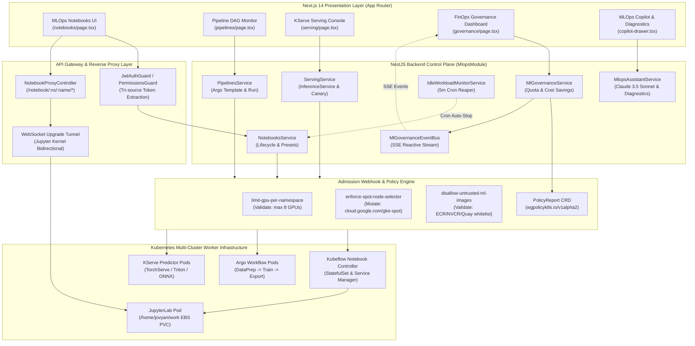
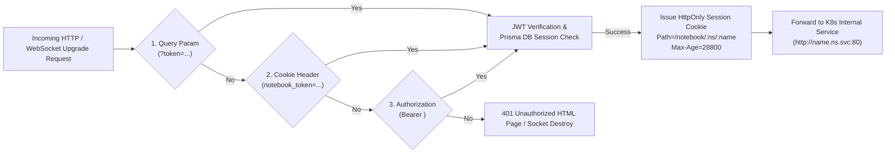
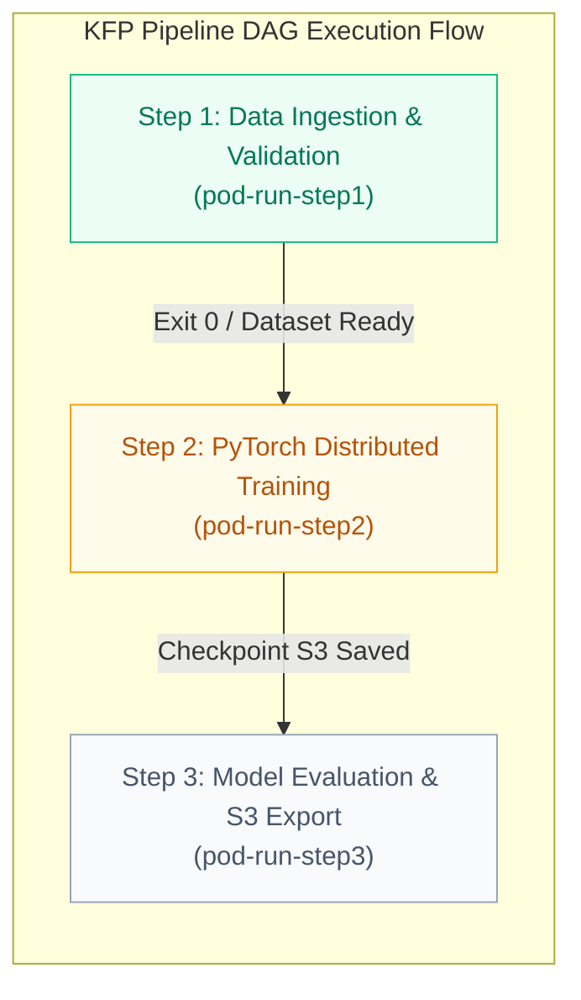
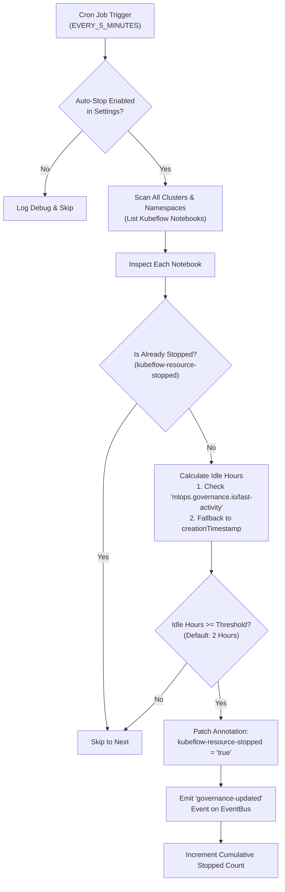
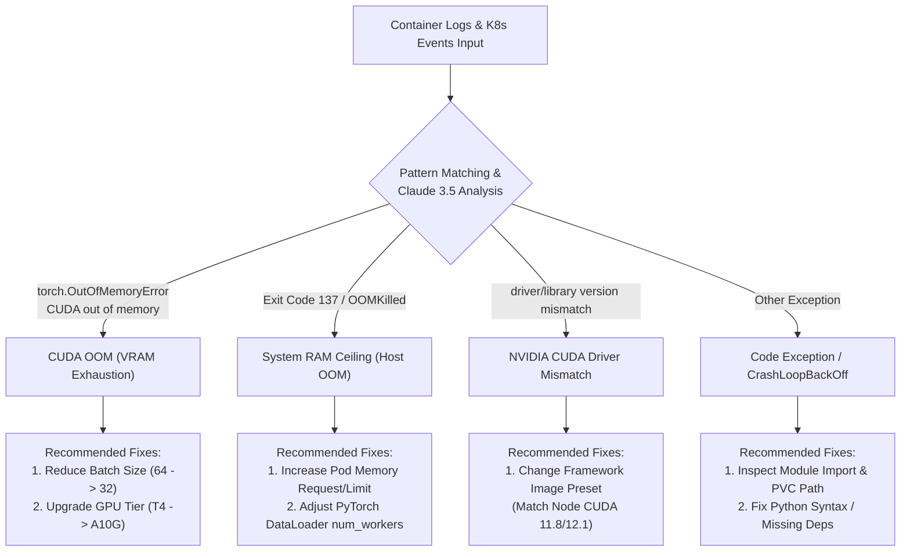

# Chapter 3: MLOps Platform & FinOps Suite

> **문서 식별자**: `DOC-PAC-KYVERNO-CH3`  
> **대상 플랫폼**: Kubernetes v1.28+, Kubeflow v1.8+, KServe v0.11+, Kyverno v1.12+, AWS Bedrock Claude 3.5 Sonnet  
> **최신 갱신일**: 2026-09-11  
> **모듈 위치**: [`apps/backend/src/mlops`](file:///home/user/work_dir/apps/backend/src/mlops) / [`apps/frontend/src/app/mlops`](file:///home/user/work_dir/apps/frontend/src/app/mlops) / [`k8s-manifests/policies/mlops`](file:///home/user/work_dir/k8s-manifests/policies/mlops)

---

## 목차 (Table of Contents)

1. [개요 및 시스템 아키텍처 (Overview of MLOps within Kyverno Governance)](#1-개요-및-시스템-아키텍처-overview-of-mlops-within-kyverno-governance)
   - 1.1. MLOps 거버넌스 통합의 필요성 및 설계 철학
   - 1.2. MLOps 엔드-투-엔드 시스템 토폴로지 (System Topology & Control Plane Flow)
   - 1.3. 백엔드 모듈 및 도메인 에러 카탈로그 ([`MlopsModule`](file:///home/user/work_dir/apps/backend/src/mlops/mlops.module.ts#L81) & [`MLOPS_ERROR`](file:///home/user/work_dir/apps/backend/src/mlops/mlops.errors.ts#L7-L62))
2. [Kubeflow Notebook 셀프서비스 및 인앱 리버스 프록시 (Notebook Self-Service & In-App Reverse Proxy)](#2-kubeflow-notebook-셀프서비스-및-인앱-리버스-프록시-notebook-self-service--in-app-reverse-proxy)
   - 2.1. Kubeflow Notebook CRD 및 컨트롤러 아키텍처
   - 2.2. 하드웨어 티어 및 프레임워크 런타임 프리셋 카탈로그
   - 2.3. 영구 워크스페이스 스토리지(EBS PVC) 자동화 프로비저닝
   - 2.4. 인앱 리버스 프록시 ([`NotebookProxyController`](file:///home/user/work_dir/apps/backend/src/mlops/notebooks/notebook-proxy.controller.ts#L11-L31) & [`NotebookProxyService`](file:///home/user/work_dir/apps/backend/src/mlops/notebooks/notebook-proxy.service.ts#L22-L310))
   - 2.5. 삼중 인증 체계(Tri-source Auth) 및 WebSocket 커널 업그레이드 터널링
   - 2.6. 노트북 프로비저닝 및 브라우저 세션 연결 시퀀스 다이어그램
3. [Kubeflow Pipelines (KFP) 워크플로우 엔진 (Kubeflow Pipelines Orchestration)](#3-kubeflow-pipelines-kfp-워크플로우-엔진-kubeflow-pipelines-orchestration)
   - 3.1. Argo Workflows 기반 KFP 어댑터 설계 ([`KFPAdapter`](file:///home/user/work_dir/apps/backend/src/mlops/pipelines/kfp.adapter.ts#L29-L387))
   - 3.2. 파이프라인 템플릿 카탈로그 및 매개변수화된 Run 실행 제출
   - 3.3. 인터랙티브 DAG 실행 모니터링 ([`DagRunMonitor`](file:///home/user/work_dir/apps/frontend/src/app/mlops/pipelines/dag-run-monitor.tsx))
   - 3.4. Server-Sent Events (SSE) 기반 실시간 상태 갱신 및 컨테이너 로그 스트리밍
4. [KServe 모델 서빙 및 트래픽 거버넌스 (KServe Model Serving & Traffic Governance)](#4-kserve-모델-서빙-및-트래픽-거버넌스-kserve-model-serving--traffic-governance)
   - 4.1. InferenceService CRD 오케스트레이션 ([`KServeAdapter`](file:///home/user/work_dir/apps/backend/src/mlops/serving/kserve.adapter.ts#L25-L390))
   - 4.2. 멀티 프레임워크 서빙 런타임 및 S3/MinIO 모델 저장소 검증
   - 4.3. 듀얼 패치(Dual-Patch) 기반 카나리(Canary) 트래픽 분할 제어
   - 4.4. 실시간 대화형 예측 테스트 콘솔 ([`ApiTestConsoleDialog`](file:///home/user/work_dir/apps/frontend/src/app/mlops/serving/api-test-console-dialog.tsx))
   - 4.5. Serverless Scale-to-Zero 및 리소스 오토스케일링
5. [GPU 쿼터 및 FinOps 거버넌스 (GPU Quota & FinOps Governance)](#5-gpu-쿼터-및-finops-거버넌스-gpu-quota--finops-governance)
   - 5.1. 네임스페이스 단위 GPU 쿼터 할당 및 실시간 모니터링 ([`GpuQuotaService`](file:///home/user/work_dir/apps/backend/src/mlops/governance/gpu-quota.service.ts#L19-L101))
   - 5.2. 백그라운드 리퍼: 유휴 워크로드 자동 수거기 ([`IdleWorkloadMonitorService`](file:///home/user/work_dir/apps/backend/src/mlops/governance/idle-workload-monitor.service.ts#L30-L231))
   - 5.3. FinOps 클라우드 비용 절감액 산출 공식 및 분석 위젯
   - 5.4. 거버넌스 이벤트 버스([`MlGovernanceEventBus`](file:///home/user/work_dir/apps/backend/src/mlops/governance/ml-governance-event-bus.service.ts)) 및 반응형 실시간 스트리밍
6. [MLOps AI Copilot 및 장애 근본 원인 진단 (MLOps AI Copilot & Diagnostics)](#6-mlops-ai-copilot-및-장애-근본-원인-진단-mlops-ai-copilot--diagnostics)
   - 6.1. AWS Bedrock Claude 3.5 Sonnet 연동 어시스턴트 ([`MlopsAssistantService`](file:///home/user/work_dir/apps/backend/src/mlops/ai-assistant/mlops-assistant.service.ts#L13-L184))
   - 6.2. 자연어 MLOps Intent 파싱 및 원클릭 액션 카드 ([`MlopsIntentParserService`](file:///home/user/work_dir/apps/backend/src/mlops/ai-assistant/mlops-intent-parser.service.ts#L8-L122))
   - 6.3. 머신러닝 워크로드 실패 진단 엔진 ([`WorkloadDiagnosticService`](file:///home/user/work_dir/apps/backend/src/mlops/ai-assistant/workload-diagnostic.service.ts#L13-L190))
   - 6.4. 장애 유형별 근본 원인 및 복구 권고안 (CUDA OOM, Exit 137, Driver Mismatch)
   - 6.5. 네트워크 단절 대비 규칙 기반 폴백 엔진 (Rule-Engine Fallback)
7. [ML 클러스터 보호를 위한 Kyverno 정책 슈트 (MLOps Kyverno Policy Defense Suite)](#7-ml-클러스터-보호를-위한-kyverno-정책-슈트-mlops-kyverno-policy-defense-suite)
   - 7.1. 네임스페이스 GPU 과점 차단 정책 ([`limit-gpu-per-namespace.yaml`](file:///home/user/work_dir/k8s-manifests/policies/mlops/limit-gpu-per-namespace.yaml))
   - 7.2. ML 배치 학습 Spot 노드 셀렉터 자동 주입 ([`enforce-spot-node-selector.yaml`](file:///home/user/work_dir/k8s-manifests/policies/mlops/enforce-spot-node-selector.yaml))
   - 7.3. 미인가 ML 레지스트리 컨테이너 이미지 차단 ([`disallow-untrusted-ml-images.yaml`](file:///home/user/work_dir/k8s-manifests/policies/mlops/disallow-untrusted-ml-images.yaml))
   - 7.4. PolicyReport 기반 위반 탐지 및 실시간 교정 가이드
8. [MLOps 플랫폼 API 및 엔드포인트 참조 규격 (API Reference Specifications)](#8-mlops-플랫폼-api-및-엔드포인트-참조-규격-api-reference-specifications)
9. [파일 링크 참조 색인 (Comprehensive Codebase & Manifest Index)](#9-파일-링크-참조-색인-comprehensive-codebase--manifest-index)

---

## 1. 개요 및 시스템 아키텍처 (Overview of MLOps within Kyverno Governance)

### 1.1. MLOps 거버넌스 통합의 필요성 및 설계 철학

엔터프라이즈 머신러닝 인프라는 대규모 분산 연산, 고가의 GPU 가속기 자원(`nvidia.com/gpu`), 복잡한 공급망 라이브러리(PyTorch, TensorFlow, CUDA 런타임)를 요구합니다. 이로 인해 다음과 같은 세 가지 치명적인 운영 난제가 발생합니다:

1. **FinOps 비용 폭증 및 자원 유휴(Idle Resource Waste)**: 데이터 사이언티스트가 분석 및 모델 디버깅을 위해 고비용 GPU 인스턴스(NVIDIA A10G, T4 등)를 할당받은 후 세션을 종료하지 않고 방치하여 막대한 유휴 비용이 청구됩니다.
2. **ML 공급망 보안 취약점**: 외부 공개 레지스트리(Docker Hub 등)의 악성 코드가 포함된 임의 이미지 배포, 루트 권한 Jupyter 컨테이너 구동으로 인한 클러스터 노드 탈취 위험이 존재합니다.
3. **인프라 접근 복잡성**: 각 개발자마다 개별 Ingress 라우팅 규칙, TLS 인증서, 로컬 `kubectl port-forward`를 구성해야 하는 번거로움으로 인해 개발 생산성이 저하됩니다.

**PaC Kyverno Governance Platform**의 MLOps Suite는 이러한 문제를 해결하기 위해 **Policy-as-Code(Kyverno)**와 **MLOps 자율 인프라(Kubeflow & KServe)**를 완벽하게 통합했습니다. 사전 검증된 하드웨어 티어 기반의 셀프서비스 프로비저닝, 쿠버네티스 Ingress 설정 없이 동작하는 **인앱 리버스 프록시**, 5분 주기 백그라운드 **유휴 자원 리퍼(Idle Reaper)**, 그리고 **AWS Bedrock Claude 3.5 Sonnet** 기반의 AI 진단 코파일럿을 단일 거버넌스 제어 평면으로 제공합니다.

### 1.2. MLOps 엔드-투-엔드 시스템 토폴로지 (System Topology & Control Plane Flow)



### 1.3. 백엔드 모듈 및 도메인 에러 카탈로그 ([`MlopsModule`](file:///home/user/work_dir/apps/backend/src/mlops/mlops.module.ts#L81) & [`MLOPS_ERROR`](file:///home/user/work_dir/apps/backend/src/mlops/mlops.errors.ts#L7-L62))

MLOps 도메인의 모든 비즈니스 로직은 [`apps/backend/src/mlops/mlops.module.ts`](file:///home/user/work_dir/apps/backend/src/mlops/mlops.module.ts)에 응집되어 있으며, 6개의 REST/Proxy 컨트롤러와 11개의 전문 프로바이더를 등록합니다:

```typescript
// apps/backend/src/mlops/mlops.module.ts (Core Definition)
@Module({
  imports: [
    JwtModule.register({}),
    KubernetesModule,
    PrismaModule,
    AiAgentModule,
  ],
  controllers: [
    NotebooksController,
    NotebookProxyController,
    MlGovernanceController,
    PipelinesController,
    ServingController,
    MlopsAssistantController,
  ],
  providers: [
    KubeflowAdapter, NotebooksService, NotebookProxyService,
    GpuQuotaService, IdleWorkloadMonitorService, MlGovernanceEventBus, MlGovernanceService,
    KFPAdapter, PipelinesService,
    KServeAdapter, ServingService,
    MlopsAssistantService, MlopsIntentParserService, WorkloadDiagnosticService,
  ],
  exports: [
    KubeflowAdapter, NotebooksService, NotebookProxyService,
    GpuQuotaService, IdleWorkloadMonitorService, MlGovernanceEventBus, MlGovernanceService,
    KFPAdapter, PipelinesService,
    KServeAdapter, ServingService,
    MlopsAssistantService, MlopsIntentParserService, WorkloadDiagnosticService,
  ],
})
export class MlopsModule {}
```

플랫폼 전반에서 발생하는 MLOps 관련 예외는 [`apps/backend/src/mlops/mlops.errors.ts`](file:///home/user/work_dir/apps/backend/src/mlops/mlops.errors.ts)의 표준 에러 카탈로그 객체 [`MLOPS_ERROR`](file:///home/user/work_dir/apps/backend/src/mlops/mlops.errors.ts#L7-L62)를 통해 구조화된 코드로 변환됩니다:

| 에러 식별자 (Error Code) | 표준 에러 메시지 (Standard Message) | 발생 원인 및 비즈니스 맥락 |
| :--- | :--- | :--- |
| `MLOPS_NOTEBOOK_NOT_FOUND` | Target Kubeflow Notebook instance was not found. | 요청한 네임스페이스에 대상 노트북 CRD 인스턴스가 존재하지 않음 |
| `MLOPS_NOTEBOOK_ALREADY_EXISTS` | A Notebook instance with the same name already exists in this namespace. | 네임스페이스 내 동일 명칭의 노트북이 기생성되어 충돌 발생 |
| `MLOPS_GPU_QUOTA_EXCEEDED` | Requested GPU resources exceed the allowed quota for your cluster. | 네임스페이스 GPU 할당 한도(16 GPU)를 초과하거나 비활성 GPU 티어 선택 시 |
| `MLOPS_CLUSTER_ACCESS_DENIED` | User does not have access to the specified cluster for MLOps resources. | RBAC 테넌트 사용자 권한에 매핑되지 않은 클러스터 ID로 자원 생성 시도 |
| `MLOPS_INVALID_PRESET` | Specified hardware tier or framework image preset is invalid. | 등록되지 않은 잘못된 하드웨어 티어 또는 런타임 이미지 ID가 전달됨 |
| `MLOPS_NOTEBOOK_CREATION_FAILED` | Failed to create Kubeflow Notebook resource in Kubernetes API server. | Kubernetes API Server 통신 오류 또는 PVC 프로비저닝 단계 실패 |
| `MLOPS_POLICY_VIOLATION` | ML workload violates Kyverno resource allocation or registry policies. | Kyverno Admission Controller에 의해 Enforce 거부(Block) 발생 시 |
| `MLOPS_GOVERNANCE_SETTINGS_INVALID`| Invalid configuration settings provided for MLOps governance. | 유휴 감시 임계시간(0시간 이하 등) 파라미터 유효성 검증 실패 시 |
| `MLOPS_IDLE_MONITOR_FAILED` | Failed to inspect or auto-shutdown idle ML workloads. | 백그라운드 리퍼 실행 도중 클러스터 노드 접근 또는 Stop 어노테이션 패치 실패 |
| `MLOPS_INVALID_MODEL_PATH` | The specified S3/MinIO model storage path is invalid or inaccessible. | `s3://` 또는 `minio://` 프로토콜 형식을 따르지 않는 비정상 스토리지 URI |
| `MLOPS_SERVING_DEPLOYMENT_FAILED`| Failed to create or update KServe InferenceService resource. | KServe v1beta1 CRD 생성 또는 듀얼 패치 적용 중 K8s API 거부 발생 |
| `MLOPS_PIPELINE_RUN_FAILED` | Failed to trigger or inspect Kubeflow Pipeline execution run. | Argo Workflow 제출 단계 실패 또는 지정된 파이프라인 파라미터 결함 |

---

## 2. Kubeflow Notebook 셀프서비스 및 인앱 리버스 프록시 (Notebook Self-Service & In-App Reverse Proxy)

### 2.1. Kubeflow Notebook CRD 및 컨트롤러 아키텍처

플랫폼은 공식 Kubeflow Notebook Operator CRD 규격인 [`kubeflow.org/v1` `Notebook`](file:///home/user/work_dir/k8s-manifests/crds/kubeflow.org_notebooks.yaml#L8-L18)을 채택하여 상태 기반 선언적 라이프사이클을 관리합니다. 클러스터 시스템 네임스페이스(`kubeflow`)에 배포된 [`notebook-controller`](file:///home/user/work_dir/k8s-manifests/base/notebook-controller.yaml#L106-L180)는 등록된 `Notebook` 리소스를 감지(Watch)하여 다음과 같은 하위 자원을 자동으로 동기화합니다:

1. **StatefulSet 관리**: 단일 Pod 인스턴스를 유지하며 비정상 노드 장애 발생 시에도 홈 디렉토리 PVC 바인딩을 보존합니다.
2. **Headless / ClusterIP Service 자동 생성**: `http://${name}.${namespace}.svc.cluster.local:80` 형태의 L4 내부 서비스를 노출하여 클러스터 내부 통신 경로를 확보합니다.
3. **Graceful Stop Annotation**: `metadata.annotations["kubeflow-resource-stopped"] = "true"`가 패치되면 컨트롤러가 StatefulSet 레플리카 수를 0으로 조정하여 컴퓨팅 자원을 즉시 반납하고 볼륨은 그대로 유지합니다.

### 2.2. 하드웨어 티어 및 프레임워크 런타임 프리셋 카탈로그

데이터 사이언티스트가 복잡한 YAML 매니페스트를 직접 작성하지 않도록 [`HARDWARE_PRESETS`](file:///home/user/work_dir/apps/backend/src/mlops/notebooks/notebooks.service.ts#L27-L76) 및 [`FRAMEWORK_PRESETS`](file:///home/user/work_dir/apps/backend/src/mlops/notebooks/notebooks.service.ts#L81-L106)를 카탈로그화하여 API 및 셀프서비스 UI 폼에 제공합니다:

#### 하드웨어 티어 프리셋 규격 ([`HARDWARE_PRESETS`](file:///home/user/work_dir/apps/backend/src/mlops/notebooks/notebooks.service.ts#L27-L76))
| Preset ID | 티어 명칭 | CPU Request / Limit | Memory Request / Limit | GPU Limit | 활성화 상태 및 특이사항 |
| :--- | :--- | :--- | :--- | :--- | :--- |
| `CPU_SMALL` | Small CPU | 0.5 Core / 1.0 Core | 1.0 GiB / 2.0 GiB | 0 | **Active**: 경량 탐색적 데이터 분석(EDA) 전용 |
| `CPU_MEDIUM` | Medium CPU | 1.0 Core / 2.0 Core | 2.0 GiB / 4.0 GiB | 0 | **Active**: 일반 머신러닝 데이터 전처리 및 분석 |
| `GPU_T4_STANDARD` | NVIDIA T4 Standard | 2.0 Core / 4.0 Core | 8.0 GiB / 16.0 GiB | 1 GPU | 클러스터 GPU 풀 현황에 따라 동적 프로비저닝 |
| `GPU_A10G_HIGH` | NVIDIA A10G High-Mem| 4.0 Core / 8.0 Core | 16.0 GiB / 32.0 GiB | 1 GPU | 대용량 LLM 파인튜닝 및 분산 학습 전용 |
| `CUSTOM` | Custom Config | 사용자 정의 (최소 0.5) | 사용자 정의 (최소 1GiB) | 0 (GPU 초과 차단) | 쿼터 정책 범위 내 커스텀 리소스 지정 |

#### 프레임워크 이미지 프리셋 규격 ([`FRAMEWORK_PRESETS`](file:///home/user/work_dir/apps/backend/src/mlops/notebooks/notebooks.service.ts#L81-L106))
| Preset ID | 환경 명칭 | 베이스 컨테이너 이미지 (사내 승인 레지스트리) | IDE 타입 |
| :--- | :--- | :--- | :--- |
| `JUPYTER_PYTORCH` | PyTorch 2.1 + CUDA 12.1 | `kubeflownotebookswg/jupyter-pytorch-full:v1.8.0` | JupyterLab |
| `JUPYTER_TENSORFLOW`| TensorFlow 2.14 + CUDA 11.8| `kubeflownotebookswg/jupyter-tensorflow-full:v1.8.0` | JupyterLab |
| `JUPYTER_SCIPY` | Jupyter Scipy (Python 3.11)| `kubeflownotebookswg/jupyter-scipy:v1.8.0` | JupyterLab |
| `RSTUDIO` | RStudio Server (R 4.3) | `kubeflownotebookswg/rstudio:v1.8.0` | RStudio |

### 2.3. 영구 워크스페이스 스토리지(EBS PVC) 자동화 프로비저닝

노트북 인스턴스가 재시작되거나 사양 변경을 위해 중지(Stop)되더라도 데이터 사이언티스트의 학습 코드, 가중치 체크포인트 및 데이터셋이 영구 보존되어야 합니다.
[`KubeflowAdapter.ensureWorkspacePvc()`](file:///home/user/work_dir/apps/backend/src/mlops/notebooks/kubeflow.adapter.ts#L257-L299) 메서드는 노트북 생성 요청 시 `${name}-workspace-pvc` 명칭의 `ReadWriteOnce` 볼륨을 검증하고 누락 시 자동 생성합니다:

```typescript
// kubeflow.adapter.ts (PersistentVolumeClaim Generation)
await coreApi.createNamespacedPersistentVolumeClaim({
  namespace,
  body: {
    apiVersion: "v1",
    kind: "PersistentVolumeClaim",
    metadata: {
      name: `${dto.name}-workspace-pvc`,
      namespace,
      labels: { "app.kubernetes.io/component": "mlops-notebook-storage" },
    },
    spec: {
      accessModes: ["ReadWriteOnce"],
      resources: { requests: { storage: `${storageGb}Gi` } },
    },
  },
});
```
생성된 볼륨은 Jupyter 컨테이너의 `/home/jovyan/work` 경로에 마운트되어 워크스페이스 격리를 보장합니다.

### 2.4. 인앱 리버스 프록시 ([`NotebookProxyController`](file:///home/user/work_dir/apps/backend/src/mlops/notebooks/notebook-proxy.controller.ts#L11-L31) & [`NotebookProxyService`](file:///home/user/work_dir/apps/backend/src/mlops/notebooks/notebook-proxy.service.ts#L22-L310))

전통적인 쿠버네티스 MLOps 환경에서는 개별 노트북마다 Ingress 라우팅 리소스, 외부 DNS 레코드, SSL/TLS 인증서 발급이 필요했습니다. 이는 수많은 CRD 생성 오버헤드와 함께 보안 감사 홀을 유발합니다.
본 플랫폼은 NestJS 백엔드 내에 고성능 **인앱 리버스 프록시**를 구현하여 외부 Ingress 없이 단일 플랫폼 도메인 내에서 완벽한 웹 IDE 세션을 중계합니다:

- **엔드포인트 라우팅**: `/notebook/:namespace/:name/*` 경로로 인입되는 모든 HTTP 트래픽을 정규식으로 캡처
- **동적 업스트림 해석(Dynamic Upstream Routing)**:
  $$\text{Target URL} = \texttt{http://\{name\}.\{namespace\}.svc.cluster.local:80}$$
- **URL Rewrite 보존**: JupyterLab은 내부 자산 로딩 시 자신의 기본 하위 경로(`base_url=/notebook/:namespace/:name`)를 인지해야 하므로 `req.originalUrl`을 그대로 보존하여 포워딩합니다.

### 2.5. 삼중 인증 체계(Tri-source Auth) 및 WebSocket 커널 업그레이드 터널링

JupyterLab 웹 환경은 단순 REST 요청뿐만 아니라 대화형 Python 커널 연산 결과를 실시간 수신하기 위해 **양방향 WebSocket 통신**(`/_xsrf`, `/api/kernels/.../channels`)을 사용합니다. 일반 브라우저는 WebSocket 핸드셰이크 시 임의의 `Authorization: Bearer` 헤더를 주입할 수 없으므로 다음의 **3단계 토큰 추출 메커니즘**을 설계했습니다:



1. **최초 진입 시점**: UI의 [NotebookConnectDialog](file:///home/user/work_dir/apps/frontend/src/app/mlops/notebooks/notebook-connect-dialog.tsx#L43)에서 팝업창 오픈 시 URL 쿼리 스트링(`?token=${accessToken}`)을 부여하여 진입합니다.
2. **세션 쿠키 변환 발급**: 프록시 미들웨어([`NotebookProxyService`](file:///home/user/work_dir/apps/backend/src/mlops/notebooks/notebook-proxy.service.ts#L59))는 쿼리 토큰을 확인한 즉시 `HttpOnly; SameSite=Lax; Path=/notebook/:ns/:name; Max-Age=28800` 스코프 쿠키로 전환하여 응답 헤더에 주입합니다.
3. **WebSocket Upgrade 인터셉트**: [`onApplicationBootstrap()`](file:///home/user/work_dir/apps/backend/src/mlops/notebooks/notebook-proxy.service.ts#L103-L135)에서 Node.js HTTP Server의 `upgrade` 이벤트를 가로채 쿠키 또는 쿼리 토큰의 유효성을 검증하고, 유효한 경우에만 TCP 소켓을 파이프하여 Jupyter 커널 연결을 성립시킵니다.

### 2.6. 노트북 프로비저닝 및 브라우저 세션 연결 시퀀스 다이어그램

```mermaid
sequenceDiagram
  autonumber
  actor User as Data Scientist
  participant WebUI as Frontend (Next.js)
  participant API as Backend (NotebooksController)
  participant Proxy as In-App Proxy (NotebookProxyService)
  participant K8s as Kubernetes API Server
  participant Controller as Kubeflow Notebook Controller
  participant Pod as JupyterLab Pod & PVC

  User->>WebUI: Click '새 노트북 생성' (Select PyTorch + Small CPU)
  WebUI->>API: POST /mlops/notebooks (CreateNotebookDto)
  API->>API: Validate Cluster Access & Quota
  API->>K8s: Ensure PVC (${name}-workspace-pvc, 10Gi)
  API->>K8s: Create CustomObject (kubeflow.org/v1 Notebook)
  K8s-->>API: Created (Status: Pending)
  API-->>WebUI: 201 Created (NotebookResponseDto)

  Controller->>K8s: Watch Event (Notebook ADDED)
  Controller->>K8s: Reconcile StatefulSet & ClusterIP Service
  Controller->>Pod: Mount Workspace PVC & Launch Container
  Pod-->>Controller: Readiness Probe Passed (Port 80 Ready)

  User->>WebUI: Click 'JupyterLab 열기'
  WebUI->>Proxy: GET /notebook/default/my-nb/lab?token=JWT
  Proxy->>Proxy: Validate JWT Token & Verify Session
  Proxy-->>WebUI: 200 OK (Set-Cookie: notebook_token=JWT; Path=/notebook/default/my-nb)
  Proxy->>Pod: Forward HTTP to http://my-nb.default.svc.cluster.local:80
  Pod-->>Proxy-->>User: Render JupyterLab IDE Workspace

  User->>Pod: Execute Code Cell (WebSocket /api/kernels/.../channels)
  WebUI->>Proxy: Upgrade: websocket (Cookie: notebook_token=JWT)
  Proxy->>Proxy: Validate Token & Delegate to http-proxy-middleware upgrade()
  Proxy->>Pod: Direct Bi-directional TCP Socket Pipe
  Pod-->>User: Stream Kernel stdout/stderr outputs
```

---

## 3. Kubeflow Pipelines (KFP) 워크플로우 엔진 (Kubeflow Pipelines Orchestration)

### 3.1. Argo Workflows 기반 KFP 어댑터 설계 ([`KFPAdapter`](file:///home/user/work_dir/apps/backend/src/mlops/pipelines/kfp.adapter.ts#L29-L387))

대규모 머신러닝 모델 학습은 단일 스크립트 실행을 넘어 **데이터 수집 및 전처리(Data Ingestion) $\to$ 분산 모델 학습(Distributed Training) $\to$ 평가 및 모델 아티팩트 레지스트리 저장(Evaluation & S3 Export)**으로 이어지는 유향 비순환 그래프(DAG: Directed Acyclic Graph) 실행을 필요로 합니다.
[`KFPAdapter`](file:///home/user/work_dir/apps/backend/src/mlops/pipelines/kfp.adapter.ts#L29-L387)는 Kubeflow Pipelines의 내부 실행 엔진인 **Argo Workflows**(`argoproj.io/v1alpha1`, plural: `workflows`) 커스텀 리소스를 직접 제어하도록 설계되었습니다.

### 3.2. 파이프라인 템플릿 카탈로그 및 매개변수화된 Run 실행 제출

[`PipelinesService`](file:///home/user/work_dir/apps/backend/src/mlops/pipelines/pipelines.service.ts#L43-L75)는 재사용 가능한 파이프라인 템플릿을 제공하며, 사용자가 하이퍼파라미터(Learning Rate, Batch Size, Epochs, Dataset S3 URI)를 입력하여 즉시 K8s 클러스터에 실행 인스턴스(Run)를 제출할 수 있도록 지원합니다:

```typescript
// apps/backend/src/mlops/pipelines/dto/create-run.dto.ts
export class CreateRunDto {
  @ApiProperty({ example: "pipe-resnet50-train" })
  pipelineId: string;

  @ApiProperty({ example: "resnet50-cifar10-v1" })
  runName: string;

  @ApiProperty({ example: "s3://mlops-storage/datasets/cifar10" })
  datasetUri: string;

  @ApiProperty({ example: { learning_rate: "0.001", batch_size: 32, epochs: 10 } })
  parameters?: Record<string, unknown>;

  @ApiProperty({ example: "default" })
  clusterId?: string;

  @ApiProperty({ example: "kubeflow" })
  namespace?: string;
}
```

### 3.3. 인터랙티브 DAG 실행 모니터링 ([`DagRunMonitor`](file:///home/user/work_dir/apps/frontend/src/app/mlops/pipelines/dag-run-monitor.tsx))

프론트엔드 파이프라인 모니터링 컴포넌트인 [`DagRunMonitor`](file:///home/user/work_dir/apps/frontend/src/app/mlops/pipelines/dag-run-monitor.tsx)는 파이프라인의 각 실행 스텝(Node) 상태를 실시간 시각화합니다:
- **스텝 진행 상태 뱃지**: `Pending`(대기), `Running`(실행 중 - 펄스 애니메이션 적용), `Succeeded`(성공), `Failed`(실패)
- **개별 Pod 매핑**: 각 DAG 스텝마다 실제 클러스터에 기동된 컨테이너 Pod 명칭(`podName`)과 컨테이너(`main`)를 추적
- **원클릭 로그 뷰어 연동**: 스텝 카드의 "로그 보기" 버튼 클릭 시 사이드 [LogDrawer](file:///home/user/work_dir/apps/frontend/src/app/mlops/pipelines/log-drawer.tsx)를 열어 Pod 로그를 즉시 덤프



### 3.4. Server-Sent Events (SSE) 기반 실시간 상태 갱신 및 컨테이너 로그 스트리밍

클라이언트의 주기적 폴링(Polling)으로 인한 서버 부하를 제거하기 위해 두 가지 SSE(Server-Sent Events) 스트림 엔드포인트를 제공합니다:

1. **파이프라인 상태 이벤트 스트림**: [`GET /api/v1/mlops/pipelines/events`](file:///home/user/work_dir/apps/backend/src/mlops/pipelines/pipelines.controller.ts#L164-L180)
   - K8s Watcher가 Argo Workflow의 `status.phase` 변경(`ADDED`, `MODIFIED`)을 감지하여 브라우저에 `pipeline-updated` 이벤트를 푸시
2. **실시간 Pod 컨테이너 로그 스트림**: [`GET /api/v1/mlops/pipelines/runs/:runId/logs/stream`](file:///home/user/work_dir/apps/backend/src/mlops/pipelines/pipelines.controller.ts#L184-L211)
   - 특정 DAG 노드 Pod의 실행 stdout 로그 단편을 3초 주기로 차분 스트리밍(`log-step` 이벤트)

---

## 4. KServe 모델 서빙 및 트래픽 거버넌스 (KServe Model Serving & Traffic Governance)

### 4.1. InferenceService CRD 오케스트레이션 ([`KServeAdapter`](file:///home/user/work_dir/apps/backend/src/mlops/serving/kserve.adapter.ts#L25-L390))

학습 완료된 모델의 실시간 추론(Inference)을 위해 클러스터 내의 **KServe**(`serving.kserve.io/v1beta1`, plural: `inferenceservices`) 컨트롤러를 연동합니다.
[`KServeAdapter`](file:///home/user/work_dir/apps/backend/src/mlops/serving/kserve.adapter.ts#L25-L390)는 모델의 최소/최대 레플리카 수(`minReplicas`, `maxReplicas`), 프레임워크 런타임 및 S3 스토리지 경로를 수신하여 선언적 K8s CRD 매니페스트를 자동 생성합니다.

### 4.2. 멀티 프레임워크 서빙 런타임 및 S3/MinIO 모델 저장소 검증

KServe 어댑터는 모델 배포 요청 시 지원 프레임워크에 맞춰 최적화된 Predictor 런타임을 구성합니다:
- **PyTorch (TorchServe)**: `spec.predictor.pytorch.storageUri`
- **ONNX Runtime**: `spec.predictor.onnx.storageUri`
- **TensorFlow (TFServing)**: `spec.predictor.tensorflow.storageUri`
- **Scikit-learn (MLServer)**: `spec.predictor.sklearn.storageUri`

[`ServingService.validateStorageUri()`](file:///home/user/work_dir/apps/backend/src/mlops/serving/serving.service.ts#L37-L41)는 모델 저장소 경로가 반드시 사내 승인된 오브젝트 스토리지 프로토콜(`s3://` 또는 `minio://`)로 시작하는지 검증하여, 비인가된 외부 HTTP 파일 주입을 사전에 방어합니다.

### 4.3. 듀얼 패치(Dual-Patch) 기반 카나리(Canary) 트래픽 분할 제어

새로운 버전의 모델을 프로덕션 환경에 무중단 배포할 때, 갑작스러운 트래픽 전량 전환으로 인한 장애를 방어하기 위해 **Canary Traffic Splitting**을 지원합니다.
KServe 컨트롤러 버전에 따라 트래픽 가중치를 어노테이션으로 읽는 환경과 Spec 필드로 읽는 환경이 혼재되어 있으므로, [`KServeAdapter.updateTrafficSplit()`](file:///home/user/work_dir/apps/backend/src/mlops/serving/kserve.adapter.ts#L181-L254)는 **Dual-Patch Body** 메커니즘을 적용했습니다:

```typescript
// apps/backend/src/mlops/serving/kserve.adapter.ts (Dual-Patch Canary Logic)
const patchBody = [
  {
    op: "add",
    path: "/metadata/annotations/serving.kserve.io~1canaryTrafficPercent",
    value: String(canaryTrafficPercent),
  },
  {
    op: "add",
    path: "/spec/canaryTrafficPercent",
    value: canaryTrafficPercent,
  },
];
```

프론트엔드의 [`CanaryTrafficSlider`](file:///home/user/work_dir/apps/frontend/src/app/mlops/serving/canary-traffic-slider.tsx) 컴포넌트는 사용자가 슬라이더 바를 0%에서 100%까지 5% 단위로 조작하여 즉각적으로 Canary 비율을 반영할 수 있도록 UI 인터랙션을 제공합니다.

### 4.4. 실시간 대화형 예측 테스트 콘솔 ([`ApiTestConsoleDialog`](file:///home/user/work_dir/apps/frontend/src/app/mlops/serving/api-test-console-dialog.tsx))

배포된 InferenceService의 예측 정확도와 엔드-투-엔드 응답 지연 시간(Latency ms)을 즉시 검증할 수 있도록 통합 테스트 콘솔 다이얼로그를 내장하고 있습니다:
- **입력 텐서 페이로드 작성**: JSON 포맷의 입력 텐서(`instances: [[0.1, 0.2, ...]]`) 편집
- **실시간 예측 실행**: [`POST /mlops/serving/endpoints/:name/test`](file:///home/user/work_dir/apps/backend/src/mlops/serving/serving.controller.ts#L164-L189) 엔드포인트를 호출하여 KServe 모델 컨테이너에 요청 중계
- **결과 출력 및 지연 시간 분석**: 모델 예측 결과 텐서(`predictions: [...]`) 및 실행 지연 시간(e.g. `42ms`)을 실시간 디스플레이

### 4.5. Serverless Scale-to-Zero 및 리소스 오토스케일링

KServe는 Knative Serving 레이어와 연동되어 모델에 인입되는 트래픽이 없을 경우 Pod 레플리카 수를 0으로 축소하는 **Scale-to-Zero**를 지원합니다:
- `minReplicas: 0`: 유휴 상태 시 Pod가 완전히 종료되어 노드 컴퓨팅 자원 반납
- 트래픽 인입 시 KNative Activator가 요청을 큐잉하고 새 Pod를 Cold-Start한 후 요청을 안전하게 처리

---

## 5. GPU 쿼터 및 FinOps 거버넌스 (GPU Quota & FinOps Governance)

### 5.1. 네임스페이스 단위 GPU 쿼터 할당 및 실시간 모니터링 ([`GpuQuotaService`](file:///home/user/work_dir/apps/backend/src/mlops/governance/gpu-quota.service.ts#L19-L101))

GPU 리소스는 노드 풀 비용의 80% 이상을 차지하므로 정밀한 네임스페이스 테넌트 쿼터 제어가 필수적입니다.
[`GpuQuotaService`](file:///home/user/work_dir/apps/backend/src/mlops/governance/gpu-quota.service.ts#L19-L101)는 클러스터 내 실행 중인 모든 활성 워크로드(Jupyter Notebooks, Serving Pods)의 리소스 요청량을 실시간 합산하여 쿼터를 평가합니다:

$$\text{Used GPUs} = \sum_{\text{Workload} \in \text{Running}} \text{limits}[\text{"nvidia.com/gpu"}]$$

$$\text{Usage Percentage} = \min\left(100, \left\lfloor \frac{\text{Used GPUs}}{\text{Total Limit}} \times 100 \right\rfloor\right)$$

- 중지된 노트북(`kubeflow-resource-stopped: "true"`)은 계산에서 자동 제외되어 실제 점유량만을 정확히 반영
- 기본 네임스페이스 한도: 16 GPU

### 5.2. 백그라운드 리퍼: 유휴 워크로드 자동 수거기 ([`IdleWorkloadMonitorService`](file:///home/user/work_dir/apps/backend/src/mlops/governance/idle-workload-monitor.service.ts#L30-L231))

데이터 분석가가 노트북 작업을 중단한 후 세션을 종료하지 않고 퇴근하는 패턴은 막대한 클라우드 비용을 발생시킵니다. 본 플랫폼은 5분 주기로 동작하는 백그라운드 리퍼를 내장하고 있습니다:



- **Cron 주기**: `@Cron(CronExpression.EVERY_5_MINUTES)`
- **유휴 판별 알고리즘**:
  1. 1순위: 컨테이너 활동 기록 어노테이션 (`mlops.governance.io/last-activity`) 확인
  2. 2순위: 인스턴스 생성 타임스탬프(`metadata.creationTimestamp`)와 현재 시간의 차분 계산
- **자동 Graceful Stop**: 임계치(기본 2시간)를 초과한 노트북을 즉시 중지하고 이벤트 버스를 통해 대시보드에 알림 브로드캐스트
- **수동 즉시 검사**: 관리자는 [`POST /mlops/governance/idle-monitor/trigger`](file:///home/user/work_dir/apps/backend/src/mlops/governance/ml-governance.controller.ts#L187-L210)를 통해 전체 클러스터 유휴 자원을 즉시 회수 가능

### 5.3. FinOps 클라우드 비용 절감액 산출 공식 및 분석 위젯

[`MlGovernanceService.getGovernanceOverview()`](file:///home/user/work_dir/apps/backend/src/mlops/governance/ml-governance.service.ts#L82-L170)는 자동 종료된 노트북 인스턴스 수량과 GPU 인스턴스 단가를 결합하여 재무 절감 지표(FinOps Metrics)를 산출합니다:

$$\text{Daily Savings (USD)} = N_{\text{stopped}} \times \text{GPUs per NB} \times \text{Cost per GPU Hour} \times \text{Hours Saved}$$

$$\text{Monthly Savings (USD)} = \text{Daily Savings} \times 30$$

*상수 기준치*:
- GPU 1대당 시간당 비용($\text{Cost per GPU Hour}$): **$1.50 USD** (AWS EC2 `g4dn.xlarge` / `g5.xlarge` 평균 기준)
- 일일 절감 시간($\text{Hours Saved}$): **12 시간** (야간 및 주말 방치 시간)

프론트엔드의 [`FinOpsResourceWidget`](file:///home/user/work_dir/apps/frontend/src/app/mlops/governance/finops-resource-widget.tsx) 컴포넌트는 4대 핵심 지표 카드를 통해 이를 직관적으로 시각화합니다:
1. **GPU 쿼터 사용률 카드**: 현재 사용량 / 전체 한도 및 프로그레스 바
2. **노트북 실행 상태 카드**: Active / Idle / Stopped 수량 배분
3. **FinOps 비용 절감 카드**: 추정 월간 절감액($) 및 일일 절감액($)
4. **ML 정책 준수 현황 카드**: Kyverno 정책 위반(Violation) 건수 집계

### 5.4. 거버넌스 이벤트 버스([`MlGovernanceEventBus`](file:///home/user/work_dir/apps/backend/src/mlops/governance/ml-governance-event-bus.service.ts)) 및 반응형 실시간 스트리밍

거버넌스 및 유휴 자원 수거 이벤트는 RxJS `Subject` 기반의 [`MlGovernanceEventBus`](file:///home/user/work_dir/apps/backend/src/mlops/governance/ml-governance-event-bus.service.ts)로 집중됩니다.
클라이언트 브라우저는 [`GET /api/v1/mlops/governance/events`](file:///home/user/work_dir/apps/backend/src/mlops/governance/ml-governance.controller.ts#L76-L92) 엔드포인트를 통해 연결되며, K8s Watcher의 실시간 노트북 변동과 백엔드 유휴 리퍼 이벤트가 병합(`merge`)되어 실시간 스트리밍됩니다.

---

## 6. MLOps AI Copilot 및 장애 근본 원인 진단 (MLOps AI Copilot & Diagnostics)

### 6.1. AWS Bedrock Claude 3.5 Sonnet 연동 어시스턴트 ([`MlopsAssistantService`](file:///home/user/work_dir/apps/backend/src/mlops/ai-assistant/mlops-assistant.service.ts#L13-L184))

머신러닝 엔지니어와 데이터 사이언티스트의 작업 흐름을 가속화하기 위해, 본 플랫폼은 **AWS Bedrock Claude 3.5 Sonnet** 모델을 직접 연동한 MLOps 전용 AI Copilot을 탑재하고 있습니다.
[`MlopsAssistantService`](file:///home/user/work_dir/apps/backend/src/mlops/ai-assistant/mlops-assistant.service.ts#L13-L184)는 엄격한 시스템 프롬프트를 통해 자연어 대화로부터 명확한 MLOps Intent와 파라미터를 JSON 구조체로 추출합니다:

```json
{
  "replyText": "요청하신 사양에 맞추어 1개 T4 GPU가 탑재된 PyTorch 노트북 생성 카드를 준비했습니다.",
  "intent": "CREATE_NOTEBOOK",
  "extractedParams": {
    "name": "pytorch-experiment-v1",
    "hardwareTier": "GPU_T4_STANDARD",
    "frameworkImage": "JUPYTER_PYTORCH",
    "gpu": true
  },
  "recommendations": [
    "장시간 미사용 시 FinOps 정책에 의해 2시간 후 자동 중지됩니다.",
    "대용량 체크포인트 저장을 위해 스토리지 용량을 50Gi로 상향할 수 있습니다."
  ]
}
```

### 6.2. 자연어 MLOps Intent 파싱 및 원클릭 액션 카드 ([`MlopsIntentParserService`](file:///home/user/work_dir/apps/backend/src/mlops/ai-assistant/mlops-intent-parser.service.ts#L8-L122))

AI 모델의 응답은 단순 텍스트로 끝나지 않고 사용자가 즉시 승인 및 실행할 수 있는 **Action Card(ProposedAction)**로 자동 변환됩니다:

| Intent 유형 | 액션 카드 타이틀 | 생성되는 실행 페이로드 (Action Payload) |
| :--- | :--- | :--- |
| `CREATE_NOTEBOOK` | 🚀 Notebook 인스턴스 생성 | `name, namespace, hardwareTier, frameworkImage, storageGb` |
| `DEPLOY_SERVED_MODEL`| 📦 KServe 모델 서빙 배포 | `name, namespace, framework, storageUri, minReplicas, maxReplicas`|
| `RUN_PIPELINE` | 🔄 KFP 파이프라인 전계 실행| `pipelineId, runName, namespace, parameters (batch_size 등)` |
| `FINOPS_OPTIMIZE` | 💰 FinOps 리소스 최적화 | `resourceName, namespace, recommendedTier (GPU -> CPU 다운그레이드)`|
| `GENERAL_CHAT` | 💬 일반 질의 응답 | 액션 카드 미생성, 대화형 가이드 텍스트 제공 |

### 6.3. 머신러닝 워크로드 실패 진단 엔진 ([`WorkloadDiagnosticService`](file:///home/user/work_dir/apps/backend/src/mlops/ai-assistant/workload-diagnostic.service.ts#L13-L190))

학습 파이프라인이나 노트북이 비정상 종료(`Error`, `CrashLoopBackOff`, `OOMKilled`)되었을 때, 데이터 사이언티스트가 수천 줄의 Pod 로그와 K8s 이벤트를 직접 파싱하는 것은 큰 병목입니다.
[`WorkloadDiagnosticService`](file:///home/user/work_dir/apps/backend/src/mlops/ai-assistant/workload-diagnostic.service.ts#L13-L190)는 실패한 컨테이너의 stdout 로그(최대 3,000자)와 Kubernetes 이벤트를 수집하여 AI 기반으로 근본 원인을 진단하고 원클릭 복구안을 도출합니다.

### 6.4. 장애 유형별 근본 원인 및 복구 권고안 (CUDA OOM, Exit 137, Driver Mismatch)

진단 엔진이 자동으로 식별하는 3대 대표 장애 패턴과 교정 솔루션은 다음과 같습니다:



1. **CUDA Out-Of-Memory (VRAM 초과)**:
   - *감지 패턴*: `CUDA out of memory`, `torch.OutOfMemoryError`
   - *진단 요약*: 할당하려는 텐서 크기가 물리 그래픽 카드 VRAM 수용량을 초과함
   - *원클릭 복구 조치*: 데이터 로더의 `batch_size`를 절반으로 다운그레이드하거나 상위 GPU 인스턴스(`GPU_A10G_HIGH`)로 티어 증설
2. **Pod OOMKilled (Exit Code 137)**:
   - *감지 패턴*: 컨테이너 Exit Code `137`, K8s Event `OOMKilled`
   - *진단 요약*: 리눅스 cgroup v2 메모리 한계(Memory Limit)를 초과하여 호스트 OS 커널 OOM Killer에 의해 SIGKILL(9) 강제 종료됨
   - *원클릭 복구 조치*: 메모리 리밋 증설 및 PyTorch DataLoader `num_workers` 공유 메모리 점유율 조정
3. **NVIDIA CUDA Driver & Library 버전 불일치**:
   - *감지 패턴*: `CUDA driver version is insufficient`, `driver/library version mismatch`
   - *진단 요약*: 컨테이너 이미지의 CUDA 런타임(e.g. CUDA 12.2)이 워커 노드의 NVIDIA 드라이버 버전과 상호 비호환
   - *원클릭 복구 조치*: 노드 커널 드라이버와 호환되는 안정화 프레임워크 이미지(`JUPYTER_PYTORCH v1.8.0`)로 변경

### 6.5. 네트워크 단절 대비 규칙 기반 폴백 엔진 (Rule-Engine Fallback)

AWS Bedrock API 호출 실패(네트워크 장애, 토큰 한도 초과, 엔드포인트 미설정 등) 발생 시에도 플랫폼의 고가용성을 유지하기 위해, 서비스는 자동으로 내부 **Rule Engine Fallback**으로 전환됩니다:
- 로그 정규식(`CUDA out of memory`, `137`, `driver version`) 기반으로 결정론적(Deterministic) 진단 보고서 생성
- 프론트엔드 [`MlopsDiagnosticModal`](file:///home/user/work_dir/apps/frontend/src/components/mlops/mlops-diagnostic-modal.tsx)은 `provider: "RULE_ENGINE_FALLBACK"` 메타데이터를 확인하여 사용자에게 안정적인 로컬 진단 결과를 지연 없이 제공

---

## 7. ML 클러스터 보호를 위한 Kyverno 정책 슈트 (MLOps Kyverno Policy Defense Suite)

Kyverno Admission Webhook 엔진을 활용하여 ML 워크로드의 자원 과점, 비용 낭비 및 보안 취약점을 차단하는 세 가지 필수 클러스터 정책이 배포되어 있습니다.

### 7.1. 네임스페이스 GPU 과점 차단 정책 ([`limit-gpu-per-namespace.yaml`](file:///home/user/work_dir/k8s-manifests/policies/mlops/limit-gpu-per-namespace.yaml))

단일 Pod나 Notebook 컨테이너가 무분별하게 대량의 GPU를 요청하여 다른 테넌트의 작업을 기아(Starvation) 상태로 빠뜨리는 것을 차단합니다.

- **정책명**: `limit-gpu-per-namespace`
- **적용 모드**: `validationFailureAction: Enforce` (규정 초과 시 배포 즉시 차단)
- **검증 규칙**: 컨테이너의 `resources.limits["nvidia.com/gpu"]`가 **8개 이하**여야 함

```yaml
# k8s-manifests/policies/mlops/limit-gpu-per-namespace.yaml (Core Rule)
apiVersion: kyverno.io/v1
kind: ClusterPolicy
metadata:
  name: limit-gpu-per-namespace
spec:
  validationFailureAction: Enforce
  background: true
  rules:
    - name: check-gpu-limits
      match:
        any:
          - resources:
              kinds: [Pod]
              namespaces: [mlops-workspace]
      validate:
        message: "단일 Pod/Notebook 컨테이너의 GPU 요청 수량은 최대 8개를 초과할 수 없습니다."
        pattern:
          spec:
            =(template):
              spec:
                containers:
                  - =(resources):
                      =(limits):
                        =(nvidia.com/gpu): "<=8"
```

### 7.2. ML 배치 학습 Spot 노드 셀렉터 자동 주입 ([`enforce-spot-node-selector.yaml`](file:///home/user/work_dir/k8s-manifests/policies/mlops/enforce-spot-node-selector.yaml))

대규모 분산 배치 학습(Job, TFJob, PyTorchJob)은 일시적인 중단 후 재개가 가능하므로 고비용 온디맨드 인스턴스 대신 최대 70% 저렴한 **Spot 인스턴스**를 사용해야 합니다. 본 정책은 개발자가 매니페스트에 설정을 누락하더라도 Admission 단계에서 **자동 변계(Mutation)**를 수행합니다.

- **정책명**: `enforce-spot-node-selector`
- **동작 방식**: `mutate.patchStrategicMerge`
- **주입 필드**:
  - `nodeSelector`: `cloud.google.com/gke-spot: "true"`
  - `tolerations`: `key: "spot"`, `operator: "Equal"`, `value: "true"`, `effect: "NoSchedule"`

```yaml
# k8s-manifests/policies/mlops/enforce-spot-node-selector.yaml (Mutation Rule)
apiVersion: kyverno.io/v1
kind: ClusterPolicy
metadata:
  name: enforce-spot-node-selector
spec:
  validationFailureAction: Enforce
  background: true
  rules:
    - name: mutate-spot-node-selector
      match:
        any:
          - resources:
              kinds: [Job, Pod]
              namespaces: [mlops-workspace]
      mutate:
        patchStrategicMerge:
          spec:
            =(template):
              spec:
                nodeSelector:
                  +(cloud.google.com/gke-spot): "true"
                tolerations:
                  - +(key): "spot"
                    +(operator): "Equal"
                    +(value): "true"
                    +(effect): "NoSchedule"
```

### 7.3. 미인가 ML 레지스트리 컨테이너 이미지 차단 ([`disallow-untrusted-ml-images.yaml`](file:///home/user/work_dir/k8s-manifests/policies/mlops/disallow-untrusted-ml-images.yaml))

신뢰할 수 없는 임의의 외부 Docker Hub 레지스트리로부터 악성 ML 컨테이너가 배포되는 것을 차단하고, 사내 보안 스캔을 통과한 승인 레지스트리(ECR, Quay, NVCR, 공식 Kubeflow) 이미지만 배포되도록 강제합니다.

- **정책명**: `disallow-untrusted-ml-images`
- **적용 모드**: `validationFailureAction: Enforce`
- **허용 레지스트리 화이트리스트**:
  - `public.ecr.aws/*`
  - `ecr.mycompany.com/*`
  - `quay.io/kubeflow/*`
  - `docker.io/kubeflow/*`
  - `gcr.io/kubeflow-images/*`
  - `nvcr.io/*`
  - `jupyter/*`

```yaml
# k8s-manifests/policies/mlops/disallow-untrusted-ml-images.yaml (Validation Rule)
apiVersion: kyverno.io/v1
kind: ClusterPolicy
metadata:
  name: disallow-untrusted-ml-images
spec:
  validationFailureAction: Enforce
  background: true
  rules:
    - name: validate-ml-registries
      match:
        any:
          - resources:
              kinds: [Pod]
              namespaces: [mlops-workspace]
      validate:
        message: "승인되지 않은 레지스트리의 ML 컨테이너 이미지는 사용할 수 없습니다. 사내 승인 레지스트리를 사용하세요."
        pattern:
          spec:
            containers:
              - image: "public.ecr.aws/* | ecr.mycompany.com/* | quay.io/kubeflow/* | docker.io/kubeflow/* | gcr.io/kubeflow-images/* | nvcr.io/* | jupyter/*"
```

### 7.4. PolicyReport 기반 위반 탐지 및 실시간 교정 가이드

클러스터 백그라운드 스캐너가 감지한 위반 내역은 Kubernetes 표준 `wgpolicyk8s.io/v1alpha2` `PolicyReport` CRD로 집계됩니다.
[`MlGovernanceService.getMlPolicyViolations()`](file:///home/user/work_dir/apps/backend/src/mlops/governance/ml-governance.service.ts#L179-L275)는 보고서 결과를 수집하여 정규화된 DTO로 변환하고 정책 유형별 맞춤형 교정 가이드(Remediation Guidance)를 제공합니다:

```typescript
// apps/backend/src/mlops/governance/ml-governance.service.ts
private getRemediationGuidance(policyName: string): string {
  if (policyName.includes("gpu")) {
    return "Pod 또는 Notebook spec.resources.limits['nvidia.com/gpu']를 8개 이하로 조정하세요.";
  }
  if (policyName.includes("spot")) {
    return "TFJob/PyTorchJob spec에 nodeSelector(cloud.google.com/gke-spot: 'true') 및 tolerations를 추가하세요.";
  }
  if (policyName.includes("untrusted") || policyName.includes("image")) {
    return "컨테이너 이미지를 사내 승인된 ECR/Kubeflow 레지스트리(ecr.mycompany.com, quay.io/kubeflow 등)로 변경하세요.";
  }
  return "Kyverno ML 정책 명세에 맞추어 매니페스트를 수정한 후 재배포하세요.";
}
```

---

## 8. MLOps 플랫폼 API 및 엔드포인트 참조 규격 (API Reference Specifications)

| Method | Endpoint | Description | Guard / Permission |
| :--- | :--- | :--- | :--- |
| `GET` | `/api/v1/mlops/notebooks/presets` | 하드웨어 티어 및 프레임워크 이미지 프리셋 목록 조회 | `JwtAuthGuard`, `mlops.notebooks` |
| `GET` | `/api/v1/mlops/notebooks` | 클러스터/네임스페이스 내 Notebook 인스턴스 목록 조회 | `JwtAuthGuard`, `mlops.notebooks` |
| `POST`| `/api/v1/mlops/notebooks` | 신규 Kubeflow Notebook 및 영구 홈 PVC 프로비저닝 | `JwtAuthGuard`, `mlops.notebooks` |
| `POST`| `/api/v1/mlops/notebooks/:name/stop` | 노트북 인스턴스 중지 (자원 반납, 볼륨 유지) | `JwtAuthGuard`, `mlops.notebooks` |
| `POST`| `/api/v1/mlops/notebooks/:name/start` | 중지된 노트북 인스턴스 재기동 | `JwtAuthGuard`, `mlops.notebooks` |
| `DEL` | `/api/v1/mlops/notebooks/:name` | 노트북 인스턴스 영구 삭제 | `JwtAuthGuard`, `mlops.notebooks` |
| `ALL` | `/notebook/:namespace/:name/*` | **인앱 리버스 프록시**: JupyterLab 웹 IDE 및 WebSocket 중계 | Tri-source Token Verification |
| `GET` | `/api/v1/mlops/pipelines/templates` | KFP 파이프라인 템플릿 목록 및 파라미터 규격 조회 | `JwtAuthGuard`, `mlops.pipelines` |
| `POST`| `/api/v1/mlops/pipelines/runs` | 하이퍼파라미터 지정 파이프라인 Run 실행 제출 | `JwtAuthGuard`, `mlops.pipelines` |
| `GET` | `/api/v1/mlops/pipelines/runs/:runId` | DAG 실행 스텝별 상태 및 Pod 명칭 조회 | `JwtAuthGuard`, `mlops.pipelines` |
| `SSE` | `/api/v1/mlops/pipelines/events` | 파이프라인 실행 상태 실시간 SSE 스트림 | `JwtAuthGuard`, `mlops.pipelines` |
| `SSE` | `/api/v1/mlops/pipelines/runs/:runId/logs/stream` | DAG 스텝 Pod 실시간 로그 SSE 스트림 | `JwtAuthGuard`, `mlops.pipelines` |
| `GET` | `/api/v1/mlops/serving/endpoints` | KServe InferenceService 서빙 목록 조회 | `JwtAuthGuard`, `mlops.serving` |
| `POST`| `/api/v1/mlops/serving/deploy` | S3 모델 경로 기반 KServe 서빙 엔드포인트 배포 | `JwtAuthGuard`, `mlops.serving` |
| `PATCH`|`/api/v1/mlops/serving/endpoints/:name/traffic`| Canary 트래픽 분할 비율(0~100%) 듀얼 패치 | `JwtAuthGuard`, `mlops.serving` |
| `POST`| `/api/v1/mlops/serving/endpoints/:name/test` | 입력 텐서 기반 실시간 예측 테스트 및 지연시간 측정 | `JwtAuthGuard`, `mlops.serving` |
| `GET` | `/api/v1/mlops/governance/overview` | FinOps 비용 절감액, GPU 쿼터 사용률, 노트북 현황 조회 | `JwtAuthGuard`, `mlops.governance` |
| `GET` | `/api/v1/mlops/governance/gpu-quotas` | 네임스페이스 단위 GPU 쿼터 및 실시간 점유량 조회 | `JwtAuthGuard`, `mlops.governance` |
| `GET` | `/api/v1/mlops/governance/violations` | MLOps 관련 Kyverno 정책 위반 내역 및 교정 가이드 | `JwtAuthGuard`, `mlops.governance` |
| `PATCH`|`/api/v1/mlops/governance/settings` | 유휴 워크로드 자동 종료 임계시간 및 활성화 변경 | `JwtAuthGuard`, `mlops.governance` |
| `POST`| `/api/v1/mlops/governance/idle-monitor/trigger` | 유휴 노트북 감시 및 자동 수거 수동 즉시 실행 | `JwtAuthGuard`, `mlops.governance` |
| `POST`| `/api/v1/mlops/assistant/chat` | AWS Bedrock Claude 3.5 Sonnet 대화 및 액션 카드 생성 | `JwtAuthGuard` |
| `POST`| `/api/v1/mlops/assistant/diagnose` | 실패 워크로드 로그 기반 AI 근본 원인(Root Cause) 진단 | `JwtAuthGuard` |

---

## 9. 파일 링크 참조 색인 (Comprehensive Codebase & Manifest Index)

### 백엔드 MLOps 핵심 소스코드 (Backend Core Sources)
- [`MlopsModule`](file:///home/user/work_dir/apps/backend/src/mlops/mlops.module.ts#L81): MLOps 통합 NestJS 모듈 선언
- [`MLOPS_ERROR`](file:///home/user/work_dir/apps/backend/src/mlops/mlops.errors.ts#L7-L62): MLOps 도메인 비즈니스 에러 카탈로그
- [`KubeflowAdapter`](file:///home/user/work_dir/apps/backend/src/mlops/notebooks/kubeflow.adapter.ts#L73-L360): Kubeflow Notebook CRD 및 PersistentVolumeClaim 연동 어댑터
- [`NotebooksService`](file:///home/user/work_dir/apps/backend/src/mlops/notebooks/notebooks.service.ts#L112-L512): 노트북 생명주기 및 하드웨어 프리셋 비즈니스 서비스
- [`NotebooksController`](file:///home/user/work_dir/apps/backend/src/mlops/notebooks/notebooks.controller.ts#L40-L274): 노트북 관리 REST API 컨트롤러
- [`NotebookProxyController`](file:///home/user/work_dir/apps/backend/src/mlops/notebooks/notebook-proxy.controller.ts#L11-L31): 인앱 리버스 프록시 HTTP 엔트리포인트 컨트롤러
- [`NotebookProxyService`](file:///home/user/work_dir/apps/backend/src/mlops/notebooks/notebook-proxy.service.ts#L22-L310): 삼중 인증 및 WebSocket 업그레이드 터널링 서비스
- [`KFPAdapter`](file:///home/user/work_dir/apps/backend/src/mlops/pipelines/kfp.adapter.ts#L29-L387): Argo Workflows 및 Pod Log 스트리밍 어댑터
- [`PipelinesService`](file:///home/user/work_dir/apps/backend/src/mlops/pipelines/pipelines.service.ts#L18-L210): KFP 파이프라인 템플릿 및 Run 관리 서비스
- [`PipelinesController`](file:///home/user/work_dir/apps/backend/src/mlops/pipelines/pipelines.controller.ts#L41-L212): 파이프라인 실행 및 SSE 이벤트 컨트롤러
- [`KServeAdapter`](file:///home/user/work_dir/apps/backend/src/mlops/serving/kserve.adapter.ts#L25-L390): KServe InferenceService CRD 조작 및 듀얼 패치 어댑터
- [`ServingService`](file:///home/user/work_dir/apps/backend/src/mlops/serving/serving.service.ts#L17-L196): 모델 배포, 카나리 트래픽 및 예측 테스트 서비스
- [`ServingController`](file:///home/user/work_dir/apps/backend/src/mlops/serving/serving.controller.ts#L46-L190): 서빙 엔드포인트 제어 REST 컨트롤러
- [`GpuQuotaService`](file:///home/user/work_dir/apps/backend/src/mlops/governance/gpu-quota.service.ts#L19-L101): 네임스페이스 GPU 쿼터 및 실시간 점유율 계산기
- [`IdleWorkloadMonitorService`](file:///home/user/work_dir/apps/backend/src/mlops/governance/idle-workload-monitor.service.ts#L30-L231): 5분 주기 백그라운드 유휴 자원 리퍼 서비스
- [`MlGovernanceService`](file:///home/user/work_dir/apps/backend/src/mlops/governance/ml-governance.service.ts#L63-L370): FinOps 비용 절감액 계산 및 정책 위반 집계 서비스
- [`MlGovernanceController`](file:///home/user/work_dir/apps/backend/src/mlops/governance/ml-governance.controller.ts#L66-L220): 거버넌스 대시보드 및 수동 트리거 컨트롤러
- [`MlGovernanceEventBus`](file:///home/user/work_dir/apps/backend/src/mlops/governance/ml-governance-event-bus.service.ts#L18-L55): 거버넌스 전역 반응형 RxJS 이벤트 버스
- [`MlopsAssistantService`](file:///home/user/work_dir/apps/backend/src/mlops/ai-assistant/mlops-assistant.service.ts#L13-L184): AWS Bedrock Claude 3.5 Sonnet 연동 Copilot
- [`MlopsIntentParserService`](file:///home/user/work_dir/apps/backend/src/mlops/ai-assistant/mlops-intent-parser.service.ts#L8-L122): MLOps Intent 파싱 및 ProposedAction 빌더
- [`WorkloadDiagnosticService`](file:///home/user/work_dir/apps/backend/src/mlops/ai-assistant/workload-diagnostic.service.ts#L13-L190): CUDA OOM 및 Exit 137 장애 진단 엔진

### 프론트엔드 MLOps 인터페이스 (Frontend Components & Pages)
- [NotebooksPage](file:///home/user/work_dir/apps/frontend/src/app/mlops/notebooks/page.tsx): MLOps 노트북 메인 대시보드 페이지
- [CreateNotebookDialog](file:///home/user/work_dir/apps/frontend/src/app/mlops/notebooks/create-notebook-dialog.tsx): 셀프서비스 하드웨어/이미지 선택 및 노트북 생성 폼
- [NotebookConnectDialog](file:///home/user/work_dir/apps/frontend/src/app/mlops/notebooks/notebook-connect-dialog.tsx): 인앱 리버스 프록시 원클릭 접속 및 kubectl 포트포워딩 모달
- [NotebookStatusBadge](file:///home/user/work_dir/apps/frontend/src/app/mlops/notebooks/notebook-status-badge.tsx): Running / Stopped / Pending 상태 뱃지
- [NotebookActions](file:///home/user/work_dir/apps/frontend/src/app/mlops/notebooks/notebook-actions.tsx): Start / Stop / Delete / Diagnose 액션 드롭다운
- [PipelinesPage](file:///home/user/work_dir/apps/frontend/src/app/mlops/pipelines/page.tsx): KFP 파이프라인 템플릿 및 Run 이력 대시보드
- [DagRunMonitor](file:///home/user/work_dir/apps/frontend/src/app/mlops/pipelines/dag-run-monitor.tsx): 실시간 DAG 스텝 진행 모니터링 카드 컴포넌트
- [LogDrawer](file:///home/user/work_dir/apps/frontend/src/app/mlops/pipelines/log-drawer.tsx): 파이프라인 스텝 컨테이너 실시간 로그 드로어
- [PipelineExecutionForm](file:///home/user/work_dir/apps/frontend/src/app/mlops/pipelines/pipeline-execution-form.tsx): 하이퍼파라미터 입력 및 파이프라인 실행 제출 폼
- [ServingPage](file:///home/user/work_dir/apps/frontend/src/app/mlops/serving/page.tsx): KServe 서빙 엔드포인트 관리 대시보드
- [DeployModelDialog](file:///home/user/work_dir/apps/frontend/src/app/mlops/serving/deploy-model-dialog.tsx): S3 경로 및 프레임워크 선택 모델 배포 다이얼로그
- [CanaryTrafficSlider](file:///home/user/work_dir/apps/frontend/src/app/mlops/serving/canary-traffic-slider.tsx): 카나리 트래픽 분할 비율 조절 인터랙티브 슬라이더
- [ApiTestConsoleDialog](file:///home/user/work_dir/apps/frontend/src/app/mlops/serving/api-test-console-dialog.tsx): 입력 텐서 JSON 기반 실시간 예측 테스트 콘솔
- [GovernancePage](file:///home/user/work_dir/apps/frontend/src/app/mlops/governance/page.tsx): FinOps 및 MLOps 정책 거버넌스 메인 페이지
- [FinOpsResourceWidget](file:///home/user/work_dir/apps/frontend/src/app/mlops/governance/finops-resource-widget.tsx): GPU 쿼터 및 비용 절감액 4대 요약 위젯
- [IdleSettingsPanel](file:///home/user/work_dir/apps/frontend/src/app/mlops/governance/idle-settings-panel.tsx): 유휴 임계시간 설정 및 수동 즉시 수거 트리거 패널
- [MlPolicyCompliancePanel](file:///home/user/work_dir/apps/frontend/src/app/mlops/governance/ml-policy-compliance-panel.tsx): ML 정책 위반 내역 및 즉각 교정 권고 패널
- [MlopsDiagnosticModal](file:///home/user/work_dir/apps/frontend/src/components/mlops/mlops-diagnostic-modal.tsx): AI 기반 워크로드 장애 원인 진단 및 해결책 팝업
- [mlops-assistant-api.ts](file:///home/user/work_dir/apps/frontend/src/lib/mlops-assistant-api.ts): MLOps Copilot 및 진단 REST API 클라이언트

### 쿠버네티스 CRD 및 매니페스트 (Kubernetes CRDs & Policy Manifests)
- [kubeflow.org_notebooks.yaml](file:///home/user/work_dir/k8s-manifests/crds/kubeflow.org_notebooks.yaml): Kubeflow Notebook v1 공식 CRD 정의
- [notebook-controller.yaml](file:///home/user/work_dir/k8s-manifests/base/notebook-controller.yaml): Kubeflow Notebook 컨트롤러 RBAC, ConfigMap 및 Deployment
- [limit-gpu-per-namespace.yaml](file:///home/user/work_dir/k8s-manifests/policies/mlops/limit-gpu-per-namespace.yaml): Pod/Notebook당 최대 8개 GPU 제한 Kyverno 검증 정책
- [enforce-spot-node-selector.yaml](file:///home/user/work_dir/k8s-manifests/policies/mlops/enforce-spot-node-selector.yaml): ML 배치 Job에 Spot 노드 셀렉터 자동 주입 Kyverno 변계 정책
- [disallow-untrusted-ml-images.yaml](file:///home/user/work_dir/k8s-manifests/policies/mlops/disallow-untrusted-ml-images.yaml): 승인된 레지스트리 외 외부 이미지 차단 Kyverno 검증 정책
