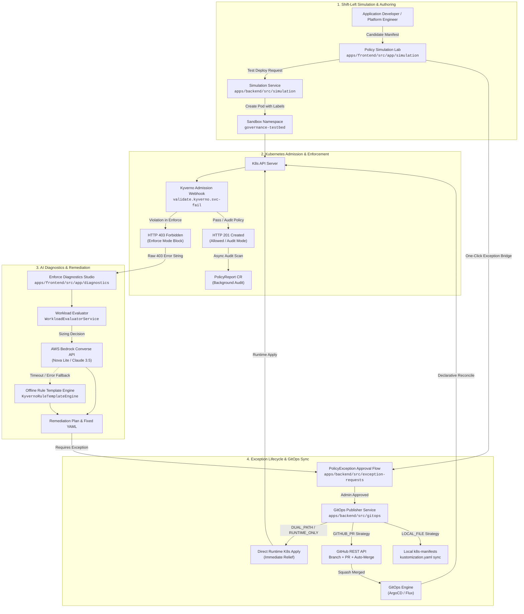
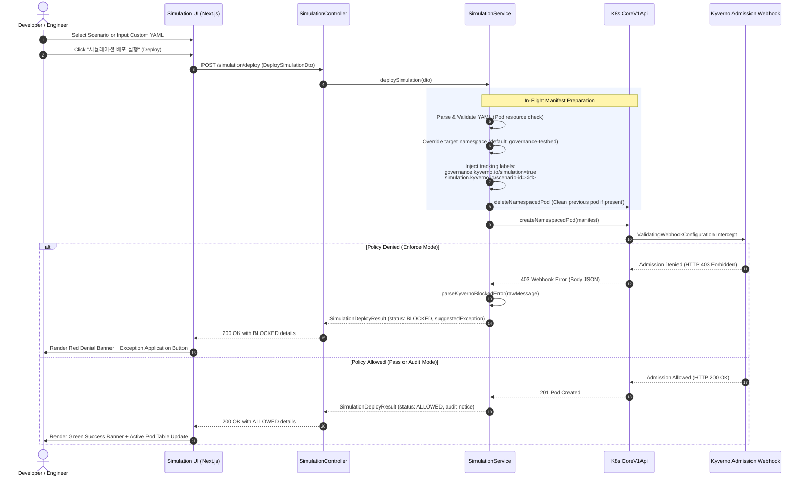
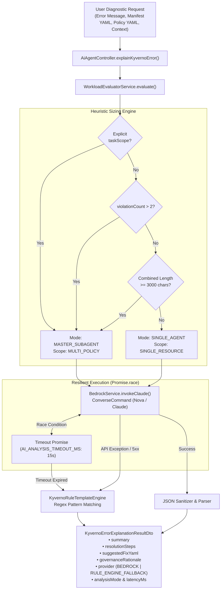
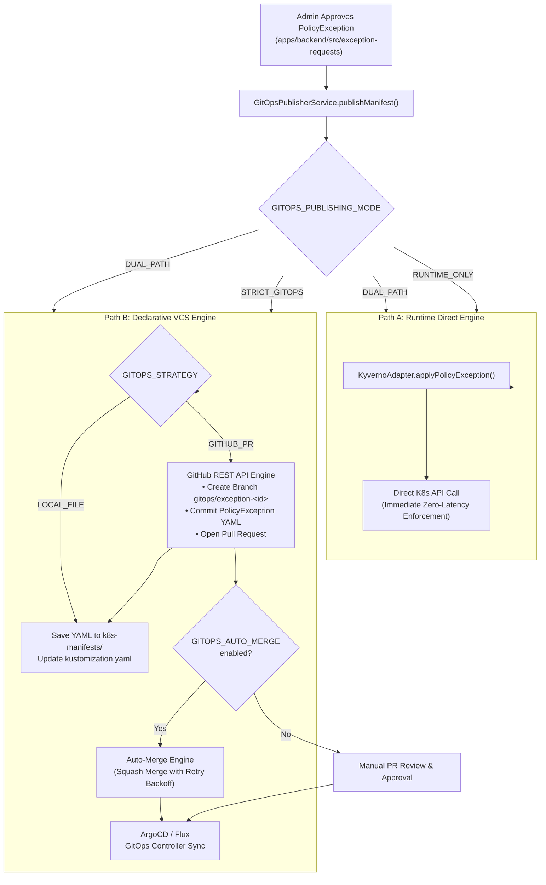
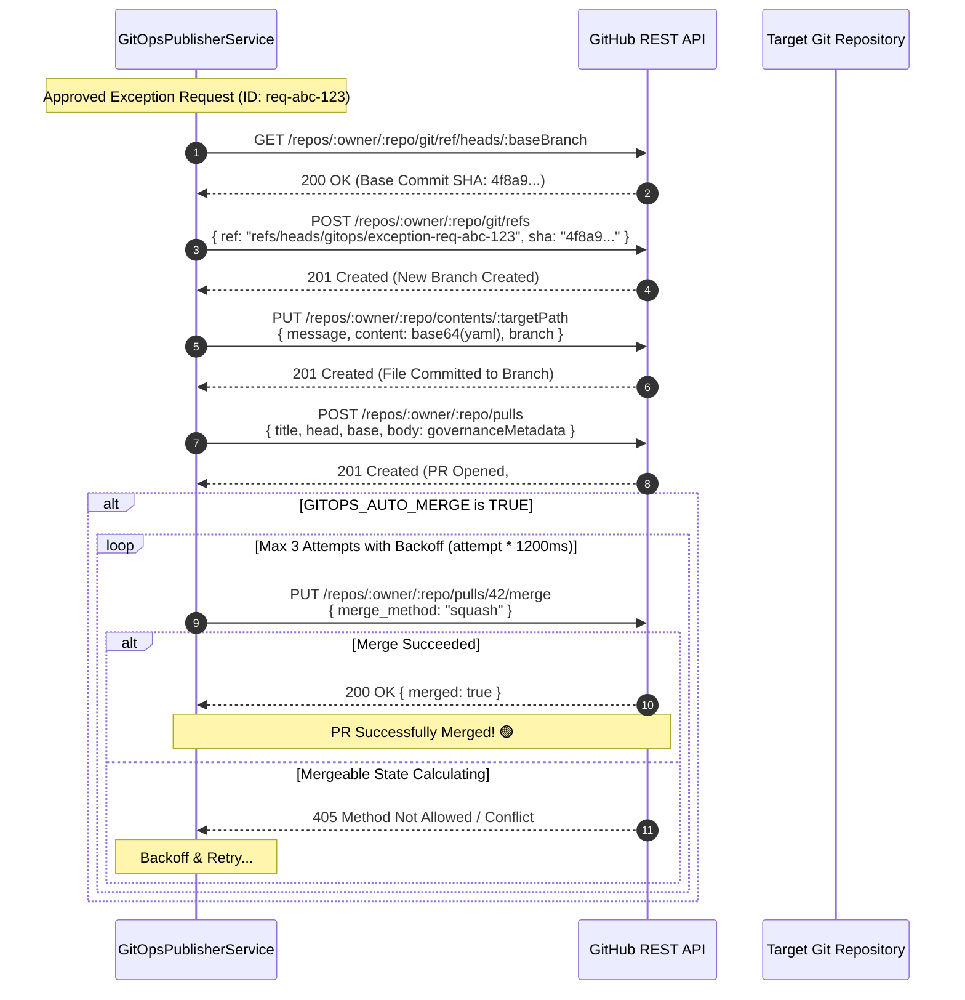

# Chapter 4: AI Diagnostics, Policy Simulation Lab & GitOps

> **Document Scope & Role**  
> This chapter provides an exhaustive architectural and implementation breakdown of the three intelligent operations pillars in the **PaC Kyverno Governance Platform**:
> 1. **Policy Simulation Lab**: Pre-deployment dry-run sandbox, admission webhook intercept mechanics, and visual impact analysis before applying policies to clusters.
> 2. **AI Policy Assistant & Enforce Diagnostics**: The admission webhook vs. policy report dilemma, AWS Bedrock universal Converse API integration (Claude 3.5 Sonnet / Amazon Nova), heuristic workload evaluation, and graceful offline rule template fallback.
> 3. **GitOps Policy Synchronization**: Dual-Path publishing architecture, `kyverno.io/v2` `PolicyException` CRD serialization, GitHub PR automation with backoff auto-merge, and multi-cluster Git repository synchronization with local filesystem fallback.

---

## Architecture Overview: The Closed-Loop Governance Lifecycle

The **PaC Kyverno Governance Platform** bridges developer velocity with platform security through a closed-loop governance cycle:



---

## 4.1 Policy Simulation Lab (Pre-Deployment Dry-Run Sandbox)

### 4.1.1 The Operational Challenge
Deploying new or modified Kyverno policies into production clusters without prior validation poses severe operational risks:
* **Production Deployment Outages**: A policy configured in `validationFailureAction: Enforce` will immediately reject uncompliant deployments, terminating existing CI/CD pipelines.
* **Hidden Audit Blast Radius**: Policies in `Audit` mode may silently generate thousands of `PolicyReport` violations, overwhelming monitoring systems and obscuring critical security alerts.
* **Developer Friction**: Developers are forced to discover policy rejections downstream during pipeline failures rather than upstream in a sandbox.

The **Policy Simulation Lab** addresses this by providing an isolated, interactive sandbox environment where platform engineers and developers can evaluate candidate Kubernetes manifests against live cluster admission webhooks before applying policies to production.

---

### 4.1.2 Sandbox Architecture & In-Cluster Evaluation Mechanics

The Policy Simulation Lab is implemented across:
* **Frontend UI**: [`apps/frontend/src/app/simulation/page.tsx`](file:///home/user/work_dir/apps/frontend/src/app/simulation/page.tsx)
* **Backend Controller**: [`SimulationController`](file:///home/user/work_dir/apps/backend/src/simulation/simulation.controller.ts)
* **Backend Service**: [`SimulationService`](file:///home/user/work_dir/apps/backend/src/simulation/simulation.service.ts)
* **Data Transfer Objects**: [`DeploySimulationDto`, `SimulationScenario`, `SimulationDeployResult`](file:///home/user/work_dir/apps/backend/src/simulation/dto/deploy-simulation.dto.ts)



#### Manifest Label Injection & Namespace Confinement
To prevent simulation workloads from polluting production environments or persisting as orphaned pods, [`SimulationService`](file:///home/user/work_dir/apps/backend/src/simulation/simulation.service.ts#L23-L26) enforces strict resource boundaries:
1. **Dedicated Testbed Namespace**: All simulation workloads default to the `governance-testbed` namespace.
2. **Metadata Label Stamping**: Every deployed resource is stamped with system labels:
   ```yaml
   metadata:
     labels:
       governance.kyverno.io/simulation: "true"
       simulation.kyverno.io/scenario-id: "disallow-latest-tag" # if scenario-based
   ```
3. **Collision Mitigation**: Before attempting deployment, [`SimulationService`](file:///home/user/work_dir/apps/backend/src/simulation/simulation.service.ts#L228-L239) checks for and deletes any existing pod with the same name with `gracePeriodSeconds: 0`.

---

### 4.1.3 Pre-Defined Simulation Scenario Catalogue

The platform ships with a built-in catalogue of high-frequency governance scenarios defined in [`SimulationService.SCENARIOS`](file:///home/user/work_dir/apps/backend/src/simulation/simulation.service.ts#L28-L145):

| Scenario ID | Title | Category | Severity | Target Kyverno Policy | Expected Result | Description & Rationale |
| :--- | :--- | :--- | :---: | :--- | :---: | :--- |
| `disallow-latest-tag` | `:latest` 태그 사용 파드 배포 | Best Practice | **HIGH** | `disallow-latest-tag` | `BLOCKED` | Verifies admission denial when a container uses the mutable `:latest` tag instead of an immutable semantic tag or digest SHA. |
| `disallow-privileged` | 특권(Privileged) 컨테이너 배포 | Pod Security | **CRITICAL** | `disallow-privileged-containers` | `AUDIT_VIOLATION` | Tests detection of `securityContext.privileged: true`. In audit mode, admission succeeds but an asynchronous `PolicyReport` record is filed. |
| `missing-resource-limits` | 자원 한도 미설정 워크로드 배포 | Cost & Reliability | **MEDIUM** | `require-resource-limits` | `AUDIT_VIOLATION` | Identifies workloads lacking `resources.limits.cpu/memory` to mitigate noisy-neighbor syndrome and host node memory starvation. |
| `compliant-workload` | 거버넌스 규격 준수 정상 파드 배포 | Compliant | **INFO** | `none` | `PASSED` | Golden standard manifest validating that a properly configured workload passes all webhooks and audits cleanly without rejection. |

---

### 4.1.4 Webhook Denial Parsing & Exception Bridge

When Kyverno blocks an admission request, the Kubernetes API Server returns an HTTP 403 with a nested error payload:
```text
Error from server (Forbidden): admission webhook "validate.kyverno.svc-fail" denied the request: 
resource Pod/governance-testbed/test-tag-violation-latest was blocked due to the following policies 
disallow-latest-tag:
  disallow-latest-tag: 'validation error: Using a :latest tag is prohibited. A specific image tag or digest must be used. rule disallow-latest-tag failed at path /spec/containers/0/image/'
```

[`SimulationService.parseKyvernoBlockedError()`](file:///home/user/work_dir/apps/backend/src/simulation/simulation.service.ts#L340-L364) applies specialized regular expressions to extract structured metadata:
```typescript
const policyBlockRegex =
  /blocked due to the following policies\s*\n\s*([a-zA-Z0-9_-]+):\s*\n\s*([a-zA-Z0-9_-]+):\s*'?(.*?)'?(?:\n[a-zA-Z0-9_-]+:|$)/s;
```

This populates the [`SimulationDeployResult`](file:///home/user/work_dir/apps/backend/src/simulation/dto/deploy-simulation.dto.ts#L73-L93) object:
* `policyName`: Extracted policy name (e.g., `disallow-latest-tag`)
* `ruleName`: Specific violated rule within the policy
* `blockedReason`: Cleaned validation failure message
* `suggestedException`: Pre-formatted payload allowing immediate navigation to the exception creation wizard:
  ```typescript
  suggestedException: {
    policyName: "disallow-latest-tag",
    ruleName: "disallow-latest-tag",
    resourceKind: "Pod",
    resourceName: "test-tag-violation-latest",
    namespace: "governance-testbed"
  }
  ```

In [`PolicySimulationPage`](file:///home/user/work_dir/apps/frontend/src/app/simulation/page.tsx#L404-L440), this translates into a one-click CTA:
```tsx
<Link href={`/exceptions/new?policy=${encodeURIComponent(lastResult.suggestedException.policyName)}&rule=${encodeURIComponent(lastResult.suggestedException.ruleName || "")}&resource=${encodeURIComponent(lastResult.suggestedException.resourceName)}&kind=Pod&namespace=${encodeURIComponent(lastResult.suggestedException.namespace)}&cluster=default`}>
  <Button className="bg-gradient-to-r from-amber-500 to-orange-500 text-slate-950">
    <FilePlus2 className="size-4 mr-2" />
    이 위반으로 예외 신청서 작성하기
  </Button>
</Link>
```

---

### 4.1.5 Testbed Lifecycle & Cluster Resource Cleanup

Because allowed and audit-mode pods actually run inside the Kubernetes cluster, the Simulation Lab includes a full lifecycle management subsystem:
1. **Active Testbed Inspection** ([`SimulationService.getActiveSimulationResources()`](file:///home/user/work_dir/apps/backend/src/simulation/simulation.service.ts#L369-L389)):
   Queries the Kubernetes API across all namespaces using the label selector `governance.kyverno.io/simulation=true`, returning pod names, namespaces, lifecycle phases (`Running`, `Pending`, `Failed`), and creation timestamps.
2. **Automated Batch Purge** ([`SimulationService.cleanupSimulationResources()`](file:///home/user/work_dir/apps/backend/src/simulation/simulation.service.ts#L394-L417)):
   Iterates through all discovered simulation pods and executes immediate zero-grace-period deletion, returning a deletion confirmation list and releasing cluster CPU/memory resources.

---

## 4.2 AI Policy Assistant & Enforce Diagnostics

### 4.2.1 The "Invisible PolicyReport" Problem in Enforce Mode

In standard Kyverno deployments, a fundamental operational contradiction confuses application engineering teams:

```
+-----------------------------------------------------------------------------------+
|                           THE KUBERNETES ADMISSION GAP                            |
|                                                                                   |
|  [ Audit Mode ]                                                                   |
|  Pod Request ---> API Server ---> Webhook (Pass) ---> etcd Record Created         |
|                                                          |                        |
|                                                          v (Async Background)     |
|                                                 PolicyReport CR Generated         |
|                                                 (Visible in Dashboard UI)         |
|                                                                                   |
|  [ Enforce Mode ]                                                                 |
|  Pod Request ---> API Server ---> Webhook (Deny) -x- (HTTP 403 Forbidden)         |
|                                         |                                         |
|                                         v (Connection Aborted)                    |
|                              No etcd Record Created!                              |
|                            NO POLICYREPORT GENERATED!                             |
|                           (Completely Invisible in UI)                            |
+-----------------------------------------------------------------------------------+
```

1. **Audit Mode**: Resources are admitted to the cluster and persisted to `etcd`. Kyverno's background controllers asynchronously scan active resources and create `PolicyReport` or `ClusterPolicyReport` Custom Resources. These reports are ingested and visualized in the platform's Policy Violations Dashboard.
2. **Enforce Mode**: The Kyverno admission webhook intercepts the admission review and issues an immediate rejection (`HTTP 403 Forbidden`). The Kubernetes API Server drops the request. **No object is ever stored in `etcd`, and therefore Kyverno never generates a `PolicyReport`**.

To the application developer, the deployment simply fails with an obscure terminal error, while the platform governance dashboard reports zero violations for their workload.

The **Enforce Diagnostics Studio** ([`apps/frontend/src/app/diagnostics/page.tsx`](file:///home/user/work_dir/apps/frontend/src/app/diagnostics/page.tsx)) and the **AI Error Explainer Dialog** ([`apps/frontend/src/components/ai-agent/ai-error-explainer-dialog.tsx`](file:///home/user/work_dir/apps/frontend/src/components/ai-agent/ai-error-explainer-dialog.tsx)) solve this gap by providing an on-demand, AI-driven diagnostic engine.

---

### 4.2.2 AI Engine Architecture & Amazon Bedrock Universal Converse API

The AI diagnostics subsystem is implemented across:
* **Controller**: [`AiAgentController`](file:///home/user/work_dir/apps/backend/src/ai-agent/ai-agent.controller.ts)
* **Orchestrator Service**: [`AiAgentService`](file:///home/user/work_dir/apps/backend/src/ai-agent/ai-agent.service.ts)
* **Bedrock Client**: [`BedrockService`](file:///home/user/work_dir/apps/backend/src/ai-agent/bedrock.service.ts)
* **Workload Evaluator**: [`WorkloadEvaluatorService`](file:///home/user/work_dir/apps/backend/src/ai-agent/services/workload-evaluator.service.ts)
* **Offline Rule Fallback**: [`KyvernoRuleTemplateEngine`](file:///home/user/work_dir/apps/backend/src/ai-agent/rule-template.engine.ts)
* **DTOs**: [`ExplainKyvernoErrorDto`, `KyvernoErrorExplanationResultDto`, `AnalysisMode`, `AnalysisTaskScope`](file:///home/user/work_dir/apps/backend/src/ai-agent/dto/explain-error.dto.ts)



#### AWS Bedrock Universal Converse API Integration
Rather than coupling the platform to legacy vendor-specific invocation payloads (e.g., InvokeModel with raw prompt strings), [`BedrockService`](file:///home/user/work_dir/apps/backend/src/ai-agent/bedrock.service.ts#L43-L87) leverages the AWS Bedrock Runtime **Converse API** (`ConverseCommand`).

The Converse API provides a unified abstraction across heterogeneous foundation models:
* **Default Model**: `amazon.nova-lite-v1:0` (ultra-fast, cost-effective, ideal for structured JSON generation)
* **High-Reasoning Models**: `amazon.nova-pro-v1:0` or Anthropic Claude 3.5 Sonnet (`anthropic.claude-3-5-sonnet-20240620-v1:0`) configured via the `BEDROCK_MODEL_ID` environment variable.

```typescript
// BedrockService Converse API Call Implementation
const command = new ConverseCommand({
  modelId: this.modelId,
  system: [{ text: systemPrompt }],
  messages: [
    {
      role: "user",
      content: [{ text: userPrompt }],
    },
  ],
  inferenceConfig: {
    maxTokens: options?.maxTokens ?? 2048,
    temperature: options?.temperature ?? 0.2, // Low temperature for deterministic YAML fixes
  },
});
```

#### System Persona & JSON Response Contract
The system prompt in [`AiAgentService`](file:///home/user/work_dir/apps/backend/src/ai-agent/ai-agent.service.ts#L48-L62) enforces four strict non-negotiables:
1. **Empathetic & Non-Punitive Tone**: The agent acts as an encouraging platform mentor, explaining technical Kubernetes jargon in intuitive Korean.
2. **Deterministic JSON Contract**: Outputs raw JSON conforming to [`KyvernoErrorExplanationResultDto`](file:///home/user/work_dir/apps/backend/src/ai-agent/dto/explain-error.dto.ts#L107-L178) without markdown code fencing wrappers.
3. **Copy-Pasteable Remediation**: Supplies a fully valid, fixed YAML snippet with compliant indentation and values.
4. **Governance Rationale**: Explicitly educates developers on *why* the organization enforces this policy (e.g., CIS Benchmarks, FinOps cost control, host protection).

---

### 4.2.3 Dynamic Workload Evaluator (`WorkloadEvaluatorService`)

To determine the computational complexity of incoming error diagnostic requests, [`WorkloadEvaluatorService`](file:///home/user/work_dir/apps/backend/src/ai-agent/services/workload-evaluator.service.ts) dynamically sizes the execution pipeline:

```typescript
// Workload Evaluator Decision Rules
// 1. Explicit task scope override
if (dto.taskScope) {
  return {
    mode: dto.taskScope === AnalysisTaskScope.SINGLE_RESOURCE 
      ? AnalysisMode.SINGLE_AGENT 
      : AnalysisMode.MASTER_SUBAGENT,
    scope: dto.taskScope,
    reason: `Explicit taskScope provided: ${dto.taskScope}`
  };
}

// 2. High violation count check
if (dto.violationCount && dto.violationCount > 2) {
  return {
    mode: AnalysisMode.MASTER_SUBAGENT,
    scope: AnalysisTaskScope.MULTI_POLICY,
    reason: `Multiple violations detected (${dto.violationCount} > 2)`
  };
}

// 3. Payload size and complexity check
const combinedLength = 
  (dto.errorMessage?.length || 0) + 
  (dto.policyYaml?.length || 0) + 
  (dto.resourceManifest?.length || 0) + 
  (dto.clusterContext?.length || 0);

if (combinedLength >= 3000) {
  return {
    mode: AnalysisMode.MASTER_SUBAGENT,
    scope: AnalysisTaskScope.MULTI_POLICY,
    reason: `Large context payload length (${combinedLength} characters)`
  };
}

// 4. Default: Lightweight single resource
return {
  mode: AnalysisMode.SINGLE_AGENT,
  scope: AnalysisTaskScope.SINGLE_RESOURCE,
  reason: "Standard lightweight single resource policy error"
};
```

---

### 4.2.4 Resilient Graceful Degradation: Offline Rule Template Engine

In enterprise environments, cloud AI connectivity may be constrained by network partition, strict air-gapping, quota exhaustion, or AWS API latency spikes.

[`AiAgentService`](file:///home/user/work_dir/apps/backend/src/ai-agent/ai-agent.service.ts#L81-L129) wraps the AWS Bedrock call in a `Promise.race` with a configurable timeout (`AI_ANALYSIS_TIMEOUT_MS`, default `15000ms`). If the timeout expires or Bedrock returns a 5xx error, the service automatically falls back to [`KyvernoRuleTemplateEngine`](file:///home/user/work_dir/apps/backend/src/ai-agent/rule-template.engine.ts).

The offline rule template engine maintains high-accuracy regular expressions mapped to curated remediation templates:

| Rule Pattern ID | Match Regex | Diagnosed Cause | Remediation YAML Template | Governance Rationale |
| :--- | :--- | :--- | :--- | :--- |
| `DISALLOW_LATEST_TAG` | `/latest\|disallow-latest-tag\|tag.*not.*allowed\|image.*tag/i` | Container image tag is `:latest` or missing | Replaces tag with immutable semantic version (e.g., `1.27.0`) | Eliminates non-deterministic runtime drift and unreproducible production bugs. |
| `REQUIRE_RESOURCE_LIMITS` | `/limit\|limits\|cpu\|memory\|require-resource-limits/i` | Missing CPU/Memory requests and limits | Adds `resources.requests` and `resources.limits` blocks | Prevents noisy-neighbor OOMKilled crashes and cluster node CPU starvation. |
| `DISALLOW_PRIVILEGED` | `/privileged\|securityContext\|disallow-privileged-containers/i` | Dangerous root privileges requested | Sets `privileged: false`, `allowPrivilegeEscalation: false` | Prevents container breakouts and unauthorized host kernel access. |
| `READONLY_ROOT_FS` | `/rootfs\|read-only\|readOnlyRootFilesystem/i` | Root filesystem write permissions enabled | Adds `readOnlyRootFilesystem: true` + `emptyDir` for `/tmp` | Blocks malicious runtime payload drops and enforces container immutability. |
| `REQUIRE_LABELS` | `/label\|labels\|team\|owner\|require-team-label/i` | Missing organizational ownership metadata | Stamping `metadata.labels.team` and `app.kubernetes.io/name` | Enables FinOps cost allocation and automated incident routing. |
| `RESTRICT_REGISTRIES` | `/registry\|registries\|restrict-image-registries/i` | Image pulled from untrusted public registry | Replaces registry with authorized corporate ECR URL | Protects cluster from supply chain malware and untrusted base layers. |
| *Dynamic Fallback* | *(Any non-matching error)* | General Kyverno policy admission block | Formatted contextual prompt referencing Kyverno docs | Safe fallback providing generic remediation and exception guidelines. |

---

### 4.2.5 UI / UX Integration: Studio vs Modal Dialog

The AI diagnostic capabilities are surfaced in two UI contexts:

#### 1. Enforce Diagnostics Studio (`/diagnostics`)
[`apps/frontend/src/app/diagnostics/page.tsx`](file:///home/user/work_dir/apps/frontend/src/app/diagnostics/page.tsx) provides a full split-screen diagnostic workbench:
* **Preset Loaders**: Quick-load buttons for `:latest` tag, privileged mode, and unauthorized registries.
* **Dual Input Terminals**: Code editors for the rejected Kubernetes manifest YAML and raw admission failure logs.
* **Diagnostic Report Cards**:
  * Root-cause breakdown with provider badge (`Bedrock AI` vs `Rule Engine`).
  * Governance context panel explaining the security rationale.
  * Numbered remediation roadmap.
  * Highlighted compliant YAML diff with one-click clipboard copy.
  * Direct action buttons: "정책 테스트 랩에서 즉시 시뮬레이션" (routes to `/simulation`) and "정책 예외 신청" (routes to `/exceptions/new`).

#### 2. Modal Dialog (`AiErrorExplainerDialog`)
[`apps/frontend/src/components/ai-agent/ai-error-explainer-dialog.tsx`](file:///home/user/work_dir/apps/frontend/src/components/ai-agent/ai-error-explainer-dialog.tsx) exposes a compact, modal dialog triggered by clicking the `<Sparkles /> 가이드` button throughout the platform (e.g., inside audit tables, cluster inspection views, and approval screens). It automatically triggers diagnostic evaluation on open and renders execution latency (`latencyMs`).

---

## 4.3 GitOps Policy Synchronization

### 4.3.1 Dual-Path Publishing Architecture

When a policy exception or policy modification is approved by an administrator, the platform must guarantee that the change is applied to the cluster **without violating GitOps declarative immutability**.

The platform implements a **Dual-Path Publishing Architecture** managed by [`GitOpsPublisherService`](file:///home/user/work_dir/apps/backend/src/gitops/gitops-publisher.service.ts):



#### Publishing Modes Comparison

| Publishing Mode (`GITOPS_PUBLISHING_MODE`) | Runtime Direct Apply | GitOps File / PR Generated | Target Deployment Environment |
| :--- | :---: | :---: | :--- |
| `DUAL_PATH` *(Default)* | **Yes** | **Yes** | **Enterprise Hybrid**: Immediate runtime relief for blocked workloads while maintaining long-term declarative Git audit trails. |
| `STRICT_GITOPS` | **No** | **Yes** | **Strict Compliance / High-Security**: Direct cluster mutations forbidden. Workloads must await ArgoCD/Flux synchronization after PR merge. |
| `RUNTIME_ONLY` | **Yes** | **No** | **Isolated / Ephemeral Testing**: KinD or on-prem sandbox clusters operating without GitHub access or remote repository tokens. |

---

### 4.3.2 CRD Serialization: Standard `kyverno.io/v2` `PolicyException`

Kyverno v1.9+ introduced the dedicated `PolicyException` Custom Resource to cleanly decouple policy rules from exemption logic.

[`dumpPolicyExceptionYaml()`](file:///home/user/work_dir/apps/backend/src/gitops/gitops-publisher.service.ts#L26-L52) and [`buildPolicyExceptionManifest()`](file:///home/user/work_dir/apps/backend/src/kubernetes/policy-exception-manifest.ts#L47-L89) construct valid, production-ready `kyverno.io/v2` manifests:

```typescript
// Manifest Generation Logic
export function buildPolicyExceptionManifest(input: PolicyExceptionManifestInput) {
  const any = [
    matchFor(input.resourceKind, input.resourceName, input.resourceNamespace),
  ];

  // Automatic Controller-to-Pod pattern expansion
  if (POD_CONTROLLERS.has(input.resourceKind)) {
    any.push(
      matchFor("Pod", `${input.resourceName}-*`, input.resourceNamespace),
    );
  } else if (input.resourceKind === "CronJob") {
    any.push(
      matchFor("Job", `${input.resourceName}-*`, input.resourceNamespace),
    );
    any.push(
      matchFor("Pod", `${input.resourceName}-*`, input.resourceNamespace),
    );
  }

  return {
    apiVersion: "kyverno.io/v2",
    kind: "PolicyException",
    metadata: {
      name: input.name,
      namespace: input.namespace,
      labels: {
        "app.kubernetes.io/managed-by": "pac-kyverno-dashboard",
        "pac.kyverno.io/request-id": input.requestId,
      },
    },
    spec: {
      exceptions: [
        {
          policyName: input.policyName,
          ruleNames: input.ruleNames,
        },
      ],
      match: {
        any,
      },
    },
  };
}
```

#### The Controller-to-Pod Wildcard Expansion Principle
A common pitfall in Kyverno exception design occurs when an exception targets a high-level controller (e.g., `Deployment/sample-app`). Kyverno's autogen rules automatically create parallel policy checks for the child `Pod` generated by that Deployment.

If the `PolicyException` only exempts `Deployment/sample-app`, the Deployment creation is permitted, but the underlying ReplicaSet fails to create child pods because the pods themselves are blocked by Kyverno!

As implemented in [`policy-exception-manifest.ts`](file:///home/user/work_dir/apps/backend/src/kubernetes/policy-exception-manifest.ts#L54-L65), the platform automatically generates wildcard child rules for all supported workload controllers:
* `Deployment`, `DaemonSet`, `Job`, `ReplicaSet`, `ReplicationController`, `StatefulSet` $\rightarrow$ automatically appends `Pod` matching `${resourceName}-*`
* `CronJob` $\rightarrow$ automatically appends `Job` matching `${resourceName}-*` AND `Pod` matching `${resourceName}-*`

---

### 4.3.3 GitHub Pull Request Automation & Backoff Auto-Merge

When `GITOPS_STRATEGY=GITHUB_PR` is enabled, [`GitOpsPublisherService.createGitHubPullRequest()`](file:///home/user/work_dir/apps/backend/src/gitops/gitops-publisher.service.ts#L164-L331) orchestrates a multi-step Git workflow using the GitHub REST API (`https://api.github.com`):



#### Pull Request Content & Governance Audit Metadata
Every generated PR is annotated with immutable metadata adhering to the repository's Conventional Commits standard:
* **Branch**: `gitops/exception-<request-id>`
* **Commit**: `feat(gitops): publish PolicyException for request <request-id>`
* **PR Title**: `feat(gitops): publish PolicyException manifest for request <request-id>`
* **Audit Body**:
  ```markdown
  ## 🛡️ Kyverno Governance Platform - Automated GitOps PR

  * **Request ID**: `765faed0-7f76-4f05-89a1-1662893440e2`
  * **Policy Name**: `disallow-latest-tag`
  * **Target Resource**: `Deployment/sample-app`
  * **Namespace**: `production`
  * **Target Cluster**: `eks-us-east-1-prod`

  ---
  *Automated PR generated by Kyverno Governance Platform GitOps Publisher Service.*
  ```

#### Auto-Merge Backoff Strategy
GitHub computes pull request mergeability asynchronously. Attempting to merge a PR immediately after creation frequently fails with HTTP 405 (Not Mergeable yet).

[`GitOpsPublisherService.autoMergePullRequest()`](file:///home/user/work_dir/apps/backend/src/gitops/gitops-publisher.service.ts#L337-L390) implements an exponential backoff loop:
```typescript
const maxRetries = 3;
for (let attempt = 1; attempt <= maxRetries; attempt++) {
  // Backoff delay before checking mergeable status: 1200ms, 2400ms, 3600ms
  await new Promise((resolve) => setTimeout(resolve, attempt * 1200));

  const mergeRes = await fetch(
    `https://api.github.com/repos/${owner}/${repo}/pulls/${prNumber}/merge`,
    {
      method: "PUT",
      headers,
      body: JSON.stringify({
        commit_title: `feat(gitops): auto-merge PolicyException for request ${requestId} (#${prNumber})`,
        commit_message: `Automatically merged by Kyverno Governance Platform GitOps Publisher Service.`,
        merge_method: "squash",
      }),
    },
  );

  if (mergeRes.ok) {
    const mergeData = await mergeRes.json();
    if (mergeData.merged) return;
  }
}
```

---

### 4.3.4 Multi-Cluster GitOps Routing

The platform supports multi-cluster governance topologies where different Kubernetes clusters synchronize with separate GitOps repositories or directory paths.

In [`GitOpsPublisherService`](file:///home/user/work_dir/apps/backend/src/gitops/gitops-publisher.service.ts#L173-L193), the publisher queries the [`ClusterProvider`](file:///home/user/work_dir/apps/backend/src/kubernetes/cluster-provider.ts) to retrieve cluster-specific VCS metadata:
```typescript
if (this.clusterProvider && request.targetClusterId) {
  try {
    const metadata = this.clusterProvider.getMetadata(request.targetClusterId);
    if (metadata.gitopsRepo) {
      targetRepo = metadata.gitopsRepo;     // Override global repo
    }
    if (metadata.gitopsBranch) {
      targetBaseBranch = metadata.gitopsBranch; // Override global branch
    }
    if (metadata.gitopsPath) {
      const ns = request.resourceNamespace || "default";
      targetPath = path.join(metadata.gitopsPath, ns, `${request.id}.yaml`);
    }
  } catch {
    // Falls back gracefully to global environment configuration
  }
}
```

---

### 4.3.5 Local Filesystem Fallback & Kustomize Synchronization

If GitHub credentials are not configured or external network calls fail, the service maintains local file system synchronization under `k8s-manifests/exceptions/<namespace>/`:

1. **Manifest File Writing**:
   Persists the serialized YAML to `k8s-manifests/exceptions/<namespace>/<request-id>.yaml`.
2. **Kustomization Maintenance** ([`updateKustomizationYaml()`](file:///home/user/work_dir/apps/backend/src/gitops/gitops-publisher.service.ts#L562-L608)):
   Reads `k8s-manifests/exceptions/<namespace>/kustomization.yaml`, adds `<request-id>.yaml` to the `resources` array (if not already present), and writes back the updated YAML.
3. **Safe Revocation** ([`unpublishManifest()`](file:///home/user/work_dir/apps/backend/src/gitops/gitops-publisher.service.ts#L486-L553)):
   When an exception is revoked, expires, or is rejected, `unpublishManifest()` deletes the YAML file and cleanly purges the entry from `kustomization.yaml`.

---

## 4.4 Configuration Reference & Operational Runbooks

### 4.4.1 Platform Environment Variables

| Variable Name | Required | Default Value | Allowed Values | Description |
| :--- | :---: | :---: | :---: | :--- |
| `GITOPS_PUBLISHING_MODE` | No | `DUAL_PATH` | `DUAL_PATH`, `STRICT_GITOPS`, `RUNTIME_ONLY` | Determines whether exceptions are applied directly to K8s, published to GitOps, or both. |
| `GITOPS_STRATEGY` | No | `LOCAL_FILE` | `LOCAL_FILE`, `GITHUB_PR` | Strategy for publishing GitOps manifests. |
| `GITOPS_GITHUB_TOKEN` | Yes* | *(None)* | GitHub Personal Access Token | Token with `repo` scope for branch creation, file commit, and PR management (*Required if `GITHUB_PR`). |
| `GITOPS_GITHUB_REPO` | Yes* | `YeongrimGo/test-for` | `owner/repo` | Target GitHub repository holding declarative GitOps manifests. |
| `GITOPS_GITHUB_BASE_BRANCH`| No | `main` | String (branch name) | Target base branch for PR submission. |
| `GITOPS_AUTO_MERGE` | No | `false` | `true`, `false`, `1`, `0` | Automatically squash-merges generated PRs after creation. |
| `GITOPS_MIN_DURATION_HOURS`| No | `24` | Positive Integer | Minimum duration threshold for publishing to GitOps. |
| `BEDROCK_MODEL_ID` | No | `amazon.nova-lite-v1:0` | `amazon.nova-lite-v1:0`, `anthropic.claude-3-5-sonnet-20240620-v1:0` | Foundation Model ID invoked via Bedrock Converse API. |
| `AWS_REGION` | No | `us-east-1` | AWS Region String | AWS Region hosting Bedrock foundation models. |
| `AI_ANALYSIS_TIMEOUT_MS` | No | `15000` | Positive Integer (ms) | Cutoff threshold before falling back to offline rule template engine. |

---

### 4.4.2 Operational Troubleshooting Runbook

#### Case 1: Bedrock AI Diagnostic Returns `RULE_ENGINE_FALLBACK`
* **Symptoms**: The diagnostic studio displays a yellow badge `"규칙 기반 고속 가이드"` and the provider is `RULE_ENGINE_FALLBACK`.
* **Root Causes**:
  1. AWS IAM credentials (`AWS_ACCESS_KEY_ID`, `AWS_SECRET_ACCESS_KEY`) lack `bedrock:InvokeModel` permissions.
  2. Model ID not enabled in the specified `AWS_REGION` in the AWS Bedrock Model Access console.
  3. API response exceeded `AI_ANALYSIS_TIMEOUT_MS` (15,000ms).
* **Remediation**:
  Check backend logs for:
  ```text
  Fallback to rule template engine due to Bedrock call failure/timeout
  ```
  Verify IAM role policies and confirm model access status in AWS Console $\rightarrow$ Amazon Bedrock $\rightarrow$ Model access.

#### Case 2: Simulation Pod Blocked with Generic Admission Error
* **Symptoms**: The simulation returns `BLOCKED`, but `policyName` and `ruleName` are empty.
* **Root Causes**:
  The admission failure was triggered by a Kubernetes Core webhook or third-party admission controller rather than Kyverno (or Kyverno returned an unrecognized error format).
* **Remediation**:
  Examine the `blockedReason` field in the simulation response. If the error originated from Kyverno, check whether a custom webhook failure message was configured in the policy's `message` field.

#### Case 3: GitOps PR Auto-Merge Fails (HTTP 405 Method Not Allowed)
* **Symptoms**: The GitOps PR is created successfully on GitHub, but remains in `OPEN` state despite `GITOPS_AUTO_MERGE=true`.
* **Root Causes**:
  1. Branch protection rules on the base branch (e.g., `main`) enforce required status checks (CI/CD) or require human pull request reviews.
  2. The GitHub Token lacks admin permissions to bypass branch protections.
* **Remediation**:
  Configure branch protection bypass rules for the service account token, or set `GITOPS_AUTO_MERGE=false` to route PRs through the standard developer code review workflow.

---

## 4.5 Component & File Reference Matrix

| Architectural Subsystem | Source Component | File Path | Primary Function / Responsibilities |
| :--- | :--- | :--- | :--- |
| **Simulation Lab** | Backend Controller | [`SimulationController`](file:///home/user/work_dir/apps/backend/src/simulation/simulation.controller.ts) | Exposes `/simulation/scenarios`, `/deploy`, `/resources`, and `/cleanup` endpoints. |
| **Simulation Lab** | Backend Service | [`SimulationService`](file:///home/user/work_dir/apps/backend/src/simulation/simulation.service.ts) | Manages sandbox pod deployments, webhook regex error extraction, and batch resource deletion. |
| **Simulation Lab** | DTO Models | [`DeploySimulationDto`](file:///home/user/work_dir/apps/backend/src/simulation/dto/deploy-simulation.dto.ts) | Defines request and response contracts for scenarios, manifests, and deployment results. |
| **Simulation Lab** | Frontend Studio | [`PolicySimulationPage`](file:///home/user/work_dir/apps/frontend/src/app/simulation/page.tsx) | Live interactive workspace with scenario selector, YAML editor, denial visualizer, and exception bridge. |
| **AI Diagnostics** | Backend Controller | [`AiAgentController`](file:///home/user/work_dir/apps/backend/src/ai-agent/ai-agent.controller.ts) | Exposes `POST /ai-agent/explain-kyverno-error` endpoint for automated policy triage. |
| **AI Diagnostics** | AI Service | [`AiAgentService`](file:///home/user/work_dir/apps/backend/src/ai-agent/ai-agent.service.ts) | Orchestrates timeout race conditions, prompt building, and fallback transitions. |
| **AI Diagnostics** | Bedrock Runtime | [`BedrockService`](file:///home/user/work_dir/apps/backend/src/ai-agent/bedrock.service.ts) | Universal AWS Bedrock Converse API client handling Claude 3.5 Sonnet and Amazon Nova. |
| **AI Diagnostics** | Sizing Engine | [`WorkloadEvaluatorService`](file:///home/user/work_dir/apps/backend/src/ai-agent/services/workload-evaluator.service.ts) | Heuristic sizing determining single vs master-subagent modes and payload scopes. |
| **AI Diagnostics** | Offline Rules | [`KyvernoRuleTemplateEngine`](file:///home/user/work_dir/apps/backend/src/ai-agent/rule-template.engine.ts) | High-speed offline regex matching engine for 6 primary Kyverno violation categories. |
| **AI Diagnostics** | Frontend Studio | [`EnforceDiagnosticsPage`](file:///home/user/work_dir/apps/frontend/src/app/diagnostics/page.tsx) | Enforce mode admission analyzer solving the "invisible PolicyReport" problem. |
| **AI Diagnostics** | UI Component | [`AiErrorExplainerDialog`](file:///home/user/work_dir/apps/frontend/src/components/ai-agent/ai-error-explainer-dialog.tsx) | Reusable modal dialog delivering contextual AI error guidance across dashboard views. |
| **GitOps Engine** | Publisher Service | [`GitOpsPublisherService`](file:///home/user/work_dir/apps/backend/src/gitops/gitops-publisher.service.ts) | Manages Dual-Path publishing, GitHub branch/PR creation, backoff auto-merge, and kustomize sync. |
| **GitOps Engine** | Manifest Builder | [`buildPolicyExceptionManifest`](file:///home/user/work_dir/apps/backend/src/kubernetes/policy-exception-manifest.ts) | Serializes requests to `kyverno.io/v2` `PolicyException` with automatic controller-to-pod wildcard expansion. |
| **GitOps Engine** | Unit Test Suite | [`gitops-publisher.service.spec.ts`](file:///home/user/work_dir/apps/backend/src/gitops/gitops-publisher.service.spec.ts) | Comprehensive test coverage for serialization, dual-path routing, GitHub API, and fallback. |
