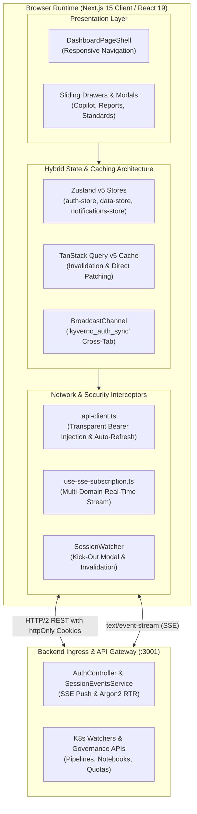
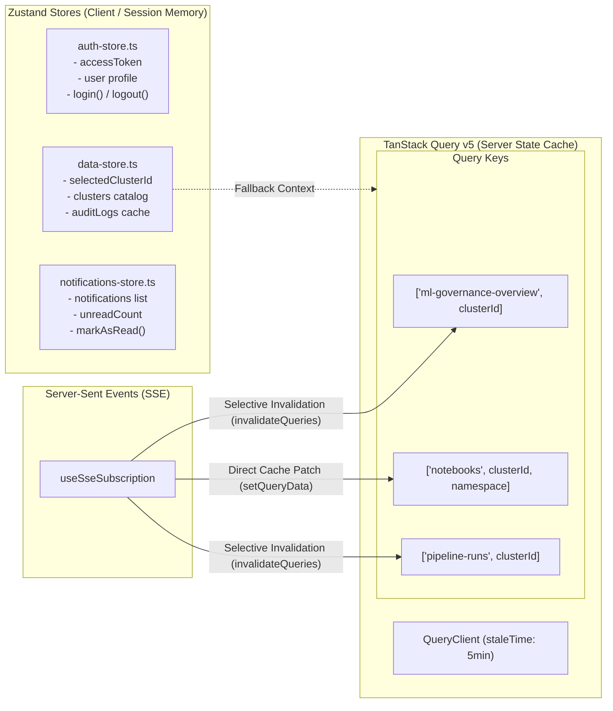
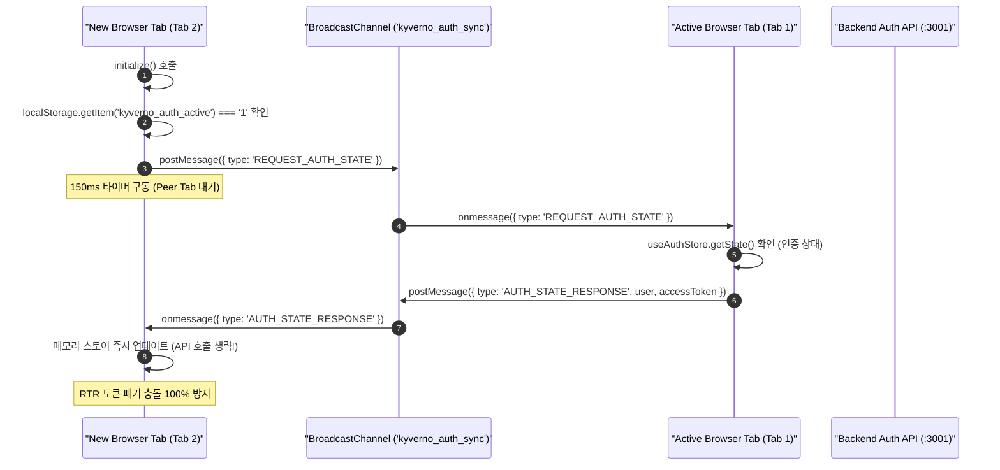
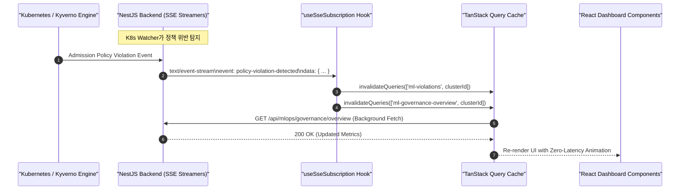
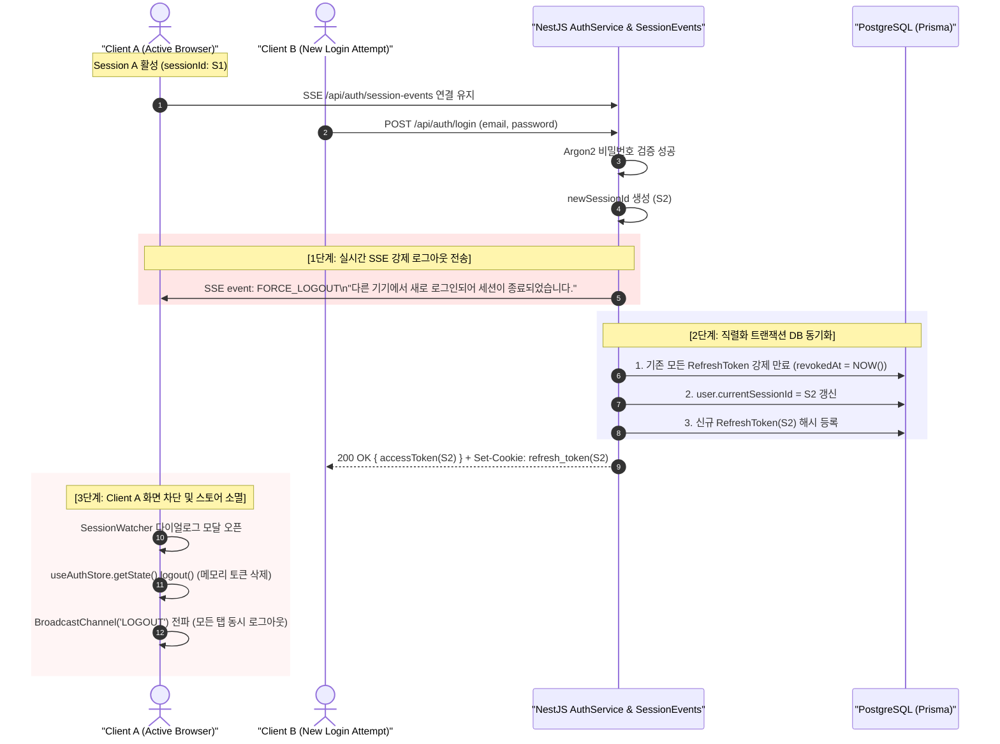
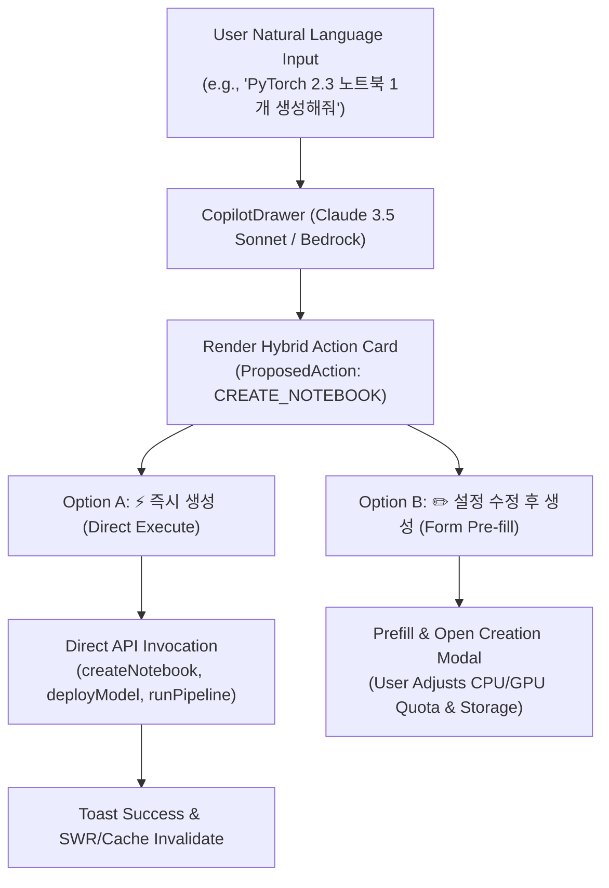
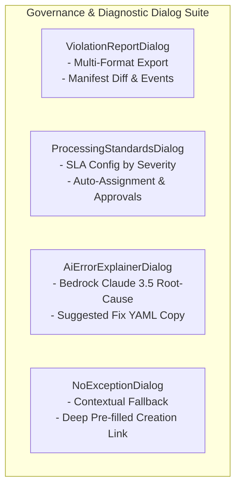

# Chapter 5: Frontend Architecture, Navigation & Security Mechanisms

> **플랫폼 컴포넌트**: PaC Kyverno Governance Web Console (`@kyverno-platform/frontend`)  
> **런타임 및 기반 프레임워크**: Next.js 15.0 (App Router), React 19, Tailwind CSS v4, Zustand v5, TanStack Query v5  
> **보안 및 규정 준수 표준**: ISO 27001 / NIST SP 800-63B Single-Session Enforcement & Refresh Token Rotation (RTR)  
> **문서 버전**: v1.0.0 (2026-09)

---

## 목차 (Table of Contents)

1. [시스템 개요 및 프론트엔드 아키텍처 원칙](#1-시스템-개요-및-프론트엔드-아키텍처-원칙)
2. [Next.js 15 App Router 디렉터리 구조 및 라우팅 토폴로지](#2-nextjs-15-app-router-디렉터리-구조-및-라우팅-토폴로지)
   - 2.1. 사용자 포털(User Portal)과 관리자 포털(Admin Portal) 분리 구조
   - 2.2. 루트 레이아웃(`RootLayout`) 및 전역 프로바이더 계층
   - 2.3. 레이아웃 상속 및 역할 기반 접근 제어(`ProtectedRoute`)
   - 2.4. 경량 컨테이너화를 위한 Standalone Output 빌드 및 Nginx/Service Rewrite
3. [전역 상태 관리 및 하이브리드 캐싱 아키텍처](#3-전역-상태-관리-및-하이브리드-캐싱-아키텍처)
   - 3.1. 상태 분할 전략: 휘발성 클라이언트 세션 vs 비동기 서버 캐시
   - 3.2. Zustand 스토어 심층 분석
     - `auth-store.ts`: 메모리 토큰, 크로스 탭 브로드캐스트 동기화 및 중복 초기화 방지
     - `data-store.ts`: 멀티클러스터 거버넌스 도메인 상태 및 SWR 백그라운드 갱신
     - `notifications-store.ts`: 역할 기반 알림 필터링 및 낙관적 업데이트(Optimistic Update)
   - 3.3. TanStack Query v5 연계 및 캐시 일관성 보장 전략
4. [실시간 서버-전송 이벤트(SSE) 스트리밍 메커니즘](#4-실시간-서버-전송-이벤트sse-스트리밍-메커니즘)
   - 4.1. 공통 SSE 구독 훅 (`use-sse-subscription.ts`) 설계
   - 4.2. 도메인별 SSE 라우팅 및 캐시 무효화 파이프라인
     - MLOps 거버넌스 및 GPU 쿼터 이벤트 (`use-ml-governance.ts`)
     - 쿠버네티스 워처 연계 노트북 생명주기 이벤트 (`use-notebooks.ts`)
     - KFP 파이프라인 런 상태 및 실시간 스텝 로그 스트림 (`use-pipelines.ts`)
5. [엔터프라이즈 세션 보안 및 인증 파이프라인](#5-엔터프라이즈-세션-보안-및-인증-파이프라인)
   - 5.1. 단일 세션 강제(Single-Session Enforcement) 및 동시 접속 차단(Kick-Out)
   - 5.2. 백엔드-프론트엔드 연계 실시간 세션 강제 종료(`SessionWatcher`)
   - 5.3. 이중 토큰 수명주기 및 Argon2 기반 Refresh Token Rotation (RTR)
   - 5.4. `api-client.ts` HTTP 요청 인터셉션 및 401 자동 세션 복구 루프
   - 5.5. 브라우저 멀티 탭 동기화(`BroadcastChannel`) 및 RTR 레이스 컨디션 방어
6. [디자인 시스템, 반응형 UI/UX 및 모달/드로어 패턴](#6-디자인-시스템-반응형-uiux-및-모달드로어-패턴)
   - 6.1. Tailwind CSS v4 엔진 설정 및 OKLCH 기반 디자인 토큰
   - 6.2. 레이아웃 셸(`DashboardPageShell`) 및 역할 기반 반응형 사이드바
   - 6.3. MLOps Bedrock AI Copilot 슬라이딩 드로어 (`CopilotDrawer`)
   - 6.4. 거버넌스 진단 및 정책 관리 모달/다이얼로그 시스템
7. [프론트엔드-백엔드 보안/인터페이스 참조 규격 매트릭스](#7-프론트엔드-백엔드-보안인터페이스-참조-규격-매트릭스)
8. [결론 및 프론트엔드 운영 안정성 요약](#8-결론-및-프론트엔드-운영-안정성-요약)

---

## 1. 시스템 개요 및 프론트엔드 아키텍처 원칙

**PaC Kyverno Governance Platform**의 프론트엔드 웹 콘솔은 대규모 멀티클러스터 쿠버네티스 환경에서 수집되는 Kyverno 정책(Policy), 위반 보고서(PolicyReport), 예외 신청(PolicyException), 그리고 MLOps 파이프라인 워크로드를 중앙에서 통제·감시하기 위한 차세대 엔터프라이즈 관제 인터페이스입니다.



### 핵심 설계 원칙

1. **Zero-Trust Client Security**:
   - Access Token은 브라우저 `localStorage`나 `sessionStorage` 같은 비보안 영구 스토리지에 절대 기록하지 않고 오직 클라이언트 런타임 메모리([`auth-store.ts`](file:///home/user/work_dir/apps/frontend/src/lib/auth-store.ts))에만 유지합니다.
   - 장기 갱신용 Refresh Token은 JavaScript 스크립트 실행 환경에서 접근이 원천 차단된 `httpOnly`, `SameSite=Lax`, `Secure` 쿠키([`refresh-token-cookie.service.ts`](file:///home/user/work_dir/apps/backend/src/auth/refresh-token-cookie.service.ts))로만 운용합니다.
2. **Deterministic Single-Session Enforcement**:
   - 금융 및 국가 보안 기준에 부합하도록 동일 계정의 동시 로그인을 엄격히 차단합니다.
   - 후입 로그인 발생 시 백엔드 [`SessionEventsService`](file:///home/user/work_dir/apps/backend/src/auth/session-events.service.ts)가 실시간 SSE 이벤트를 방출하여 선행 접속 세션의 화면에 경고 모달을 띄우고 즉시 무효화합니다.
3. **Event-Driven Reactive Synchronization**:
   - 정적 폴링(Polling)을 전면 배제하고, 쿠버네티스 Watcher와 연동된 단일 SSE 스트림 파이프라인([`use-sse-subscription.ts`](file:///home/user/work_dir/apps/frontend/src/hooks/use-sse-subscription.ts))을 통해 TanStack Query 캐시를 선택적으로 무효화하거나 직접 주입(Direct Patching)합니다.
4. **Role-Segregated Ergonomic Navigation**:
   - 일반 개발자/운영자를 위한 사용자 포털(`/dashboard`, `/policies`, `/violations`, `/exceptions`)과 승인권자/보안팀을 위한 관리자 포털(`/admin/*`)을 Next.js App Router 레이아웃 계층으로 물리적·논리적으로 분리합니다.

---

## 2. Next.js 15 App Router 디렉터리 구조 및 라우팅 토폴로지

### 2.1. 사용자 포털(User Portal)과 관리자 포털(Admin Portal) 분리 구조

프론트엔드는 Next.js 15 App Router 표준 규격을 채택하여 파일 시스템 기반 라우팅을 구성하며, 도메인 권한에 따라 독립된 하위 트리로 분기됩니다.

```text
apps/frontend/src/app/
├── layout.tsx                     # 전역 Root Layout (Provider, Toaster, SessionWatcher)
├── page.tsx                       # 플랫폼 랜딩 및 로그인 페이지 (LoginForm)
├── globals.css                    # Tailwind CSS v4 테마 및 OKLCH 변수 정의
│
├── (User Portal Routes)
│   ├── dashboard/                 # 일반 사용자 대시보드 (클러스터 요약, 위반 통계)
│   │   ├── layout.tsx             # ProtectedRoute 래퍼 (인증 필수)
│   │   └── page.tsx
│   ├── policies/                  # 정책 목록 조회 및 룰 뷰어
│   ├── violations/                # 내 리소스 위반 탐지 내역 및 세부 진단
│   │   ├── [id]/page.tsx          # 위반 상세 분석 페이지
│   │   └── page.tsx
│   ├── exceptions/                # 예외 신청 현황 및 신규 신청
│   │   ├── new/page.tsx           # 신규 예외 신청서 작성 폼
│   │   ├── [id]/page.tsx          # 개별 예외 신청 진행 상태
│   │   └── page.tsx
│   ├── clusters/                  # 클러스터 메타데이터 및 라이브 토폴로지 뷰
│   │   ├── live-topology/page.tsx # E2E 클러스터 노드/파드 시각화 맵
│   │   └── page.tsx
│   ├── simulation/                # 정책 테스트 랩 (CLI Kyverno 사전 검증)
│   ├── diagnostics/               # Enforce 차단 로그 AI 원인 진단
│   ├── mlops/                     # MLOps 특화 워크스페이스
│   │   ├── notebooks/page.tsx     # Jupyter/PyTorch 워크스페이스 관리
│   │   ├── pipelines/page.tsx     # Kubeflow Pipelines DAG 및 로그 관제
│   │   ├── serving/page.tsx       # KServe 모델 추론 엔드포인트 관리
│   │   └── governance/page.tsx    # FinOps GPU 쿼터 및 유휴 감시 설정
│   ├── notifications/page.tsx     # 전역 알림 피드 및 읽음 처리 센터
│   └── me/page.tsx                # 현재 사용자 프로필 및 배정 클러스터 정보
│
└── admin/                         # [관리자 전용 포털]
    ├── layout.tsx                 # ProtectedRoute 래퍼 (ADMIN, APPROVER 권한 강제)
    ├── dashboard/page.tsx         # 관리자 종합 관제 보드 (승인 대기, 감사 통계)
    ├── clusters/                  # 멀티클러스터 연동 등록, 인증서 및 상태 관리
    ├── policies/                  # 전역 정책 CRUD, 배포 템플릿 마스터
    │   ├── new/page.tsx           # 정책 빌더 에디터
    │   └── [id]/edit/page.tsx     # 정책 YAML 및 속성 수정
    ├── violations/                # 클러스터 통합 위반 트리아지 및 일괄 조치
    │   └── [id]/page.tsx          # 위반 조치 패널 (Action Panel)
    ├── exceptions/                # 정책 예외 결재함 (승인, 반려, 만료 처리)
    │   └── [id]/approval-panel.tsx# 심의 의견 및 단계별 승인 워크플로우
    ├── users/page.tsx             # RBAC 사용자 계정 생성, 권한 및 클러스터 매핑
    └── audit-logs/page.tsx        # 플랫폼 전역 행위 추적 감사 로그
```

| 포털 구분 | 기본 진입 경로 | 최소 요구 역할 (`UserRole`) | 접근 가능 핵심 리소스 |
| :--- | :--- | :--- | :--- |
| **로그인 / 퍼블릭** | `/` | Guest (비인가) | 계정 인증 폼, 플랫폼 소개 메타데이터 |
| **사용자 포털** | `/dashboard` | `VIEWER`, `REQUESTER`, `APPROVER`, `ADMIN` | 할당된 네임스페이스의 위반 내역, 정책 뷰어, 예외 신청서 작성, MLOps 워크스페이스, 알림 |
| **관리자 포털** | `/admin/dashboard` | `APPROVER`, `ADMIN` | 전역 위반 트리아지, 예외 신청 심의/결재, 클러스터 연동 관리, 정책 배포/수정, 감사 로그 |
| **보안 관리(특권)** | `/admin/users` | `ADMIN` 단독 | 시스템 사용자 등록/수정/비활성화, 역할 변경, 클러스터 스코프 할당 |

---

### 2.2. 루트 레이아웃(`RootLayout`) 및 전역 프로바이더 계층

Next.js 15의 [`apps/frontend/src/app/layout.tsx`](file:///home/user/work_dir/apps/frontend/src/app/layout.tsx)는 모든 페이지의 최상위 셸로서 애플리케이션 전역 인프라 컴포넌트를 주입합니다.

```tsx
// apps/frontend/src/app/layout.tsx
import type { Metadata } from "next";
import { Toaster } from "@/components/ui/sonner";
import { TooltipProvider } from "@/components/ui/tooltip";
import { QueryProvider } from "@/components/providers/query-provider";
import { SessionWatcher } from "@/components/auth/session-watcher";
import "./globals.css";

export const metadata: Metadata = {
  title: "Kyverno Governance Platform",
  description: "Kubernetes Policy as Code 정책 위반 탐지 및 예외 관리 시스템",
};

export default function RootLayout({ children }: Readonly<{ children: React.ReactNode }>) {
  return (
    <html lang="ko" className="font-sans">
      <body>
        <QueryProvider>
          <TooltipProvider>
            {children}
            <SessionWatcher />
            <Toaster />
          </TooltipProvider>
        </QueryProvider>
      </body>
    </html>
  );
}
```

- [`QueryProvider`](file:///home/user/work_dir/apps/frontend/src/components/providers/query-provider.tsx): TanStack Query Client 인스턴스를 격리 생성하여 렌더링 간 캐시 공유를 지원합니다.
- [`SessionWatcher`](file:///home/user/work_dir/apps/frontend/src/components/auth/session-watcher.tsx): 브라우저 전역에 상주하며 백엔드의 `/api/auth/session-events` SSE 스트림을 상시 감시하여 동시 접속 차단 신호를 수신합니다.
- [`Toaster`](file:///home/user/work_dir/apps/frontend/src/components/ui/sonner.tsx): Sonner 기반 비동기 알림 및 작업 완료 피드백을 사용자 화면 우하단에 렌더링합니다.

---

### 2.3. 레이아웃 상속 및 역할 기반 접근 제어(`ProtectedRoute`)

각 하위 라우트는 자체적인 `layout.tsx`를 통해 인가 경계를 설정합니다.

```mermaid
flowchart TD
    Req["Incoming Route Request"] --> RootLayout["RootLayout (layout.tsx)"]
    PathCheck{"Target Path?"}
    RootLayout --> PathCheck

    PathCheck -->|"/dashboard, /policies, ..."| UserLayout["User Layout (dashboard/layout.tsx)"]
    PathCheck -->|"/admin/*"| AdminLayout["Admin Layout (admin/layout.tsx)"]

    UserLayout --> ProtUser["ProtectedRoute (Any Authenticated User)"]
    AdminLayout --> ProtAdmin["ProtectedRoute (requiredRoles: ['ADMIN', 'APPROVER'])"]

    ProtUser --> CheckAuth1{"Authenticated?"}
    CheckAuth1 -->|No| RedirectLogin1["Redirect to /?next={pathname}"]
    CheckAuth1 -->|Yes| RenderUserPage["Render User Page Component"]

    ProtAdmin --> CheckAuth2{"Authenticated?"}
    CheckAuth2 -->|No| RedirectLogin2["Redirect to /?next={pathname}"]
    CheckAuth2 -->|Yes| CheckRole{"Role in ['ADMIN', 'APPROVER']?"}
    CheckRole -->|No| FallbackDash["Redirect to /dashboard"]
    CheckRole -->|Yes (APPROVER on /admin/users)| FallbackExc["Redirect to /admin/exceptions"]
    CheckRole -->|Yes| RenderAdminPage["Render Admin Page Component"]
```

[`ProtectedRoute`](file:///home/user/work_dir/apps/frontend/src/components/auth/protected-route.tsx) 컴포넌트는 클라이언트 렌더링 수명주기 초기에 [`useAuthStore.getState().initialize()`](file:///home/user/work_dir/apps/frontend/src/lib/auth-store.ts#L191)를 비동기 호출하여 세션을 검증합니다:

```tsx
// apps/frontend/src/components/auth/protected-route.tsx
export function ProtectedRoute({ children, requiredRole, requiredRoles }: ProtectedRouteProps) {
  const pathname = usePathname();
  const router = useRouter();
  const { initialize, status, user } = useAuthStore();
  
  const allowedRoles = useMemo(
    () => requiredRoles ?? (requiredRole ? [requiredRole] : undefined),
    [requiredRole, requiredRoles],
  );

  const fallbackPath =
    pathname.startsWith("/admin") && user?.role === "APPROVER"
      ? "/admin/exceptions"
      : "/dashboard";

  useEffect(() => {
    void initialize();
  }, [initialize]);

  useEffect(() => {
    if (status === "unauthenticated") {
      router.replace(`/?next=${encodeURIComponent(pathname)}`);
      return;
    }

    if (
      status === "authenticated" &&
      allowedRoles &&
      (!user || !allowedRoles.includes(user.role))
    ) {
      router.replace(fallbackPath);
    }
  }, [allowedRoles, fallbackPath, pathname, router, status, user]);
  ...
}
```

- **상세 롤 폴백 메커니즘**: 승인자(`APPROVER`) 권한을 가진 사용자가 관리자 포털 내 권한 범위를 벗어난 영역(예: `/admin/users`)에 접근 시도시 일률적으로 `/dashboard`로 튕겨내지 않고, 승인자의 주 업무 화면인 `/admin/exceptions`로 지능형 리다이렉트를 수행합니다.

---

### 2.4. 경량 컨테이너화를 위한 Standalone Output 빌드 및 Nginx/Service Rewrite

운영 환경(Kubernetes EKS)에서 프론트엔드 컨테이너의 파드 기동 속도와 이미지 크기를 극소화하기 위해 [`next.config.mjs`](file:///home/user/work_dir/apps/frontend/next.config.mjs)에 `output: "standalone"`을 선언합니다.

```javascript
// apps/frontend/next.config.mjs
/** @type {import('next').NextConfig} */
const nextConfig = {
  transpilePackages: ["@kyverno-platform/shared"],
  output: "standalone",
  async rewrites() {
    const backendUrl =
      process.env.INTERNAL_BACKEND_URL ||
      "http://kyverno-backend.kyverno-platform.svc.cluster.local:3001";
    return [
      {
        source: "/api/:path*",
        destination: `${backendUrl}/api/:path*`,
      },
      {
        source: "/notebook/:path*",
        destination: `${backendUrl}/notebook/:path*`,
      },
    ];
  },
};

export default nextConfig;
```

#### Standalone 아키텍처의 장점 및 동작 방식
1. **Tree-Shaken `node_modules` 배포**:
   - `next build` 수행 시 번들러가 AST(추상 구문 트리) 분석을 통해 소스코드에서 실제 `import`된 런타임 파일만을 추려내어 `.next/standalone/` 디렉터리에 자체 완결형 패키지를 복사합니다.
   - 1GB 이상의 무거운 `node_modules` 전체를 컨테이너에 포함할 필요 없이 150MB 미만의 경량 런타임 이미지를 도출합니다.
2. **K8s 클러스터 내부 서비스 프록시 Rewrite**:
   - 브라우저가 전송하는 `/api/*` 및 `/notebook/*` 요청을 클러스터 내부 CoreDNS 도메인(`kyverno-backend.kyverno-platform.svc.cluster.local:3001`)으로 서버사이드 리버스 프록시(Reverse Proxy)합니다.
   - 브라우저 클라이언트 입장에서는 Same-Origin으로 인식되어 CORS 복잡성을 원천 배제하면서도 보안 헤더를 유지합니다.

---

## 3. 전역 상태 관리 및 하이브리드 캐싱 아키텍처

플랫폼은 데이터의 생명주기와 변경 주체에 따라 상태를 엄밀히 분리하는 **하이브리드 상태 아키텍처(Zustand + TanStack Query)**를 적용합니다.

| 계층 구분 | 담당 기술 스택 | 관리 대상 데이터 | 보관 위치 및 수명 |
| :--- | :--- | :--- | :--- |
| **클라이언트 세션 상태** | Zustand v5 (`auth-store.ts`) | Access Token, 유저 식별자, 역할, 브라우저 탭 간 세션 동기화 | 메모리 Heap (새로고침 시 재검증, 탭 간 BroadcastChannel) |
| **애플리케이션 전역 상태** | Zustand v5 (`data-store.ts`, `notifications-store.ts`) | 선택된 클러스터 ID, 클러스터 메타데이터 카탈로그, UI 알림 뱃지 | 메모리 Heap (SWR 전략에 따른 백그라운드 재조회) |
| **서버 도메인 캐시** | TanStack Query v5 (`@tanstack/react-query`) | 정책 목록, 위반 상세, 예외 목록, MLOps 파이프라인/노트북 | 메모리 인덱스 캐시 (QueryCache, SSE 이벤트 기반 무효화) |

---

### 3.1. 상태 분할 전략: 휘발성 클라이언트 세션 vs 비동기 서버 캐시



---

### 3.2. Zustand 스토어 심층 분석

#### 3.2.1. `auth-store.ts`: 메모리 토큰, 크로스 탭 브로드캐스트 동기화 및 중복 초기화 방지

[`apps/frontend/src/lib/auth-store.ts`](file:///home/user/work_dir/apps/frontend/src/lib/auth-store.ts)는 플랫폼 전체 보안의 중추입니다.

```typescript
// apps/frontend/src/lib/auth-store.ts 발췌
const AUTH_SYNC_CHANNEL_NAME = "kyverno_auth_sync";
const AUTH_STORAGE_KEY = "kyverno_auth_active";

type AuthBroadcastMessage =
  | { type: "LOGIN"; user: AuthUser; accessToken: string }
  | { type: "LOGOUT" }
  | { type: "TOKEN_REFRESH"; user: AuthUser; accessToken: string }
  | { type: "REQUEST_AUTH_STATE" }
  | { type: "AUTH_STATE_RESPONSE"; user: AuthUser; accessToken: string };
```

##### 1. 단일 비행(Single-Flight) 뮤텍스 프로미스 패턴
사용자가 애플리케이션에 처음 진입하거나 여러 컴포넌트(`Header`, `Sidebar`, `ProtectedRoute`)가 동시에 마운트될 때 `initialize()`와 `refreshSession()`이 중복 호출되어 불필요한 백엔드 API 부하를 야기하고 Refresh Token Rotation(RTR) 충돌을 일으키는 문제를 방지하기 위해 **모듈 스코프의 Promise 캐싱 변수**를 둡니다.

```typescript
let initializePromise: Promise<AuthUser | null> | null = null;
let refreshPromise: Promise<AuthUser | null> | null = null;

async refreshSession() {
  if (refreshPromise) {
    return refreshPromise;
  }
  ...
  refreshPromise = (async () => {
    try {
      const result = await refreshRequest();
      ...
      return result.user;
    } finally {
      refreshPromise = null;
    }
  })();
  return refreshPromise;
}
```

##### 2. 브라우저 멀티 탭 간 `BroadcastChannel` 기반 상태 복제
새 탭이 열릴 때 백엔드 `/auth/refresh` API를 호출하면 백엔드 DB의 기존 Refresh Token이 즉시 폐기되어 다른 탭과의 경합 상태가 발생할 수 있습니다. 이를 방지하기 위해:
1. `localStorage`의 `kyverno_auth_active === "1"` 플래그로 활성 세션 존재 여부를 확인합니다.
2. 활성 탭이 존재하면 브라우저 내부 `BroadcastChannel`로 `REQUEST_AUTH_STATE` 메시지를 송신합니다.
3. 150ms 이내에 다른 탭으로부터 `AUTH_STATE_RESPONSE`를 수신하면 HTTP 통신 없이 메모리상의 Access Token과 유저 프로필을 즉시 동기화합니다.
4. 응답이 없는 단독 탭 환경일 때만 안전하게 백엔드 `refreshSession()`을 수행합니다.



---

#### 3.2.2. `data-store.ts`: 멀티클러스터 거버넌스 도메인 상태 및 SWR 백그라운드 갱신

[`apps/frontend/src/lib/data-store.ts`](file:///home/user/work_dir/apps/frontend/src/lib/data-store.ts)는 클러스터 선택 상태와 클러스터 카탈로그 메타데이터를 관리합니다.

```typescript
// apps/frontend/src/lib/data-store.ts
export const useDataStore = create<DataState>((set, get) => ({
  clusters: null,
  selectedClusterId: null,
  ...
  async fetchClusters(force = false) {
    const { clusters } = get();
    if (clusters !== null && !force) {
      // Stale-While-Revalidate (SWR): 기존 캐시 반환 후 비동기 백그라운드 재검증
      void (async () => {
        try {
          const fresh = await listClusterCatalog().catch(() => listClusters());
          if (Array.isArray(fresh) && fresh.length > 0) {
            set((state) => ({
              clusters: fresh,
              selectedClusterId:
                state.selectedClusterId && fresh.some((c) => c.id === state.selectedClusterId)
                  ? state.selectedClusterId
                  : fresh[0].id,
            }));
          }
        } catch {}
      })();
      return clusters;
    }
    ...
  }
}));
```

- **SWR (Stale-While-Revalidate) 전략**: 이미 메모리에 로드된 클러스터나 정책 데이터가 있다면 즉시 반환하여 UI 깜빡임(Flickering)을 제거하고, 백그라운드에서 최신 데이터를 비동기 조회하여 변경 사항이 감지될 때만 스토어를 갱신합니다.
- **클러스터 ID 자동 폴백 및 무결성 보장**: 현재 선택된 `selectedClusterId`가 새로 조회된 클러스터 목록에 더 이상 존재하지 않는 경우(예: 클러스터 등록 해제), 첫 번째 활성 클러스터 ID로 즉각 자동 재지정합니다.

---

#### 3.2.3. `notifications-store.ts`: 역할 기반 알림 필터링 및 낙관적 업데이트(Optimistic Update)

[`apps/frontend/src/lib/notifications-store.ts`](file:///home/user/work_dir/apps/frontend/src/lib/notifications-store.ts)는 상단 네비게이션 헤더의 알림 드롭다운과 전역 알림 센터(`/notifications`) 간의 실시간 카운트 동기화를 관장합니다.

- **낙관적 업데이트 (Optimistic UI Update)**:
  사용자가 '모두 읽음' 또는 특정 알림을 클릭했을 때 백엔드 API 응답을 기다리지 않고 로컬 스토어의 `read: true` 플래그를 즉시 반전시킵니다.
- **CustomEvent 전역 브로드캐스팅**:
  ```typescript
  if (typeof window !== "undefined") {
    window.dispatchEvent(new CustomEvent("notifications-read-all"));
  }
  ```
  Zustand 외부나 독립된 서브트리에 존재하는 UI 컴포넌트들에게 브라우저 네이티브 이벤트를 전파하여 뱃지 숫자를 지연 없이 즉각 소멸시킵니다.
- **역할 기반 가시성 판정 (`getUnreadCount`)**:
  현재 로그인한 사용자의 역할(`ADMIN`, `APPROVER`, `REQUESTER`, `VIEWER`) 및 할당된 `clusterIds`를 기준으로 타깃되지 않은 알림을 카운트에서 제외하는 정밀 필터링 로직([`isNotificationVisibleToUser`](file:///home/user/work_dir/apps/frontend/src/lib/notifications.ts))을 내장합니다.

---

### 3.3. TanStack Query v5 연계 및 캐시 일관성 보장 전략

전역 Query Client는 [`QueryProvider`](file:///home/user/work_dir/apps/frontend/src/components/providers/query-provider.tsx)에서 생성되며 엔터프라이즈 거버넌스 특성에 맞춘 기본 옵션을 장착합니다:

```typescript
// apps/frontend/src/components/providers/query-provider.tsx
new QueryClient({
  defaultOptions: {
    queries: {
      staleTime: 1000 * 60 * 5, // 5분간 Fresh 상태 유지
      refetchOnWindowFocus: false, // 탭 전환 시 불필요한 HTTP 트래픽 차단
    },
  },
})
```

- `staleTime: 5min`: 대규모 클러스터 환경에서 빈번한 HTTP 재요청으로 EKS API Server 및 백엔드가 과부하되는 현상을 차단합니다.
- `refetchOnWindowFocus: false`: 창 포커스 이동에 따른 자동 Refetch를 끄고, 대신 **SSE 실시간 스트림 이벤트 발생 시에만 선택적으로 캐시를 무효화(Selective Invalidation)**하는 이벤트 주도형 방식을 사용합니다.

---

## 4. 실시간 서버-전송 이벤트(SSE) 스트리밍 메커니즘

HTTP/2 기반의 단방향 실시간 통신 규격인 **Server-Sent Events (SSE)**는 본 플랫폼의 핵심 실시간 동기화 파이프라인입니다. WebSocket과 달리 재연결 처리가 브라우저 표준에 내장되어 있고, 방화벽 친화적이며, HTTP 헤더/인증 체계를 그대로 재활용할 수 있는 장점을 가집니다.

---

### 4.1. 공통 SSE 구독 훅 (`use-sse-subscription.ts`) 설계

[`apps/frontend/src/hooks/use-sse-subscription.ts`](file:///home/user/work_dir/apps/frontend/src/hooks/use-sse-subscription.ts)는 모든 실시간 모듈이 공통으로 사용하는 유니버설 커스텀 훅입니다.

```typescript
// apps/frontend/src/hooks/use-sse-subscription.ts 주요 인터페이스
export interface SseSubscriptionOptions<T = unknown> {
  path: string;
  queryParams?: Record<string, string | number | boolean | undefined | null>;
  events?: string[];
  onMessage?: (data: T, eventType: string, rawEvent: MessageEvent) => void;
  eventHandlers?: Record<string, (data: any, eventType: string, rawEvent: MessageEvent) => void>;
  onError?: (error: Event) => void;
  onOpen?: () => void;
  enabled?: boolean;
}
```

#### 핵심 구현 상세
1. **EventSource 표준 인증 한계 극복**:
   브라우저 표준 `EventSource` API는 `Authorization: Bearer <token>` 헤더 설정을 지원하지 않습니다. 따라서 [`useSseSubscription`](file:///home/user/work_dir/apps/frontend/src/hooks/use-sse-subscription.ts#L80)은 Zustand 메모리 스토어에서 최신 `accessToken`을 획득하여 안전하게 쿼리 파라미터(`?token=${accessToken}`)로 인코딩하여 전송합니다. 백엔드의 Passport JWT 전략([`jwt.strategy.ts`](file:///home/user/work_dir/apps/backend/src/auth/strategies/jwt.strategy.ts#L20))은 쿼리 파라미터의 토큰을 자동으로 추출하여 검증합니다.
2. **참조 안정성 및 무한 루프 방지**:
   사용자 콜백 함수(`onMessage`, `eventHandlers`, `onError`)를 `useRef`로 래핑하여, 상위 컴포넌트가 리렌더링될 때마다 `EventSource` 연결이 해제되고 재생성되는 누수 현상을 완벽히 차단합니다.
3. **엄격한 이벤트 리스너 Teardown**:
   구독 해제(컴포넌트 언마운트 또는 의존성 변경) 시 등록되었던 모든 개별 이벤트 리스너를 `removeEventListener`로 제거한 후 `eventSource.close()`를 호출합니다.

---

### 4.2. 도메인별 SSE 라우팅 및 캐시 무효화 파이프라인



#### 1. MLOps 거버넌스 및 GPU 쿼터 이벤트 ([`use-ml-governance.ts`](file:///home/user/work_dir/apps/frontend/src/hooks/use-ml-governance.ts))
- 엔드포인트: `/api/mlops/governance/events?clusterId=...&namespace=...`
- 수신 이벤트:
  - `governance-updated`: 거버넌스 전반 메트릭, GPU 쿼터, 위반 사항 일괄 캐시 무효화
  - `gpu-quota-changed`: 네임스페이스별 할당된 GPU 초과 사용률 갱신
  - `policy-violation-detected`: 신규 정책 차단 발생 시 위반 피드 즉각 리프레시

#### 2. K8s 워처 연계 노트북 생명주기 이벤트 ([`use-notebooks.ts`](file:///home/user/work_dir/apps/frontend/src/hooks/use-notebooks.ts))
- 엔드포인트: `/api/mlops/notebooks/events?clusterId=...&namespace=...`
- 수신 이벤트: `notebook-updated`
- **캐시 직접 패칭 (Direct Cache Update)**:
  불필요한 HTTP `GET` 요청을 유발하는 `invalidateQueries` 대신, 백엔드 K8s Watcher가 전달한 페이로드의 `action`(`ADDED`, `MODIFIED`, `DELETED`)에 따라 TanStack Query 캐시 배열을 클라이언트 메모리 상에서 직접 수정하여 초고속 반응성을 보장합니다.
  ```typescript
  // apps/frontend/src/hooks/use-notebooks.ts 발췌
  queryClient.setQueryData<NotebookItem[]>(targetKey, (old = []) => {
    if (data.action === "DELETED") {
      return old.filter((item) => item.name !== data.notebook?.name);
    }
    const exists = old.some((item) => item.name === data.notebook?.name);
    if (exists) {
      return old.map((item) => item.name === data.notebook?.name ? data.notebook! : item);
    }
    return [...old, data.notebook!];
  });
  ```

#### 3. KFP 파이프라인 런 상태 및 실시간 스텝 로그 스트림 ([`use-pipelines.ts`](file:///home/user/work_dir/apps/frontend/src/hooks/use-pipelines.ts))
- 파이프라인 상태: `/api/mlops/pipelines/events` (`pipeline-updated` 수신 시 DAG 쿼리 무효화)
- 실시간 Pod 로그 스트리밍:
  [`usePipelineRunLogStream`](file:///home/user/work_dir/apps/frontend/src/hooks/use-pipelines.ts#L131) 훅은 `/api/mlops/pipelines/runs/:runId/logs/stream?podName=...` 엔드포인트를 구독하여 실행 중인 쿠버네티스 파드의 로그 라인을 단편(`log-step`) 단위로 실시간 수신 및 누적 렌더링합니다.

---

## 5. 엔터프라이즈 세션 보안 및 인증 파이프라인

본 플랫폼은 엄격한 규정 준수(Compliance)를 위해 **단일 세션 강제(Single-Session Enforcement)**, **SSE 실시간 세션 만료 통보**, **Argon2 기반 Refresh Token Rotation (RTR)** 및 **401 자동 세션 복구**를 결합한 최고 수준의 세션 보안 아키텍처를 구현합니다.

---

### 5.1. 단일 세션 강제(Single-Session Enforcement) 및 동시 접속 차단(Kick-Out)

동일 사용자가 PC 브라우저에서 로그인한 상태에서 다른 PC나 모바일에서 추가 로그인을 시도할 경우, 보안 누출을 방지하기 위해 선행 로그인된 세션을 즉시 강제 종료(Kick-out)하는 **후입 우선(Last-In-Takes-Precedence) 정책**을 채택합니다.



#### 세션 보안의 3중 방어선
1. **제1방어선 (Push-based Real-time SSE Kick-out)**:
   [`SessionEventsService`](file:///home/user/work_dir/apps/backend/src/auth/session-events.service.ts#L26)가 RxJS `Subject`를 통해 `Client A`로 `FORCE_LOGOUT` 이벤트를 즉각 방출합니다.
2. **제2방어선 (DB-level Refresh Token Revocation)**:
   Prisma 직렬화 트랜잭션(`runSerializableTransaction`) 내에서 해당 사용자의 과거 모든 `RefreshToken`을 즉시 무효화(`revokedAt = NOW()`)합니다.
3. **제3방어선 (Request-time Session ID Validation)**:
   `Client A`가 SSE 연결을 유실한 상태에서 API를 호출하더라도, Passport JWT 전략([`jwt.strategy.ts`](file:///home/user/work_dir/apps/backend/src/auth/strategies/jwt.strategy.ts#L53))이 DB의 최신 `currentSessionId`와 토큰 페이로드의 `sessionId`를 실시간 대조하여 불일치 시 `AUTH_SESSION_EXPIRED` 비즈니스 예외를 반환합니다.

---

### 5.2. 백엔드-프론트엔드 연계 실시간 세션 강제 종료(`SessionWatcher`)

[`apps/frontend/src/components/auth/session-watcher.tsx`](file:///home/user/work_dir/apps/frontend/src/components/auth/session-watcher.tsx)는 브라우저 전역에 상주하며 SSE 채널을 리스닝합니다.

```tsx
// apps/frontend/src/components/auth/session-watcher.tsx 발췌
export function SessionWatcher() {
  const user = useAuthStore((state) => state.user);
  const accessToken = useAuthStore((state) => state.accessToken);
  const logout = useAuthStore((state) => state.logout);
  const [forceLogoutModalOpen, setForceLogoutModalOpen] = useState(false);

  useEffect(() => {
    if (!user || !accessToken) return;
    const sseUrl = `${API_BASE_URL}/auth/session-events?token=${encodeURIComponent(accessToken)}`;
    const eventSource = new EventSource(sseUrl, { withCredentials: true });

    eventSource.onmessage = (event) => {
      try {
        const data = JSON.parse(event.data);
        if (data?.type === "FORCE_LOGOUT") {
          setLogoutMessage(data.message);
          setForceLogoutModalOpen(true);
          void logout(); // 메모리 토큰 폐기 및 크로스 탭 LOGOUT 전파
        }
      } catch {}
    };

    return () => eventSource.close();
  }, [user, accessToken, logout]);
  ...
}
```

- 강제 로그아웃 모달은 `onOpenChange={() => {}}` 속성을 통해 모달 바깥 영역(Backdrop) 클릭이나 ESC 키 입력으로 닫히지 않도록 강제(Modal Trap)하여, 사용자가 반드시 "로그인 화면으로 이동" 버튼을 눌러야만 하도록 UX를 통제합니다.

---

### 5.3. 이중 토큰 수명주기 및 Argon2 기반 Refresh Token Rotation (RTR)

본 플랫폼은 OAuth 2.0 보안 모범 사례(RFC 6749 & RFC 6819)에 따른 **Refresh Token Rotation (RTR)**을 구현합니다.

| 토큰 유형 | 저장 위치 | 전달 방식 | 기본 만료 기간 | 보호 알고리즘 / 암호화 |
| :--- | :--- | :--- | :--- | :--- |
| **Access Token** | 클라이언트 메모리 (Zustand) | `Authorization: Bearer <token>` 헤더 | 15분 (`JWT_ACCESS_EXPIRES_IN`) | HMAC-SHA256 (대칭키 서명), `sessionId` 클레임 포함 |
| **Refresh Token** | 브라우저 전용 쿠키 (`refresh_token`) | `Cookie` 헤더 (`path=/api/auth`) | 7일 (`JWT_REFRESH_EXPIRES_IN`) | 서버 DB에 **Argon2id** 단방향 해시로 저장 |

#### Argon2 기반 Token Revocation 메커니즘
- 데이터베이스 `RefreshToken` 테이블에는 평문 토큰을 절대 저장하지 않고, 암호학적 공격에 강인한 **Argon2id** 해시값([`argon2.hash(refreshToken)`](file:///home/user/work_dir/apps/backend/src/auth/auth.service.ts#L217))만을 기록합니다.
- 토큰 갱신 요청 시 DB의 유효한 후보 토큰 해시들과 `argon2.verify`로 비교 검증하며, 일치하는 즉시 기존 레코드를 폐기 처리하고 완전히 새로운 토큰 쌍을 발급합니다. 만약 이미 폐기된 토큰으로 갱신을 시도할 경우 백엔드는 토큰 탈취 시도로 간주하여 즉시 거부합니다.

---

### 5.4. `api-client.ts` HTTP 요청 인터셉션 및 401 자동 세션 복구 루프

[`apps/frontend/src/lib/api-client.ts`](file:///home/user/work_dir/apps/frontend/src/lib/api-client.ts)의 [`requestWithAuth`](file:///home/user/work_dir/apps/frontend/src/lib/api-client.ts#L9) 함수는 모든 API 요청의 투명한 인증 인터셉터 역할을 수행합니다.

```mermaid
flowchart TD
    Start["requestWithAuth(path, options)"] --> CheckToken{"Memory Token\nExists?"}
    
    CheckToken -->|No| PreRefresh["await refreshSession()"]
    PreRefresh --> GotPreToken{"Refreshed\nSuccessfully?"}
    GotPreToken -->|No| ErrAuth["Throw '로그인이 필요합니다'"]
    GotPreToken -->|Yes| FetchCall["Execute fetch() with Bearer Token"]
    CheckToken -->|Yes| FetchCall

    FetchCall --> Check401{"HTTP Status 401?"}
    Check401 -->|No| ReturnResp["parseResponse(response)"]

    Check401 -->|Yes| CloneCheck["Clone & Inspect Error JSON"]
    CloneCheck --> IsExpired{"error.code ==\n'AUTH_SESSION_EXPIRED'?"}
    
    IsExpired -->|Yes (동시접속 차단)| ForceLogout["await logout()\nThrow Session Expired Error"]
    IsExpired -->|No (단순 토큰 만료)| PostRefresh["await refreshSession()"]

    PostRefresh --> RetrySuccess{"New Token\nAcquired?"}
    RetrySuccess -->|No| Return401["parseResponse(original 401)"]
    RetrySuccess -->|Yes| ReplayFetch["Replay fetch() with New Bearer Token"]
    ReplayFetch --> ReturnResp
```

```typescript
// apps/frontend/src/lib/api-client.ts 발췌
export async function requestWithAuth<T>(path: string, options: RequestOptions = {}) {
  const { accessToken, refreshSession } = useAuthStore.getState();
  let token = accessToken;

  // 1. 메모리 토큰 누락 시 선제적 세션 복구
  if (!token) {
    const user = await refreshSession();
    token = user ? useAuthStore.getState().accessToken : null;
  }
  if (!token) throw new Error("로그인이 필요합니다.");

  const makeRequest = (currentToken: string) =>
    fetch(`${API_BASE_URL}${path}`, {
      method: options.method ?? "GET",
      headers: {
        Authorization: `Bearer ${currentToken}`,
        ...(options.body ? { "Content-Type": "application/json" } : {}),
      },
      credentials: "include", // httpOnly refresh_token 쿠키 동봉
      body: options.body ? JSON.stringify(options.body) : undefined,
    });

  let response = await makeRequest(token);

  // 2. 401 Unauthorized 수신 시 분기 처리
  if (response.status === 401) {
    const clone = response.clone();
    try {
      const errorData = await clone.json();
      if (errorData?.code === "AUTH_SESSION_EXPIRED") {
        await useAuthStore.getState().logout();
        throw new Error(errorData.message || "다른 환경에서 로그인되어 세션이 만료되었습니다.");
      }
    } catch (e) {
      if (e instanceof Error && e.message.includes("다른 환경에서 로그인")) throw e;
    }

    // 3. 단순 Access Token 만료인 경우 백그라운드 재발급 후 원래 요청 재시도(Replay)
    const user = await refreshSession();
    const refreshedToken = user ? useAuthStore.getState().accessToken : null;
    if (refreshedToken) {
      response = await makeRequest(refreshedToken);
    }
  }

  return parseResponse<T>(response);
}
```

---

### 5.5. 브라우저 멀티 탭 동기화(`BroadcastChannel`) 및 RTR 레이스 컨디션 방어

동일 사용자가 여러 브라우저 탭을 열어두고 작업할 때 발생할 수 있는 토큰 불일치 문제를 해결하기 위해, 모든 인증 상태 변경(`LOGIN`, `LOGOUT`, `TOKEN_REFRESH`)은 `BroadcastChannel`을 통해 모든 탭에 즉각 전파됩니다.

- **로그아웃 전파**: 한 탭에서 로그아웃을 실행하면 다른 모든 열린 탭에서도 즉시 인증 스토어가 비워지고 로그인 화면으로 리다이렉트됩니다.
- **토큰 갱신 전파**: 특정 탭에서 API 요청 중 401을 만나 새 Access Token을 발급받으면, 다른 탭들도 동일한 최신 Access Token으로 즉각 교체되어 중복된 토큰 갱신 호출로 인한 레이스 컨디션을 방지합니다.

---

## 6. 디자인 시스템, 반응형 UI/UX 및 모달/드로어 패턴

### 6.1. Tailwind CSS v4 엔진 설정 및 OKLCH 기반 디자인 토큰

본 콘솔은 최신 **Tailwind CSS v4** 엔진을 탑재하여 별도의 복잡한 `tailwind.config.js` 파일 없이 CSS 파일 자체에서 직접 지시어(`@theme`, `@custom-variant`)를 선언하는 아키텍처를 가집니다.

```css
/* apps/frontend/src/app/globals.css 발췌 */
@import "tailwindcss";
@import "tw-animate-css";
@import "shadcn/tailwind.css";

@source "../**/*.{ts,tsx,js,jsx,mdx}";

@custom-variant dark (&:is(.dark *));

@theme inline {
  --font-heading: system-ui, -apple-system, BlinkMacSystemFont, "Segoe UI", sans-serif;
  --font-sans: system-ui, -apple-system, BlinkMacSystemFont, "Segoe UI", sans-serif;
  --color-sidebar: var(--sidebar);
  --color-primary: var(--primary);
  --color-destructive: var(--destructive);
  --radius-xl: calc(var(--radius) * 1.4);
  --radius-2xl: calc(var(--radius) * 1.8);
}

:root {
  --primary: oklch(0.205 0 0);
  --sidebar: oklch(0.985 0 0);
  --destructive: oklch(0.577 0.245 27.325);
  --radius: 0.625rem;
}

.dark {
  --background: oklch(0.145 0 0);
  --foreground: oklch(0.985 0 0);
  --sidebar: oklch(0.205 0 0);
  --sidebar-primary: oklch(0.488 0.243 264.376);
}
```

- **OKLCH 색 공간 활용**: RGB 및 HSL보다 인간의 시각적 인지에 균일한 밝기를 보장하는 현대적인 `oklch()` 색 공간을 채택하여 다크 모드 전환 시 명도 왜곡 없는 정밀한 고대비 컬러를 제공합니다.
- **반응형 폰트 및 라운딩 토큰**: `--radius: 0.625rem`을 기본값으로 설정하고 이를 비율에 따라 계산하는 수식(`calc(var(--radius) * 1.8)`)을 통해 일관된 라운딩 감각을 유지합니다.

---

### 6.2. 레이아웃 셸(`DashboardPageShell`) 및 역할 기반 반응형 사이드바

모든 관제 화면은 일관된 사용자 경험을 제공하기 위해 [`DashboardPageShell`](file:///home/user/work_dir/apps/frontend/src/components/dashboard/dashboard-page-shell.tsx)로 래핑됩니다.

```tsx
// apps/frontend/src/components/dashboard/dashboard-page-shell.tsx
export function DashboardPageShell({ variant = "user", activeHref, title, description, actions, children }: DashboardPageShellProps) {
  return (
    <main className="flex min-h-dvh bg-[#f4f7fb] text-slate-950">
      <DashboardSidebar variant={variant} activeHref={activeHref} />
      <div className="min-w-0 flex-1">
        <header className="sticky top-0 z-20 flex h-20 items-center border-b border-slate-200 bg-white/95 px-5 backdrop-blur-sm sm:px-8">
          ...
          <div className="ml-auto flex items-center gap-2">
            {actions}
            <NotificationDropdown />
          </div>
        </header>
        <div className="mx-auto max-w-[1440px] space-y-6 p-5 sm:p-8">
          {children}
        </div>
      </div>
    </main>
  );
}
```

#### 사이드바 네비게이션 매트릭스 ([`DashboardSidebar`](file:///home/user/work_dir/apps/frontend/src/components/dashboard/dashboard-sidebar.tsx))
사이드바는 `variant="user"`와 `variant="admin"` 모드를 지원하며, 사용자 권한에 따라 메뉴 목록을 동적으로 필터링합니다.

| 메뉴 라벨 | 경로 (`href`) | Lucide 아이콘 | 노출 뷰 | 역할 제약 |
| :--- | :--- | :--- | :--- | :--- |
| **대시보드** | `/dashboard` | `LayoutDashboard` | User | 전체 |
| **정책 테스트 랩** | `/simulation` | `FlaskConical` | User / Admin | 전체 |
| **Enforce 차단 AI 진단** | `/diagnostics` | `Sparkles` | User | 전체 |
| **MLOps 노트북** | `/mlops/notebooks` | `Layers` | User / Admin | 전체 |
| **MLOps 거버넌스** | `/mlops/governance` | `Coins` | Admin | APPROVER, ADMIN |
| **클러스터 (관리)** | `/clusters` / `/admin/clusters` | `Server` | User / Admin | 전체 / APPROVER+ |
| **정책 (관리)** | `/policies` / `/admin/policies` | `ShieldCheck` | User / Admin | 전체 / APPROVER+ |
| **사용자 관리** | `/admin/users` | `Users` | Admin | **ADMIN 단독** |
| **위반 내역 (오류 관리)** | `/violations` / `/admin/violations` | `FileWarning` | User / Admin | 전체 / APPROVER+ |
| **예외 신청 (예외 관리)** | `/exceptions` / `/admin/exceptions` | `Files` / `FileClock` | User / Admin | 전체 / APPROVER+ |
| **감사 로그** | `/admin/audit-logs` | `History` | Admin | APPROVER, ADMIN |
| **알림 피드** | `/notifications` | `BellRing` | User / Admin | 전체 |

---

### 6.3. MLOps Bedrock AI Copilot 슬라이딩 드로어 (`CopilotDrawer`)

[`apps/frontend/src/components/mlops/copilot-drawer.tsx`](file:///home/user/work_dir/apps/frontend/src/components/mlops/copilot-drawer.tsx)는 MLOps 워크스페이스 전역에 떠 있는 인터랙티브 AI 어시스턴트 드로어입니다.



#### 하이브리드 제안 액션 (Hybrid Action Pattern)
AI가 사용자의 질의를 해석하여 인프라 생성 작업을 제안할 때, 두 가지 상호작용 경로를 제공합니다:
1. **[⚡ 즉시 생성] 버튼**: 제안된 페이로드를 검증 없이 즉시 API로 전송하여 노트북 인스턴스를 즉각 기동합니다.
2. **[✏️ 설정 수정 후 생성] 버튼**: 제안된 스펙(CPU/메모리 티어, 도커 이미지 태그, 스토리지 크기 등)을 모달 입력 폼에 미리 채워 넣고(Pre-fill) 드로어를 닫아 사용자가 세부 파라미터를 최종 조율할 수 있도록 유도합니다.

---

### 6.4. 거버넌스 진단 및 정책 관리 모달/다이얼로그 시스템

플랫폼 전역에는 Radix UI / Shadcn 기반의 고도화된 다이얼로그 모달들이 배치되어 업무 연속성을 보장합니다.



#### 1. 정책 위반 진단 리포트 다이얼로그 ([`ViolationReportDialog`](file:///home/user/work_dir/apps/frontend/src/components/violations/violation-report-dialog.tsx))
- 위반된 리소스의 식별자, 쿠버네티스 네임스페이스, Kyverno 정책명, 규칙명 및 심각도 배지를 집약 렌더링합니다.
- **다중 포맷 내보내기 엔진**:
  - `JSON 다운로드`: API 규격에 맞춘 감사용 원시 JSON 구조화 파일 저장
  - `CSV 다운로드`: [`exportToCSV`](file:///home/user/work_dir/apps/frontend/src/lib/export-utils.ts) 유틸리티를 활용한 보안 감사 제출용 스프레드시트 파일 생성
  - `마크다운 복사`: 슬랙(Slack), 지라(Jira) 이슈 티켓에 즉시 붙여넣을 수 있는 정형화된 마크다운 텍스트 클립보드 복사
- 리소스의 실제 K8s YAML 매니페스트를 구문 강조하여 보여주는 임베디드 코드 뷰어를 포함합니다.

#### 2. 정책 처리 기준 설정 다이얼로그 ([`ProcessingStandardsDialog`](file:///home/user/work_dir/apps/frontend/src/components/violations/processing-standards-dialog.tsx))
- 정책 위반 발생 시 대응 표준 규정을 정의하는 관리자 모달입니다.
- **3대 탭 구성**:
  - **심각도별 SLA**: Critical(4시간), High(24시간), Medium(72시간), Low(168시간) 등 목표 조치 기한을 동적으로 설정
  - **담당 그룹 및 에스컬레이션**: 기본 할당 팀(SecOps, DevOps 등) 및 네임스페이스 라벨 기반 소유자 자동 할당 규칙 설정
  - **예외 승인 기준**: 최대 허용 유효기간(일), 고위험 예외 승인 최소 권한 역할 지정, 대체 보안 통제(Compensating Control) 작성 의무화 토글

#### 3. Bedrock AI 기반 에러 분석 다이얼로그 ([`AiErrorExplainerDialog`](file:///home/user/work_dir/apps/frontend/src/components/ai-agent/ai-error-explainer-dialog.tsx))
- Admission Webhook에서 Pod 배포가 거부(`Enforce` 차단)되었을 때 개발자가 직관적으로 원인을 파악할 수 있도록 AWS Bedrock Claude 3.5 Sonnet 에이전트를 연결합니다.
- 차단된 에러 원문, 보안 거버넌스 배경 설명, 단계별 해결 체크리스트 및 복사 가능한 **권장 수정 매니페스트(Suggested Fix YAML)**를 원스톱으로 제공합니다.

#### 4. 예외 부재 알림 및 빠른 작성 다이얼로그 ([`NoExceptionDialog`](file:///home/user/work_dir/apps/frontend/src/components/violations/no-exception-dialog.tsx))
- 위반 목록에서 예외 상태를 조회했을 때 등록된 예외 신청 건이 없는 경우 안내를 제공합니다.
- `신규 예외 신청 작성` 버튼 클릭 시 현재 선택된 위반의 클러스터, 네임스페이스, 정책명, 규칙명, 리소스 종류/이름이 URL 쿼리 파라미터로 자동 바인딩된 상태로 `/admin/exceptions/new` 페이지로 이동시켜 사용자의 수동 입력 오류를 차단합니다.

---

## 7. 프론트엔드-백엔드 보안/인터페이스 참조 규격 매트릭스

본 매트릭스는 프론트엔드 모듈과 백엔드 컨트롤러 간의 계약(Contract) 명세를 총망라합니다.

| 프론트엔드 파일 / 심볼 | 백엔드 엔드포인트 / 서비스 | 인증 / 보안 수단 | 데이터 포맷 / 프로토콜 | 주 목적 및 동작 |
| :--- | :--- | :--- | :--- | :--- |
| [`login()`](file:///home/user/work_dir/apps/frontend/src/lib/auth-api.ts#L77) in `auth-api.ts` | `POST /api/auth/login` ([`AuthController`](file:///home/user/work_dir/apps/backend/src/auth/auth.controller.ts#L40)) | Argon2 패스워드 검증, `credentials: include` | JSON Request / Response + Set-Cookie (`refresh_token`) | 신규 세션 ID 생성, 기존 세션 실시간 Kick-out, Access Token 발급 및 httpOnly 쿠키 설정 |
| [`refresh()`](file:///home/user/work_dir/apps/frontend/src/lib/auth-api.ts#L88) in `auth-api.ts` | `POST /api/auth/refresh` ([`AuthController`](file:///home/user/work_dir/apps/backend/src/auth/auth.controller.ts#L57)) | httpOnly 쿠키, Argon2 단방향 해시 대조 | JSON Response + Set-Cookie (새로운 `refresh_token`) | Refresh Token Rotation (RTR) 수행, 기존 토큰 즉시 무효화 및 새 토큰 페어 교체 |
| [`logout()`](file:///home/user/work_dir/apps/frontend/src/lib/auth-api.ts#L97) in `auth-api.ts` | `POST /api/auth/logout` ([`AuthController`](file:///home/user/work_dir/apps/backend/src/auth/auth.controller.ts#L79)) | httpOnly 쿠키 전송 | Empty Response + Clear-Cookie (`refresh_token`) | DB 내 활성 Refresh Token 삭제, 쿠키 만료 처리 및 크로스 탭 로그아웃 동기화 |
| [`SessionWatcher`](file:///home/user/work_dir/apps/frontend/src/components/auth/session-watcher.tsx) | `GET /api/auth/session-events` ([`AuthController`](file:///home/user/work_dir/apps/backend/src/auth/auth.controller.ts#L101)) | `JwtAuthGuard` (`?token=${accessToken}`) | Server-Sent Events (`text/event-stream`) | 후입 로그인 발생 시 `FORCE_LOGOUT` 이벤트 실시간 수신 및 클라이언트 잠금 모달 트리거 |
| [`requestWithAuth`](file:///home/user/work_dir/apps/frontend/src/lib/api-client.ts#L9) | 전역 `/api/*` 엔드포인트 | `Authorization: Bearer <accessToken>` | JSON | 토큰 주입, 401 수신 시 `AUTH_SESSION_EXPIRED` 검사 및 무중단 자동 세션 재발급/재호출 |
| [`useSseSubscription`](file:///home/user/work_dir/apps/frontend/src/hooks/use-sse-subscription.ts) | `/api/mlops/*/events`, `/runs/*/logs/stream` | 쿼리 파라미터 `token` 주입 | Server-Sent Events (`text/event-stream`) | K8s Watcher 기반 거버넌스 이벤트, 노트북 상태, 파이프라인 로그 스트리밍 |
| [`useAuthStore`](file:///home/user/work_dir/apps/frontend/src/lib/auth-store.ts) | 클라이언트 브라우저 런타임 | `BroadcastChannel` (`kyverno_auth_sync`) | 직렬화 자바스크립트 객체 | 브라우저 탭 간 Access Token 복제 및 중복 Refresh 요청 방지 뮤텍스 |

---

## 8. 결론 및 프론트엔드 운영 안정성 요약

PaC Kyverno Governance Platform의 프론트엔드 아키텍처는 단순한 관리자 웹 콘솔을 넘어, **엔터프라이즈 제로 트러스트(Zero-Trust)** 보안 철학과 **이벤트 주도형 실시간성(Event-Driven Reactivity)**을 결합한 완성도 높은 시스템입니다.

1. **보안 무결성**:
   - Access Token의 메모리 격리 보관과 Refresh Token의 `httpOnly` 쿠키 및 Argon2 단방향 해싱 Rotation을 통해 XSS 및 CSRF 공격 표면을 최소화했습니다.
   - 단일 세션 강제(Single-Session Enforcement)와 SSE Push 기반 Kick-out 메커니즘으로 계정 도용 및 중복 접속을 원천 차단했습니다.
2. **고성능 캐싱 및 반응성**:
   - Zustand v5와 TanStack Query v5를 조합한 하이브리드 상태 계층을 통해 클러스터 부하를 최소화하면서도, 백엔드 쿠버네티스 Watcher와 직접 연결된 SSE 스트림으로 사용자 화면의 데이터 지연(Latency)을 '0'에 수렴하도록 설계했습니다.
3. **확장 가능한 엔터프라이즈 UX**:
   - Next.js 15 App Router의 역할 기반 레이아웃 분리, Tailwind CSS v4 기반의 정밀한 디자인 시스템, Bedrock AI Copilot 드로어 및 다채로운 거버넌스 진단 모달을 통해 대규모 엔터프라이즈 환경의 정책 운영자에게 최적화된 업무 환경을 제공합니다.
