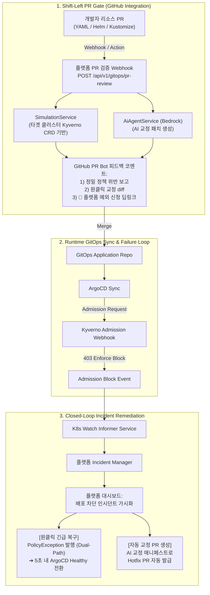

# GitOps 워크로드 거버넌스 통합 전략 및 아키텍처 제안서 (Agent Specification)

> **문서 버전**: v1.0.0  
> **대상 독자**: 후속 기능 구현 및 상세 설계를 담당하는 AI 에이전트 및 플랫폼 엔지니어  
> **관련 모듈**: `apps/backend/src/gitops`, `apps/backend/src/simulation`, `apps/backend/src/ai-agent`, `apps/backend/src/exception-requests`  
> **작성 일자**: 2026-09-12  

---

## 1. 개요 및 배경 (Context & Problem Statement)

### 1.1 배경
현재 **PaC Kyverno Governance Platform**은 정책 예외(`PolicyException`)의 라이프사이클 관리 및 GitOps 매니페스트 발행(`GitOpsPublisherService`)에 대해서는 구현이 완료되어 있습니다.  
그러나 **개발자가 배포하는 실제 애플리케이션 리소스(Deployment, Service, Ingress 등)의 라이프사이클 및 배포 거버넌스는 직접 다루지 못하는 한계**가 있습니다.

### 1.2 현장의 근본적 페인포인트 (Enterprise Reality)
1. **개발자의 인지 부하(Cognitive Overload)와 내부 정책 무지**:
   * 현업 개발자의 80% 이상은 사내 세부 보안 규정(Kyverno CRD, PodSecurityStandards, 사내 허용 ECR 레지스트리 목록, GPU 쿼터 등)을 숙지하지 못합니다.
   * 개발자들은 기존 성공 매니페스트를 복사-붙여넣기(Copy-Paste)하여 PR을 생성하며, 이로 인해 잠재적 취약점과 정책 위반이 지속적으로 복제됩니다.
2. **플랫폼 팀의 수동 병목(Human Bottleneck)과 티켓 옵스**:
   * 플랫폼 엔지니어는 개발자가 올린 Git PR을 일일이 검토하며 반려 사유("Root 권한 제거 필요", "CPU limit 누락")를 수작업 코멘트로 작성합니다.
   * 배포 마감이 급한 경우 Slack 등을 통한 구두 타협으로 무분별한 예외가 발생합니다.
3. **범용 AI(GitHub Copilot) PR 리뷰의 치명적 한계**:
   * GitHub Copilot의 코드 리뷰는 **클러스터 런타임 및 내부 정책 컨텍스트가 전혀 없습니다(Zero Cluster Context)**.
   * Copilot이 "LGTM"으로 PR을 승인하더라도, 실제 배포 시점에 **Kyverno Admission Webhook에 걸려 ArgoCD 배포가 중단(SyncFailed/Degraded)**되는 참사가 빈번합니다.
   * 결정론적(Deterministic) 검증이 불가능하여 개발자에게 스팸성 노이즈 리뷰를 남깁니다.

### 1.3 플랫폼의 목표
본 제안은 우리 플랫폼이 단순 '사후 예외 처리 도구'에 머무르지 않고, **"PR 검증 ➔ 클러스터 배포 ➔ 차단 시 실시간 치유"까지의 깃옵스 전체 루프를 지휘하는 거버넌스 컨트롤 타워**로 진화하기 위한 기술 규격을 정의합니다.

---

## 2. 전체 아키텍처 개요 (Target Architecture)



---

## 3. 핵심 전략별 상세 설계 명세

### 전략 1: Shift-Left PR 거버넌스 검증 엔진 (PR Bot & Deep Link)

#### 3.1 목적
개발자가 Git PR을 올렸을 때, GitHub Copilot이 알지 못하는 **"실제 클러스터 내부 Kyverno 정책"을 기반으로 결정론적 검증 및 교정 가이드**를 제공하고 플랫폼으로의 자연스러운 유입(Onboarding) 통로를 구축합니다.

#### 3.2 신규 API 엔드포인트 설계
* **라우트**: `POST /api/v1/gitops/pr-review`
* **요청 본문 (DTO)**:
```typescript
export class GitOpsPrReviewDto {
  @ApiProperty({ description: 'GitHub 저장소 전체 이름 (예: org/repo)' })
  repository: string;

  @ApiProperty({ description: 'Pull Request 번호' })
  pullNumber: number;

  @ApiProperty({ description: 'PR 대상 커밋 SHA' })
  commitSha: string;

  @ApiProperty({ description: '타겟 클러스터 식별자' })
  clusterId?: string;

  @ApiProperty({ description: '배포 대상 네임스페이스' })
  targetNamespace: string;

  @ApiProperty({ description: '변경/추가된 쿠버네티스 매니페스트 YAML 원문' })
  manifestYaml: string;
}
```

* **동작 흐름**:
  1. `SimulationService.runSimulation()`을 호출하여 대상 클러스터의 현재 인메모리 Kyverno Policy/ClusterPolicy와 대조 검증.
  2. 위반(Fail) 항목이 존재할 경우 `AiAgentService.generateFix()`를 호출하여 올바른 YAML 수정 diff 생성.
  3. 플랫폼 예외 신청 딥링크 URL 생성:
     `https://<PLATFORM_DOMAIN>/exceptions/new?repo=${repo}&pr=${pr}&cluster=${cluster}&namespace=${namespace}&policy=${policyName}&rule=${ruleName}`
  4. GitHub REST API(`POST /repos/{owner}/{repo}/issues/{issue_number}/comments`) 또는 Check Runs API를 사용하여 PR에 인라인 리포트 게시.

#### 3.3 GitHub PR 코멘트 템플릿
```markdown
### 🛡️ PaC Kyverno Governance Gate: 검증 결과 보고

⚠️ **정책 위반이 감지되어 클러스터 배포 시 차단될 수 있습니다.**

| 상태 | 정책명 | 규칙명 | 심각도 | 사유 |
| :--- | :--- | :--- | :--- | :--- |
| ❌ Blocked | `disallow-root-user` | `run-as-non-root` | **High** | `runAsNonRoot: true` 설정이 누락되었습니다. |
| ❌ Blocked | `allowed-image-registries` | `validate-registries` | **Medium** | 사내 프라이빗 ECR(`*.dkr.ecr.us-east-1.amazonaws.com`) 외 이미지는 허용되지 않습니다. |

---

#### 💡 AI 자동 수정 제안 (Suggested Changes)
```yaml
@@ -15,2 +15,6 @@
         image: 123456789012.dkr.ecr.us-east-1.amazonaws.com/my-service:v1.0.0
+        securityContext:
+          runAsNonRoot: true
+          allowPrivilegeEscalation: false
+          readOnlyRootFilesystem: true
```

---

#### 🔗 정책 예외(Exception)가 필요한 경우
부득이한 사유로 즉시 규정 준수가 어렵다면, 플랫폼 승인 절차를 통해 임시 예외를 신청하세요:  
👉 **[PaC 플랫폼에서 원클릭 예외 신청하기](https://dashboard.kyverno.internal/exceptions/new?pr=42&policy=disallow-root-user)** (리소스 정보 자동 입력됨)
```

---

### 전략 2: Closed-Loop Admission Block 감지 및 자동 복구 (ArgoCD 연동)

#### 2.1 목적
ArgoCD가 Git 매니페스트를 클러스터에 Sync할 때 Kyverno Admission Webhook에 의해 차단(`403 Forbidden`)되어 **파이프라인이 멈추는 장애를 실시간 감지하고 원클릭으로 복구**합니다.

#### 2.2 감지 메커니즘
* Kubernetes API Server의 `events.k8s.io` 또는 Audit Event에서 `reason: "AdmissionWebhookDenied"` 및 `subresource: "admission"` 이벤트 감지.
* Informer(`ClusterProvider`)가 차단 이벤트를 캡처하여 파드의 메타데이터 추출:
  - 리소스 Kind, Name, Namespace
  - 차단시킨 Kyverno Policy 이름 및 거절 메시지
  - ArgoCD 트래킹 라벨 (`app.kubernetes.io/instance`, `argocd.argoproj.io/tracking-id`)

#### 2.3 데이터 모델 확장 제안 (Prisma Schema)
```prisma
model DeploymentIncident {
  id              String           @id @default(uuid())
  clusterId       String
  namespace       String
  resourceKind    String
  resourceName    String
  policyName      String
  ruleName        String?
  blockReason     String
  argoAppName     String?
  gitCommitSha    String?
  gitRepository   String?
  status          IncidentStatus   @default(ACTIVE) // ACTIVE, RESOLVED_BY_EXCEPTION, RESOLVED_BY_HOTFIX, IGNORED
  createdAt       DateTime         @default(now())
  resolvedAt      DateTime?
  exceptionId     String?          // PolicyExceptionRequest와 연계
}

enum IncidentStatus {
  ACTIVE
  RESOLVED_BY_EXCEPTION
  RESOLVED_BY_HOTFIX
  IGNORED
}
```

#### 2.4 원클릭 복구 워크플로우 (Dual-Path Recovery)
1. 플랫폼 대시보드 상단에 **[배포 차단 인시던트 발생]** 배너 노출.
2. 플랫폼 관리자가 UI에서 `[긴급 예외 승인 및 발행]` 클릭:
   - 플랫폼이 내부적으로 승인된 `PolicyExceptionRequest` 생성.
   - `GitOpsPublisherService.publishManifest()`가 호출되어:
     1. 즉시 타겟 EKS 클러스터에 `PolicyException` CRD 런타임 직접 적용 (ArgoCD가 5초 이내에 자동 재시도하여 Sync 성공).
     2. 비동기로 GitOps 저장소에 해당 예외 매니페스트 PR 자동 커밋 (GitOps 선언성 유지).
3. 인시던트 상태가 `RESOLVED_BY_EXCEPTION`으로 변경되고 Slack 및 관리자 감사 로그 기록.

---

### 전략 3: Policy-Gated 셀프서비스 배포 포털 (Golden Path IDP)

#### 3.1 목적
초기 매니페스트 작성 단계부터 정책 준수를 보장하는 "골든 패스 템플릿"을 제공하여, 잘못된 YAML의 생성 자체를 원천 방지합니다.

#### 3.2 워크플로우
1. 개발자가 플랫폼 UI의 **[새 워크로드 배포]** 메뉴 진입.
2. 마법사 폼을 통해 서비스 기본 정보(앱 이름, 이미지 URL, 포트, 환경 변수 등) 입력.
3. 플랫폼이 사내 표준(Golden Path) 보안 컨텍스트(`runAsNonRoot`, `readOnlyRootFilesystem`, `resources.limits` 등)가 자동 주입된 완전한 Deployment YAML 생성.
4. 플랫폼에서 타겟 GitOps 저장소의 지정 브랜치로 자동 PR 생성 ➔ 승인 프로세스 진행.

---

## 4. 구현 로드맵 (Agent Implementation Phases)

다른 에이전트가 순차적으로 작업할 수 있는 마일스톤 단계입니다:

| 단계 | 작업 내용 | 영향 받는 모듈 | 우선순위 |
| :--- | :--- | :--- | :--- |
| **Phase 1** | **Shift-Left PR 검증 API & 코멘트 포매터 구현**<br/>- `GitOpsPrReviewDto` 및 엔드포인트 구현<br/>- `SimulationService` 연동 및 위반 리포트 포매터 제작<br/>- 프론트엔드 예외 신청 페이지 쿼리 파라미터 자동 완성(Auto-fill) 지원 | `apps/backend/src/gitops`<br/>`apps/backend/src/simulation`<br/>`apps/frontend/src/app/exceptions/new` | **최우선 (P0)** |
| **Phase 2** | **Admission Block 감지 및 인시던트 트래킹 엔진**<br/>- K8s Informer 기반 차단 이벤트 리스너 추가<br/>- Prisma `DeploymentIncident` 모델 마이그레이션<br/>- 인시던트 목록 조회 및 상태 관리 API 구현 | `apps/backend/src/kubernetes`<br/>`apps/backend/src/prisma`<br/>`apps/backend/src/violations` | **P1** |
| **Phase 3** | **인시던트 원클릭 긴급 복구 UI 및 GitOps 연계**<br/>- 인시던트 상세 모달 및 원클릭 복구 버튼 UI 구현<br/>- `GitOpsPublisherService`와 결합한 Dual-Path 복구 루프 연동 | `apps/frontend/src/app/dashboard`<br/>`apps/backend/src/gitops` | **P1** |
| **Phase 4** | **골든 패스 워크로드 카탈로그 포털**<br/>- 일반 마이크로서비스 배포 템플릿 생성기 구축 | `apps/frontend/src/app/workloads` | **P2** |

---

## 5. 참조 파일 및 핵심 클래스 링크

* 정책 시뮬레이션 엔진: [`SimulationService`](file:///home/user/kyverno-dashboard/apps/backend/src/simulation/simulation.service.ts)
* AI 진단 및 패치 생성 엔진: [`AiAgentService`](file:///home/user/kyverno-dashboard/apps/backend/src/ai-agent/ai-agent.service.ts)
* GitOps 발행 및 Dual-Path 제어: [`GitOpsPublisherService`](file:///home/user/kyverno-dashboard/apps/backend/src/gitops/gitops-publisher.service.ts)
* 정책 예외 요청 라이프사이클: [`ExceptionRequestsService`](file:///home/user/kyverno-dashboard/apps/backend/src/exception-requests/exception-requests.service.ts)
* 클러스터 인포머 및 캐시 관리: [`ClusterProvider`](file:///home/user/kyverno-dashboard/apps/backend/src/kubernetes/cluster-provider.ts)
