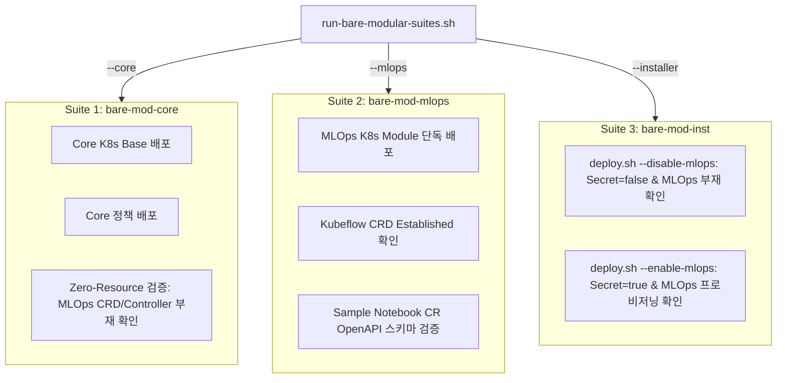

# Kind 기반 초경량(Bare-Minimum) 모듈형 테스트 환경 설계서

## 1. 개요 및 설계 원칙 (Design Philosophy)

* **배경**:
  기존의 무거운 통합 클러스터(모든 컨트롤러와 파드가 상주하는 환경)는 메모리와 CPU를 과도하게 점유하고 테스트 실행 시간이 오래 걸리는 문제가 있습니다.
* **핵심 원칙**:
  1. **극소 자원 점유 (Bare-Minimum Topology)**:
     - 1개의 Control-Plane 노드만 사용 (Worker 노드 0개, Host Port 충돌 방지).
     - 불필요한 데몬, 무거운 Helm 차트, 불필요한 백그라운드 컨트롤러를 배포하지 않고, 검증에 필요한 순수 CRD와 매니페스트만 타깃팅.
  2. **환경 세부 분할 (Granular & Isolated Environments)**:
     - 한 번에 모든 것을 통합해서 띄우지 않고, **Core 격리 환경**, **MLOps 독립 환경**, **실시간 배포기 수명주기 환경**으로 명확히 분할.
     - 각 환경은 개별적으로 20초 내외로 빠르게 실행되고 즉시 소멸.
  3. **완전한 무점유 자원 회수 (Self-Cleaning via EXIT Trap)**:
     - 테스트 성공/실패 여부와 무관하게 `trap cleanup EXIT INT TERM`을 통해 Kind 클러스터와 Docker 볼륨을 즉시 자동 삭제하여 호스트 리소스를 100% 회수.

---

## 2. 분할된 테스트 환경 명세 (Granular Test Suites)



### 2.1. [Suite 1] Core 거버넌스 격리 환경 (`test-kind-modular-core.sh`)
* **클러스터명**: `bare-mod-core`
* **배포 대상**: `k8s-manifests/base`, `k8s-manifests/policies/*.yaml`
* **검증 내용**:
  * Core 네임스페이스(`kyverno-platform`) 및 ServiceAccount, ClusterRole, ClusterRoleBinding 생성 확인.
  * Backend, Frontend, Postgres 서비스 리소스 등록 확인.
  * **MLOps 부재 확인**: `notebooks.kubeflow.org` CRD 미존재, `kubeflow` 네임스페이스 미존재, `notebook-controller` 워크로드 미배포 확인.
  * MLOps 전용 정책(`limit-gpu-per-namespace` 등) 배제 확인.

### 2.2. [Suite 2] MLOps 확장 모듈 독립 환경 (`test-kind-modular-mlops.sh`)
* **클러스터명**: `bare-mod-mlops`
* **배포 대상**: `k8s-manifests/modules/mlops`, `k8s-manifests/policies/mlops/*.yaml`
* **검증 내용**:
  * Core 의존성 없이 MLOps 모듈 단독 배포 성공 확인.
  * Kubeflow Notebook CRD(`notebooks.kubeflow.org`) 등록 및 `Established` 상태 확인.
  * `kubeflow` 네임스페이스, Controller RBAC, Deployment 정의 확인.
  * Core 네임스페이스(`kyverno-platform`)가 MLOps 모듈에 불필요하게 섞이지 않았는지 격리 확인.
  * 샘플 Kubeflow Notebook Custom Resource가 K8s API 서버의 OpenAPI 스키마 유효성 검사를 정상 통과하는지 검증.

### 2.3. [Suite 3] 배포기 실 클러스터 연동 및 수명주기 환경 (`test-kind-modular-installer.sh`)
* **클러스터명**: `bare-mod-inst`
* **배포 대상**: `scripts/deploy.sh` 실 클러스터 연동 (`--skip-rollout` 옵션 적용으로 20초 초고속 수행)
* **검증 내용**:
  * **Case A (`--disable-mlops`)**:
    * K8s Secret `kyverno-platform-secret`의 `MODULE_MLOPS_ENABLED` 키가 `false`로 저장되는지 확인.
    * 실제 클러스터에 MLOps CRD 및 `kubeflow` 네임스페이스가 생성되지 않는지 확인.
  * **Case B (`--enable-mlops` 동적 업그레이드)**:
    * 동일 클러스터에서 Secret `MODULE_MLOPS_ENABLED` 키가 `true`로 갱신되는지 확인.
    * MLOps CRD 및 `notebook-controller` 워크로드가 실제 API 서버에 프로비저닝되는지 확인.

---

## 3. 실행 방법 (Usage)

각 테스트 환경은 독립적으로 실행할 수 있으며, 필요에 따라 마스터 스크립트로 선택 실행할 수 있습니다:

```bash
# 1. Core 전용 격리 테스트 단독 실행 (약 20초)
./scripts/tests/run-bare-modular-suites.sh --core

# 2. MLOps 독립 모듈 테스트 단독 실행 (약 20초)
./scripts/tests/run-bare-modular-suites.sh --mlops

# 3. 배포기 실 클러스터 Secret/수명주기 테스트 단독 실행 (약 20초)
./scripts/tests/run-bare-modular-suites.sh --installer

# 4. 전체 분할 스위트 순차 실행 (클러스터를 하나씩 생성/검증 후 즉시 해체하여 메모리 충돌 없음)
./scripts/tests/run-bare-modular-suites.sh --all
```
